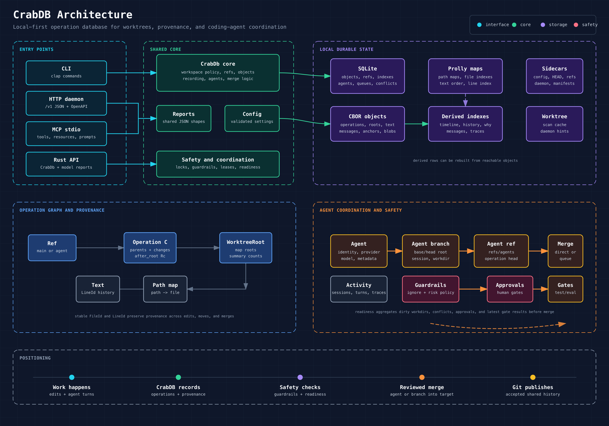

# CrabDB

CrabDB gives AI coding agents branch-like memory, transcripts, checkpoints, and
rewind without polluting your active Git branch.

CrabDB is a local-first operation database for code and text worktrees. It records
the meaningful work that happens between Git commits: local edits, recorded
operations, branch movement, lane patches, review handoffs, merges, and
line-level provenance.

Git remains the source of shared repository history. CrabDB adds a local layer for
questions Git does not answer well by itself:

- What operation introduced this current line?
- What changed on this branch before it became a Git commit?
- What happened in a lane, which paths changed, and is it ready to merge?
- Which changes are blocked by conflicts, pending approvals, dirty workdirs, or
  missing test/eval gates?
- Can an editor, agent host, or local service query the same state through CLI,
  HTTP, MCP, or Rust?

CrabDB stores its local state under `.crabdb/`, uses `.crabignore` and Git ignore
files to avoid accidental private/generated captures, and can run fully through
the CLI without a background service. The HTTP daemon and MCP stdio server are
opt-in integration surfaces.

## CrabDB vs Git

CrabDB is not a Git replacement. It sits next to Git as a local operation,
provenance, and lane-coordination layer.

```text
  human edits, editor saves, lane turns, tool calls, patches
                         |
                         v
  +---------------------------------------------------------+
  | CrabDB                                                  |
  | record operations, preserve line identity, isolate      |
  | lane branches, run guardrails, check readiness,        |
  | produce review and handoff reports                      |
  +--------------------------+------------------------------+
                             |
                             v
  reviewed state, resolved conflicts, accepted operations
                             |
                             v
  +---------------------------------------------------------+
  | Git                                                     |
  | commit, branch, tag, push, pull, rebase, share history  |
  | with remotes and existing developer workflows           |
  +---------------------------------------------------------+
```

Use Git for durable shared source-control history. Use CrabDB for the messy,
high-frequency, local work that happens before a commit is ready.

| Need | Git | CrabDB |
| --- | --- | --- |
| Shared project history | Excellent: commits, branches, remotes, tags, PR workflows | Complements Git and can import/export mappings |
| Local in-between work | Mostly unstaged/staged diffs, stash, reflog | First-class recorded operations with messages, actors, roots, and parents |
| Line provenance | Blame by committed lines | Stable `LineId` history for current and recorded local lines |
| Lane isolation | Branches and worktrees, but no agent activity model | `refs/lanes/<name>`, sessions, turns, traces, patches, gates, handoffs |
| Safety before mutation | Hooks and review conventions | Ignore policy, guardrails, approvals, leases, readiness blockers |
| Machine interfaces | Git CLI and plumbing | CLI JSON, HTTP/OpenAPI, MCP tools/resources/prompts, Rust reports |
| Merge readiness | Merge attempt plus conflicts | Readiness reports before merge: conflicts, dirty workdirs, approvals, gates |

The practical position is:

- Git is the publication and synchronization layer.
- CrabDB is the local operational memory and coordination layer.
- Git answers "what committed snapshot did the project accept?"
- CrabDB answers "what happened locally, why did it happen, which lane contains it,
  is it safe to accept, and what still blocks merge?"

## Why This Matters for AI Agents

AI coding agents produce more than final diffs. They create attempts,
intermediate patches, tool calls, test runs, review notes, approvals, and
handoffs. Treating all of that as either "unstaged changes" or "a Git commit"
loses important context.

CrabDB gives lane workflows a native coordination layer:

- Each external agent can work inside an isolated CrabDB lane without
  immediately touching `main`.
- Structured patches can target stable file and line identity instead of fragile
  line numbers.
- Sessions, turns, messages, events, and trace spans preserve what happened in
  the lane and why.
- Guardrail checks and human approvals make risky actions explicit before they
  mutate the workspace or external systems.
- Test/eval gates, dirty-workdir checks, open conflicts, and pending approvals
  roll up into one readiness signal.
- Handoff and contribution reports give humans or other agents enough context to
  continue, review, or reject lane work.
- Merge queues serialize accepted lane work so parallel agents do not silently
  overwrite each other.

In short: Git is where accepted code history lives. CrabDB is where local and
lane work becomes understandable, reviewable, and mergeable before it becomes
Git history.

## Who It Is For

CrabDB is useful for several overlapping audiences.

**Developers working locally:** record useful worktree operations before they
become commits, inspect branch history, ask why a line exists, and safely
checkout or merge local refs.

**Reviewers and maintainers:** inspect provenance, changed paths, operation
timelines, conflict sets, anchors, and diagnostics before accepting work.

**Coding-agent operators:** give each external agent an isolated lane, durable
sessions and turns, structured patches, trace events/spans, guardrail checks, human
approvals, test/eval gates, readiness reports, handoff packets, and serialized
merge queues.

**Tool and integration authors:** use human/JSON CLI output, a loopback HTTP API
with OpenAPI 3.1, an MCP stdio server with tools/resources/prompts, or the Rust
`CrabDb` API and exported model/report types.

## What CrabDB Provides

- Local operation history with content-addressed objects, refs, roots, and
  rebuildable indexes.
- Stable `ChangeId`, `FileId`, and `LineId` identity for provenance and
  line-aware patching.
- Worktree status, selective recording, timeline, show, diff, checkout, branch,
  merge, why, history, and code-from workflows.
- Ignore policy and guardrail preflight for private paths, ignored files, risky
  shell/network/deploy/destructive actions, and workspace policy rules.
- Lane branches under `refs/lanes/<name>` with optional materialized or sparse
  workdirs.
- Durable lane sessions, turns, messages, events, trace spans, paused run
  checkpoints, approvals, tests, evals, readiness, contribution, and handoff
  reports.
- Direct lane merges and merge queues with readiness checks, conflict sets, and
  manual conflict resolution.
- Git import/export mappings, backup/restore, fsck, index rebuild, garbage
  collection, and doctor diagnostics.
- CLI, HTTP daemon, OpenAPI, MCP, and Rust library integration surfaces backed by
  the same core implementation.

## Architecture at a Glance

CrabDB is organized around one core library object, `CrabDb`. The CLI, HTTP
daemon, MCP server, tests, and Rust callers all route through that same core so
they can share behavior and report types.



The same architecture in text form:

```text
                         entry points
  +-----------+   +---------------+   +--------------+   +-------------+
  | CLI       |   | HTTP daemon   |   | MCP stdio    |   | Rust API    |
  | crabdb    |   | /v1 JSON API  |   | tools/docs   |   | CrabDb      |
  +-----+-----+   +-------+-------+   +------+-------+   +------+------+
        |                 |                  |                  |
        +-----------------+------------------+------------------+
                                     |
                                     v
  +-------------------------------------------------------------------+
  | CrabDb core                                                       |
  | workspace policy, refs, objects, records, lanes, merges, reports |
  +-----------+------------------+--------------------+---------------+
              |                  |                    |
              v                  v                    v
  +-------------------+  +------------------+  +----------------------+
  | SQLite            |  | Prolly maps      |  | .crabdb sidecars     |
  | objects, refs,    |  | path maps, file  |  | config, HEAD, refs,  |
  | indexes, queues,  |  | indexes, text    |  | daemon files,        |
  | lane state        |  | and line order   |  | workdir manifests    |
  +-------------------+  +------------------+  +----------------------+
```

### Command Flow

Most commands run directly against the local database. Selected hot paths can
use the daemon when a daemon URL is supplied or when `.crabdb/daemon.json` is
auto-discovered.

```text
  user or host
      |
      v
  crabdb CLI
      |
      v
  parse command + build RuntimeContext
      |
      +--> daemon-capable command and daemon available?
      |        |
      |        +-- yes --> HTTP daemon --> CrabDb core --> report JSON
      |
      +-- no or fallback --> local CrabDb core --> report struct
                                      |
                                      v
                         human output, JSON, or NDJSON
```

The important design point is that daemon-backed and local paths return the same
report shapes. A script can use CLI JSON, the HTTP API, MCP tools, or Rust types
without learning separate data models for each surface.

### Durable History Model

CrabDB records operations as durable history. Refs point to operation/root pairs;
operations point to parent operations and before/after roots; roots point to
ordered maps and content objects.

```text
  refs/branches/main              refs/lanes/doc-bot
          |                               |
          v                               v
  +----------------+              +----------------+
  | Operation C    |              | Operation D    |
  | after_root Rc  |              | after_root Rd  |
  +-------+--------+              +-------+--------+
          |                               |
          +---------------+---------------+
                          |
                          v
                  +---------------+
                  | Operation B   |
                  | parent: A     |
                  +-------+-------+
                          |
                          v
                  +---------------+
                  | Operation A   |
                  +---------------+

  each after_root
          |
          v
  +-------------------+      +-------------------+
  | WorktreeRoot      |----->| path map          |-----> FileEntry
  | map root ids      |      | path -> file      |
  +---------+---------+      +-------------------+
            |
            v
  +-------------------+      +-------------------+
  | file index map    |      | TextContent/Blob  |
  | FileId -> path    |      | lines or bytes    |
  +-------------------+      +-------------------+
```

The operation and object graph is the durable source of truth. SQLite indexes
such as `operations`, `file_history`, `line_history`, `messages`, trace spans,
and worktree scan rows make common queries fast and can be rebuilt from reachable
objects.

```text
  durable refs + operation objects + message objects
                    |
                    v
          index rebuild / fsck / gc
                    |
                    v
  derived query tables: timeline, history, why, code-from, traces
```

### Lane Coordination Model

A lane is a branch-backed work container. A normal branch stores code state; a
lane stores code state plus the work history around it: sessions, turns,
messages, events, spans, approvals, gates, workdirs, and rewind checkpoints.
Use branches for long-lived code lines such as `main` or `release`, and lanes
for active work by humans, automation, or external coding agents.

A normal lane workflow writes to `refs/lanes/<name>`, reviews readiness, then
merges into a target branch only after checks pass.

```text
  +-------------------+        +----------------------+
  | lanes             |        | lane_branches       |
  | identity, model,  |------->| ref, base/head root, |
  | provider, metadata|        | session, workdir,    |
  +-------------------+        | status               |
                               +----------+-----------+
                                          |
                                          v
                               refs/lanes/<name>
                                          |
                                          v
                               operation/root history

  activity around the branch:

  sessions -> turns -> messages/events/spans
       |          |          |
       v          v          v
  approvals   run states   test/eval gates
       \          |          /
        \         v         /
          readiness + handoff + merge queue
```

Materialized workdirs are optional. Structured patches can update a lane branch
without checking out a full filesystem tree; materialized or sparse workdirs are
available when tools need real files and command execution.

### Safety Boundaries

CrabDB's safety checks sit between user, automation, or agent requests and workspace mutation.

```text
  request
     |
     v
  normalize paths
     |
     v
  block .crabdb/.git/private hardcoded paths
     |
     v
  apply .crabignore and .gitignore policy
     |
     v
  guardrail risk check + workspace policy
     |
     v
  pending/approved/rejected human approvals
     |
     v
  allowed operation, approval_required report, or blocked report
```

These checks are deliberately local and explainable. They protect CrabDB/Git
internals, ignored/private paths, risky lane actions, dirty materialized
workdirs, stale refs, and conflicted merges before changes are accepted.

## Quick Start

CrabDB is a Rust workspace. The repository declares Rust 1.81 in `Cargo.toml`.
Build from source with the Makefile:

```sh
# Build the debug binary at target/debug/crabdb.
make build

# Print CLI help from the local debug binary.
target/debug/crabdb --help
```

Install a local optimized binary with the Makefile. By default this installs to
`$HOME/.cargo/bin/crabdb`:

```sh
# Build the release binary and install crabdb locally.
make install

# Verify the installed crabdb command is on your PATH.
crabdb --help
```

For ACP coding-agent setup, keep installation simple and use the guided CrabDB
commands after the binary is installed:

```sh
crabdb agent doctor --provider claude-code
crabdb agent setup --provider claude-code --editor vscode
```

For a project-local install directory, override `PREFIX`:

```sh
# Install to ./.local/bin/crabdb instead of $HOME/.cargo/bin/crabdb.
make install PREFIX="$PWD/.local"
```

The equivalent direct Cargo build command is:

```sh
# Build the debug binary without using the Makefile.
cargo build -p crabdb

# Print CLI help from the Cargo-built debug binary.
target/debug/crabdb --help
```

Initialize a workspace from the current working tree:

```sh
# Import visible working tree files into .crabdb/.
crabdb init --working-tree
```

Inspect and record an edit:

```sh
# Show whether the current worktree differs from CrabDB's recorded root.
crabdb status

# Record the current edit as a named local operation.
crabdb record -m "record current edit"

# List recent recorded operations.
crabdb timeline --limit 10

# Inspect one recorded operation from the timeline output.
crabdb show <change-id>
```

Ask provenance questions:

```sh
# Explain what operation introduced the current README.md line 2.
crabdb why README.md:2

# Show recorded history for README.md.
crabdb history README.md

# Show the current unrecorded worktree diff as a patch.
crabdb diff --dirty --patch
```

Start a lane for task work:

```sh
# Create an isolated lane branch with its own materialized workdir.
crabdb lane spawn docs-lane --from main --materialize=true

# Print the path to that workdir, then edit there or point a coding agent there.
crabdb lane workdir docs-lane

# Record, review, and check readiness before merge.
crabdb lane record docs-lane -m "record docs update"
crabdb lane diff docs-lane --patch
crabdb lane readiness docs-lane
crabdb merge-lane docs-lane --into main --dry-run
```

Example CLI output from a tiny workspace looks like this. IDs, object hashes,
workspace IDs, and actor names will differ on your machine.

## Common ID prefixes:

| Prefix | Meaning | Example use |
| --- | --- | --- |
| `wk_` | Workspace ID derived when `.crabdb/` is initialized | Identifies one local CrabDB workspace |
| `ch_` | Change/operation ID allocated when CrabDB records an operation | Appears as `Head`, `Initial operation`, timeline entries, and `show` selectors |
| `obj_` | Content-addressed object ID | Identifies stored roots, operations, text objects, blobs, and other durable objects |
| `msg_` | Message ID | Used for durable operation, agent, or review messages |
| `anc_` | Anchor ID | Used for durable labels tied to file and line identity |
| `ch_...:<n>` | Stable file or line identity with an origin change and local sequence | Appears in `why` output as a `Line ID` |

## Example output

1. Initialize CrabDB from the visible files in the current working tree. The
   output shows the workspace ID, active branch, initial operation ID, and import
   summary.

```text
$ crabdb init --working-tree
Initialized CrabDB workspace
Workspace: wk_24ec99f68d1db8716f4df8a87580e3da
Branch: main
Initial operation: ch_5a44178a04acec35b4c27590303d665d462a229aa9bf627bb24e2c0f685fdcd6
Imported: 1 files (1 text, 0 opaque, 0 binary)
```

2. Check the recorded branch and worktree state. Immediately after
   initialization, the worktree is clean.

```text
$ crabdb status
Branch: main
Head: ch_5a44178a04acec35b4c27590303d665d462a229aa9bf627bb24e2c0f685fdcd6
Root: obj_46b1a72c6ff5e66a7b3026113243681493e79c2e659b6ef9658a2db57fdac431
Worktree: clean
```

3. After editing `README.md`, run `status` again. CrabDB reports the worktree as
   dirty and lists the modified path.

```text
$ crabdb status
Branch: main
Head: ch_5a44178a04acec35b4c27590303d665d462a229aa9bf627bb24e2c0f685fdcd6
Root: obj_46b1a72c6ff5e66a7b3026113243681493e79c2e659b6ef9658a2db57fdac431
Worktree: dirty
  Modified README.md
```

4. Record the edit as a named local operation. The output returns the new
   operation ID and the changed path summary.

```text
$ crabdb record -m "record current edit"
Recorded ch_3d5a38ae49a7cd4b6873f003c97863f30ebc3efa61749b463c222d5d34809bfa
  Modified README.md
```

5. Read the recent operation timeline. The newest record appears first, followed
   by the initial import operation.

```text
$ crabdb timeline --limit 10
ch_3d5a38ae49a7cd4b6873f003c97863f30ebc3efa61749b463c222d5d34809bfa ManualRecord main record current edit
ch_5a44178a04acec35b4c27590303d665d462a229aa9bf627bb24e2c0f685fdcd6 GitImport main Initialize CrabDB workspace
```

6. Inspect one operation from the timeline. `show` expands the operation kind,
   actor, message, parent, before/after roots, and path-level summary.

```text
$ crabdb show ch_3d5a38ae49a7cd4b6873f003c97863f30ebc3efa61749b463c222d5d34809bfa
Operation: ch_3d5a38ae49a7cd4b6873f003c97863f30ebc3efa61749b463c222d5d34809bfa
Kind: ManualRecord
Branch: main
Actor: demo
Message: record current edit
Parents:
  ch_5a44178a04acec35b4c27590303d665d462a229aa9bf627bb24e2c0f685fdcd6
Before root: obj_46b1a72c6ff5e66a7b3026113243681493e79c2e659b6ef9658a2db57fdac431
After root: obj_7e39865c8542fe846b528c28debed69daecc4b53c34ff17f8a4da8bacbb773a4
  Modified README.md (+1 -0)
```

7. Ask why a current line exists. `why` resolves the path and line number to a
   stable line ID, then shows the operation that introduced it and the last
   operation that changed its content.

```text
$ crabdb why README.md:2
README.md:2 First recorded line
Line ID: ch_5a44178a04acec35b4c27590303d665d462a229aa9bf627bb24e2c0f685fdcd6:2
Introduced by: ch_5a44178a04acec35b4c27590303d665d462a229aa9bf627bb24e2c0f685fdcd6
Last content change: ch_5a44178a04acec35b4c27590303d665d462a229aa9bf627bb24e2c0f685fdcd6
```

8. Show file history. `history` lists operations that affected the selected
   file.

```text
$ crabdb history README.md
README.md
ch_5a44178a04acec35b4c27590303d665d462a229aa9bf627bb24e2c0f685fdcd6 Added README.md
ch_3d5a38ae49a7cd4b6873f003c97863f30ebc3efa61749b463c222d5d34809bfa Modified README.md
```

9. After making another edit without recording it, inspect the dirty diff. The
   patch shows what is currently in the worktree but not yet recorded by CrabDB.

```text
$ crabdb diff --dirty --patch
Diff main..dirty
  Modified README.md (+1 -0)
diff --crabdb a/README.md b/README.md
--- a/README.md
+++ b/README.md
 CrabDB sample
 First recorded line
 Second recorded line
+Unrecorded working tree line
```

Initialization creates `.crabdb/` state and a `.crabignore` file when needed.
Default ignore patterns protect CrabDB/Git internals, environment files, private
key/certificate files, dependency folders, build output, and coverage output.

Later examples use `crabdb` for readability. If the binary is not on your PATH,
install it with `make install` or replace `crabdb` with `target/debug/crabdb`.

## Common CLI Reference

| Command | Description |
| --- | --- |
| `crabdb init --working-tree` | Initialize `.crabdb/` from visible working tree files |
| `crabdb status` | Show branch head, root object, cleanliness, and changed paths |
| `crabdb record -m "<message>"` | Record current worktree changes as a named local operation |
| `crabdb record --paths <path>... -m "<message>"` | Record only selected paths |
| `crabdb watch --once` | Watch for changes and record once after debounce |
| `crabdb timeline --limit <n>` | List recent operations, newest first |
| `crabdb show <selector>` | Inspect an operation, message, ref, or object |
| `crabdb diff --dirty --patch` | Show unrecorded worktree changes as a patch |
| `crabdb why <path:line>` | Explain which operation introduced a current line |
| `crabdb history <path>` | Show recorded history for a file or selector |
| `crabdb code-from <selector>` | Find changed paths connected to a message, session, or agent |
| `crabdb branch` | List local CrabDB branches |
| `crabdb branch <name> --from <ref>` | Create a branch from another ref |
| `crabdb checkout <branch> --dry-run` | Preview checkout effects before changing the worktree |
| `crabdb merge <branch> --into <target> --dry-run` | Preview a branch merge and possible conflicts |
| `crabdb ignore check <path>` | Check whether ignore policy records or skips a path |
| `crabdb guardrails check --action <action>` | Preflight a risky action against workspace policy |
| `crabdb agent setup --provider claude-code --editor vscode` | Print editor config for fresh CrabDB agent tasks |
| `crabdb agent continue latest` | Start a fresh follow-up task from the latest task checkpoint |
| `crabdb agent` | Open the agent inbox home view with grouped tasks, review-first hints, and one next action |
| `crabdb agent board` | Show a multi-agent board with low-noise columns and one next action |
| `crabdb agent ask show agent board` | Route a plain-language question to the multi-agent board |
| `crabdb agent ask what needs attention` | Route a plain-language question to the inbox home view |
| `crabdb agent ask what changed` | Route a plain-language question to the right task view |
| `crabdb agent ask last prompt` | Route a plain-language question to the latest prompt turn |
| `crabdb agent ask what changed in the last prompt` | Route a plain-language question to the newest prompt delta |
| `crabdb agent ask what changed in README.md in the last prompt` | Route a plain-language question to a file-scoped prompt delta |
| `crabdb agent ask show transcript` | Route a plain-language question to the task transcript |
| `crabdb agent ask what should I put in the PR` | Route to a read-only pull request draft |
| `crabdb agent ask give me a summary to share` | Route to the copyable task receipt |
| `crabdb agent ask handoff this to another agent` | Route to the copyable handoff packet |
| `crabdb agent ask what commit message should I use` | Route to apply readiness and the generated commit message |
| `crabdb agent ask which task first` | Route to overlap checks and safe apply order |
| `crabdb agent` | Show the current task dashboard, or grouped inbox when there are multiple tasks |
| `crabdb agent guide` | Show the shortest state-aware workflow for setup, review, apply, or recovery |
| `crabdb agent help-me` | Friendly alias for the agent guide |
| `crabdb agent home` | Alias for the agent inbox home view |
| `crabdb agent inbox` | Group all agent tasks by attention state, new changes, and review-first file |
| `crabdb agent board` | Group all agent tasks as a low-noise board for multiple agents or tasks |
| `crabdb agent tasks` | Friendly alias for the multi-agent board |
| `crabdb agent stack` | Show shared files and a safe apply order across agent tasks |
| `crabdb agent next` | Show the one next useful action for the latest agent task |
| `crabdb agent todo` | Friendly alias for the one next useful action |
| `crabdb agent status` | Show the latest agent task, risk, and next useful action |
| `crabdb agent dashboard latest` | Show one compact task board with next action, focus, validation, and apply readiness |
| `crabdb agent review-data latest` | Show one structured review packet for editor panels and integrations |
| `crabdb agent review-flow latest` | Walk review, validation, and finish as one guided checklist |
| `crabdb agent walkthrough latest` | Friendly alias for the guided review checklist |
| `crabdb agent brief latest` | Show a compact task brief with risk, next action, changes, and tools |
| `crabdb agent summary latest` | Show one post-run cockpit with readiness, risk, receipt, PR draft, and next command |
| `crabdb agent validate latest` | Show latest gates and suggested validation commands without running anything |
| `crabdb agent test-plan latest` | Show a prioritized test/eval checklist with exact commands |
| `crabdb agent receipt latest` | Print a copyable post-run receipt with validation, changes, risk, and next command |
| `crabdb agent handoff latest` | Print a copyable handoff packet for another human or agent |
| `crabdb agent share latest` | Friendly alias for the handoff packet |
| `crabdb agent pr latest` | Print a pull request draft title and body without creating a remote PR |
| `crabdb agent report latest --markdown` | Print the deeper review bundle behind a task |
| `crabdb agent story latest` | Explain what happened in plain language |
| `crabdb agent tools latest` | Show tool calls, available commands, and the turns/checkpoints around them |
| `crabdb agent impact latest` | Show changed areas, blast radius, and recommended review/test checks |
| `crabdb agent review-map latest` | Show a file-by-file review checklist grouped by changed area |
| `crabdb agent risk latest` | Show apply risk, reasons, and concrete mitigations |
| `crabdb agent confidence latest` | Show one go/no-go verdict across review, validation, risk, and apply preflight |
| `crabdb agent go-no-go latest` | Friendly alias for the confidence verdict |
| `crabdb agent ready latest` | Check apply readiness without mutating Git |
| `crabdb agent can-land latest` | Friendly alias for safe apply readiness |
| `crabdb agent diagnose latest` | Explain likely issues and safe recovery options before undo/rewind |
| `crabdb agent recover latest` | Friendly alias for recovery diagnosis |
| `crabdb agent compare <TASK_A> <TASK_B>` | Compare two agent tasks, shared files, risk, and next action |
| `crabdb agent test latest -- cargo test` | Run and record a test gate in the task workdir |
| `crabdb agent eval latest -- <command>` | Run and record an eval gate in the task workdir |
| `crabdb agent workdir latest` | Print the task workdir and a copyable `cd` command |
| `crabdb agent view latest` | Inspect transcript, tools, changed paths, and checkpoint |
| `crabdb agent changes latest` | Show high-level change cards plus turn/checkpoint details |
| `crabdb agent delta latest` | Show the newest completed turn or operation delta |
| `crabdb agent last latest` | Friendly alias for the newest completed turn or operation delta |
| `crabdb agent new latest` | Show changes since the task was last marked reviewed |
| `crabdb agent what-changed latest` | Friendly alias for changes since the last reviewed checkpoint |
| `crabdb agent mark-reviewed latest` | Mark the current task checkpoint as reviewed |
| `crabdb agent mark-file-reviewed latest README.md` | Mark one changed file reviewed in the review map |
| `crabdb agent done latest` | Friendly alias for marking the current checkpoint reviewed |
| `crabdb agent archive latest` | Hide a finished or irrelevant task from default inbox/list/latest views |
| `crabdb agent close latest` | Friendly alias for archiving an agent task |
| `crabdb agent unarchive <TASK>` | Restore an archived task to the default agent inbox |
| `crabdb agent turn` | Inspect the latest completed turn with prompt, tools, checkpoint, and files |
| `crabdb agent turn-diff latest --patch` | Show the latest or selected turn diff without spelling out diff flags |
| `crabdb agent files latest` | Show changed files with the turns and commands behind each file |
| `crabdb agent changed-files latest` | Friendly alias for changed files with provenance |
| `crabdb agent inspect README.md` | Friendly alias for file-centered agent context |
| `crabdb agent checkpoints latest` | List friendly rewind targets and checkpoint ids |
| `crabdb agent rewind-points latest` | Friendly alias for checkpoint and rewind targets |
| `crabdb agent why latest README.md` | Explain which prompt, turn, tools, and checkpoint changed a file |
| `crabdb agent explain README.md` | Friendly alias for explaining why a file changed |
| `crabdb agent review-plan latest` | Show readiness, risk, review-priority files, and next commands |
| `crabdb agent review latest` | Short alias for the review-priority dashboard |
| `crabdb agent focus latest` | Inspect the next file to review with why, a materialized-task open command, and focused diff summary |
| `crabdb agent open latest` | Open the focused file in `$EDITOR` for a materialized task |
| `crabdb agent apply latest --dry-run` | Preview safe Git apply for an agent task |
| `crabdb agent apply latest` | Record, merge, export, and fast-forward with a task-title commit message |
| `crabdb agent land latest` | Friendly alias for applying an agent task safely |
| `crabdb agent finish latest` | Apply the task and hide it from the default inbox after success |
| `crabdb agent undo latest` | Undo the latest agent turn without copying checkpoint ids |
| `crabdb agent undo-last latest` | Friendly alias for undoing the latest agent turn |
| `crabdb lane spawn <name> --from <ref>` | Create an isolated lane branch |
| `crabdb lane apply-patch <name> --patch <file>` | Apply a structured patch to a lane branch |
| `crabdb lane review <name>` | Produce a compact review packet for a lane branch |
| `crabdb lane readiness <name>` | Report blockers before merging a lane branch |
| `crabdb lane handoff <name>` | Produce a review and continuation packet for a lane |
| `crabdb merge-lane <name> --into <branch> --dry-run` | Preview merging a lane branch into a target branch |
| `crabdb merge-queue run` | Run queued lane merges with readiness and conflict checks |
| `crabdb daemon` | Start the loopback HTTP daemon for editor and automation integrations |
| `crabdb mcp` | Start the MCP stdio server for agent hosts |
| `crabdb acp install --agent claude-code` | Print an ACP relay command and editor snippet |
| `crabdb acp doctor --agent claude-code` | Check ACP provider and relay readiness |
| `crabdb acp sessions` | List captured ACP sessions |
| `crabdb transcript <lane-or-session>` | Read captured prompts, assistant messages, tools, and checkpoints |
| `crabdb doctor` | Run workspace and integration diagnostics |
| `crabdb backup create <output>` | Create a CrabDB workspace backup |
| `crabdb fsck` | Verify repository integrity |

## Core Local Workflows

Record the whole worktree:

```sh
crabdb record -m "describe the operation"
```

Record only selected paths:

```sh
crabdb record --paths README.md docs/ -m "record docs only"
```

Manage branches and merges:

```sh
crabdb branch
crabdb branch experiment --from main
crabdb checkout experiment --dry-run
crabdb merge experiment --into main --dry-run
```

Run safety and maintenance checks:

```sh
crabdb ignore check README.md
crabdb guardrails check --action shell.exec --summary "Run smoke tests"
crabdb doctor
crabdb fsck
```

Use `--json` or `--format json` on commands when a script, editor, or agent
needs machine-readable output.

## Agent Workflow

Use `crabdb agent` when you want CrabDB to hide lane names, ACP sessions, export
ranges, and Git handoff details. Each task gets a fresh lane by default.
Task lists and summaries show a human title first, derived from the prompt or
from `--name`; the stable task id is still shown when you need precision.
When a task has a materialized filesystem, summaries also show `Workdir`, the
exact directory where the agent edited files.

Configure an ACP editor once:

```sh
crabdb agent setup --provider claude-code --editor vscode
```

Paste the printed snippet into the editor's ACP custom-agent settings. After one
prompt, ask CrabDB what needs attention:

```sh
crabdb agent
```

Bare `agent` is the inbox home view. It shows the task queue, the attention
state, new files/lines since the last review, the first file to inspect, and the
one next command. Use `agent status` for only the latest task or
`agent todo latest` for a single primary command. Use `agent board` when several
editor or terminal agents are active and you want one low-noise board grouped by
needs-record, conflicted, blocked, needs-review, ready, running, applied, and
archived. Use `agent stack` when you need overlap checks and a safe apply order
across tasks. Then drill into a task only as needed:

`agent guide` is the first-run and "I forgot what to do" command. It explains
the current task state, prints one next command, shows a short setup/review/apply
or recovery workflow, and keeps the public mental model to agent task, changes,
apply, and recover.

```sh
crabdb agent
crabdb agent board
crabdb agent stack
crabdb agent guide
crabdb agent ask help me
crabdb agent ask what needs attention
crabdb agent ask what should I do next
crabdb agent ask what did the agent do
crabdb agent ask where is the workdir
crabdb agent ask where did the agent edit
crabdb agent ask which prompt changed README.md
crabdb agent ask last prompt
crabdb agent ask what changed in the last prompt
crabdb agent ask what changed in README.md in the last prompt
crabdb agent ask show transcript
crabdb agent ask show dashboard
crabdb agent ask what should I review
crabdb agent ask what should I review first
crabdb agent ask what file should I review first
crabdb agent ask what file should I open
crabdb agent ask where should I look first
crabdb agent ask open review
crabdb agent ask review this task
crabdb agent ask what tools were used
crabdb agent tools latest
crabdb agent ask what is the blast radius
crabdb agent impact latest
crabdb agent ask review map
crabdb agent review-map latest
crabdb agent ask what did the agent change
crabdb agent ask what files did it touch
crabdb agent ask can I merge
crabdb agent ask why can't I apply
crabdb agent ask what is blocking this task
crabdb agent ask why did it fail
crabdb agent ask what went wrong
crabdb agent ask any red flags
crabdb agent ask what should I worry about
crabdb agent ask which files are risky
crabdb agent ask what changed since I looked
crabdb agent ask what should I put in the PR
crabdb agent ask give me a summary to share
crabdb agent ask what commit message should I use
crabdb agent ask explain README.md
crabdb agent ask show the diff
crabdb agent ask show changes by file
crabdb agent ask show patch for README.md
crabdb agent ask show turn diff
crabdb agent story latest
crabdb agent summary latest
crabdb agent ask what tests should I run
crabdb agent ask is it tested
crabdb agent ask how should I test this
crabdb agent test-plan latest
crabdb agent validate latest
crabdb agent risk latest
crabdb agent confidence latest
crabdb agent ask final check, am I good?
crabdb agent can-land latest
crabdb agent recover latest
crabdb agent compare <TASK_A> <TASK_B>
crabdb agent stack
crabdb agent receipt latest
crabdb agent handoff latest
crabdb agent pr latest
crabdb agent report latest --markdown
crabdb agent test latest -- cargo test
crabdb agent brief latest
crabdb agent dashboard latest
crabdb agent review-flow latest
crabdb agent ask walk me through review
crabdb agent workdir latest
crabdb agent last latest
crabdb agent what-changed latest
crabdb agent mark-file-reviewed latest README.md
crabdb agent done latest
crabdb agent close latest
crabdb agent inbox --all
crabdb agent unarchive <TASK>
crabdb agent changes latest
crabdb agent changes latest --by-file
crabdb agent turn
crabdb agent turn-diff latest --patch
crabdb agent changed-files latest
crabdb agent rewind-points latest
crabdb agent explain README.md
crabdb agent turn-diff latest --file README.md --patch
crabdb agent review-plan latest
crabdb agent focus latest
crabdb agent open latest
crabdb agent view latest
crabdb agent land latest --dry-run
crabdb agent land latest
crabdb agent finish latest
```

If the latest prompt went sideways, undo by task language instead of copying a
checkpoint id:

```sh
crabdb agent rewind-points latest
crabdb agent undo-last latest
crabdb agent undo-last latest --turn 2
crabdb agent undo-last latest --prompt 'Add hook support'
```

For terminal-first work, create a fresh materialized lane and launch Claude Code
inside it:

```sh
crabdb agent start --provider claude-code --name docs-edit
crabdb agent
crabdb agent ask what should I do next
crabdb agent todo
crabdb agent last latest
crabdb agent what-changed latest
crabdb agent changes latest
crabdb agent changes latest --by-file
crabdb agent change latest 1
crabdb agent inspect README.md
crabdb agent timeline latest
crabdb agent turn
crabdb agent turn-diff latest --patch
crabdb agent validate latest
crabdb agent test latest -- cargo test
crabdb agent can-land latest
crabdb agent explain README.md
crabdb agent turn-diff latest --file README.md --patch
crabdb agent finish latest
crabdb agent continue latest
```

`agent land` is an alias for `agent apply`; use whichever verb feels more
natural. Both record dirty lane workdirs first, check that the current Git tree
matches CrabDB's internal apply base, merges the task into CrabDB, creates a Git
commit using the task title by default, and fast-forwards the current Git branch
only when safe. Use `-m` only when you want to override the generated commit
message. If the task has already been applied, `agent land` reports
`already_applied` and suggests `agent continue` so follow-up work starts from the
applied checkpoint in a fresh task instead of reusing old lane history.

Use `agent finish latest` when you want the low-maintenance path: it performs
the same safe apply flow as `agent land` and, after success, hides the finished
task from the default inbox. `agent ship` is a readable alias. Use `agent land`
when you want to keep the applied task visible for more inspection.

`agent summary latest` is the easiest post-run view for one task. It combines
readiness, risk, validation, Git preflight, receipt and PR pointers, and the one
next command. Use it when you are not sure whether to review, test, apply, or
draft a PR.

`agent dashboard latest` is the compact daily-use board. It shows the one next
action, review focus, open command, validation status, changed files, risk, and
apply readiness without exposing lane, turn, or checkpoint ids unless you ask
for JSON.

`agent review-data latest` is the editor-panel packet. It returns file review
progress, focus file, review map, changes by file, confidence, validation, risk,
apply readiness, and typed actions for side-panel buttons in one structured
report. Actions include stable ids, safety classes, disabled reasons, optional
MCP tool names and MCP arguments, so UI buttons do not need to parse shell
commands. `agent cockpit latest` and `agent side-panel latest` are aliases.

`agent validate latest` is the read-only validation guide. It shows the latest
test/eval gates, whether more validation is needed, and suggested
`agent test`/`agent eval` commands. Risk, review, readiness, and summary views
point here before suggesting commands that execute validation. `agent tests
latest` is an alias.

`agent test-plan latest` is the actionable validation checklist. It turns
changed areas and existing gates into ranked test/eval steps with exact
commands, affected paths, and reasons. Use it when you are asking what to run;
use `agent validate latest` when you only want to know whether gates already
passed. `agent ask what tests should I run` and `agent ask how should I test
this` route here.

`agent receipt latest` is the copyable after-action note. It prints Markdown by
default with validation gates, changed files, turns, tools, risk, checkpoint,
and the next command; use `--json` when an editor panel needs the same data.

`agent handoff latest` is the copyable packet for another human or agent. It
prints Markdown by default with the current state, receiver next step, review
commands, validation, risks, changed files, turns, tools, and links to the
shorter receipt and deeper report. `agent share latest` is the friendly alias.

`agent pr latest` prints a pull request draft title and body from the same
recorded task state. It is read-only: it does not create a GitHub/GitLab PR or
touch Git. Use `--title-only` or `--body-only` for scripts.

`agent ask ...` is the easiest front door when you do not remember a command.
It uses deterministic routing, not model inference, and reuses the normal agent
reports. Examples: `agent ask what needs attention`,
`agent ask what should I do next`,
`agent ask what did the agent do`, `agent ask where is the workdir`,
`agent ask where did the agent edit`, `agent ask which prompt changed README.md`,
`agent ask last prompt`, `agent ask what changed in the last prompt`,
`agent ask what changed in README.md in the last prompt`,
`agent ask show transcript`,
`agent ask what should I review`,
`agent ask what should I review first`,
`agent ask what file should I review first`,
`agent ask what file should I open`,
`agent ask where should I look first`, `agent ask open review`,
`agent ask review this task`,
`agent ask what tools were used`, `agent ask what just changed`,
`agent ask what changed since I looked`, `agent ask changed files`,
`agent ask what is the blast radius`,
`agent ask review map`,
`agent ask what did the agent change`,
`agent ask what files did it touch`,
`agent ask what tests should I run`, `agent ask validation plan`,
`agent ask is it tested`, `agent ask how should I test this`, `agent ask can I merge`,
`agent ask is it safe to land`, `agent ask why can't I apply`,
`agent ask what is blocking this task`,
`agent ask why did it fail`, `agent ask what went wrong`,
`agent ask any red flags`, `agent ask what should I worry about`,
`agent ask which files are risky`,
`agent ask what should I put in the PR`,
`agent ask give me a summary to share`,
`agent ask handoff this to another agent`,
`agent ask what commit message should I use`,
`agent ask recover`, and `agent ask explain README.md`.
Patch and diff phrasing also works:
`agent ask show the diff`, `agent ask show last patch`,
`agent ask show changes by file`, `agent ask show turn diff`, and
`agent ask show patch for README.md`.

`agent todo latest` is the "what should I do now?" command. It is an alias for
`agent next latest` and returns one primary next action plus a few alternatives.

`agent can-land latest` is the "is it safe?" command. It is an alias for
`agent ready latest` and combines task readiness, risk, Git preflight, blockers,
warnings, and the next command without mutating Git.

`agent recover latest` is the recovery front door. It is an alias for
`agent diagnose latest`. It explains the likely issue, shows evidence, lists
friendly checkpoint targets, and prints safe
inspection/recovery commands before you run destructive undo or rewind actions.

`agent timeline latest` is the chronological view. It connects prompts,
assistant responses, tool summaries, checkpoints, changed files, and exact
follow-up commands so you can understand what happened without chasing turn ids
or operation ids manually. Use `--by-operation` when you need the lower-level
CrabDB operation timeline.

`agent last latest` starts with the newest completed turn. It is the fastest
way to answer "what just changed?" after an editor or terminal agent finishes a
prompt. It is an alias for `agent delta latest`. Add `--patch` for exact hunks
or `--file <PATH> --patch` to keep the view pinned to one open file.

`agent what-changed latest` starts from the last reviewed checkpoint. It is
the fastest way to answer "what changed since I looked?" without manually
comparing turns or operation ids. If no reviewed marker exists yet, it shows the
whole task as unreviewed. Run `agent done latest` after inspection to make the
current checkpoint the next baseline. It is an alias for `agent new latest`;
`agent mark-reviewed latest` remains the explicit reviewed-marker form.

`agent close latest` is the low-clutter cleanup command. It archives the task so
default `agent`, `agent inbox`, `agent board`, `agent list`, and `latest` ignore
it, but it does not delete the lane, transcript, checkpoints, or provenance. Use
`agent inbox --all`, `agent board --all`, or `agent list --all` to see archived tasks, and
`agent unarchive <TASK>` to restore one.

`agent changes latest` is the start-here review map for the whole task. It
prints one `Next` command, then ranks change cards by likely review importance.
Use `--by-file` when you want one card per changed file, or `--by-operation`
when you want raw CrabDB checkpoint operations. Each card includes ready
`Review`, `Focus`, `Why`, and `Diff` commands so you can open the card, inspect
the first file, explain provenance, or jump straight to a patch without copying
turn ids or checkpoint ids.

`agent change latest 1` expands one change card into a focused change set:
files, provenance, tools, ready commands, and optional focused patches with
`--patch`. You can select by rank or key, for example `agent change latest docs`.

`agent impact latest` is the blast-radius view. It groups changed files into
areas such as dependencies, build config, public API, integrations, CLI/UI,
tests, docs, and core code, then combines that with risk, validation status, and
recommended review/test commands. `agent ask what is the blast radius` routes
here.

`agent review-map latest` is the lowest-burden code review checklist. It groups
files by changed area, ranks each file with existing review priority signals,
and prints ready `focus`, `why`, `patch`, and editor-open commands. Use it when
you want to review every file without stitching together impact, changes,
timeline, and focus views by hand. `agent ask review map` routes here.

`agent mark-file-reviewed latest README.md` marks one changed file reviewed at
the current task checkpoint. The next `agent review-map latest` shows that file
as reviewed unless the agent changes it again. Use `agent mark-reviewed latest`
only when the whole checkpoint has been reviewed.

`agent turn-diff latest` is the shortcut for prompt-sized code review. It shows
the newest completed turn diff without requiring `agent diff --last-turn`.
Pass `--turn 3` for a specific prompt, `--file <PATH>` for the file open in your
editor, and `--patch` when you want exact hunks.

`agent changed-files latest` is the code-review-shaped view. It is an alias for
`agent files latest` and lists every changed file with the prompt, turn,
operation, and ready commands behind that file.

`agent inspect README.md` starts from the file you are looking at. It shows
whether the agent changed that path, which change set contains it, which turn or
operation touched it, and the next command. It is an alias for
`agent file README.md`. Add `--patch` for the focused diff.

`agent explain README.md` answers why one file changed: the captured prompt,
turn, tools, checkpoint, and focused diff command. It is an alias for
`agent why README.md`.

`agent rewind-points latest` lists friendly recovery targets before you undo or
rewind. It is an alias for `agent checkpoints latest`.

`agent undo-last latest` is the everyday recovery command. It is an alias for
`agent undo latest` and rewinds to the state before the latest completed turn by
default; pass `--turn` or `--prompt` when you need a specific prompt-sized undo.

## Lane Workflow

Lanes work on isolated CrabDB refs instead of immediately changing `main`.
External coding agents such as Claude Code or Codex can work inside these lanes,
but `crabdb lane` itself is the lower-level workflow. Prefer `crabdb agent` for
day-to-day agent tasks.

```sh
crabdb lane spawn doc-bot --from main --materialize=true
crabdb lane status doc-bot
crabdb lane workdir doc-bot
```

The printed workdir path is where you edit files or run an external coding
agent. CrabDB keeps that work isolated until you record it into the lane.

Apply a structured patch directly to the lane branch:

```sh
crabdb lane apply-patch doc-bot --patch patch.json
```

Review and gate the work:

```sh
crabdb lane diff doc-bot --patch --show-line-ids
crabdb lane review doc-bot
crabdb lane contribution doc-bot
crabdb lane readiness doc-bot
crabdb lane handoff doc-bot
```

When a tool needs a filesystem checkout, create or sync a materialized workdir:

```sh
crabdb lane spawn doc-bot --from main --materialize=true
LANE_DIR="$(crabdb lane workdir doc-bot)"
cd "$LANE_DIR"
# Edit files or run external tooling here.

cd /path/to/project
crabdb lane record doc-bot -m "record workdir changes"
crabdb lane sync-workdir doc-bot
```

Merge only after review and readiness checks:

```sh
crabdb merge-lane doc-bot --into main --dry-run
crabdb merge-queue add doc-bot --into main
crabdb merge-queue run
```

If a merge opens conflicts, inspect and resolve them explicitly:

```sh
crabdb conflicts list
crabdb conflicts show <conflict-set-id>
```

## Integrations

Start the local HTTP daemon for editor and automation integrations:

```sh
crabdb daemon
```

The daemon defaults to `127.0.0.1:8765`. `GET /v1/health` is unauthenticated;
other routes require bearer auth or `x-crabdb-token` unless the daemon is started
with `--no-auth`. When no token is supplied, CrabDB creates or reads
`.crabdb/daemon.token`, and daemon discovery uses `.crabdb/daemon.json`.

Export the OpenAPI contract:

```sh
crabdb api openapi --output crabdb.openapi.json
```

Start the MCP stdio server for agent hosts:

```sh
crabdb mcp
```

MCP exposes tools, resources, resource templates, prompts, completions, and risk
annotations for host permission UX. The MCP and HTTP layers call the same
`CrabDb` methods and return the same report shapes used by CLI JSON output.
Editor hosts can call `crabdb.agent_ask` with plain-language questions such as
`what needs attention`, `what changed since I looked`,
`show editor panel data`,
`what did the agent do`, `where is the workdir`, `where did the agent edit`,
`which prompt changed README.md`, `what should I review`,
`what should I review first`, `what file should I review first`,
`what file should I open`, `where should I look first`, `open review`,
`review this task`, `last prompt`,
`what changed in the last prompt`,
`what changed in README.md in the last prompt`, `show transcript`,
`what tools were used`, `can I merge`, `why can't I apply`,
`what is blocking this task`, `why did it fail`, `what went wrong`,
`what did the agent change`, `what files did it touch`,
`which files are risky`,
`what should I put in the PR`, `give me a summary to share`,
`what commit message should I use`,
or `explain README.md`; it routes to the
matching read-only agent report and includes the routed tool name.
For side panels, call `crabdb.agent_review_data` or read
`crabdb://workspace/agent-tasks/latest/review-data`.
Agent-focused MCP prompts include `crabdb.review_agent`,
`crabdb.recover_agent`, and `crabdb.apply_agent` for editor hosts that want a
guided workflow instead of making users choose individual tools.

Rust callers can depend on the `crabdb` crate and use exported types such as
`CrabDb`, `InitImportMode`, IDs, `PatchDocument`, and report structs through the
library prelude.

## Repository Layout

```text
crates/crabdb/   CLI, library API, HTTP daemon, MCP server, models, storage
crates/prolly/   Ordered map storage used by roots and text indexes
docs/            User, operator, integration, reference, and design docs
scripts/         Local helper and benchmark scripts
```

## Documentation

Start with the docs home:

- [CrabDB documentation](docs/README.md)
- [Roadmap](ROADMAP.md)
- [Install and build](docs/getting-started/install-and-build.md)
- [Initialize a workspace](docs/getting-started/initialize-a-workspace.md)
- [First record and provenance query](docs/getting-started/first-record-and-query.md)
- [First lane workflow](docs/getting-started/first-lane-workflow.md)

Read by topic:

- [Core concepts](docs/concepts/operation-database.md)
- [Guides](docs/guides/record-worktree-changes.md)
- [Harden agent workflows](docs/guides/hardening-agent-workflows.md)
- [Use cases](docs/use-cases/local-code-history.md)
- [Lane workflows](docs/lanes/overview.md)
- [Lane work model](docs/lanes/work-model.md)
- [Integrations](docs/integrations/overview.md)
- [CLI reference](docs/reference/cli/global-options-and-env.md)
- [HTTP API reference](docs/reference/http-api.md)
- [MCP tools reference](docs/reference/mcp-tools.md)
- [Design notes](docs/design/architecture.md)
- [Code fact map](docs/_meta/code-fact-map.md)

## Development

Run the main test suite:

```sh
cargo test -p crabdb
```

Run the storage crate tests when changing prolly-tree behavior:

```sh
cargo test -p prolly
```

Useful validation commands while editing docs or examples:

```sh
cargo run -p crabdb -- --help
cargo run -p crabdb -- agent --help
cargo run -p crabdb -- api openapi --output /tmp/crabdb.openapi.json
```

## License

CrabDB is distributed under the terms in [LICENSE](LICENSE). The checked-in
license file contains the MIT License; the Rust workspace metadata currently
declares `MIT OR Apache-2.0`.

## Current Boundaries

CrabDB is local-first. It does not require a hosted service, and its HTTP daemon
is a loopback integration surface rather than a cloud API.

CrabDB complements Git rather than replacing it. Use Git for shared commit
history; use CrabDB for local operation history, provenance, agent coordination,
and review signals before or around commits.

Safety features are conservative but not magic. Keep secrets ignored, review
patches and diffs, treat guardrail decisions as preflight signals, and use human
approvals for sensitive agent actions.
