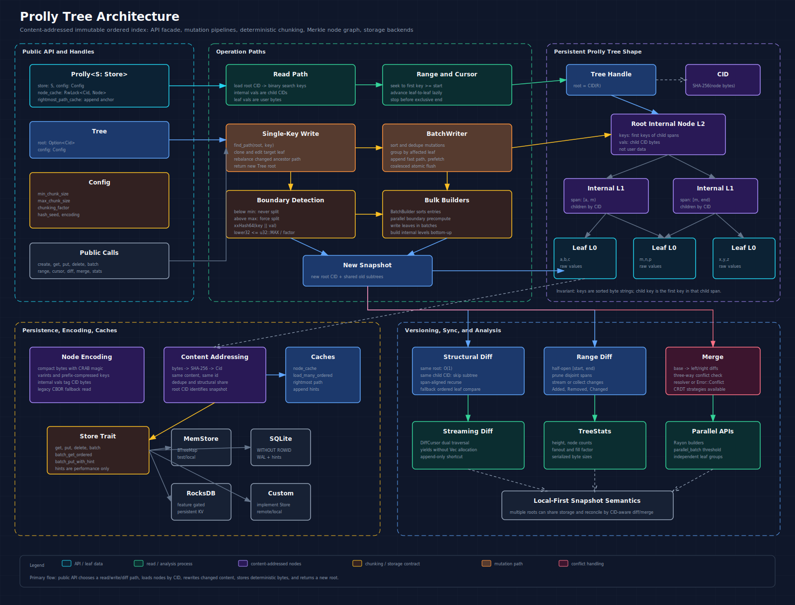

# prolly-map

`prolly-map` publishes the `prolly` Rust library crate. Users depend on the
package as `prolly-map`, while code imports stay concise:
`use prolly::{Config, Prolly};`.

The crate provides content-addressed prolly tree storage primitives: an
immutable, ordered key-value index over byte keys and byte values, with stable
content-derived structure for efficient structural sharing, diff, merge, and
bulk loading.

At the API boundary, a `Tree` is a small persistent handle:

- `root: Option<Cid>` points at the content-addressed root node.
- `config: Config` records the chunking and encoding parameters used by the tree.

The actual nodes live in a pluggable `Store`. Operations clone and rewrite only
the affected path or subtrees, write new content-addressed nodes, and return a
new `Tree` handle.

## Architecture



The same diagram is also rendered as
[`diagram/prolly-tree-architecture@2x.png`](diagram/prolly-tree-architecture@2x.png)
for contexts that prefer raster images.

The full end-user documentation set lives in [`docs/`](docs/), with getting
started material, guides, cookbook recipes, architecture, design spec,
implementation notes, roadmap, and language-porting guidance. The canonical
cookbook is [`docs/cookbook.md`](docs/cookbook.md).

## What This Crate Gives You

- Ordered byte-key lookup with lexicographic key ordering.
- Immutable updates: `put`, `delete`, and `batch` return a new `Tree`.
- Content-addressed nodes: each node CID is the SHA-256 hash of deterministic
  node bytes.
- Deterministic content-defined chunking using xxHash64 boundary checks.
- Structural sharing between versions because unchanged nodes keep the same CID.
- Efficient diff and range diff by pruning equal CIDs and disjoint child spans.
- Three-way merge with conflict resolver support.
- CRDT-style conflict-free merge strategies.
- Lazy range iteration and cursor-based traversal.
- Batch mutation paths for sorted, grouped, append-heavy, and multi-leaf writes.
- Parallel bulk builders for large initial trees.
- Pluggable storage through the `Store` trait, with memory, SQLite, and optional
  RocksDB implementations.
- Merkle-style missing-node planning and copy helpers for store sync.
- Snapshot namespace helpers for branch, tag, checkpoint, and custom roots.
- Store-independent single-key, shared multi-key, complete range, cursor-page,
  and diff-page proofs for a tree root.
- Tree statistics for inspecting shape, fill factor, fanout, and serialized size.

## Quick Start

```rust
use prolly::{Config, MemStore, Prolly};

let store = MemStore::new();
let prolly = Prolly::new(store, Config::default());

let tree = prolly.create();
let tree = prolly
    .put(&tree, b"name".to_vec(), b"Alice".to_vec())
    .unwrap();

let value = prolly.get(&tree, b"name").unwrap();
assert_eq!(value, Some(b"Alice".to_vec()));

let tree = prolly.delete(&tree, b"name").unwrap();
assert!(prolly.get(&tree, b"name").unwrap().is_none());
```

All update APIs are persistent. The old `Tree` handle remains valid as long as
the store still contains the nodes it references.

More copyable examples live in [`examples/`](examples/):

- [`agent_event_log.rs`](examples/agent_event_log.rs): append-heavy agent
  event logs for messages, tools, memory writes, checkpoints, and summaries.
- [`background_compaction.rs`](examples/background_compaction.rs):
  retention-aware event-log compaction, summary index rebuild, and GC.
- [`basic_map.rs`](examples/basic_map.rs): put, get, delete, and range scan.
- [`batch_build.rs`](examples/batch_build.rs): bulk build plus tree stats.
- [`diff_merge.rs`](examples/diff_merge.rs): diff and conflict-free three-way merge.
- [`resolver.rs`](examples/resolver.rs): delete-aware merge resolvers.
- [`secondary_index.rs`](examples/secondary_index.rs): maintain a per-tenant
  secondary index incrementally from source-tree diffs.
- [`materialized_view.rs`](examples/materialized_view.rs): derive and update a
  materialized view from source diffs, with source/view roots in manifests.
- [`crdt_merge.rs`](examples/crdt_merge.rs): custom CRDT value and delete resolution.
- [`conversation_memory.rs`](examples/conversation_memory.rs): canonical memory
  roots, agent attempt branches, merge, and CAS publish.
- [`deterministic_rag_snapshot.rs`](examples/deterministic_rag_snapshot.rs):
  record exact index roots for reproducible RAG answers and rollback.
- [`document_chunk_index.rs`](examples/document_chunk_index.rs): document/chunk
  key conventions, blob-backed text, and vector sidecar IDs.
- [`vector_sidecar.rs`](examples/vector_sidecar.rs): keep embeddings in a
  sidecar vector engine while prolly roots preserve retrieval metadata.
- [`provenance_values.rs`](examples/provenance_values.rs): values that carry
  source, parser, embedding, model, parent chunk, and CID provenance.
- [`file_blob_store.rs`](examples/file_blob_store.rs): durable blob offload and
  blob GC.
- [`filesystem_snapshot.rs`](examples/filesystem_snapshot.rs): Git-like
  filesystem snapshots with file blobs and named roots.

## Key Helpers

Keys are raw bytes and sort lexicographically. For application-level schemas,
use `KeyBuilder` to build segment-safe composite keys and `prefix_range` to scan
one logical namespace:

```rust
use prolly::{prefix_range, Config, KeyBuilder, MemStore, Prolly};

let prolly = Prolly::new(MemStore::new(), Config::default());
let mut tree = prolly.create();

let conversation = KeyBuilder::new()
    .push_str("tenant")
    .push_str("t1")
    .push_str("conversation")
    .push_str("c42")
    .finish();

let message_key = KeyBuilder::from_prefix(conversation.clone())
    .push_u64(7)
    .finish();
tree = prolly.put(&tree, message_key, b"hello".to_vec()).unwrap();

let (start, end) = prefix_range(&conversation);
let messages = prolly
    .range(&tree, &start, end.as_deref())
    .unwrap()
    .collect::<Result<Vec<_>, _>>()
    .unwrap();
assert_eq!(messages.len(), 1);
```

Use `push_u64`, `push_u128`, `push_i64`, `push_i128`, and
`push_timestamp_millis` when numeric order must match byte order. Use
`decode_segments` in tests and diagnostics, and `debug_key` for readable logs.

## Key And Range Proofs

Use `prove_key` when another process needs to verify a value or absence against
a root CID without having the backing store. A proof carries the root, key, and
root-to-leaf node path. Verification recomputes node CIDs and checks the child
links before returning a verified value. Use `prove_keys` to share proof nodes
across multiple keys, `prove_range` to prove every entry in `[start, end)`, and
`prove_prefix` to prove all entries in a logical namespace without giving the
verifier access to the store. Use `prove_range_page` when a client consumes a
cursor-based page and needs a proof for exactly that page window without
downloading the backing store. Use `prove_diff_page` when a sync peer needs a
bounded diff page it can verify offline against both the base and target roots.
Use `inspect_proof_bundle` when a receiver needs to route opaque canonical
bundle bytes to the right proof decoder or display root/bounds/count metadata
before verification. Use `verify_proof_bundle` when a receiver only needs a
store-independent aggregate verification result for opaque bundle bytes. Any
canonical proof bundle can also be wrapped in an HMAC-SHA256 authenticated
envelope when peers need tamper detection, application context, key IDs, nonces,
and optional issue/expiration times. Use `verify_authenticated_proof_bundle`
when a receiver has serialized envelope bytes and wants one call to authenticate
the envelope and verify the enclosed proof bundle.

```rust
use prolly::{
    inspect_proof_bundle, sign_proof_bundle_hmac_sha256, verify_authenticated_proof_bundle,
    verify_authenticated_proof_envelope, verify_proof_bundle, Config, Diff, DiffPageProof,
    KeyProof, MemStore, Prolly, RangeCursor, RangePageProof, RangeProof,
};

let prolly = Prolly::new(MemStore::new(), Config::default());
let tree = prolly
    .put(&prolly.create(), b"name".to_vec(), b"Alice".to_vec())
    .unwrap();

let proof = prolly.prove_key(&tree, b"name").unwrap();
let verified = proof.verify();
assert!(verified.exists());
assert_eq!(verified.value, Some(b"Alice".to_vec()));

let portable_path = proof.path_node_bytes();
let rebuilt = KeyProof::from_node_bytes(proof.root.clone(), proof.key.clone(), portable_path)
    .unwrap();
assert!(rebuilt.verify().valid);

let proof_bundle = proof.to_bundle_bytes().unwrap();
let bundle_summary = inspect_proof_bundle(&proof_bundle).unwrap();
assert_eq!(bundle_summary.kind_name(), "key");
assert_eq!(bundle_summary.key_count, 1);
let bundle_verified = verify_proof_bundle(&proof_bundle).unwrap();
assert!(bundle_verified.valid);
assert_eq!(bundle_verified.exists_count, 1);
let bundled = KeyProof::from_bundle_bytes(&proof_bundle).unwrap();
assert!(bundled.verify().exists());

let batch_proof = prolly
    .prove_keys(&tree, &[b"name".as_slice(), b"missing".as_slice()])
    .unwrap();
let batch_verified = batch_proof.verify();
assert!(batch_verified.valid);
assert!(batch_verified.results[0].exists());
assert!(batch_verified.results[1].is_absence());

let range_proof = prolly.prove_range(&tree, b"name", None).unwrap();
let range_verified = range_proof.verify();
assert!(range_verified.valid);
assert_eq!(
    range_verified.entries,
    vec![(b"name".to_vec(), b"Alice".to_vec())]
);

let range_bundle = range_proof.to_bundle_bytes().unwrap();
let range_bundled = RangeProof::from_bundle_bytes(&range_bundle).unwrap();
assert_eq!(range_bundled.verify().entries.len(), 1);

let prefix_proof = prolly.prove_prefix(&tree, b"na").unwrap();
assert_eq!(prefix_proof.verify().entries.len(), 1);

let page_tree = prolly
    .build_from_sorted_entries(vec![
        (b"a".to_vec(), b"A".to_vec()),
        (b"b".to_vec(), b"B".to_vec()),
    ])
    .unwrap();
let proved_page = prolly
    .prove_range_page(&page_tree, &RangeCursor::start(), None, 1)
    .unwrap();
assert_eq!(proved_page.page.entries, vec![(b"a".to_vec(), b"A".to_vec())]);
assert_eq!(proved_page.proof.verify().entries, proved_page.page.entries);

let page_bundle = proved_page.proof.to_bundle_bytes().unwrap();
let page_bundled = RangePageProof::from_bundle_bytes(&page_bundle).unwrap();
assert_eq!(page_bundled.verify().entries.len(), 1);

let diff_tree = prolly.delete(&page_tree, b"a").unwrap();
let diff_tree = prolly
    .put(&diff_tree, b"b".to_vec(), b"B2".to_vec())
    .unwrap();
let proved_diff = prolly
    .prove_diff_page(&page_tree, &diff_tree, &RangeCursor::start(), None, 1)
    .unwrap();
assert_eq!(
    proved_diff.page.diffs,
    vec![Diff::Removed {
        key: b"a".to_vec(),
        val: b"A".to_vec()
    }]
);
assert_eq!(proved_diff.proof.verify().diffs, proved_diff.page.diffs);

let diff_bundle = proved_diff.proof.to_bundle_bytes().unwrap();
let diff_summary = inspect_proof_bundle(&diff_bundle).unwrap();
assert_eq!(diff_summary.kind_name(), "diff_page");
assert_eq!(diff_summary.limit, Some(1));
assert!(diff_summary.has_lookahead);
let diff_bundle_verified = verify_proof_bundle(&diff_bundle).unwrap();
assert!(diff_bundle_verified.valid);
assert_eq!(diff_bundle_verified.diff_count, 1);
let diff_bundled = DiffPageProof::from_bundle_bytes(&diff_bundle).unwrap();
assert!(diff_bundled.verify().lookahead_valid);

let signed = sign_proof_bundle_hmac_sha256(
    proof_bundle.clone(),
    b"proof-key-v1".to_vec(),
    b"shared secret",
    b"tenant=t1".to_vec(),
    Some(1_700_000_000_000),
    Some(1_700_000_100_000),
    b"nonce-1".to_vec(),
)
.unwrap();
let envelope = signed.to_bytes().unwrap();
let decoded = prolly::AuthenticatedProofEnvelope::from_bytes(&envelope).unwrap();
let authenticated =
    verify_authenticated_proof_envelope(&decoded, b"shared secret", Some(1_700_000_050_000));
assert!(authenticated.valid);
assert!(KeyProof::from_bundle_bytes(&authenticated.proof_bundle)
    .unwrap()
    .verify()
    .exists());
let authenticated_bundle =
    verify_authenticated_proof_bundle(&envelope, b"shared secret", Some(1_700_000_050_000))
        .unwrap();
assert!(authenticated_bundle.valid);
assert_eq!(
    authenticated_bundle.proof.as_ref().unwrap().exists_count,
    1
);
```

## Value Codecs

The core map stores values as bytes. Use `encode_json` / `decode_json` or
`encode_cbor` / `decode_cbor` when application values are typed structs:

```rust
use prolly::{decode_json, encode_json};
use serde::{Deserialize, Serialize};

#[derive(Debug, PartialEq, Serialize, Deserialize)]
struct MemoryRecord {
    source: String,
    content: String,
}

let record = MemoryRecord {
    source: "conversation/c42".to_string(),
    content: "User likes durable local-first state.".to_string(),
};

let bytes = encode_json(&record).unwrap();
let decoded: MemoryRecord = decode_json(&bytes).unwrap();
assert_eq!(decoded, record);
```

Use reusable codec objects when a module owns an application schema and wants to
pass encode/decode policy around:

```rust
use prolly::{JsonCodec, ValueCodec, VersionedJsonCodec};

# #[derive(Debug, PartialEq, serde::Serialize, serde::Deserialize)]
# struct MemoryRecord {
#     source: String,
#     content: String,
# }
# let record = MemoryRecord {
#     source: "conversation/c42".to_string(),
#     content: "User likes durable local-first state.".to_string(),
# };
let json = JsonCodec;
let bytes = json.encode(&record).unwrap();
let decoded = json.decode::<MemoryRecord>(&bytes).unwrap();
assert_eq!(decoded, record);

let versioned = VersionedJsonCodec::new("ai.memory.record", 1);
let stored = versioned.encode(&record).unwrap();
let decoded = versioned.decode::<MemoryRecord>(&stored).unwrap();
assert_eq!(decoded, record);
```

Use `VersionedValue` when stored bytes need schema and migration metadata:

```rust
use prolly::{Config, MemStore, Prolly, VersionedValue};

# #[derive(Debug, PartialEq, serde::Serialize, serde::Deserialize)]
# struct MemoryRecord {
#     source: String,
#     content: String,
# }
# let record = MemoryRecord {
#     source: "conversation/c42".to_string(),
#     content: "User likes durable local-first state.".to_string(),
# };
let prolly = Prolly::new(MemStore::new(), Config::default());
let tree = prolly.create();

let value = VersionedValue::json("ai.memory.record", 1, &record)
    .unwrap()
    .to_bytes()
    .unwrap();
let tree = prolly
    .put(&tree, b"memory/record/1".to_vec(), value)
    .unwrap();

let stored = prolly.get(&tree, b"memory/record/1").unwrap().unwrap();
let envelope = VersionedValue::from_bytes(&stored).unwrap();
envelope.require_schema("ai.memory.record", 1).unwrap();

let decoded: MemoryRecord = envelope.decode_json().unwrap();
assert_eq!(decoded, record);
```

## Tombstones

Use `Tombstone` when a sync-heavy application needs a logical delete that peers
can observe before the key is physically removed. A tombstone stores actor,
timestamp, and causal metadata as an ordinary value:

```rust
use prolly::{tombstone_compaction, Config, MemStore, Prolly, Tombstone};

let prolly = Prolly::new(MemStore::new(), Config::default());
let tree = prolly.create();
let tree = prolly
    .put(&tree, b"doc/1".to_vec(), b"live".to_vec())
    .unwrap();

let tombstone = Tombstone::new(b"agent-a".to_vec(), 1_700_000_000_000)
    .with_causal_metadata("base-root", b"cid-before-delete".to_vec());
let tree = prolly
    .batch(&tree, vec![tombstone.to_upsert_mutation(b"doc/1").unwrap()])
    .unwrap();

let stored = prolly.get(&tree, b"doc/1").unwrap().unwrap();
let decoded = Tombstone::from_stored_bytes(&stored).unwrap().unwrap();
assert_eq!(decoded.actor, b"agent-a".to_vec());

let delete = tombstone_compaction(b"doc/1".to_vec(), &stored)
    .unwrap()
    .unwrap();
let compacted = prolly.batch(&tree, vec![delete]).unwrap();
assert!(prolly.get(&compacted, b"doc/1").unwrap().is_none());
```

## Core Data Model

### `Tree`

`Tree` is the durable handle returned to callers. It does not own node data.
It only records the root CID and the `Config` used to build the tree.

An empty tree has `root == None`. A non-empty tree has `root == Some(Cid)`.

### `Cid`

`Cid` is a 32-byte SHA-256 digest of serialized node bytes. Equal node content
produces the same CID, which gives the tree Merkle-style identity:

- Equal roots mean equal trees.
- Equal child CIDs let diff skip entire subtrees.
- Rewritten paths can share all untouched sibling subtrees.

### `Node`

A `Node` stores sorted `keys` and parallel `vals`.

For a leaf node:

```text
keys = [k1, k2, k3]
vals = [v1, v2, v3]        // raw user value bytes
```

For an internal node:

```text
keys = [first_key_child_1, first_key_child_2, ...]
vals = [child_cid_1, child_cid_2, ...]  // 32-byte CID bytes
```

Important node fields:

- `leaf`: whether values are raw data or child CIDs.
- `level`: `0` for leaves, increasing toward the root.
- `min_chunk_size`: entries before hash boundaries can split a chunk.
- `max_chunk_size`: hard upper bound that forces splitting.
- `chunking_factor`: average-boundary tuning; higher means larger chunks.
- `hash_seed`: deterministic seed for boundary placement.
- `encoding`: value encoding metadata (`Raw`, `Cbor`, `Json`, or `Custom`).

Nodes serialize to a compact deterministic format with the `CRAB` magic header.
Legacy CBOR node bytes are still readable. Fixed byte fixtures guard both
compact encoding stability and legacy decode compatibility.

## Content-Defined Chunking

Prolly trees use content-defined chunk boundaries rather than fixed B-tree split
points. Boundary placement is stable for the same content and config.

Boundary rules:

1. If the current chunk is below `min_chunk_size`, do not split.
2. If the current chunk is at or beyond `max_chunk_size`, force a split.
3. Otherwise hash `key || value` with xxHash64 and compare the lower 32 bits to
   `u32::MAX / chunking_factor`.

The default `chunking_factor` is `128`, so the expected boundary probability is
roughly `1 / 128`. Lower factors produce more, smaller chunks. Higher factors
produce fewer, larger chunks.

This is the key property that makes prolly trees good for local-first storage
and versioned indexes: small edits usually rewrite a local leaf and ancestor
path, while unchanged content keeps identical CIDs.

## Read Path

`get(&tree, key)` performs a root-to-leaf search:

1. Load `tree.root` from the `Store`.
2. Binary-search the current node's sorted `keys`.
3. In internal nodes, descend to the child whose span can contain the key.
4. In a leaf, return the exact key's value or `None`.

The expected complexity is `O(log n)` node visits.

Range APIs use similar positioning:

- `range(&tree, start, end)` returns a lazy `RangeIter`.
- `range_after(&tree, after_key, end)` resumes strictly after a processed key.
- `range_from_cursor(&tree, cursor, end)` resumes from a stable `RangeCursor`.
- `range_page(&tree, cursor, end, limit)` reads bounded pages for checkpoints.
- `reverse_page(&tree, cursor, start, limit)` and `prefix_reverse_page(&tree, prefix, cursor, limit)` read descending pages with a
  stable `ReverseCursor`.
- `prove_range_page(&tree, cursor, end, limit)` returns the same page plus a
  store-independent proof for the exclusive cursor window.
- `cursor(&tree, key)` positions a cursor near a key.
- `range_cursor(&tree, start, end)` uses cursor traversal for bounded scans.

Range iteration performs an initial seek and then advances across leaves in
sorted key order.

```rust
use prolly::{Config, MemStore, Prolly, RangeCursor};

let prolly = Prolly::new(MemStore::new(), Config::default());
let mut tree = prolly.create();
for i in 0..5 {
    tree = prolly
        .put(
            &tree,
            format!("k{i:03}").into_bytes(),
            format!("v{i:03}").into_bytes(),
        )
        .unwrap();
}

let mut cursor = RangeCursor::start();
let mut rows = Vec::new();
loop {
    let page = prolly.range_page(&tree, &cursor, Some(b"k004"), 2).unwrap();
    rows.extend(page.entries);
    match page.next_cursor {
        Some(next) => cursor = next,
        None => break,
    }
}

assert_eq!(rows.len(), 4);
```

## Write Path

`put` and `delete` are immutable operations.

Single-key writes:

1. `find_path` walks from root to the target leaf.
2. The leaf is cloned and updated.
3. `rebalance_with_collector` splits, merges, or propagates changes upward.
4. New or changed nodes are collected.
5. The collector flushes node bytes through the store.
6. The method returns a new `Tree` with the new root CID.

The original tree remains valid and shares any unchanged subtrees.

Append-heavy single-key writes can use the rightmost-path fast path when the key
belongs after the current right edge.

## Batch Mutation Path

`batch(&tree, mutations)` is the default API for multiple updates:

```rust
use prolly::{Config, MemStore, Mutation, Prolly};

let store = MemStore::new();
let prolly = Prolly::new(store, Config::default());
let tree = prolly.create();

let mutations = vec![
    Mutation::Upsert {
        key: b"a".to_vec(),
        val: b"1".to_vec(),
    },
    Mutation::Upsert {
        key: b"b".to_vec(),
        val: b"2".to_vec(),
    },
    Mutation::Delete {
        key: b"old".to_vec(),
    },
];

let tree = prolly.batch(&tree, mutations).unwrap();
```

Use `batch_with_stats` or `append_batch_with_stats` when callers need
telemetry for an operation. The returned `BatchApplyResult` contains the new
tree plus `BatchApplyStats`, including input/effective mutation counts, whether
the input was already sorted, the selected route (append fast path, batched
route, coalesced rebuild, deferred rebalancing, or bottom-up rebuild), and node
write counts.

Batch processing:

- Sorts mutations by key.
- Deduplicates duplicate keys with last-write-wins semantics.
- Detects append-only batches and updates the rightmost path directly when
  possible.
- Groups mutations by target leaf.
- Can prefetch leaves through `Store::batch_get_ordered`.
- Applies grouped mutations with either a two-pointer merge or binary search.
- Rebuilds affected parents and flushes nodes atomically through store batch
  writes when supported.

For explicit tuning, use `BatchWriter` and `BatchWriterConfig`:

```rust
use prolly::{BatchWriter, BatchWriterConfig};

let writer = BatchWriter::with_config(
    BatchWriterConfig::new()
        .with_prefetch(true)
        .with_optimized_merge(true)
        .with_bottom_up_rebuild(true),
);
```

The default config enables prefetch, optimized merge, and deferred rebalancing.
Bottom-up rebuild is available for workloads that touch many leaves.

## Bulk Building

Use `BatchBuilder` when you have many unsorted entries and want to build a fresh
tree:

```rust
use prolly::{BatchBuilder, Config, MemStore};
use std::sync::Arc;

let store = Arc::new(MemStore::new());
let mut builder = BatchBuilder::new(store, Config::default());

for i in 0..1000 {
    builder.add(
        format!("key-{i:04}").into_bytes(),
        format!("value-{i}").into_bytes(),
    );
}

let tree = builder.build().unwrap();
```

`BatchBuilder` sorts entries, computes hash-boundary predicates in parallel with
Rayon, writes leaf nodes in batches, and then builds internal levels bottom-up.

Use `SortedBatchBuilder` when the input is already sorted by key. It can stream
leaf construction without retaining every key-value pair in memory.

## Diff, Range Diff, and Merge

Diff APIs compare tree structure before falling back to leaf-level comparison:

- `diff(&base, &other)` returns collected `Diff` entries.
- `range_diff(&base, &other, start, end)` prunes subtrees outside a half-open
  key range.
- `diff_from_cursor(&base, &other, cursor, end)` resumes strictly after the
  cursor key.
- `diff_page(&base, &other, cursor, end, limit)` reads bounded diff pages for
  checkpointed indexing and sync jobs.
- `prove_diff_page(&base, &other, cursor, end, limit)` returns the same diff
  page plus a store-independent proof over both roots and any continuation
  lookahead needed to verify pagination.
- `structural_diff_page(&base, &other, cursor, limit)` checkpoints the actual
  CID frontier so large diff jobs can resume without recomputing from a key.
- `diff_cursor(&base, &other)` and `stream_diff(&base, &other)` stream changes.
- `stream_conflicts(&base, &left, &right)` streams only three-way merge
  conflicts without materializing the full right-side diff.

Fast paths:

- Same root CID returns no changes in `O(1)`.
- Equal child CIDs skip whole subtrees.
- Matching child spans recurse structurally.
- Divergent boundaries fall back to ordered collection and comparison for the
  affected subtree.

```rust
use prolly::{Config, MemStore, Prolly, RangeCursor};

let prolly = Prolly::new(MemStore::new(), Config::default());
let base = prolly.create();
let base = prolly.put(&base, b"a".to_vec(), b"1".to_vec()).unwrap();
let other = prolly.put(&base, b"b".to_vec(), b"2".to_vec()).unwrap();

let mut cursor = RangeCursor::start();
let mut diffs = Vec::new();
loop {
    let page = prolly.diff_page(&base, &other, &cursor, None, 16).unwrap();
    diffs.extend(page.diffs);
    match page.next_cursor {
        Some(next) => cursor = next,
        None => break,
    }
}

assert_eq!(diffs.len(), 1);
```

For background sync or indexing jobs that want to preserve subtree pruning
between checkpoints, page the structural traversal directly:

```rust
let mut cursor = None;
let mut diffs = Vec::new();
loop {
    let page = prolly
        .structural_diff_page(&base, &other, cursor.as_ref(), 16)
        .unwrap();
    diffs.extend(page.diffs);
    match page.next_cursor {
        Some(next) => cursor = Some(next),
        None => break,
    }
}
```

`merge(&base, &left, &right, resolver)` performs a three-way merge. It detects
conflicts when both sides change the same key differently. A resolver returns
`Resolution::Value`, `Resolution::Delete`, or `Resolution::Unresolved`; unresolved
conflicts return `Error::Conflict`.

```rust
use prolly::{resolver, Config, MemStore, Prolly};

let store = MemStore::new();
let prolly = Prolly::new(store, Config::default());

let base = prolly.create();
let base = prolly.put(&base, b"mode".to_vec(), b"base".to_vec()).unwrap();
let left = prolly.delete(&base, b"mode").unwrap();
let right = prolly
    .put(&base, b"mode".to_vec(), b"right".to_vec())
    .unwrap();

let merged = prolly
    .merge(&base, &left, &right, Some(Box::new(resolver::update_wins)))
    .unwrap();

assert_eq!(prolly.get(&merged, b"mode").unwrap(), Some(b"right".to_vec()));
```

Use `merge_range(&base, &left, &right, start, end, resolver)` when only one
keyspace should accept right-side changes. `merge_prefix` is the convenience
form for prefix-partitioned data such as one document, tenant, workspace, or
secondary index shard:

```rust
use prolly::{Config, MemStore, Prolly};

let prolly = Prolly::new(MemStore::new(), Config::default());
let base = prolly
    .put(&prolly.create(), b"doc/1/title".to_vec(), b"old".to_vec())
    .unwrap();
let left = prolly
    .put(&base, b"doc/2/title".to_vec(), b"local".to_vec())
    .unwrap();
let right = prolly
    .put(&base, b"doc/1/title".to_vec(), b"remote".to_vec())
    .unwrap();

let merged = prolly
    .merge_prefix(&base, &left, &right, b"doc/1/", None)
    .unwrap();

assert_eq!(
    prolly.get(&merged, b"doc/1/title").unwrap(),
    Some(b"remote".to_vec())
);
assert_eq!(
    prolly.get(&merged, b"doc/2/title").unwrap(),
    Some(b"local".to_vec())
);
```

Use `merge_explain` when merge behavior needs to be observable. It returns a
`MergeExplanation` with both the merge result and a typed trace. The trace is
kept even when the merge result is `Error::Conflict`, so applications can show
custom resolver calls, fallback reasons, reused subtrees, and rewritten node
spans in debugging UIs or sync logs. When merge falls back to the diff/batch
path, the trace includes `DiffTraversal` counters such as compared nodes,
skipped equal subtrees, collected subtree fallbacks, and emitted diff entries.

```rust
use prolly::{Config, MemStore, MergeTraceEvent, Prolly};

let prolly = Prolly::new(MemStore::new(), Config::default());
let base = prolly.create();
let base = prolly.put(&base, b"k".to_vec(), b"base".to_vec()).unwrap();
let left = prolly.put(&base, b"k".to_vec(), b"left".to_vec()).unwrap();
let right = prolly.put(&base, b"k".to_vec(), b"right".to_vec()).unwrap();

let explanation = prolly.merge_explain(&base, &left, &right, None);
assert!(explanation
    .trace
    .events
    .iter()
    .any(|event| matches!(event, MergeTraceEvent::StructuralMergeStarted)));
assert!(explanation.result.is_err());
```

The same explanation shape is available as `AsyncProlly::merge_explain` under
the `async-store` feature, which lets remote sync jobs and object-store-backed
applications keep resolver diagnostics without blocking on sync storage APIs.

Use `stream_conflicts` when an application needs to ask a user, agent, or domain
policy about conflicts before choosing a resolver. The iterator yields
delete-aware `Conflict` values and skips clean right-side changes:

```rust
let conflicts = prolly
    .stream_conflicts(&base, &left, &right)
    .unwrap()
    .collect::<Result<Vec<_>, _>>()
    .unwrap();
```

`AsyncProlly::stream_conflicts` exposes the same delete-aware conflict stream
under the `async-store` feature with `next().await`, `collect().await`, and
`into_stream()` adapters.

For applications with domain-specific rules, use `MergePolicyRegistry` to
compose resolvers by key prefix, exact key, or custom matcher. Later matching
rules override earlier ones:

```rust
use prolly::{resolver, MergePolicyRegistry, Resolution};

let policies = MergePolicyRegistry::with_default(|_| Resolution::unresolved())
    .add_prefix(b"settings/".to_vec(), resolver::update_wins)
    .add_prefix(b"permissions/".to_vec(), resolver::delete_wins)
    .add_prefix(b"documents/".to_vec(), resolver::prefer_left)
    .add_pattern(
        "summary merge",
        |key| key.ends_with(b"/summary"),
        |conflict| {
            let mut value = conflict.left.clone().unwrap_or_default();
            value.extend_from_slice(b"\n---\n");
            value.extend(conflict.right.clone().unwrap_or_default());
            Resolution::value(value)
        },
    );

let merged = prolly.merge(&base, &left, &right, Some(policies.as_resolver()));
```

`crdt_merge` uses `CrdtConfig` for automatic conflict-free merge behavior such
as last-writer-wins, multi-value preservation, or a custom merge function.

## Public API Surface

The crate root is the supported user-facing API. The implementation module is
private so callers use stable imports such as `prolly::Prolly`,
`prolly::Store`, `prolly::BatchBuilder`, and `prolly::resolver`.

Low-level route planning and rebuild helpers are crate-internal. Public batch
tuning is exposed through `append_batch`, `BatchWriter`, `BatchWriterConfig`,
`BatchApplyStats`, `BatchApplyResult`, and `MutationBuffer`.

## Compatibility Policy

`prolly` is still preparing for an open-source `0.1` release. Until `1.0`,
minor releases may make breaking API changes when they simplify the long-term
map abstraction or remove accidental internals. The intended stable surface is
the crate root API documented above.

Compatibility promises for early adopters:

- Tree handles are immutable. Existing `Tree` values remain valid as long as the
  backing store retains all referenced node CIDs.
- Store keys are content IDs and store values are serialized node bytes. Stores
  must preserve bytes exactly.
- Node bytes are persisted data. New decoders should continue reading existing
  `CRAB` compact nodes and legacy CBOR fixture bytes, or the release must call
  out a migration path.
- Node serialization is deterministic for a given node payload and encoding
  version. Changing serialization, chunking config, or encoding config can
  change newly produced CIDs and roots.
- Feature flags are additive. Disabling a backend feature removes that backend's
  types from the public API.
- `async-store` avoids a hard Tokio dependency. Tokio-specific adapters remain
  behind the `tokio` feature.
- Resolver and CRDT custom merge callbacks should be deterministic and
  side-effect-free; merge fast paths may evaluate equivalent conflicts through
  different execution paths.

## Storage Backends

The `Store` trait is intentionally small and content-addressed. Store keys are
CID bytes and values are serialized node bytes.

Required methods:

- `get`
- `put`
- `delete`
- `batch`

Optional optimized methods:

- `batch_get`
- `batch_get_ordered`
- `batch_get_ordered_unique`
- `batch_put`
- `supports_hints`
- `get_hint`
- `put_hint`
- `batch_put_with_hint`

Built-in stores:

- `MemStore`: in-memory store for tests and lightweight use.
- `FileNodeStore`: durable content-addressed file/object-layout store. It keeps
  immutable nodes under a sharded CID namespace, verifies node bytes on read and
  write, and stores hints and named roots in separate namespaces.
- `SqliteStore`: persistent SQLite backend behind the `sqlite` feature.
- `RocksDBStore`: optional RocksDB backend behind the `rocksdb` feature.
- `PgliteStore`: optional PGlite/Node sidecar backend behind the `pglite`
  feature.
- `SlateDbStore`: optional object-store-backed SlateDB backend behind the
  `slatedb` feature.

Feature flags:

- `async-store`: async store/blob traits, adapters, and `AsyncProlly` without a
  hard Tokio dependency.
- `tokio`: enables `async-store` plus the Tokio blocking-store adapter.
- `sqlite`: enables `SqliteStore`.
- `rocksdb`: enables `RocksDBStore`.
- `pglite`: enables `PgliteStore`; real sidecar tests require
  `PROLLY_PGLITE_TEST=1`.
- `slatedb`: enables `SlateDbStore`.

```sh
cargo test -p prolly-map
cargo test -p prolly-map --features async-store
cargo test -p prolly-map --features tokio
cargo test -p prolly-map --features sqlite
cargo test -p prolly-map --features rocksdb
cargo test -p prolly-map --features pglite
cargo test -p prolly-map --features slatedb
```

## Root Manifests

Immutable tree handles are useful in memory, but applications need durable names
for branches, checkpoints, workspaces, and sync cursors. `ManifestStore` stores
named `RootManifest` values beside content-addressed nodes.

```rust
use prolly::{Config, FileNodeStore, Prolly};
use std::sync::Arc;

let store = Arc::new(FileNodeStore::open("./target/prolly-prefix-hints").unwrap());
let prolly = Prolly::new(store.clone(), Config::default());

let tree = prolly.create();
let tree = prolly
    .put(&tree, b"project/name".to_vec(), b"crabdb".to_vec())
    .unwrap();

let update = prolly
    .compare_and_swap_named_root(b"main", None, Some(&tree))
    .unwrap();
assert!(update.is_applied());

let loaded = prolly.load_named_root(b"main").unwrap().unwrap();
assert_eq!(
    prolly.get(&loaded, b"project/name").unwrap(),
    Some(b"crabdb".to_vec())
);
```

`compare_and_swap_named_root` lets concurrent writers update a named root only
when the current tree matches the expected tree. `publish_named_root` replaces a
name unconditionally, and `delete_named_root` removes the name without removing
content-addressed nodes. `MemStore` supports this for tests and lightweight use.
`SqliteStore` and `PgliteStore` store roots in a dedicated table. `RocksDBStore`
stores roots in a dedicated column family. `SlateDbStore` stores roots under a
dedicated key prefix. Durable stores keep named-root data separate from
content-addressed node bytes.

Stores that can enumerate manifests implement `ManifestStoreScan`. Use
`list_named_roots`, `load_named_roots`, and `load_retained_named_roots` to build
explicit retained-root sets for background jobs and garbage collection.
`NamedRootRetention` supports retaining all roots, exact root names, a name
prefix, the lexicographically newest N roots under a prefix, or roots updated
since a Unix-millisecond timestamp. Manager-level publish and CAS helpers stamp
`created_at_millis` and `updated_at_millis`; `*_at_millis` variants accept
explicit timestamps for deterministic import and tests.

## Large Value Offloading

Large payloads can be kept out of leaf nodes by using the large-value helper
layer. Small values remain raw inline leaf bytes. Values larger than the
configured threshold are written to a content-addressed `BlobStore`, and the tree
stores a compact `ValueRef::Blob` envelope containing the blob CID and length.

```rust
use prolly::{Config, LargeValueConfig, MemBlobStore, MemStore, Prolly, ValueRef};

let prolly = Prolly::new(MemStore::new(), Config::default());
let blobs = MemBlobStore::new();
let policy = LargeValueConfig::new(1024);

let tree = prolly.create();
let payload = vec![42; 8 * 1024];
let tree = prolly
    .put_large_value(&blobs, &tree, b"doc/body".to_vec(), payload.clone(), policy)
    .unwrap();

assert_eq!(
    prolly.get_large_value(&blobs, &tree, b"doc/body").unwrap(),
    Some(payload)
);

let stored = prolly.get_value_ref(&tree, b"doc/body").unwrap().unwrap();
assert!(matches!(stored, ValueRef::Blob(_)));
```

`put_large_value` writes blob bytes before publishing the tree update. Repeated
large writes are content-addressed and deduplicate in `MemBlobStore`.
`get_large_value` also reads ordinary raw values, so applications can migrate to
offloading gradually. Calling plain `get` on an offloaded value returns the
stored reference envelope, not the resolved blob bytes.

Use `FileBlobStore` when local durable blob storage is enough. It stores blobs
under `blobs/sha256/aa/bb/<cid-hex>`, validates blob bytes on read, and
implements `BlobStoreScan` so GC can use backend listing as its candidate set:

```rust
use prolly::{Config, FileBlobStore, LargeValueConfig, MemStore, Prolly};

let prolly = Prolly::new(MemStore::new(), Config::default());
let blobs = FileBlobStore::open("./target/prolly-blobs").unwrap();
let policy = LargeValueConfig::new(1024);

let tree = prolly.create();
let tree = prolly
    .put_large_value(&blobs, &tree, b"doc/body".to_vec(), vec![9; 4096], policy)
    .unwrap();

let plan = prolly.plan_blob_store_gc(&blobs, &[tree.clone()]).unwrap();
assert!(plan.is_empty());
```

Offloaded blobs have their own candidate-driven GC helpers. This mirrors node
GC: mark reachable blob references from retained trees, dry-run against a
candidate set, then sweep exactly the unreachable candidates. Continuing with an
existing `prolly`, `blobs`, and `policy`:

```rust
let old = prolly.create();
let old = prolly
    .put_large_value(&blobs, &old, b"doc/body".to_vec(), vec![1; 4096], policy.clone())
    .unwrap();
let old_ref = match prolly.get_value_ref(&old, b"doc/body").unwrap().unwrap() {
    ValueRef::Blob(reference) => reference,
    ValueRef::Inline(_) => unreachable!("payload is larger than the threshold"),
};

let current = prolly
    .put_large_value(&blobs, &old, b"doc/body".to_vec(), vec![2; 4096], policy)
    .unwrap();
let current_ref = match prolly.get_value_ref(&current, b"doc/body").unwrap().unwrap() {
    ValueRef::Blob(reference) => reference,
    ValueRef::Inline(_) => unreachable!("payload is larger than the threshold"),
};

let candidates = vec![old_ref, current_ref];
let plan = prolly.plan_blob_gc(&blobs, &[current.clone()], &candidates).unwrap();
let sweep = prolly.sweep_blob_gc(&blobs, &[current], &candidates).unwrap();
assert_eq!(sweep.deleted_blobs, plan.reclaimable_blob_count);
```

## Garbage Collection

Immutable updates preserve old tree nodes, so long-lived applications should
eventually reclaim nodes that are no longer reachable from retained roots. The
generic GC API accepts explicit candidate CIDs, and built-in stores that can
scan their node namespace also implement `NodeStoreScan` for store-wide
planning.

```rust
use prolly::{Config, FileNodeStore, Prolly};
use std::sync::Arc;

let store = Arc::new(FileNodeStore::open("./target/prolly-prefix-hints").unwrap());
let prolly = Prolly::new(store.clone(), Config::default());

let base = prolly.create();
let base = prolly.put(&base, b"k".to_vec(), b"old".to_vec()).unwrap();
let updated = prolly.put(&base, b"k".to_vec(), b"new".to_vec()).unwrap();

let candidates = prolly
    .mark_reachable(&[base.clone(), updated.clone()])
    .unwrap()
    .into_cids();
let plan = prolly.plan_gc(&[updated.clone()], &candidates).unwrap();

println!(
    "reclaimable nodes={}, bytes={}",
    plan.reclaimable_nodes, plan.reclaimable_bytes
);

let sweep = prolly.sweep_gc(&[updated], &candidates).unwrap();
assert_eq!(sweep.deleted_nodes, plan.reclaimable_nodes);
```

`mark_reachable` deduplicates shared subtrees across roots. `plan_gc` is a
dry-run: it reports unreachable candidate CIDs that are present in the store,
their reclaimable byte count, and candidate CIDs that were already missing.
`sweep_gc` deletes exactly the reclaimable candidates from the plan and clears
the manager cache afterward so swept nodes are not served from memory.

When the backing store implements `NodeStoreScan`, use `plan_store_gc` and
`sweep_store_gc` to scan all stored node CIDs automatically:

```rust
let plan = prolly.plan_store_gc(&[updated.clone()]).unwrap();
let sweep = prolly.sweep_store_gc(&[updated]).unwrap();

assert_eq!(sweep.deleted_nodes, plan.reclaimable_nodes);
```

For named-root applications, use retention policies so GC keeps the branch,
checkpoint, workspace, and sync-cursor roots that should survive:

```rust
use prolly::NamedRootRetention;

prolly.publish_named_root(b"checkpoint/0001", &base).unwrap();
prolly
    .publish_named_root(b"checkpoint/0002", &updated)
    .unwrap();

let retention = NamedRootRetention::newest_by_name(b"checkpoint/", 1);
let selected = prolly.load_retained_named_roots(&retention).unwrap();
assert_eq!(selected.roots.len(), 1);

let plan = prolly.plan_store_gc_for_retention(&retention).unwrap();
let sweep = prolly.sweep_store_gc_for_retention(&retention).unwrap();
assert_eq!(sweep.deleted_nodes, plan.reclaimable_nodes);
```

Exact-name retention reports missing names, and the GC convenience helpers fail
with `Error::MissingNamedRoots` when exact roots are absent. Prefix and
newest-by-name policies intentionally select from roots that currently exist.
Use `NamedRootRetention::updated_since(prefix, cutoff_millis)` or the
duration-style `updated_within*` helpers for time-window retention when
manifests have `updated_at_millis` metadata:

```rust
prolly
    .publish_named_root_at_millis(b"checkpoint/0001", &base, 1_800_000)
    .unwrap();
prolly
    .publish_named_root_at_millis(b"checkpoint/0002", &updated, 3_600_000)
    .unwrap();

let recent = NamedRootRetention::updated_since(b"checkpoint/", 3_000_000);
let selected = prolly.load_retained_named_roots(&recent).unwrap();
assert_eq!(selected.roots.len(), 1);

let now_millis = 3_600_000;
let last_hour = NamedRootRetention::updated_within_millis(
    b"checkpoint/",
    now_millis,
    60 * 60 * 1000,
);
let selected = prolly.load_retained_named_roots(&last_hour).unwrap();
assert_eq!(selected.roots.len(), 2);
```

Passing an incomplete retained-root set can delete nodes that another branch or
checkpoint still needs.

## Snapshot Namespaces

Named roots are intentionally byte-level so applications can choose their own
root scheme. Snapshot namespaces add a small convention layer for common
branch, tag, checkpoint, and custom root names while reusing the same manifest
storage, CAS updates, retention policies, and GC behavior.

```rust
use prolly::{Config, MemStore, Prolly, SnapshotNamespace};

let prolly = Prolly::new(MemStore::new(), Config::default());
let tree = prolly
    .put(&prolly.create(), b"k".to_vec(), b"v".to_vec())
    .unwrap();

let branches = prolly.branch_snapshots();
branches.publish_at_millis(b"main", &tree, 1_700_000).unwrap();

assert_eq!(branches.root_name(b"main"), b"refs/heads/main".to_vec());
assert_eq!(branches.load(b"main").unwrap(), Some(tree.clone()));

let listed = branches.list().unwrap();
assert_eq!(listed.snapshots.len(), 1);

let deleted = branches
    .compare_and_swap(b"main", Some(&tree), None)
    .unwrap();
assert!(deleted.is_applied());

let tags = prolly.snapshots(SnapshotNamespace::tag());
tags.publish(b"v1", &tree).unwrap();
```

## Store Synchronization

Use missing-node planning to copy a tree root between stores without rewriting
nodes the destination already has. This is the low-level Merkle sync primitive
for remote peers, object-store caches, workspace sync, and background agents.

```rust
use prolly::{Config, MemStore, Prolly};
use std::sync::Arc;

let source_store = Arc::new(MemStore::new());
let destination_store = Arc::new(MemStore::new());
let source = Prolly::new(source_store, Config::default());

let tree = source.create();
let tree = source
    .put(&tree, b"doc/title".to_vec(), b"Design notes".to_vec())
    .unwrap();

let plan = source
    .plan_missing_nodes(&tree, &destination_store)
    .unwrap();
println!(
    "send {} nodes / {} bytes",
    plan.missing_nodes, plan.missing_bytes
);

let copied = source
    .copy_missing_nodes(&tree, &destination_store)
    .unwrap();
assert_eq!(copied.copied_nodes, plan.missing_nodes);

let destination = Prolly::new(destination_store, tree.config.clone());
assert_eq!(
    destination.get(&tree, b"doc/title").unwrap(),
    Some(b"Design notes".to_vec())
);
```

`plan_missing_nodes` walks the source tree, checks the destination with ordered
batch reads, and verifies any destination bytes against their CID. Missing
source bytes are also re-hashed before they are counted or copied. If a store
returns bytes that do not match the requested CID, the operation fails with
`Error::CidMismatch` instead of trusting corrupted content.

For a local object-layout backend, use `FileNodeStore`. It mirrors the namespace
split a remote object-store adapter should use: immutable node objects live
under `nodes/sha256/...`, optional hints under `hints/...`, and named roots
under `roots/...`.

```rust
use prolly::{Config, FileNodeStore, Prolly};
use std::sync::Arc;

let store = Arc::new(FileNodeStore::open("./target/prolly-nodes").unwrap());
let prolly = Prolly::new(store.clone(), Config::default());

let tree = prolly.create();
let tree = prolly
    .put(&tree, b"doc/title".to_vec(), b"Design notes".to_vec())
    .unwrap();
prolly.publish_named_root(b"main", &tree).unwrap();

let reopened = Prolly::new(store, tree.config.clone());
assert_eq!(reopened.load_named_root(b"main").unwrap(), Some(tree));
```

## Async Store Support

Enable the `async-store` feature when implementing remote, browser, object-store,
or background-agent storage. The async API mirrors the sync `Store` trait while
keeping existing embedded users on the zero-runtime sync path.

```rust
use prolly::{AsyncProlly, AsyncStore, Config, MemStore, Prolly, SyncStoreAsAsync};
use std::sync::Arc;

let sync_store = Arc::new(MemStore::new());
let sync_prolly = Prolly::new(sync_store.clone(), Config::default());
let tree = sync_prolly.create();
let tree = sync_prolly
    .put(&tree, b"cid-a".to_vec(), b"node bytes".to_vec())
    .unwrap();

let async_store = SyncStoreAsAsync::new(sync_store);
let async_prolly = AsyncProlly::new(async_store, Config::default());

async fn read_nodes<S: AsyncStore>(store: &S) -> Result<(), S::Error> {
    let keys: Vec<&[u8]> = vec![b"cid-a", b"cid-a", b"cid-b"];
    let values = store.batch_get_ordered(&keys).await?;

    assert_eq!(values.len(), 3);
    Ok(())
}

async fn read_tree<S>(prolly: &AsyncProlly<S>, tree: &prolly::Tree) -> Result<(), prolly::Error>
where
    S: AsyncStore,
    S::Error: Send + Sync,
{
    let value = prolly.get(tree, b"cid-a").await?;
    assert_eq!(value, Some(b"node bytes".to_vec()));
    Ok(())
}

async fn scan_tree<S>(prolly: &AsyncProlly<S>, tree: &prolly::Tree) -> Result<(), prolly::Error>
where
    S: AsyncStore,
    S::Error: Send + Sync,
{
    let mut iter = prolly.range(tree, b"k", Some(b"l")).await?;
    while let Some(entry) = iter.next().await {
        let (_key, _value) = entry?;
    }
    Ok(())
}

async fn scan_page<S>(
    prolly: &AsyncProlly<S>,
    tree: &prolly::Tree,
    cursor: &prolly::RangeCursor,
) -> Result<prolly::AsyncRangePage, prolly::Error>
where
    S: AsyncStore,
    S::Error: Send + Sync,
{
    prolly.range_page(tree, cursor, Some(b"l"), 100).await
}

async fn write_tree<S>(prolly: &AsyncProlly<S>) -> Result<prolly::Tree, prolly::Error>
where
    S: AsyncStore,
    S::Error: Send + Sync,
{
    let tree = prolly.create();
    let tree = prolly
        .put(&tree, b"k1".to_vec(), b"v1".to_vec())
        .await?;
    let tree = prolly.delete(&tree, b"k1").await?;
    Ok(tree)
}
```

`AsyncStore` default ordered batch reads deduplicate repeated keys, preserve
result slots, and can overlap point reads up to `read_parallelism()`. Stores
with native multi-get can override `batch_get_ordered` directly. Broad async
tree traversals chunk child-frontier prefetches so stats, reachability, diff,
range, batch routing, and missing-node sync do not hand one unbounded multi-get
to remote or object-store-style backends.

Large-value offloading also has async-native blob support under the same
feature. `AsyncBlobStore` mirrors `BlobStore`, `SyncBlobStoreAsAsync` adapts
embedded blob stores without a runtime dependency, and `AsyncProlly` can
`put_large_value`, `get_large_value`, `mark_reachable_blobs`, `plan_blob_gc`,
and `sweep_blob_gc` through async blob backends:

```rust
use prolly::{
    AsyncProlly, Config, LargeValueConfig, MemBlobStore, MemStore, SyncBlobStoreAsAsync,
    SyncStoreAsAsync,
};
use std::sync::Arc;

let node_store = Arc::new(MemStore::new());
let prolly = AsyncProlly::new(SyncStoreAsAsync::new(node_store), Config::default());
let blobs = SyncBlobStoreAsAsync::new(MemBlobStore::new());
let policy = LargeValueConfig::new(1024);

async fn write_doc<B>(
    prolly: &AsyncProlly<SyncStoreAsAsync<Arc<MemStore>>>,
    blobs: &B,
    policy: LargeValueConfig,
) -> Result<prolly::Tree, prolly::Error>
where
    B: prolly::AsyncBlobStore,
    B::Error: Send + Sync,
{
    let tree = prolly.create();
    let tree = prolly
        .put_large_value(blobs, &tree, b"doc/body".to_vec(), vec![7; 4096], policy)
        .await?;
    assert!(prolly.get_large_value(blobs, &tree, b"doc/body").await?.is_some());
    Ok(tree)
}
```

`AsyncProlly` currently supports `create`, `get`, `get_many`, `put`, `delete`,
route-planned coalesced `batch`, range scanning, eager `diff`, `range_diff`,
streaming diff, conflict streaming, standard three-way `merge`, merge
diagnostics through `merge_explain`, CRDT `crdt_merge`, `collect_stats`,
`stats_diff`, `debug_tree`, `debug_compare_trees`, `mark_reachable`,
`plan_missing_nodes`, `copy_missing_nodes`,
cache inspection, cache pinning, and cache clearing. Async batch routes sorted mutation ranges
through ordered async node loads, applies each touched leaf once, rebuilds only
touched ancestors, and flushes rewritten nodes once. Async diff skips equal
subtrees by CID and hydrates changed frontiers through ordered async batch reads
when the store prefers batched reads. Async streaming diff exposes the same
structural pruning lazily through `AsyncDiffIter::next().await` and an
`into_stream()` adapter for `futures_util::Stream`. Async merge uses the same
delete-aware resolver model as sync merge, and async `merge_explain` preserves a
typed trace across successful merges and `Error::Conflict`; async CRDT merge
uses the same conflict-free resolution strategies as sync CRDT merge. The range
iterator supports `next().await`, resumable
`RangeCursor` tokens, `range_after`, `range_from_cursor`, bounded `range_page`,
bounded `reverse_page`, and an `into_stream()` adapter for
`futures_util::Stream`. Append-heavy async
batches use the same rightmost-path hint namespace as sync append batches so
fresh async managers can hydrate the append anchor through ordered reads.

See [`docs/async-store.md`](docs/async-store.md) for the larger async roadmap, including
`AsyncProlly`, object-store backends, browser/WASM storage, and remote sync.

For async applications using blocking stores, enable the `tokio` feature and
wrap the store with `TokioBlockingStore`. This runs sync store calls on Tokio's
blocking thread pool instead of stalling runtime worker threads:

```rust
use prolly::{AsyncProlly, Config, MemStore, TokioBlockingStore};
use std::sync::Arc;

let store = Arc::new(MemStore::new());
let async_store = TokioBlockingStore::from_arc(store);
let prolly = AsyncProlly::new(async_store, Config::default());
```

## Caches and Hints

`Prolly<S>` and `AsyncProlly<S>` maintain two in-process caches:

- `node_cache`: immutable nodes keyed by CID.
- `rightmost_path_cache`: the known right edge for append-heavy workloads.

The decoded node cache is unbounded by default to preserve historical behavior.
Use `Config::builder().node_cache_max_nodes(n)` to cap retained nodes,
`node_cache_max_bytes(bytes)` to cap retained serialized node weight, or both
together for a hard memory budget. Passing `0` for either cap disables node
caching. Cache evictions are safe: cache misses always fall back to the backing
store.

Hot snapshots can pin cache entries as a performance hint. Use
`pin_tree_root(&tree)` when many reads will start from the same root, or
`pin_tree_path(&tree, key)` to keep the root-to-leaf path for a hot key range in
memory. Pinned entries may temporarily exceed configured cache limits; call
`unpin_all_cache_nodes()` when the workload phase ends so normal eviction can
trim the cache again. `AsyncProlly` exposes the same pinning APIs as async
methods.

Stores may also persist performance hints. Hint-capable stores can store a
rightmost-path hint alongside node writes so a fresh sync or async manager can
hydrate the append anchor with ordered batch reads. Hints are never required for
correctness; callers always have a normal traversal fallback.

For hot prefix ranges, sync managers can explicitly persist and hydrate a
root-to-leaf path hint. This is useful when a service repeatedly scans the same
tenant, workspace, document, or index shard from fresh workers:

```rust
use prolly::{Config, FileNodeStore, Prolly};
use std::sync::Arc;

let store = Arc::new(FileNodeStore::open("./target/prolly-prefix-hints").unwrap());
let prolly = Prolly::new(store.clone(), Config::default());
let tree = prolly.create();
let tree = prolly
    .put(&tree, b"tenant/42/doc/1".to_vec(), b"body".to_vec())
    .unwrap();

let prefix = b"tenant/42/";
let _published = prolly.publish_prefix_path_hint(&tree, prefix).unwrap();

let fresh_worker = Prolly::new(store, tree.config.clone());
let _hydrated = fresh_worker
    .hydrate_prefix_path_hint(&tree, prefix)
    .unwrap();
```

If the hint is absent, stale, malformed, or points to missing nodes, hydration
returns `false` and ordinary tree traversal remains correct.

Writers that already know affected key ranges can also persist recently changed
span hints for background indexing or sync jobs:

```rust
use prolly::ChangedSpan;

let old_root = tree.clone();
let tree = prolly
    .put(&old_root, b"tenant/42/doc/2".to_vec(), b"new body".to_vec())
    .unwrap();

let spans = vec![ChangedSpan::for_prefix(b"tenant/42/".to_vec())];
let _published = prolly
    .publish_changed_spans_hint(&old_root, &tree, spans)
    .unwrap();

if let Some(hint) = prolly.load_changed_spans_hint(&old_root, &tree).unwrap() {
    for span in hint.spans {
        let _diffs = prolly
            .range_diff(&old_root, &tree, &span.start, span.end.as_deref())
            .unwrap();
    }
}
```

Changed-span hints are advisory. They are useful when the producer is trusted or
when a worker wants to prioritize likely-hot ranges, but callers can always fall
back to full `diff`, `range_diff`, or `structural_diff_page` for authoritative
change discovery.

Use `clear_cache()` after tests or external store maintenance that intentionally
mutates the backing store outside the `Prolly` API. Use `cache_len()` and
`cache_bytes_len()` to inspect current node-cache size. Use
`cache_pinned_len()` and `cache_pinned_bytes_len()` to inspect pinned entries.

## Manager Metrics

`Prolly` and `AsyncProlly` expose lightweight cumulative metrics for cache and
node I/O observability:

```rust
use prolly::{Config, MemStore, Prolly};

let prolly = Prolly::new(MemStore::new(), Config::default());
let tree = prolly.create();
let tree = prolly.put(&tree, b"k".to_vec(), b"v".to_vec()).unwrap();

let metrics = prolly.metrics();
assert!(metrics.nodes_written > 0);

prolly.reset_metrics();
prolly.clear_cache();
let _ = prolly.get(&tree, b"k").unwrap();

let metrics = prolly.metrics();
assert!(metrics.node_cache_misses > 0);
assert!(metrics.nodes_read > 0);
```

Metrics count manager-observed serialized node bytes before backend-specific
compression or layout. Cache hits are requested node slots served from the
in-process cache; cache misses are unique node CIDs fetched from the backing
store; cache evictions count decoded nodes removed from the manager cache.
Resetting metrics does not clear caches.

## Configuration

```rust
use prolly::{Config, Encoding};

let config = Config::builder()
    .min_chunk_size(4)
    .max_chunk_size(1024)
    .chunking_factor(128)
    .hash_seed(42)
    .encoding(Encoding::Raw)
    .node_cache_max_nodes(50_000)
    .node_cache_max_bytes(256 * 1024 * 1024)
    .build();
```

Tuning guide:

| Setting | Effect |
| --- | --- |
| `min_chunk_size` | Prevents tiny chunks by disabling boundary checks until the chunk is large enough. |
| `max_chunk_size` | Forces a split and bounds worst-case node size. |
| `chunking_factor` | Higher values create fewer boundaries and larger average nodes. |
| `hash_seed` | Changes deterministic boundary placement for the same content. |
| `encoding` | Records value encoding metadata on nodes. |
| `node_cache_max_nodes` | Caps decoded nodes retained per manager; omit for unbounded, use `0` to disable. |
| `node_cache_max_bytes` | Caps retained serialized node weight; combine with node count for predictable memory budgets. |

For durable stores, larger chunks generally reduce node count and I/O, while
smaller chunks can improve edit locality and diff granularity.

## Statistics

`collect_stats(&tree)` traverses the tree and returns `TreeStats`, including:

- node, leaf, and internal-node counts;
- tree height;
- total key-value pairs;
- serialized size metrics;
- entries per level;
- fanout and fill factor;
- key and value size distribution.

Use `stats_diff(&before, &after)` to collect both sides and return a
`StatsComparison` containing the baseline stats, candidate stats, absolute
deltas, and percentage deltas:

```rust
let comparison = prolly.stats_diff(&before, &after).unwrap();
println!(
    "entries: {:+}, bytes: {:+}",
    comparison.absolute.total_key_value_pairs_diff,
    comparison.absolute.total_tree_size_bytes_diff
);
```

This is useful when tuning chunking parameters, comparing storage backends, or
tracking write amplification in benchmarks.

## Debug Visualization

`debug_tree(&tree)` returns a `TreeDebugView` grouped from root to leaves. Each
node includes its CID, level, leaf/internal kind, entry count, fill factor,
encoded byte size, and key range:

```rust
let view = prolly.debug_tree(&tree).unwrap();
println!("{}", view.to_text());
```

`debug_compare_trees(&before, &after)` reports shared, left-only, and right-only
CIDs so tests, CLIs, and benchmark reports can see which subtrees were reused or
rewritten:

```rust
let comparison = prolly.debug_compare_trees(&before, &after).unwrap();
println!("{}", comparison.to_text());
assert!(comparison.shared_nodes > 0);
```

`AsyncProlly` exposes the same methods and loads child frontiers through ordered
async batch reads.

## CLI Inspection

The `prolly-inspect` binary inspects named roots in a filesystem-backed
`FileNodeStore`. It is intended for local debugging, CI artifacts, and operator
checks before GC or sync jobs:

```sh
cargo run -p prolly-map --bin prolly-inspect -- /path/to/store roots
cargo run -p prolly-map --bin prolly-inspect -- /path/to/store stats main
cargo run -p prolly-map --bin prolly-inspect -- /path/to/store walk main
cargo run -p prolly-map --bin prolly-inspect -- /path/to/store compare main feature
cargo run -p prolly-map --bin prolly-inspect -- /path/to/store changed main feature
cargo run -p prolly-map --bin prolly-inspect -- /path/to/store verify --all
```

The commands list named roots, print tree stats, render node levels and fill
factors, compare shared versus rewritten subtrees, summarize changed key spans,
and dry-run reachability from one root or all named roots.

## Complexity

Approximate costs:

| Operation | Cost |
| --- | --- |
| `get` | `O(log n)` node visits |
| `put` / `delete` | `O(log n)` path rewrite plus rebalancing |
| `range` | `O(log n + k)` for `k` yielded entries |
| `batch` | sort and group mutations, then rewrite affected leaves and ancestors |
| `diff` | `O(changed subtrees)` when boundaries align; local ordered fallback otherwise |
| same-root `diff` | `O(1)` |
| `merge` | diffs plus batch application of non-conflicting changes |

## Testing and Benchmarks

Run crate tests:

```sh
cargo test -p prolly-map
```

Run with SQLite support:

```sh
cargo test -p prolly-map --features sqlite
```

Run release-quality checks used by CI:

```sh
RUSTDOCFLAGS="-D warnings" cargo doc -p prolly-map --no-deps --features "tokio sqlite"
cargo check -p prolly-map --bin prolly-inspect
cargo check -p prolly-map --examples
cargo check -p prolly-map --benches --features "tokio sqlite"
```

Run shared store contract coverage:

```sh
cargo test -p prolly-map --test store_conformance
cargo test -p prolly-map --features async-store --test async_store
cargo test -p prolly-map --features sqlite --test sqlite_store
cargo test -p prolly-map --features rocksdb --test rocksdb_store
cargo test -p prolly-map --features slatedb --test slatedb_store
cargo test -p prolly-map --features pglite --test pglite_store
```

The PGlite contract compiles by default and opens the Node.js sidecar only when
`PROLLY_PGLITE_TEST=1` is set:

```sh
mkdir -p /tmp/prolly-pglite-node
npm install --prefix /tmp/prolly-pglite-node @electric-sql/pglite@0.5.3
PROLLY_PGLITE_TEST=1 PROLLY_PGLITE_NODE_CWD=/tmp/prolly-pglite-node \
  cargo test -p prolly-map --features pglite --test pglite_store
```

Run the main benchmark harness:

```sh
PROLLY_BENCH_SCALE=5000 cargo bench -p prolly-map --bench prolly_bench --features sqlite
```

Run the AI/local-first workload harness:

```sh
PROLLY_AI_BENCH_SCALE=10000 cargo bench -p prolly-map --bench ai_workloads_bench
```

Run the focused SQLite scale harness:

```sh
PROLLY_SQLITE_SCALE_STAGES=1000000,10000000 \
PROLLY_SQLITE_SCALE_BATCH=100000 \
cargo bench -p prolly-map --bench sqlite_scale_bench --features sqlite
```

See [`docs/performance.md`](docs/performance.md) for the performance guide,
current benchmark coverage, and measured SQLite scale results.

## Module Map

| Module | Responsibility |
| --- | --- |
| `tree.rs` | Persistent `Tree` handle. |
| `node.rs` | Node layout, compact serialization, node CID calculation. |
| `cid.rs` | SHA-256 content identifier. |
| `config.rs` | Chunking and encoding configuration. |
| `boundary.rs` | xxHash64 content-defined boundary detection. |
| `rebalance.rs` | Splitting, merging, parent propagation, root changes. |
| `batch.rs` | Batch mutation processing, append paths, collectors, rebuild helpers. |
| `builder.rs` | Parallel and sorted bulk tree construction. |
| `range.rs` | Lazy range iteration. |
| `cursor.rs` | Cursor traversal and streaming diff cursor. |
| `diff.rs` | Structural diff, range diff, and three-way merge. |
| `crdt.rs` | Conflict-free merge strategies. |
| `parallel.rs` | Parallel batch/rebalance interfaces. |
| `streaming.rs` | Streaming differ trait and default implementation. |
| `stats.rs` | Tree shape and size metrics. |
| `store/` | Storage trait and backend implementations. |

## When To Use It

Use this crate when you need an ordered map that can cheaply keep multiple
versions, diff them, merge them, or persist them into a content-addressed store.
It is a good fit for local-first databases, versioned metadata indexes,
replication/sync state, and systems like CrabDB that need stable structural
identity between snapshots.
