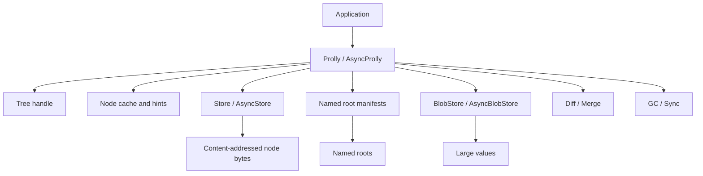

# Architecture

`prolly-map` is organized around a small set of concepts:

- `Tree`: an immutable snapshot handle.
- `Cid`: a SHA-256 content identifier for serialized node bytes.
- `Node`: an internal or leaf node in an ordered tree.
- `Store`: the synchronous key-value backend for node bytes and metadata.
- `AsyncStore`: the optional asynchronous backend trait.
- `Prolly`: the synchronous tree manager.
- `AsyncProlly`: the asynchronous tree manager.
- `ManifestStore`: named root storage.
- `BlobStore`: optional large value storage.

## Component View



## Tree Snapshots

A tree snapshot is immutable. Mutations return a new snapshot:

```text
old tree root: A
put(k, v)
new tree root: B
```

Unchanged subtrees keep their old CIDs and are shared. Changed leaves and their
ancestor path are rebuilt.

This design is important for AI-native applications because it makes state
snapshots cheap:

- an agent can branch memory for a run;
- a RAG index can be rebuilt in the background;
- a UI can diff two roots to update derived views;
- a sync process can copy only missing CIDs.

## Node Layout

Leaf nodes contain sorted key/value pairs.

Internal nodes contain sorted separator keys and child CIDs.

The tree behaves like a B+ tree for lookup:

1. Start at root CID.
2. Load the node from the store.
3. Search keys in the node.
4. Follow the matching child CID until a leaf.
5. Search the leaf for the key.

Unlike a traditional B+ tree, splits are content-defined. The boundary
function decides where nodes should break based on key/content hashing and the
configured chunking parameters.

## Content Addressing

Every node is serialized deterministically. Its CID is the SHA-256 hash of
those bytes.

Consequences:

- identical node content produces the same CID;
- stores can deduplicate nodes naturally;
- diff can skip equal CIDs;
- sync can plan missing CIDs;
- root CIDs can act as reproducible snapshot identifiers.

The CID only covers the serialized node bytes. It does not include external
store metadata, cache hints, named root names, or local timestamps.

## Store Layer

The core store contract is intentionally small:

```rust
pub trait Store {
    fn get(&self, key: &[u8]) -> Result<Option<Vec<u8>>, Self::Error>;
    fn put(&self, key: &[u8], value: &[u8]) -> Result<(), Self::Error>;
    fn delete(&self, key: &[u8]) -> Result<(), Self::Error>;
    fn batch(&self, ops: &[BatchOp]) -> Result<(), Self::Error>;
}
```

Optional store capabilities include:

- ordered batch reads;
- batch puts;
- scan of node CIDs for GC;
- performance hints;
- named root manifests;
- backend-specific durability and transaction behavior.

Stores are responsible for bytes. The tree manager is responsible for node
encoding, invariants, chunking, diff, merge, and traversal.

## Async Store Layer

`AsyncStore` mirrors the sync store contract and adds async-first read
parallelism hooks. It exists for backends where operations may wait on network,
browser, or object storage I/O.

The async manager is not just a sync manager hidden behind blocking calls. It
has async read, write, range, diff, merge, stats, batch, large-value, and
cache-related paths.

Adapters bridge the two worlds:

- `SyncStoreAsAsync` wraps a sync store for async code.
- `TokioBlockingStore` runs sync store operations on Tokio's blocking pool.

The crate keeps both APIs because sync stores remain ideal for simple local
backends, while async stores unlock remote and browser deployments.

## Manifest Layer

Named roots are manifests that map application names to tree snapshots.

Examples:

```text
main
workspace:123:memory
workspace:123:rag-index
agent:run-456:attempt
view:open-tickets
```

Named roots solve the "where is the current root?" problem. They also provide
an application-level concurrency boundary through compare-and-swap updates.

The manifest layer is separate from the tree nodes. A tree root CID can exist
without a name, and a name can be moved from one root to another.

Tree updates do not move names. `put`, `delete`, `batch`, and `merge` return a
new immutable `Tree` handle. The named root still points at the old tree until
the application explicitly publishes the new handle with `publish_named_root` or
updates it with `compare_and_swap_named_root`.

Use this mental model:

```text
prolly root CID   immutable tree snapshot
named root        mutable application pointer to a tree
CAS publish       ref update from expected tree to replacement tree
```

If an application needs Git-like commit semantics, keep commit metadata above
the map layer. Parent links, authors, messages, reflogs, branch policies, and
remote-tracking state are application records that point at tree handles; they
are not part of a raw prolly root.

## Diff

Diff compares two roots:

```text
base root A
other root B
```

If CIDs are equal, the whole subtree is equal. If CIDs differ, the differ walks
down into the affected spans. This makes diff proportional to changed
structure, not always to total tree size.

Diff powers:

- UI change feeds;
- sync planning;
- materialized view updates;
- index maintenance;
- merge.

## Merge

Three-way merge uses:

```text
base
left
right
```

The merge engine handles disjoint changes automatically. When the same key is
changed incompatibly, it constructs a `Conflict`:

```rust
pub struct Conflict {
    pub key: Vec<u8>,
    pub base: Option<Vec<u8>>,
    pub left: Option<Vec<u8>>,
    pub right: Option<Vec<u8>>,
}
```

Absence is explicit. A delete/update conflict is visible as one side `None`
and the other `Some(value)`.

Standard merge may return unresolved conflicts. CRDT-style merge must resolve
to value or delete.

## Large Values

Large value support separates the ordered index from bulky payload bytes:

```text
leaf value -> inline bytes
leaf value -> ValueRef -> BlobStore
```

This keeps tree nodes small and makes it possible to use different storage
policies for node metadata and large payloads.

Use this for:

- documents;
- embeddings payloads, when not kept in a vector database;
- images or binary attachments;
- model outputs with large provenance bundles.

## GC and Retention

Because nodes are immutable, old snapshots remain available until unreachable
nodes are swept.

GC needs a retention set:

```text
retained roots -> reachable CIDs -> sweep candidates not reachable
```

The retention set should include:

- named roots;
- checkpoints;
- in-flight branches;
- roots still referenced by clients or agents;
- debug roots you want to preserve.

Blob GC follows the same idea, but reachability comes from value references
stored in retained tree nodes.

## Sync

Store sync is Merkle-style:

1. Choose a source root.
2. Walk the source tree.
3. Ask the destination store which CIDs are missing.
4. Copy missing nodes.
5. Publish or record the root in the destination.

This is useful for local-first systems, remote cache warmup, background agents,
and object-store publishing.

## Why This Architecture Fits AI-Native Apps

AI-native applications often need more than a single mutable database row:

- agents branch and retry;
- memory needs provenance;
- retrieval indexes need reproducible snapshots;
- background workers rebuild derived state;
- local and remote peers sync opportunistically;
- users need explainable diffs between states.

Prolly trees give those workflows a storage primitive with cheap snapshots,
content IDs, diff, merge, and portable byte-level semantics.
