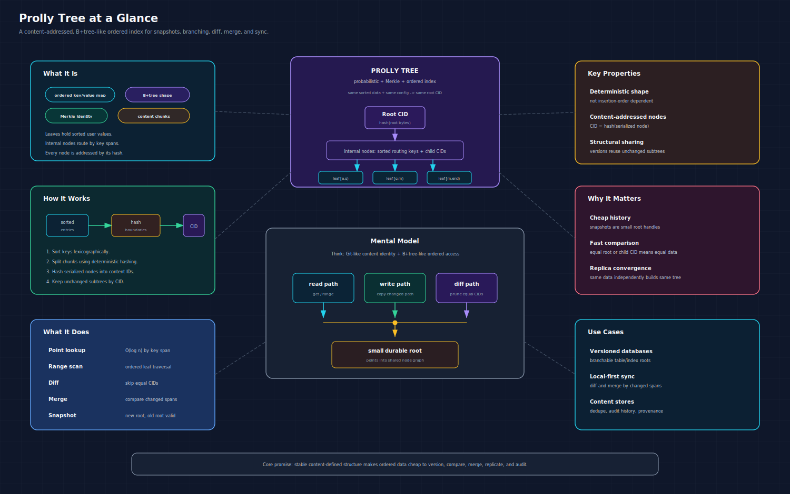
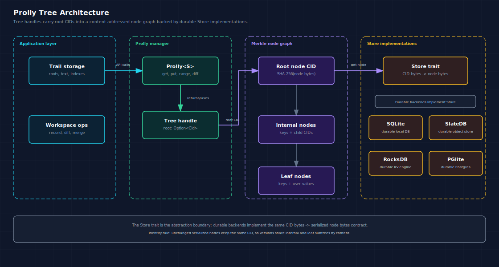
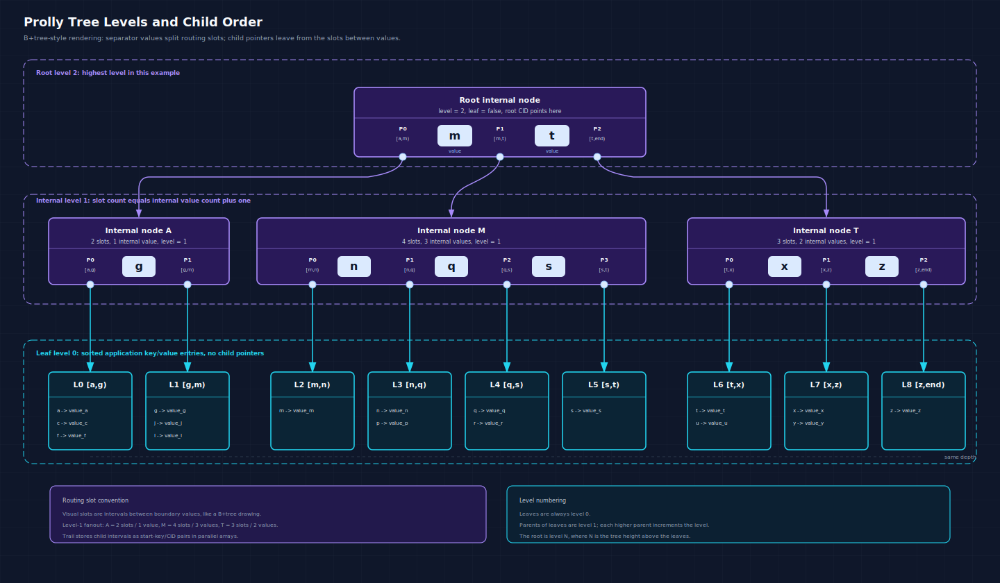
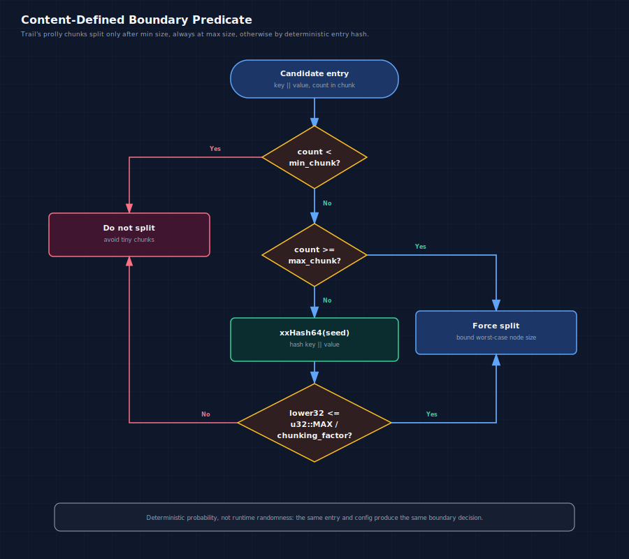
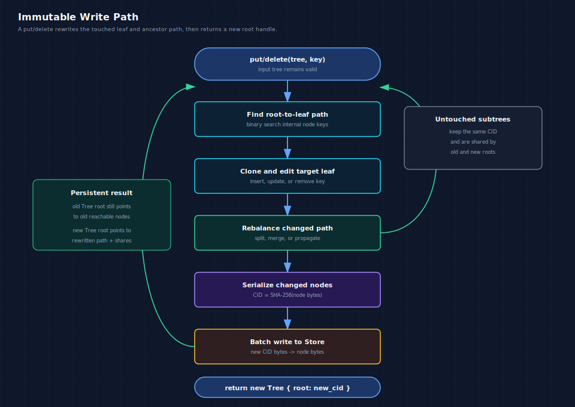
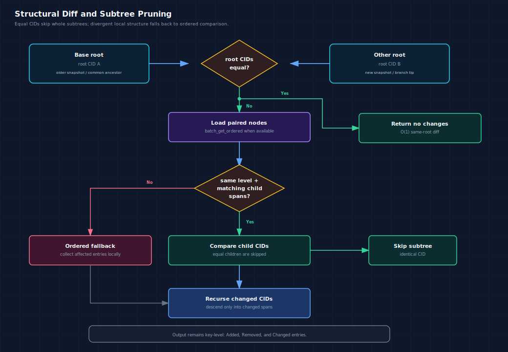

# Prolly Trees: Content-Addressed Ordered Indexes for Versioned Data

A prolly tree is an immutable ordered key-value index whose shape is derived
from content instead of insertion history. It gives you B-tree-style lookup and
range scans, Merkle-style identity, and efficient structural sharing between
versions.

The name is short for "probabilistic tree." The probabilistic part is not
runtime randomness. It comes from a deterministic hash predicate that places
chunk boundaries with an expected average size. Given the same sorted entries
and the same chunking configuration, a prolly tree builds the same structure
and the same root identifier.

CrabDB uses this property for versioned workspace roots and text indexes. A
root can be represented by a small handle, while the backing tree nodes live in
a content-addressed store. Unchanged subtrees keep the same content ID across
versions, so diff, merge, history, and provenance operations can skip large
parts of the tree.



## The Short Definition

A prolly tree is best understood as:

- An ordered map over byte keys and byte values.
- A persistent data structure: updates return a new root and leave old roots
  valid.
- A Merkle tree: every node is addressed by a cryptographic hash of its
  deterministic bytes.
- A B-tree-like search index: internal nodes route lookups to sorted children,
  and leaves store sorted key-value entries.
- A content-defined chunk tree: node boundaries are chosen by hashing entries,
  not by fixed page numbers or insertion order.

Those pieces combine into one useful invariant:

```text
same sorted data + same config -> same tree shape -> same root CID
```

That invariant is what makes prolly trees useful for versioned databases and
local-first systems. Two independently built trees can converge on identical
subtrees without coordinating insertion order.

## Why Not Just Use a B-Tree or a Merkle Tree?

A normal B-tree is excellent for point lookups and range scans, but its shape is
usually affected by insertion order, page split timing, and storage engine
state. Two replicas that contain the same logical rows can have different page
layouts. That is fine for a single database engine, but less helpful when the
tree shape itself is used for sync, deduplication, or structural diff.

A plain Merkle tree gives strong identity and subtree comparison, but it does
not automatically give an ordered map with efficient lexicographic lookup,
bounded range scans, and local updates.

A prolly tree sits between those designs:

- Like a B-tree, it stores sorted keys and supports `O(log n)` lookup.
- Like a B+ tree, user values live at the leaf level.
- Like a Merkle tree, each node has a content ID.
- Like content-defined chunking systems, boundaries remain stable around
  unchanged content.

The result is an ordered map that is friendly to snapshots, branching, merging,
and replication.

## Architecture

CrabDB's `prolly` crate exposes a small persistent `Tree` handle and stores
actual nodes through a pluggable `Store`.



The core types are:

| Type | Role |
| --- | --- |
| `Tree` | A durable handle containing `root: Option<Cid>` and the chunking `Config`. |
| `Cid` | A 32-byte SHA-256 digest of serialized node bytes. |
| `Node` | A sorted node. Leaves store values; internal nodes store child CIDs. |
| `Config` | Chunking and encoding parameters. |
| `Store` | A backend interface where keys are CID bytes and values are serialized nodes. |
| `Prolly<S>` | The manager that performs reads, writes, range scans, diff, merge, and caching over a store. |

An empty tree has `root == None`. A non-empty tree has a root CID that points to
the top node in the store.

## Node Layout and Tree Hierarchy

CrabDB's implementation stores sorted byte keys and parallel byte values:

```text
Leaf node, level = 0

keys = [k1, k2, k3]
vals = [v1, v2, v3]
```

Internal nodes use the same physical layout, but the values are child CIDs:

```text
Internal node, level > 0

keys = [first_key_child_1, first_key_child_2, first_key_child_3]
vals = [cid_child_1,       cid_child_2,       cid_child_3]
```

The key at each internal slot is the first key covered by that child. During a
lookup, the search chooses the child whose span can contain the target key.
Other prolly tree implementations may store separator keys differently, but the
purpose is the same: route a sorted key search through content-addressed
children.

CrabDB numbers levels from the leaves upward: leaf nodes are `level = 0`,
parents of leaves are `level = 1`, and the root has the highest level in that
tree.

The hierarchy diagram uses the usual B+ tree visual convention: child pointers
leave from routing intervals between boundary keys, while CrabDB stores those
children as parallel start-key and CID arrays.



Each node also records the parameters that shaped it:

- `leaf`: whether values are user bytes or child CID bytes.
- `level`: `0` for leaves, increasing toward the root.
- `min_chunk_size`: minimum entries before hash boundaries can split a node.
- `max_chunk_size`: hard upper bound that forces a split.
- `chunking_factor`: expected-boundary tuning.
- `hash_seed`: deterministic seed for the boundary hash.
- `encoding`: metadata such as `Raw`, `Cbor`, `Json`, or `Custom`.

## Content IDs and Deterministic Bytes

The content ID is computed from the serialized node:

```text
cid = SHA-256(node_bytes)
```

This gives the tree Merkle identity:

- Equal node bytes produce equal CIDs.
- Equal root CIDs mean equal trees under the same serialization rules.
- Equal child CIDs let diff and merge skip whole subtrees.
- Updating one leaf can preserve all untouched sibling subtrees.

CrabDB's current compact node format starts with a `CRAB` magic header, records
node metadata with varints, prefix-compresses sorted keys against the previous
key, and stores internal child CIDs with a compact tag. Legacy CBOR node bytes
remain readable.

Deterministic serialization is not an implementation detail you can casually
change. It is part of the identity function. If two nodes serialize differently,
they have different CIDs even if a human would consider them logically similar.

## Content-Defined Chunking

The defining feature of a prolly tree is that it chooses chunk boundaries from
entry content.

CrabDB's boundary predicate is:

1. If the current chunk has fewer than `min_chunk_size` entries, do not split.
2. If the current chunk is at or above `max_chunk_size`, force a split.
3. Otherwise hash `key || value` with xxHash64 using `hash_seed`.
4. Take the lower 32 bits of the hash.
5. Split when that value is less than or equal to
   `u32::MAX / chunking_factor`.

In pseudocode:

```text
fn is_boundary(config, count, key, value):
    if count < config.min_chunk_size:
        return false

    if count >= config.max_chunk_size:
        return true

    hash = xxhash64(seed = config.hash_seed, bytes = key || value)
    lower32 = hash & 0xffff_ffff
    threshold = u32::MAX / config.chunking_factor

    return lower32 <= threshold
```



With a chunking factor of `128`, the expected boundary probability is about
`1 / 128`. Lower factors make smaller average nodes. Higher factors make larger
average nodes.

CrabDB uses two relevant configurations:

- General text/index maps use `min=4`, `max=1024`, `factor=128`,
  `seed=0xC0DB`, and raw values.
- Root path and file-index maps use wider chunks: `min=64`, `max=512`,
  `factor=256`, `seed=0xC0DB`, and raw values.

The wide root-map configuration trades finer diff granularity for fewer nodes
and less storage overhead on large workspace roots.

## Read Path

A point lookup follows a root-to-leaf path:

1. Read the root CID from the `Tree`.
2. Load the node from the `Store`.
3. Binary-search the node's sorted keys.
4. If the node is internal, descend into the matching child CID.
5. If the node is a leaf, return the exact value or `None`.

The expected cost is `O(log n)` node visits, plus store latency. The tree is
ordered, so range scans perform an initial seek and then advance through leaves
in lexicographic key order.

Basic use:

```rust
use prolly::{Config, MemStore, Prolly};

let store = MemStore::new();
let prolly = Prolly::new(store, Config::default());

let tree = prolly.create();
let tree = prolly
    .put(&tree, b"name".to_vec(), b"Alice".to_vec())
    .unwrap();

let value = prolly.get(&tree, b"name").unwrap();
assert_eq!(value, Some(b"Alice".to_vec()));
```

Range iteration:

```rust
use prolly::{Config, MemStore, Prolly};

let store = MemStore::new();
let prolly = Prolly::new(store, Config::default());

let mut tree = prolly.create();
tree = prolly.put(&tree, b"a".to_vec(), b"1".to_vec()).unwrap();
tree = prolly.put(&tree, b"b".to_vec(), b"2".to_vec()).unwrap();
tree = prolly.put(&tree, b"c".to_vec(), b"3".to_vec()).unwrap();

for item in prolly.range(&tree, b"b", Some(b"d")).unwrap() {
    let (key, value) = item.unwrap();
    println!("{key:?} -> {value:?}");
}
```

## Write Path

Single-key writes are immutable. `put` and `delete` do not mutate the input
`Tree`; they return a new `Tree`.



The unchanged parts of the original tree are reused by CID. A small edit usually
rewrites one leaf and the ancestor path to the root. The old root remains valid
as long as the store still contains the nodes it references.

This is copy-on-write at the tree level, but content addressing makes it more
powerful than ordinary path copying. If a rebuilt node has identical bytes, it
gets the same CID. If two independently built versions contain the same
subtree, that subtree has the same identity.

## Batch Mutation Path

Batch updates matter because prolly trees are often used for snapshots: record a
workspace root, ingest many rows, update an index, or apply a remote change set.

CrabDB's batch path:

1. Sorts mutations by key.
2. Deduplicates repeated keys with last-write-wins semantics.
3. Detects append-only batches when possible.
4. Groups mutations by target leaf.
5. Prefetches leaves through `Store::batch_get_ordered` when the backend
   benefits from batched reads.
6. Applies grouped mutations with an optimized merge path.
7. Rebuilds affected parents.
8. Flushes changed nodes through store batch writes.

Example:

```rust
use prolly::{Config, MemStore, Mutation, Prolly};

let store = MemStore::new();
let prolly = Prolly::new(store, Config::default());
let tree = prolly.create();

let mutations = vec![
    Mutation::Upsert {
        key: b"a".to_vec(),
        val: b"1".to_vec(),
    },
    Mutation::Upsert {
        key: b"b".to_vec(),
        val: b"2".to_vec(),
    },
    Mutation::Delete {
        key: b"old".to_vec(),
    },
];

let tree = prolly.batch(&tree, mutations).unwrap();
```

For fresh bulk loads, `BatchBuilder` accepts unsorted entries, sorts them,
computes boundary predicates in parallel, writes leaves in batches, and builds
internal levels bottom-up. `SortedBatchBuilder` is available when input is
already sorted and can be streamed without retaining every entry in memory.

## Diff

Diff is where prolly trees become more than an ordered map.



The fast paths are:

- Equal root CIDs return no changes in `O(1)`.
- Equal child CIDs skip entire subtrees.
- Matching child spans recurse structurally.
- Range diff prunes child spans outside the requested key range.

When boundaries do not align, the implementation falls back to collecting the
affected subtree's ordered entries and comparing them locally. That fallback is
important. Content-defined boundaries are stable for unchanged content, but
insertions and value changes can shift nearby boundaries.

Diff output is key-level:

```rust
use prolly::{Config, Diff, MemStore, Prolly};

let store = MemStore::new();
let prolly = Prolly::new(store, Config::default());

let base = prolly.create();
let base = prolly.put(&base, b"a".to_vec(), b"1".to_vec()).unwrap();
let other = prolly.put(&base, b"a".to_vec(), b"2".to_vec()).unwrap();

let diffs = prolly.diff(&base, &other).unwrap();
assert_eq!(
    diffs,
    vec![Diff::Changed {
        key: b"a".to_vec(),
        old: b"1".to_vec(),
        new: b"2".to_vec(),
    }]
);
```

CrabDB also exposes streaming diff APIs so large comparisons do not need to
materialize every change up front.

## Merge

Merge uses a normal three-way shape:

```text
        base
       /    \
    left    right
       \    /
       merged
```

The merge algorithm can return immediately when one side is unchanged or both
sides are identical. Otherwise it compares changes from the common base, checks
whether both branches changed the same key incompatibly, and applies
non-conflicting mutations in a batch.

Conflicts include:

- Both branches change the same existing key to different values.
- One branch changes a key while the other deletes it.
- Both branches add the same key with different values.

A resolver can choose a value, delete the key, or leave the conflict unresolved.
Without a resolver, unresolved conflicts return an error.

```rust
use prolly::{Config, MemStore, Prolly, Resolution, Resolver};

let store = MemStore::new();
let prolly = Prolly::new(store, Config::default());

let base = prolly.create();
let base = prolly.put(&base, b"mode".to_vec(), b"old".to_vec()).unwrap();

let left = prolly.put(&base, b"mode".to_vec(), b"left".to_vec()).unwrap();
let right = prolly.put(&base, b"mode".to_vec(), b"right".to_vec()).unwrap();

let prefer_left: Resolver = Box::new(|conflict| {
    conflict
        .left
        .clone()
        .map_or_else(Resolution::delete, Resolution::value)
});
let merged = prolly.merge(&base, &left, &right, Some(prefer_left)).unwrap();

assert_eq!(
    prolly.get(&merged, b"mode").unwrap(),
    Some(b"left".to_vec())
);
```

The crate also includes CRDT-style merge strategies for automatic conflict-free
behavior such as last-writer-wins, multi-value preservation, and custom merge
functions.

## Storage Backends

The storage interface is intentionally small:

```rust
use std::collections::HashMap;
use std::sync::Mutex;

use prolly::{BatchOp, Store};

struct ExampleStore {
    nodes: Mutex<HashMap<Vec<u8>, Vec<u8>>>,
}

impl Store for ExampleStore {
    type Error = std::io::Error;

    fn get(&self, key: &[u8]) -> Result<Option<Vec<u8>>, Self::Error> {
        Ok(self.nodes.lock().unwrap().get(key).cloned())
    }

    fn put(&self, key: &[u8], value: &[u8]) -> Result<(), Self::Error> {
        self.nodes
            .lock()
            .unwrap()
            .insert(key.to_vec(), value.to_vec());
        Ok(())
    }

    fn delete(&self, key: &[u8]) -> Result<(), Self::Error> {
        self.nodes.lock().unwrap().remove(key);
        Ok(())
    }

    fn batch(&self, ops: &[BatchOp]) -> Result<(), Self::Error> {
        let mut nodes = self.nodes.lock().unwrap();
        for op in ops {
            match op {
                BatchOp::Upsert { key, value } => {
                    nodes.insert((*key).to_vec(), (*value).to_vec());
                }
                BatchOp::Delete { key } => {
                    nodes.remove(*key);
                }
            }
        }
        Ok(())
    }
}
```

The actual `Store` trait also includes optional optimized methods:

- `batch_get`
- `batch_get_ordered`
- `prefers_batch_reads`
- `batch_put`
- `supports_hints`
- `get_hint`
- `put_hint`
- `batch_put_with_hint`

Store keys are CID bytes. Store values are serialized node bytes. That means
the storage backend does not need to understand the logical key-value data. It
only needs to persist content-addressed blobs.

CrabDB can store prolly nodes in SQLite by default. New workspaces can choose
SlateDB-backed node storage:

```sh
crabdb init --working-tree --prolly-backend slatedb
```

SQLite remains the metadata store for refs, operations, derived indexes, and
workspace bookkeeping. With SlateDB, prolly nodes can live in an object-store
path configured by `storage.slatedb_*`.

## Caches and Hints

The `Prolly<S>` manager keeps two in-process caches:

- A node cache keyed by CID.
- A rightmost-path cache for append-heavy workloads.

The rightmost path matters because many ingest workloads append sorted keys.
Without an anchor, each batch may rediscover the right edge from the root. With
the rightmost-path cache, append chains can update the known edge directly.

Stores may also persist hints. SQLite can store a compact rightmost-path hint
with node writes. A fresh manager can hydrate that append anchor using ordered
batch reads. Hints are performance metadata only. Correctness always requires a
normal traversal fallback.

## How CrabDB Uses Prolly Maps

CrabDB is a local-first operation database for code and text worktrees. Prolly
maps are used where CrabDB needs ordered, versioned, content-addressed indexes:

- Root path map.
- Root file index map.
- Text order map.
- Line index map.

A `WorktreeRoot` records map roots and summary metadata for a workspace
snapshot. Because those maps are prolly trees, two roots can be compared by
walking CIDs and pruning unchanged subtrees. That is useful for dirty status,
recording, branch/lane diff, merge preparation, provenance, and structured
patch review.

Text storage uses prolly maps for larger `TreeText` content:

- One map represents line order.
- Another map indexes line identity.

That lets CrabDB reason about line movement and line history without treating a
file as only one opaque blob.

Low-level inspection commands expose this machinery for debugging:

```sh
crabdb map range <root> --type path
crabdb map diff <base-root> <other-root> --type path
```

Those commands are internal/debugging tools, but they are useful for
understanding how root and text maps are actually stored.

## Example Scenarios

### Recording a Workspace Snapshot

When CrabDB records a workspace, it can build or update ordered maps from paths
to file entries and from file identities to index entries. Most files do not
change between snapshots. Their map entries and surrounding subtrees can retain
the same CIDs, so the new root shares structure with the previous root.

### Diffing Two Branches or Lanes

Two workspace roots can be compared structurally. If a directory-sized region
of lexicographic paths is unchanged, equal child CIDs prune that region. The
diff only descends into changed spans.

### Merging Disjoint Edits

If two lanes change different keys, a three-way merge can apply both sets of
changes. If both change the same key differently, the conflict is explicit and
can be routed to a resolver or higher-level domain logic.

### Syncing Versioned State

A sync protocol can compare root CIDs, request missing child CIDs, and avoid
transferring subtrees the receiver already has. The ordered shape is useful for
range-aware sync, while content IDs provide deduplication.

## Real-World Applications

Prolly trees are a good fit when a system needs more than a mutable index:

- Versioned databases that need cheap snapshots and branch/merge semantics.
- Local-first applications that sync ordered state between peers.
- Source-control-adjacent systems that track structured workspace metadata.
- Collaborative editors that need stable identity for document ranges or lines.
- Metadata stores where many versions share mostly unchanged content.
- Replication systems that want to exchange missing content-addressed subtrees.

Dolt and Noms are the common references for this family of ideas. Dolt uses
prolly-tree maps in its storage engine, and Noms popularized a
content-addressed database model where structured values can be compared and
synchronized by hash.

## Advanced Topics

### Boundary Tuning

The most important tuning knobs are `min_chunk_size`, `max_chunk_size`, and
`chunking_factor`.

Smaller average chunks:

- Improve edit locality.
- Improve fine-grained diff behavior.
- Increase node count and store overhead.

Larger average chunks:

- Reduce node count.
- Improve broad scan and storage overhead.
- Can make small edits rewrite larger local regions.

The right values depend on workload. CrabDB uses wider chunks for root maps
than for general text/index maps because root maps benefit from reduced node
amplification at large workspace sizes.

### Key-Value Boundary Hashing

CrabDB hashes `key || value` for boundary placement. That means a value change
can move a local chunk boundary even when the key stays the same. The upside is
that boundaries are derived from full entry content. The tradeoff is that value
updates may perturb nearby structure more than key-only chunking would.

Key-only chunking is a valid alternative in other systems. It can make value
updates less likely to move boundaries, but it may be less sensitive to content
changes when values dominate the logical data.

### Append-Heavy Optimization

Content-defined trees can be expensive if append workloads repeatedly traverse
from the root to the right edge. CrabDB handles this with append-batch detection,
an in-process rightmost-path cache, and optional persisted rightmost-path hints.

This is a practical storage-engine lesson: the abstract data structure gives
good asymptotic behavior, but production performance still depends on
workload-specific fast paths.

### Batch Rebuilds

For large mutation sets, it can be cheaper to rebuild affected regions
bottom-up than to apply many path rewrites independently. The `prolly` crate has
batch writers, grouped leaf mutation paths, sorted builders, and bottom-up
rebuild helpers for these cases.

### Structural Diff Limits

Structural diff is fastest when chunk boundaries align. Local insertions,
deletions, and value changes can shift boundaries. A correct implementation
must handle that by falling back to ordered comparison for the affected
subtree. The goal is not to avoid all local work; the goal is to avoid work in
unchanged regions.

### Storage Amplification

Every versioned structure has some amplification. In a prolly tree, the main
costs are:

- Serialized node bytes.
- Internal-node fanout.
- Rewritten ancestor paths.
- Store indexing overhead.
- Caches, hints, and backend metadata.

CrabDB tracks this in benchmarks with metrics such as SQLite bytes,
`repo_prolly_nodes` bytes, text-content bytes, and operation latency. Compact
node encoding and wider root-map fanout are examples of practical changes aimed
at reducing amplification.

### Garbage Collection

Content-addressed nodes can be shared by many roots. A node is safe to delete
only when no reachable root references it. That requires reachability analysis
from live roots, branches, operations, or backup boundaries. In other words,
garbage collection is a graph problem, not a key deletion problem.

### Hash Choice

CrabDB uses xxHash64 for fast boundary detection and SHA-256 for content IDs.
Those jobs are different:

- Boundary detection needs speed and stable distribution.
- Content IDs need collision resistance and durable identity.

Do not use the boundary hash as the Merkle identity hash.

## When to Use a Prolly Tree

Use a prolly tree when you need an ordered map and at least one of these is
central to the system:

- Cheap immutable snapshots.
- Efficient structural diff.
- Branch and merge behavior.
- Content-addressed replication.
- Deduplication across versions.
- Range scans over versioned data.

Avoid it when:

- You only need a single mutable index.
- Insertion order identity is acceptable.
- Versions are short-lived and never compared.
- A simple append log or LSM table is enough.
- The overhead of content-addressed nodes outweighs diff/sync benefits.

## Mental Model

The practical mental model is:

```text
Prolly tree = ordered map + deterministic chunking + Merkle identity
```

The ordered map gives useful database operations. Deterministic chunking makes
the shape stable across replicas and rebuilds. Merkle identity makes equality,
diff, merge, and sync efficient.

That combination is why prolly trees show up in systems like CrabDB: they are a
storage primitive for data that is not just queried, but also versioned,
compared, merged, and synchronized.

## Further Reading

- [CrabDB prolly crate README](../../crates/prolly/README.md)
- [CrabDB prolly performance guide](../../crates/prolly/docs/performance.md)
- [CrabDB storage and indexing design](../design/storage-and-indexing.md)
- [CrabDB objects, roots, text, and line identity](objects-roots-text-and-line-identity.md)
- [Dolt prolly tree storage-engine docs](https://www.dolthub.com/docs/architecture/storage-engine/prolly-tree/)
- [Noms introduction](https://github.com/attic-labs/noms/blob/master/doc/intro.md)
- [Accelerating Prolly Trees: Simplified Chunking for Rapid Updates](https://ceur-ws.org/Vol-3791/paper8.pdf)
