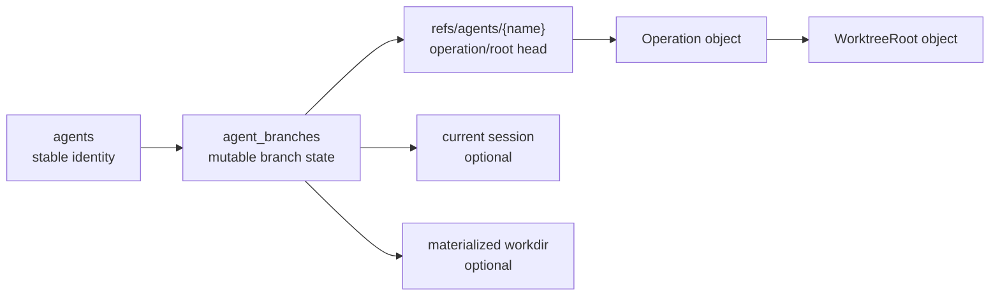
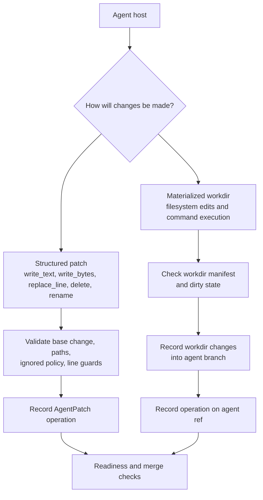
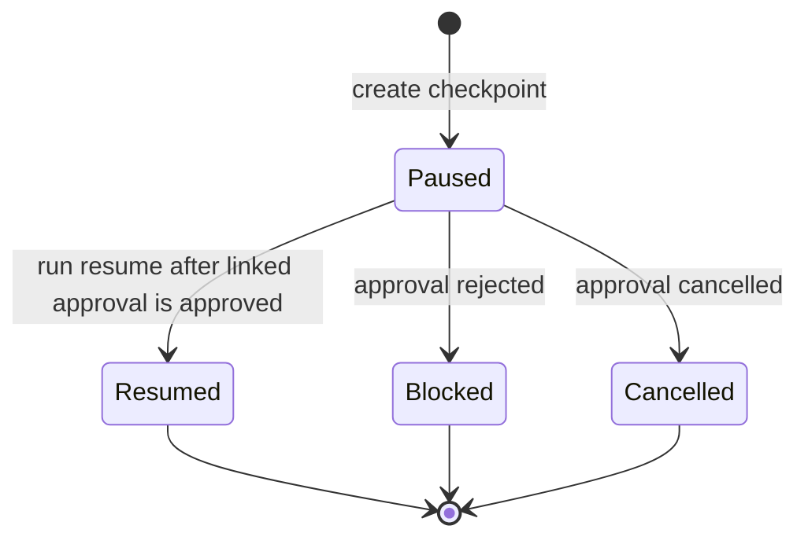
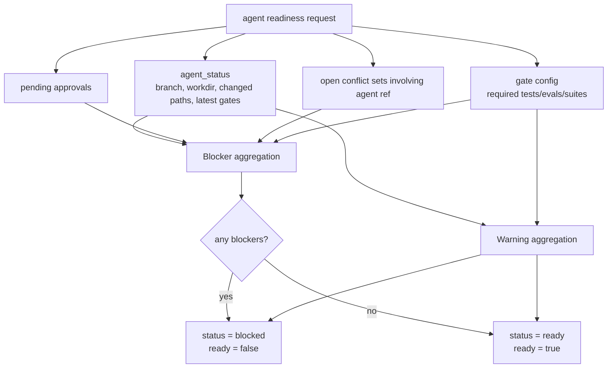

# Agent Coordination

This design section is advanced/internal. It explains how CrabDB coordinates multiple agent branches, workdirs, sessions, gates, approvals, and merges.

## Coordination Goals

The agent subsystem is designed to let coding agents work without immediately mutating the main workspace branch.

The core goals are:

- Isolate agent changes on `refs/agents/<name>`.
- Preserve enough activity history for review and handoff.
- Support both structured patches and materialized workdir edits.
- Coordinate path ownership with advisory leases.
- Block unsafe merges with readiness checks.
- Serialize merges to shared targets through a merge queue.

## Agent Identity and Branch State

Agent state is split between `agents` and `agent_branches`.

`agents` stores identity:

- `agent_id`
- name
- kind
- provider
- model
- creation time
- metadata JSON

`agent_branches` stores branch state:

- agent ID
- backing ref name
- base change/root
- head change/root
- current session
- optional materialized workdir
- status
- timestamps

This split allows stable identity while branch head and workdir state change.



## Agent Refs

Agent branches use refs under:

```text
refs/agents/<name>
```

The ref points to the same head operation/root that `agent_branches` records. Code that mutates an agent branch should keep these in sync.

## Editing Modes

Agents can change branch state in two main ways.

Structured patches apply directly to the agent branch:

- write text
- write bytes
- replace stable line
- delete path
- rename path

Materialized workdirs let an agent operate on a filesystem checkout and then record the workdir into the agent branch.

The direct patch path is easier to audit and safer for tool hosts. The workdir path is useful when tools need a real filesystem, command execution, or incremental editing.



## Materialized Workdirs

Materialization can be:

- Full branch materialization.
- Sparse materialization for selected paths.
- Sparse materialization with neighbor files.
- Custom workdir path.
- Default workdir under configured `agent.worktrees_dir`.

Safety rules include:

- Custom workdirs must be empty or absent.
- Workdirs cannot be symlinks.
- Sparse workdirs store manifests for selected paths.
- Dirty workdirs must be recorded or force-synced before merge.

## Sessions and Turns

Sessions are durable containers for agent work. Turns are bounded units of activity inside a session.

Session state includes:

- agent ID
- title
- status
- start/end timestamps
- metadata

Turn state includes:

- agent ID
- optional session ID
- base change
- before change
- optional after change
- status
- start/end timestamps
- metadata

Messages, events, operations, and spans can all link back to sessions and turns. This gives handoff reports enough context to describe what happened and what should happen next.

## Events and Trace Spans

Agent events are generic structured records with:

- event ID
- agent/session/turn links
- event type
- optional change/message links
- payload
- timestamp

Trace spans are derived from start/end events and indexed separately so the system can list, summarize, and show spans efficiently. Parent span IDs and trace IDs let a host reconstruct nested work.

## Run Checkpoints

`agent_run_states` persists paused/resumed agent run state. A run checkpoint can link to:

- agent
- session
- turn
- approval

It stores reason, summary, state JSON, optional interruption JSON, status, reviewer, note, and timestamps.

This is not a scheduler. It is a durable handoff/checkpoint record for hosts that need to pause on approval or interruption and resume later.



## Human Approvals

Approvals are durable gates over sensitive actions. They store:

- action
- summary
- optional payload
- status
- reviewer/note
- session/turn links

Guardrail checks can detect matching pending, approved, or rejected approvals. Approved matches can satisfy approval-required guardrail reasons; rejected matches block.

## Leases and Claims

Leases are advisory coordination records. They do not replace branch isolation or merge conflict detection.

Lease fields include:

- lease ID
- agent ID
- ref name
- optional path
- optional file ID
- mode
- expiry
- creation time

`agent claim` is a convenience around a write lease for a path. Claims also try to hydrate sparse workdir paths for the claimant when possible.

Conflict behavior:

- Existing active lease by the same agent/path/mode is reused.
- Conflicting active leases from other agents return conflict information or an error depending on API path.
- Expired leases can be ignored by default lists unless `--all` is requested.

## Readiness Aggregation

Readiness is derived at request time. It is not stored as durable truth.

Inputs include:

- Agent status and branch status.
- Branch diff changed paths.
- Materialized workdir state.
- Workdir changed paths.
- Pending approvals.
- Open conflict sets involving the agent ref.
- Latest test gate.
- Latest eval gate.
- Required test/eval gate configuration.
- Existing queued merges.

Blocker codes include:

- `agent_removed`
- `dirty_workdir`
- `pending_approvals`
- `open_conflicts`
- `latest_test_failed`
- `latest_eval_failed`
- `missing_latest_test` when required
- `missing_latest_eval` when required
- required suite issues from gate config

Warnings include:

- Missing latest test/eval when not required.
- No changed paths.
- Already queued merge.



## Handoff Reports

Handoff reports combine:

- Agent details.
- Readiness.
- Current session details.
- Recent sessions.
- Recent events.
- Recent spans.
- Recent operations.
- Derived next steps.

This report is the main transfer object for moving agent work between hosts or from an agent to a human reviewer.

## Merge Coordination

Direct `merge-agent` checks readiness before merging. Merge queue runs serialize queued entries and record merge results. If a conflict appears, the queue item becomes conflicted and a conflict set persists for resolution.

This avoids silent overwrites and gives humans/agents an explicit conflict-resolution surface.

## Invariants

- Agent branch records and agent refs should agree on head change/root.
- Removed agents should not be treated as merge-ready.
- Dirty materialized workdirs should block merge until recorded or force-handled.
- Pending approvals should block readiness.
- Open conflict sets involving the agent ref should block readiness.
- Required gate suite config should be enforced by readiness and merge paths.

## Code Facts Used

- Agent lifecycle: `crates/crabdb/src/db/agent/lifecycle.rs`
- Agent workdirs: `crates/crabdb/src/db/agent/workdir`
- Agent identity/status: `crates/crabdb/src/db/agent/identity.rs`
- Agent control: `crates/crabdb/src/db/agent/control`
- Leases: `crates/crabdb/src/db/agent/leases.rs`
- Readiness/handoff: `crates/crabdb/src/db/agent/readiness.rs`
- Merge queue: `crates/crabdb/src/db/merge`
