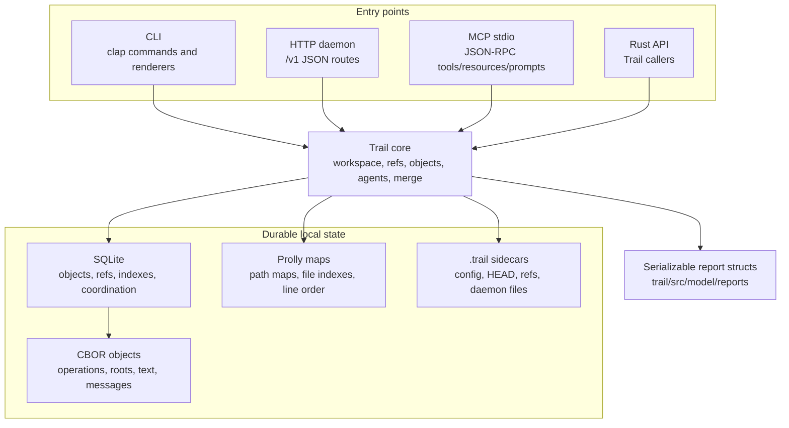
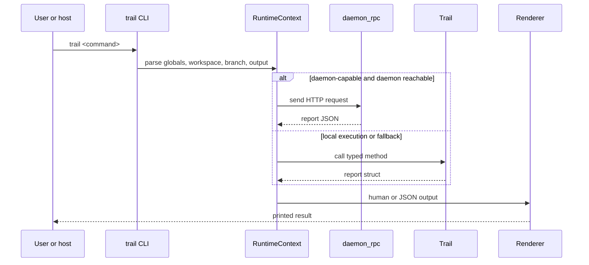
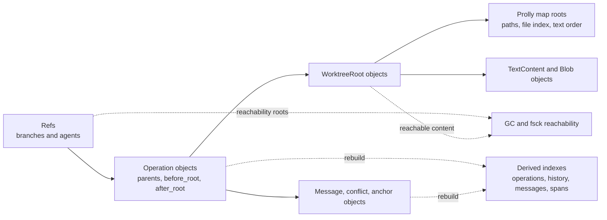

# Architecture

This design section is advanced/internal. It describes the implementation shape in the current source tree, not a stable external contract.

## Goals

Trail is built as a local-first operation database for code and text worktrees. The main architectural goals visible in the code are:

- Keep the workspace local and usable without a daemon.
- Record operations as durable history, not only snapshots.
- Preserve stable file and line identity for provenance and lane patching.
- Let humans and agents work on isolated refs before merge.
- Share typed reports across CLI, HTTP, MCP, and Rust API surfaces.
- Keep risky actions inspectable through guardrails, approvals, readiness, and merge queues.

## Main Layers

Trail is split into these layers:

- CLI: `trail/src/cli`
- Core library API: `trail/src/lib.rs` and `trail/src/db`
- Domain and report models: `trail/src/model`
- HTTP daemon and OpenAPI: `trail/src/server`
- MCP stdio server: `trail/src/mcp`
- Ordered map storage: `prolly`

The `trail` binary is intentionally thin: `src/main.rs` calls `cli::run()`. The core behavior lives in the library so the CLI, HTTP server, MCP server, tests, and external Rust callers can use the same implementation.

## Command Flow

CLI command flow is:

1. `clap` parses global options and a typed command enum.
2. `run_cli` decides whether parse/runtime errors should be JSON.
3. A `RuntimeContext` resolves workspace, database directory, branch, output format, quiet mode, and JSON mode.
4. Supported hot commands may route to a daemon through `daemon_rpc`.
5. Otherwise the handler opens a local `Trail` and calls the corresponding typed method.
6. Renderers print either human output or JSON serialized from report structs.

This means CLI behavior usually has two paths:

- Local execution through `Trail`.
- Daemon-backed execution for selected hot commands, returning the same report shapes.

The daemon path is intentionally partial. It handles `status`, `record`, `diff`, selected `lane` commands, `merge-lane`, and `merge-queue`. Unsupported commands fall back to local execution unless the user explicitly supplied a daemon URL and the command is not daemon-capable.

## `Trail` Object Boundary

`Trail` owns the live state needed by the library:

- `workspace_root`
- `db_dir`
- SQLite connection
- shared `SqliteStore` for prolly objects
- regular and root prolly clients
- parsed `TrailConfig`
- in-process object cache
- optional daemon worktree cache

The object is not only a storage handle. It also enforces workspace path policy, locking, config validation, object serialization, index maintenance, agent coordination, merge logic, and materialization rules.

## Storage Boundary

Trail uses a hybrid storage model:

- SQLite tables store refs, indexes, queue state, coordination records, and object metadata.
- CBOR-encoded content-addressed objects store roots, operations, text content, messages, blobs, anchors, and conflict sets.
- Prolly maps store ordered key-value structures for path maps, file indexes, text order, and line indexes.
- Filesystem sidecars under `.trail` store config, HEAD, ref files, daemon discovery files, daemon token files, and materialized workdir manifests.

The design separates durable object truth from derived indexes. If derived indexes are damaged or stale, `index rebuild` reconstructs them from reachable operation and message objects.

## Surface Model

Most public operations return serializable report structs. That keeps interfaces aligned:

- CLI JSON output serializes reports directly.
- HTTP routes return reports as JSON.
- MCP tools return reports as structured content.
- Rust callers receive typed reports.

This report boundary is a practical architecture choice. Raw SQLite rows, object bytes, and low-level prolly map entries stay internal unless an explicit inspection command exposes them.

## Workspace Lifecycle

Initialization creates:

- `.trail/index`
- `.trail/refs/branches`
- `.trail/refs/lanes`
- `.trail/worktrees`
- `config.toml`
- `HEAD`
- `.trailignore`
- initial schema and refs

Opening a workspace applies SQLite pragmas, constructs prolly clients, initializes or validates schema, and refuses schema versions newer than the binary supports.

## Write Coordination

Mutating operations use a workspace write lock. The lock prevents concurrent writers from corrupting refs, indexes, or object reachability. Code that records operations, changes config, acquires leases, rebuilds indexes, runs GC, or mutates branches generally obtains this lock before writing.

Advisory leases are separate from the write lock. The write lock protects database mutation. Leases coordinate agent intent at the path/workspace level.

## Important Invariants

- Refs should point to an operation object and root object that exist.
- Operation parents form the reachable history graph.
- Branch refs and lane branch records should agree on current head/root.
- Materialized workdirs should not be trusted if their manifest is missing or dirty without recording/sync.
- Ignored and internal paths should not be recorded accidentally.
- Derived indexes may be rebuilt, but object history and refs are the durable source of truth.

## Failure Modes

- Future schema version: opening fails with invalid input.
- Missing workspace: CLI exits with `WORKSPACE_NOT_FOUND`.
- Dirty worktree/materialized workdir: checkout or merge may refuse.
- Workspace lock held: mutating operations fail with `WORKSPACE_LOCKED`.
- Daemon unavailable: explicit daemon routing reports daemon error; auto-discovery may fall back.
- Corrupt or missing objects: `fsck` and index rebuild report errors.

## When to Change This Area

Inspect the architecture layer when adding:

- A new CLI command or output mode.
- A new HTTP/MCP route backed by existing library behavior.
- A new report type shared across surfaces.
- A new object kind or durable coordination table.
- A change to workspace discovery, daemon routing, or locking.

## Code Facts Used

- CLI runtime: `trail/src/cli/command/handler.rs`
- Runtime context: `trail/src/cli/command/handler/runtime.rs`
- Daemon routing: `trail/src/cli/command/handler/daemon_rpc.rs`
- `Trail`: `trail/src/db/mod.rs`
- Initialization/opening: `trail/src/db/core/init.rs`
- Library exports: `trail/src/lib.rs`
- Error model: `trail/src/error.rs`
