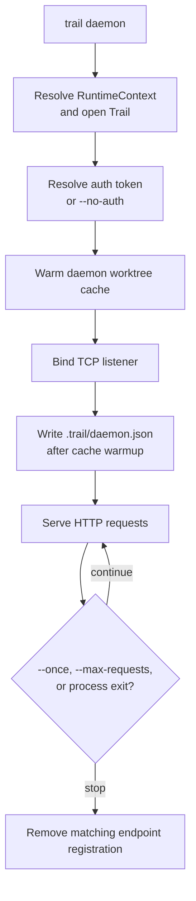
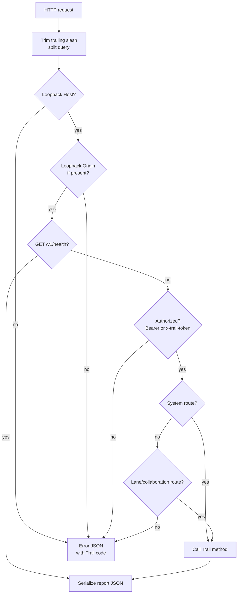
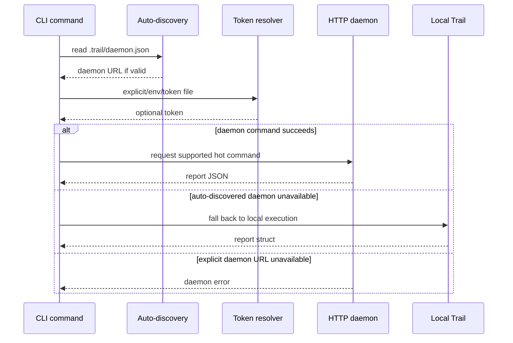
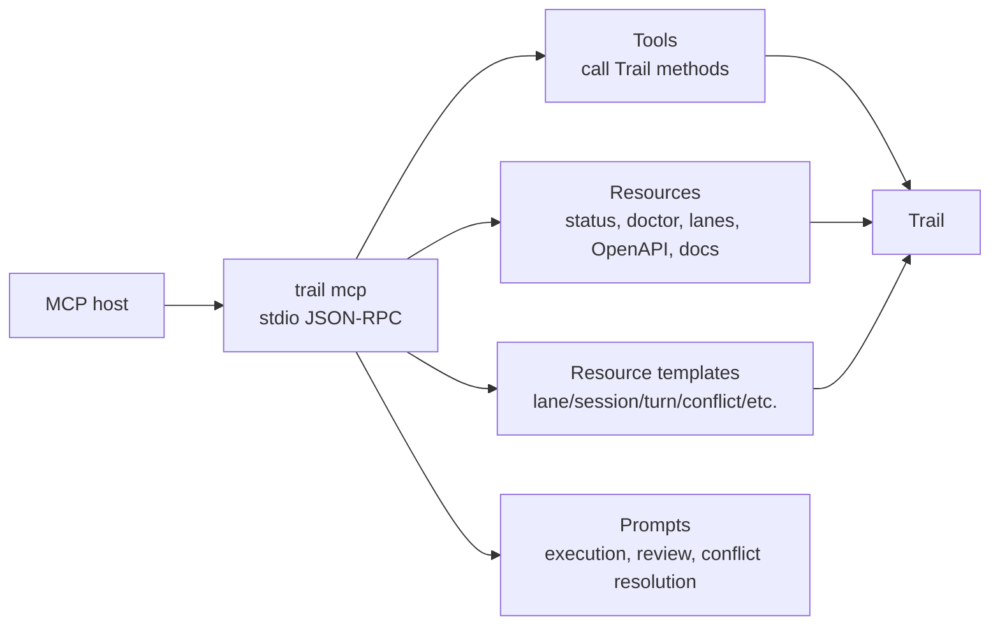

# Daemon, HTTP, and MCP

This design section is advanced/internal. It explains how Trail exposes the same local database through the daemon, HTTP API, OpenAPI, and MCP stdio server.

## Integration Goals

Trail has several integration surfaces because different hosts need different tradeoffs:

- CLI: best for humans and shell scripts.
- HTTP daemon: best for editor integrations and repeated local automation.
- MCP stdio server: best for agent hosts that can discover tools/resources/prompts.
- Rust API: best for typed in-process use.

The daemon and MCP layers are adapters over `Trail`. They should not develop separate semantics from the core library.

## Daemon Lifecycle

`trail daemon` flow:

1. Resolve runtime context and open `Trail`.
2. Resolve daemon auth.
3. Start daemon worktree cache warmup.
4. Bind a TCP listener.
5. Compute a local daemon URL.
6. Prepare endpoint registration under `.trail/daemon.json`.
7. Write endpoint registration after cache warmup if the daemon is still alive.
8. Serve HTTP requests until `--once`, `--max-requests`, or process exit.
9. Remove endpoint registration on drop if it still matches this daemon.

This design lets CLI auto-discovery find the daemon without an external service registry.



## Daemon Worktree Cache

The daemon starts a worktree cache because repeated status/diff/record-style requests are common for editor integrations. The cache tracks filesystem events and dirty path hints, then reconciles with full status scans when needed.

The cache is an optimization. The database remains usable without it, and auto-daemon routing falls back when the daemon is unavailable.

## Endpoint Registration

The endpoint file contains:

- version
- URL
- process ID
- auth enabled flag

The CLI reads `.trail/daemon.json` during auto-discovery. Invalid, stale, or unsupported endpoint data is ignored.

## Auth Model

Daemon auth defaults to enabled.

Auth sources in priority order:

1. `--auth-token`
2. `TRAIL_DAEMON_TOKEN`
3. `--auth-token-file`
4. `.trail/daemon.token`

Token files must be regular files; symlink token files are rejected. If the
token file does not exist, the daemon generates a 32-byte random token encoded
as hex and writes it. On Unix, newly created or reused token files are
restricted to mode `0600` before the daemon accepts them.

`--no-auth` disables auth, cannot be combined with token flags, and is allowed
only with a loopback listener. Startup prints a stderr `WARNING`, even with
`--quiet`, because any local process can mutate the workspace through that
daemon while auth is disabled.

At request time:

- `/v1/health` bypasses auth.
- Other routes require bearer auth or `x-trail-token`.

## HTTP Transport

The HTTP transport is intentionally small and local:

- It reads an origin-form `HTTP/1.0` or `HTTP/1.1` request line, headers, and
  `Content-Length` body.
- Origin-form request targets must start with `/` and cannot contain fragments,
  control characters, or backslash separators.
- Request-head lines must use CRLF line endings; bare CR or LF is rejected
  before routing.
- It applies 30-second read and write timeouts to accepted TCP connections.
  Slow requests receive `408 Request Timeout` without stopping the listener.
  `trail daemon --connection-timeout-secs` can override the listener timeout;
  the value must be greater than zero.
- It applies a per-peer rate limit on accepted listener connections. The
  default is 600 requests per 60-second window. `trail daemon` exposes
  `--rate-limit-requests` and `--rate-limit-window-secs`, and callers embedding
  the listener can provide a different `ServerRateLimit`. Limit values must be
  greater than zero. Rate-limited responses include `Retry-After`.
- It rejects total requests larger than 16 MiB, including headers and body,
  before routing.
- It accepts fixed-length requests only: malformed request lines, malformed or
  unterminated header lines, header names with surrounding whitespace, missing
  header terminators, duplicate or non-decimal `Content-Length`, bodies without
  `Content-Length`, body length mismatches, and `Transfer-Encoding` requests
  are rejected before routing. Duplicate
  `Authorization`, `X-Trail-Token`, `Origin`, `Host`, and `Idempotency-Key`
  headers are also rejected so security and retry behavior cannot depend on
  header order.
- It rejects requests with an `Origin` header unless the origin is well-formed,
  uses a valid port if one is present, and has a loopback host (`localhost`,
  `127.0.0.1`, or `::1`).
- Routed requests must include a `Host` header with a loopback host
  (`localhost`, `127.0.0.1`, or `::1`). Missing Host, non-loopback hosts,
  credentials, paths, whitespace, and invalid ports are rejected before auth or
  route dispatch.
- It stores lowercased header names.
- It parses method and path.
- It dispatches to route handlers.
- It serializes JSON responses with status, reason, and `Content-Length`.

This is not a general web framework. It is a simple local JSON transport for Trail integrations.

## HTTP Routing

Routing flow:

1. Normalize the path by trimming trailing `/`.
2. Split query string.
3. Reject missing or non-loopback Host.
4. Reject non-loopback Origin.
5. Return health without auth.
6. Enforce auth.
7. Dispatch system routes.
8. Dispatch lane/collaboration routes.
9. Return invalid input for unknown endpoints.

System routes cover core workspace operations: OpenAPI, doctor, status, record, diff, config, timeline, why, history, code-from, ignore, and guardrails.

Lane routes cover lane lifecycle, sessions, approvals, runs, traces, turns, leases, anchors, merge queue, conflicts, and lane merge.



## Request and Response Shape

HTTP route handlers parse request bodies into typed request structs from `server/request_types`. They call `Trail` methods and return report structs serialized as JSON.
Mutation request bodies use strict typed deserialization: unknown fields are rejected instead of ignored. This catches misspelled keys and prevents clients from believing Trail accepted options that were never evaluated.

Mutating HTTP requests may include `Idempotency-Key`. Trail stores the first
response for a key in `http_idempotency_keys` with method, path, request hash,
status, and body. A later request with the same key, method, path, and body
hash replays the stored response without dispatching the mutation again. A
later request with the same key but a different method, path, or body is
rejected as invalid input. Unauthorized and forbidden responses are not cached.
Replayed mutation responses still emit external mutation audit rows with
`idempotency_replay: true` in the summary.

Errors return:

```json
{
  "error": {
    "message": "...",
    "code": 2
  }
}
```

The numeric code is the same category used by CLI exit codes.

HTTP status mapping:

- 400: invalid input, invalid path, ignored path, malformed JSON, unknown JSON fields.
- 404: missing ref, operation, or root.
- 409: conflict, dirty worktree, patch rejection, stale branch, workspace lock.
- 429: daemon listener rate limit exceeded; response includes `Retry-After`.
- 500: other errors.

## External Mutation Audit

HTTP and MCP mutation surfaces emit compact durable audit rows in `external_mutation_audit`.

For HTTP, non-GET mutation requests are audited after routing, including auth
and origin refusals. For MCP, mutating `tools/call` requests are audited
according to tool risk annotations; read-only tools are not written to the audit
table.

Audit rows store:

- actor: `http:bearer`, `http:x-trail-token`, `http:no-auth`, or `mcp:stdio`
- surface: `http` or `mcp`
- command: HTTP method/path or MCP tool name
- lane id and target ref when they can be inferred from structured output,
  request path, or turn id
- success or error status
- HTTP status code when applicable
- change id when the mutation produced one
- a small redacted summary

Raw HTTP request bodies, MCP arguments, and bearer/token values are not stored in the audit table.

## CLI Daemon Routing

The CLI can route supported hot commands through the daemon.

Explicit routing:

```sh
trail --daemon-url http://127.0.0.1:8765 --daemon-token "$TOKEN" status
```

Environment routing:

```sh
TRAIL_DAEMON_URL=http://127.0.0.1:8765
TRAIL_DAEMON_TOKEN=...
```

Auto-discovery:

- Find `.trail/daemon.json`.
- Parse endpoint URL.
- Resolve token from explicit/env/token file.
- Try daemon command.
- Fall back to local execution for daemon-unavailable errors when discovery was automatic.

Supported daemon-routed commands include `status`, `record`, `diff`, selected `lane` commands including `lane merge`, and `merge-queue`.



## OpenAPI Contract

The OpenAPI document is generated in code from grouped path builders and schema builders.
Top-level request schemas are emitted with `additionalProperties: false` so the
contract matches runtime `deny_unknown_fields` validation. Patch edit/file
variants are also emitted as strict nested schemas because their runtime
deserializers reject unknown fields too.
Mutation routes that have no request schema, such as path-only `DELETE`
endpoints, reject non-empty request bodies instead of ignoring them.

Path groups:

- Core workspace routes.
- Lane lifecycle and branch routes.
- Collaboration routes.
- Turn, event, span, and run routes.

The contract is available through:

- `trail api openapi`
- `GET /v1/openapi.json`
- MCP `trail://openapi` resource

Because OpenAPI is generated from source, docs should describe groups and route intent, while the generated JSON remains the precise route/schema contract.

## MCP Server

`trail mcp` opens a `Trail` and serves JSON-RPC over stdio.
Stdio messages are newline-delimited UTF-8 JSON-RPC objects. Each input line is
bounded to 16 MiB; oversized or non-UTF-8 lines receive JSON-RPC parse errors
and are drained so the server can continue with the next request.

Capabilities include:

- Tools.
- Resources.
- Resource templates.
- Prompts.
- Completion.

MCP tool calls dispatch into `Trail` methods through `mcp/tool_call` modules. Tools return MCP tool results with structured content and error flags.

## MCP Tool Organization

Tool groups mirror product workflows:

- Core: doctor, status, diff, timeline, why, history, code-from, config, ignore, guardrails.
- Lane: spawn, claim, list, show, status, contribution, gates, readiness, handoff, remove.
- Collaboration: sessions, approvals, runs, leases, anchors.
- Merge: merge queue and conflicts.
- Turns: begin/end turn, messages, events, spans, patch application, lane diff, tests/evals, workdir sync/read.

Risk annotations mark tools as read-only, workspace write, destructive write, or open-world write. This helps MCP hosts make safer decisions before calling tools. The MCP dispatcher enforces read-only annotations with a read-only database guard and a storage fingerprint check, so annotated read-only tools fail if they attempt to persist Trail state. The workspace status resource also uses a non-mutating status path instead of refreshing persistent index caches. MCP JSON-RPC request envelopes, tool-call params, tool arguments, resource params, prompt params, and completion params reject unknown fields while accepting the reserved `_meta` object where MCP hosts may send it. Mutating MCP tools are audited through `external_mutation_audit`.

## MCP Resources and Prompts

Static resources expose:

- status
- doctor
- lanes
- merge queue
- conflicts
- OpenAPI
- agent task inbox/latest review/latest changes/latest files/latest focus
- documentation resources

Resource templates expose specific agent task review/changes/file/report dashboards plus
lane, session, turn, conflict, approval, run, and span reports.

Prompts guide hosts through:

- lane task execution
- lane review
- conflict resolution
- agent task review
- agent task recovery
- agent task apply

The prompts are procedural guidance for hosts; the tools are the executable interface.



## Consistency Expectations

When adding a new core behavior:

- Add or update the `Trail` method and report type first.
- Add CLI args/handler/rendering if human/shell use matters.
- Add HTTP request/route/OpenAPI schema if editor/API use matters.
- Add MCP tool/resource/prompt coverage if agent hosts need it.
- Add e2e tests across surfaces for behavior that should stay aligned.

## Failure Modes

- Malformed HTTP request: invalid input response.
- Unauthorized HTTP request: 401 with daemon error code 11.
- Unknown API endpoint: invalid input response.
- Invalid daemon URL: invalid input.
- Stale auto-discovered daemon: local fallback.
- MCP unknown method/tool: JSON-RPC or tool error.

## Code Facts Used

- Daemon handler/auth: `trail/src/cli/command/handler/maintenance.rs`
- Daemon routing: `trail/src/cli/command/handler/daemon_rpc.rs`
- HTTP transport: `trail/src/server/transport.rs`
- HTTP routes: `trail/src/server/route`
- OpenAPI: `trail/src/server/openapi`
- MCP protocol/capabilities/tools: `trail/src/mcp`
- Tests: `cli_daemon_url_routes_hot_lane_commands`, `local_api_and_cli_export_openapi_contract`, `mcp_stdio_tools_drive_lane_turn_workflow`
