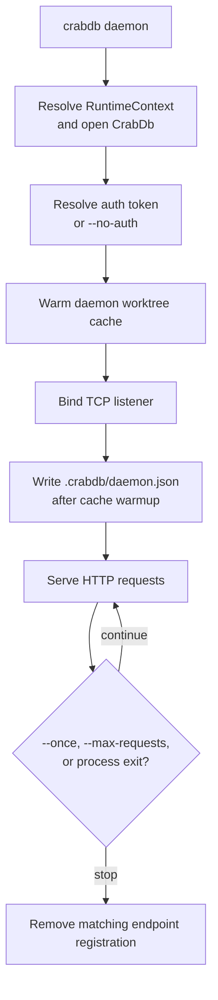
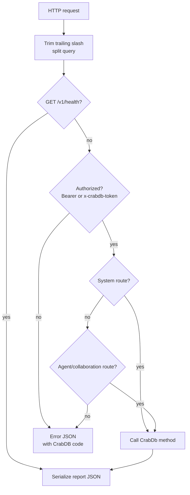
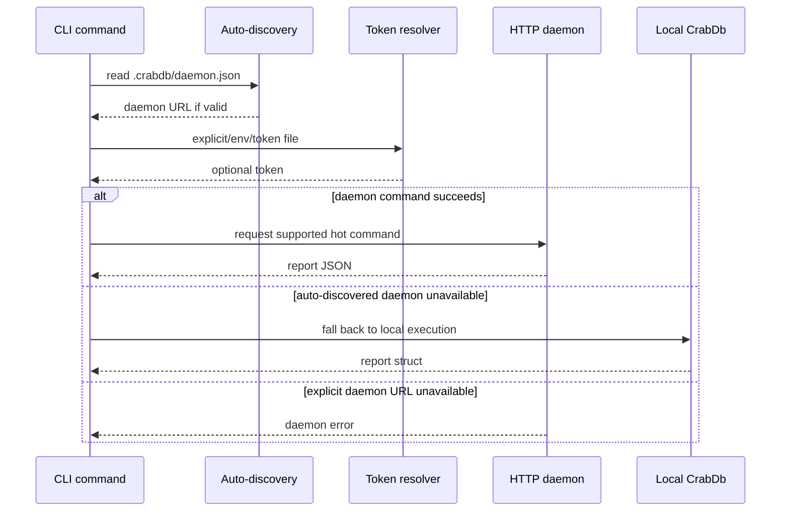
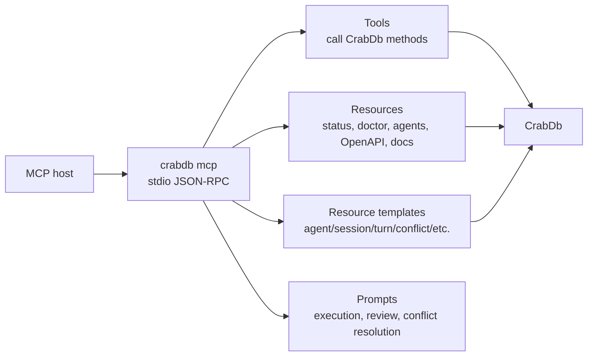

# Daemon, HTTP, and MCP

This design section is advanced/internal. It explains how CrabDB exposes the same local database through the daemon, HTTP API, OpenAPI, and MCP stdio server.

## Integration Goals

CrabDB has several integration surfaces because different hosts need different tradeoffs:

- CLI: best for humans and shell scripts.
- HTTP daemon: best for editor integrations and repeated local automation.
- MCP stdio server: best for agent hosts that can discover tools/resources/prompts.
- Rust API: best for typed in-process use.

The daemon and MCP layers are adapters over `CrabDb`. They should not develop separate semantics from the core library.

## Daemon Lifecycle

`crabdb daemon` flow:

1. Resolve runtime context and open `CrabDb`.
2. Resolve daemon auth.
3. Start daemon worktree cache warmup.
4. Bind a TCP listener.
5. Compute a local daemon URL.
6. Prepare endpoint registration under `.crabdb/daemon.json`.
7. Write endpoint registration after cache warmup if the daemon is still alive.
8. Serve HTTP requests until `--once`, `--max-requests`, or process exit.
9. Remove endpoint registration on drop if it still matches this daemon.

This design lets CLI auto-discovery find the daemon without an external service registry.



## Daemon Worktree Cache

The daemon starts a worktree cache because repeated status/diff/record-style requests are common for editor integrations. The cache tracks filesystem events and dirty path hints, then reconciles with full status scans when needed.

The cache is an optimization. The database remains usable without it, and auto-daemon routing falls back when the daemon is unavailable.

## Endpoint Registration

The endpoint file contains:

- version
- URL
- process ID
- auth enabled flag

The CLI reads `.crabdb/daemon.json` during auto-discovery. Invalid, stale, or unsupported endpoint data is ignored.

## Auth Model

Daemon auth defaults to enabled.

Auth sources in priority order:

1. `--auth-token`
2. `CRABDB_DAEMON_TOKEN`
3. `--auth-token-file`
4. `.crabdb/daemon.token`

If the token file does not exist, the daemon generates a 32-byte random token encoded as hex and writes it. On Unix, newly created token files are restricted to mode `0600`.

`--no-auth` disables auth and cannot be combined with token flags.

At request time:

- `/v1/health` bypasses auth.
- Other routes require bearer auth or `x-crabdb-token`.

## HTTP Transport

The HTTP transport is intentionally small and local:

- It reads a request line, headers, and `Content-Length` body.
- It stores lowercased header names.
- It parses method and path.
- It dispatches to route handlers.
- It serializes JSON responses with status, reason, and `Content-Length`.

This is not a general web framework. It is a simple local JSON transport for CrabDB integrations.

## HTTP Routing

Routing flow:

1. Normalize the path by trimming trailing `/`.
2. Split query string.
3. Return health without auth.
4. Enforce auth.
5. Dispatch system routes.
6. Dispatch agent/collaboration routes.
7. Return invalid input for unknown endpoints.

System routes cover core workspace operations: OpenAPI, doctor, status, record, diff, config, timeline, why, history, code-from, ignore, and guardrails.

Agent routes cover agent lifecycle, sessions, approvals, runs, traces, turns, leases, anchors, merge queue, conflicts, and agent merge.



## Request and Response Shape

HTTP route handlers parse request bodies into typed request structs from `server/request_types`. They call `CrabDb` methods and return report structs serialized as JSON.

Errors return:

```json
{
  "error": {
    "message": "...",
    "code": 2
  }
}
```

The numeric code is the same category used by CLI exit codes.

HTTP status mapping:

- 400: invalid input, invalid path, ignored path.
- 404: missing ref, operation, or root.
- 409: conflict, dirty worktree, patch rejection, stale branch, workspace lock.
- 500: other errors.

## CLI Daemon Routing

The CLI can route supported hot commands through the daemon.

Explicit routing:

```sh
crabdb --daemon-url http://127.0.0.1:8765 --daemon-token "$TOKEN" status
```

Environment routing:

```sh
CRABDB_DAEMON_URL=http://127.0.0.1:8765
CRABDB_DAEMON_TOKEN=...
```

Auto-discovery:

- Find `.crabdb/daemon.json`.
- Parse endpoint URL.
- Resolve token from explicit/env/token file.
- Try daemon command.
- Fall back to local execution for daemon-unavailable errors when discovery was automatic.

Supported daemon-routed commands include `status`, `record`, `diff`, selected `agent` commands, `merge-agent`, and `merge-queue`.



## OpenAPI Contract

The OpenAPI document is generated in code from grouped path builders and schema builders.

Path groups:

- Core workspace routes.
- Agent lifecycle and branch routes.
- Collaboration routes.
- Turn, event, span, and run routes.

The contract is available through:

- `crabdb api openapi`
- `GET /v1/openapi.json`
- MCP `crabdb://openapi` resource

Because OpenAPI is generated from source, docs should describe groups and route intent, while the generated JSON remains the precise route/schema contract.

## MCP Server

`crabdb mcp` opens a `CrabDb` and serves JSON-RPC over stdio.

Capabilities include:

- Tools.
- Resources.
- Resource templates.
- Prompts.
- Completion.

MCP tool calls dispatch into `CrabDb` methods through `mcp/tool_call` modules. Tools return MCP tool results with structured content and error flags.

## MCP Tool Organization

Tool groups mirror product workflows:

- Core: doctor, status, diff, timeline, why, history, code-from, config, ignore, guardrails.
- Agent: spawn, claim, list, show, status, contribution, gates, readiness, handoff, remove.
- Collaboration: sessions, approvals, runs, leases, anchors.
- Merge: merge queue and conflicts.
- Turns: begin/end turn, messages, events, spans, patch application, agent diff, tests/evals, workdir sync/read.

Risk annotations mark tools as read-only, workspace write, destructive write, or open-world write. This helps MCP hosts make safer decisions before calling tools.

## MCP Resources and Prompts

Static resources expose:

- status
- doctor
- agents
- merge queue
- conflicts
- OpenAPI
- documentation resources

Resource templates expose specific agent, session, turn, conflict, approval, run, and span reports.

Prompts guide hosts through:

- agent task execution
- agent review
- conflict resolution

The prompts are procedural guidance for hosts; the tools are the executable interface.



## Consistency Expectations

When adding a new core behavior:

- Add or update the `CrabDb` method and report type first.
- Add CLI args/handler/rendering if human/shell use matters.
- Add HTTP request/route/OpenAPI schema if editor/API use matters.
- Add MCP tool/resource/prompt coverage if agent hosts need it.
- Add e2e tests across surfaces for behavior that should stay aligned.

## Failure Modes

- Malformed HTTP request: invalid input response.
- Unauthorized HTTP request: 401 with daemon error code 11.
- Unknown API endpoint: invalid input response.
- Invalid daemon URL: invalid input.
- Stale auto-discovered daemon: local fallback.
- MCP unknown method/tool: JSON-RPC or tool error.

## Code Facts Used

- Daemon handler/auth: `crates/crabdb/src/cli/command/handler/maintenance.rs`
- Daemon routing: `crates/crabdb/src/cli/command/handler/daemon_rpc.rs`
- HTTP transport: `crates/crabdb/src/server/transport.rs`
- HTTP routes: `crates/crabdb/src/server/route`
- OpenAPI: `crates/crabdb/src/server/openapi`
- MCP protocol/capabilities/tools: `crates/crabdb/src/mcp`
- Tests: `cli_daemon_url_routes_hot_agent_commands`, `local_api_and_cli_export_openapi_contract`, `mcp_stdio_tools_drive_agent_turn_workflow`
