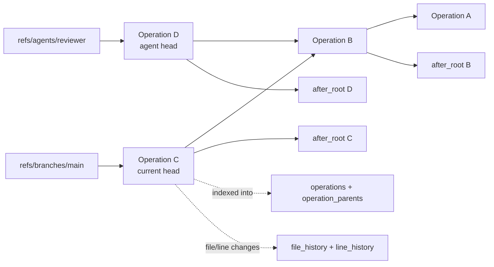
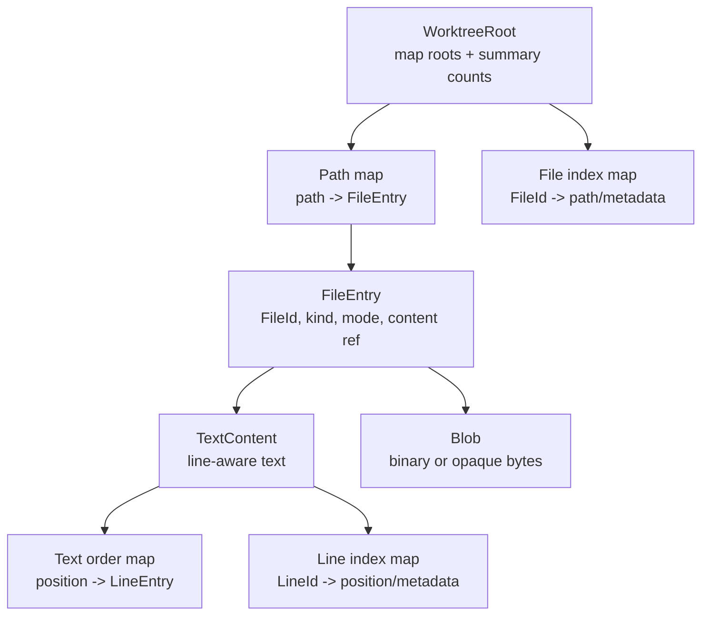
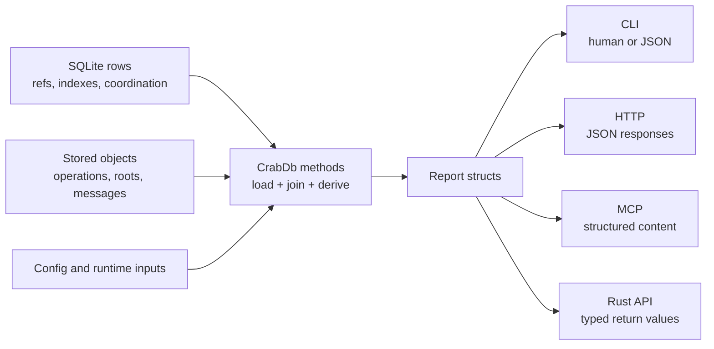

# Data Model

This design section is advanced/internal. It explains the model layer and how it maps to durable objects, indexes, and public report shapes.

## Model Groups

The public model namespace is assembled from:

- Domain config, objects, and operations.
- Agent changes, core records, activity records, and coordination records.
- Inspection result types.
- Report types for worktree, agent, merge, and maintenance commands.

The model layer is intentionally serializable. Types are shared by the Rust API, CLI JSON output, HTTP responses, MCP structured content, and tests.

## Identity Types

Core IDs are newtype wrappers or structured IDs:

- `WorkspaceId`
- `ChangeId`
- `ObjectId`
- `FileId`
- `LineId`
- `MessageId`
- `AnchorId`

`WorkspaceId` is derived from workspace path bytes at initialization. `ChangeId` is allocated from workspace, actor, lamport-like state, and a hint. `ObjectId` is content-derived from object kind, version, and bytes.

`FileId` and `LineId` include origin information:

- `FileId` has an origin change and local sequence.
- `LineId` has an origin change and local sequence.

That design lets CrabDB track continuity across renames, line rewrites, and merges.

## Operation Graph

`Operation` is the central history record. It contains:

- `change_id`
- operation kind
- parent operation IDs
- before and after roots
- branch name
- actor
- optional session ID
- optional message
- file changes
- creation timestamp

Operations form a graph through `parents`. Refs point at operation/root pairs. Derived operation indexes are written to SQLite for fast timeline, history, and query operations, but operation objects are the durable source.

## Object Model

Object kinds include:

- `WorktreeRoot`
- `TextContent`
- `Operation`
- `Blob`
- `Message`
- `ConflictSet`
- `Anchor`

Objects are stored in the `objects` table as bytes with kind, version, codec, hash algorithm, size, and timestamp. The current code stores typed object payloads with CBOR helpers.

## Worktree Root Model

`WorktreeRoot` does not inline every file. It points at map roots and stores summary counts:

- path map root
- file index map root
- file count
- total text bytes
- creating operation

File entries contain stable identity and content metadata:

- file ID
- kind
- mode/executable flag
- content reference
- size and content hash
- creating and last-changing operations
- optional path-change operation

This gives CrabDB both snapshot materialization and provenance.

## Text Model

`TextContent` stores line count, byte count, hashes, optional full blob, map roots, and representation.

Representations:

- `TreeText`
- `LazyText`
- `OpaqueText`
- `SmallTextTable`
- `SmallText`

`LineEntry` stores stable line identity, bytes, newline kind, text hash, origin/change metadata, move metadata, and flags.

## Change Model

`FileChange` records path-level changes:

- added
- modified
- deleted
- renamed
- type changed

`LineChange` records line-level changes:

- added
- modified
- deleted
- moved

Change records are stored on operations and indexed into `file_history` and `line_history` for query performance.

## Agent Model

Agent state is split into:

- `AgentRecord`: identity and metadata such as name, kind, provider, model.
- `AgentBranch`: ref, base/head changes, base/head roots, session, workdir, status.
- `AgentDetails`: record plus branch.

The split matters because an agent's identity can exist independently from branch state, but user-facing reports usually need both.

## Conversation and Activity Model

Agent activity is modeled with:

- `AgentSession`
- `AgentTurn`
- `Message`
- `AgentEventRecord`
- `AgentTraceSpan`
- `AgentRunState`

Sessions group long-running work. Turns represent bounded units of work. Messages and events create a reviewable timeline. Trace spans derive from span start/end events and are indexed for duration and status queries.

## Coordination Model

Coordination types include:

- `AgentApproval`
- `LeaseRecord`
- `AgentClaimReport`
- `Anchor`
- `ConflictSetSummary`
- `MergeQueueEntry`

Approvals gate sensitive work. Leases are advisory path coordination. Anchors bind durable labels to file/line identity. Merge queue entries serialize shared-target merges. Conflict sets persist failed merge decisions until resolved.

## Report Model

Reports are deliberately not the same as storage rows. Examples:

- `AgentReadinessReport` aggregates branch status, workdir state, approvals, conflicts, and gate status.
- `AgentHandoffReport` bundles readiness, current session context, recent events, spans, operations, and next steps.
- `BackupRestoreReport` includes restore effects such as rewritten workdirs.
- `GuardrailCheckReport` includes decision, reasons, path checks, approvals, and optional approval request instructions.

This keeps command/API consumers from having to join internal tables themselves.

## Invariants

- A `RefRecord` should reference an operation object and root object.
- `Operation.after_root` should match the root written into the ref when advancing a branch.
- Agent branch head fields should match the backing agent ref.
- A message may link to an agent, session, or change depending on origin.
- Readiness and handoff reports should be derived fresh rather than stored as durable truth.

## Code Facts Used

- Domain objects: `crates/crabdb/src/model/domain`
- Agent models: `crates/crabdb/src/model/agent`
- Reports: `crates/crabdb/src/model/reports`
- Inspection models: `crates/crabdb/src/model/inspect`
- IDs: `crates/crabdb/src/ids.rs`
- Object storage: `crates/crabdb/src/db/storage/objects`
