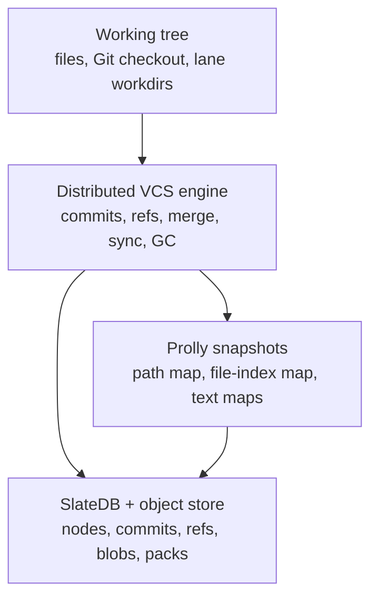
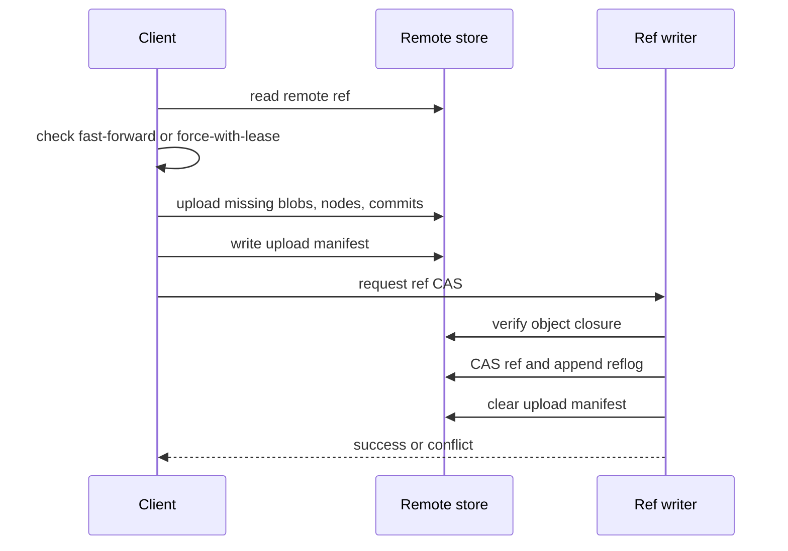

# Distributed Prolly VCS

This document proposes a Git-like distributed version-control engine built on
CrabDB's prolly maps, content-addressed objects, SlateDB/object-store storage,
and existing Git import/export primitives.

The design is intentionally implementable in stages. It keeps today's local
CrabDB `Operation` graph and SQLite indexes useful, while adding a portable
distributed commit/ref layer that can live in an object store and interoperate
with Git repositories.

## Status

Proposed.

## Goals

- Make a prolly root a durable snapshot equivalent to a Git tree.
- Add immutable commit objects, tags, refs, reflogs, remotes, push, pull, fetch,
  clone, checkout, merge, fsck, and GC.
- Store the distributed repository in an object-store-backed layout, with
  SlateDB as the structured KV engine and the object store as the large-blob and
  pack substrate.
- Support multi-client distributed use by making immutable data idempotent and
  serializing mutable ref updates with compare-and-swap, leases, or a single
  remote writer.
- Preserve compatibility with local Git repositories through import, export,
  Git object projection, mapping indexes, and an optional Git remote helper.
- Keep local query indexes derived and rebuildable.

## Non-Goals

- Replacing Git's native object database in place.
- Making object storage provide POSIX filesystem semantics.
- Requiring a central server for the immutable object data plane.
- Requiring Git to understand prolly nodes directly.
- Guaranteeing conflict-free multi-writer ref updates without a CAS, lease, or
  merge coordinator.

## Summary

The engine has four layers:



The key idea is:

- A prolly tree root is the snapshot.
- A commit is an immutable object that points to a snapshot and parent commits.
- A branch is a mutable ref that points to a commit.
- A push uploads immutable object closure first, then CAS-updates the remote ref.
- A pull downloads remote commit closure, creates remote-tracking refs, then
  fast-forwards or merges local refs.
- Git compatibility is a projection between CrabDB commits/snapshots and Git
  commits/trees/blobs.

## Current System Fit

CrabDB already has most of the local pieces:

- `WorktreeRoot` points at prolly map roots and stores snapshot summary counts.
- `FileEntry` stores stable file identity, kind, mode, content reference, size,
  hash, and provenance.
- `Operation` forms the current local history graph through parent
  `ChangeId`s.
- Refs point at operation/root pairs with generation-based CAS.
- Git import reads Git-tracked files into CrabDB.
- Git export can write Git blobs, trees, and commit objects through `git
  hash-object`, `git mktree`, and `git commit-tree`.
- `git_mappings` records Git head, dirty state, CrabDB change, and CrabDB root.
- The `prolly` crate already supports immutable roots, named roots, CAS-able
  manifests, diff, merge, GC reachability, large-value offload, and a SlateDB
  backend.

The distributed VCS layer should not delete these concepts. Instead:

- `Operation` remains the local detailed event/provenance object.
- `VersionCommit` becomes the portable distributed commit object.
- Local indexes continue to derive from reachable operations and commits.
- Git mappings expand from local import/export bookkeeping into a durable
  projection index.

## Repository Layout

A remote repository is an object-store prefix:

```text
<repo-prefix>/
  format.json
  slatedb/                         # SlateDB database path
  blobs/sha256/aa/bb/<hex>          # large content blobs
  packs/<pack-id>.pack              # optional bundled object payloads
  packs/<pack-id>.idx               # optional object index
  uploads/<session-id>/manifest     # in-flight upload protection
  refs-mirror/heads/main            # optional human-inspectable ref mirror
```

SlateDB stores structured keys:

```text
v1:object:commit:<hash-alg>:<id>       -> VersionCommit bytes
v1:object:tag:<hash-alg>:<id>          -> VersionTag bytes
v1:object:root:<object-id>             -> WorktreeRoot bytes, optional mirror
v1:node:<cid>                          -> serialized prolly node
v1:hint:<namespace>:<key>              -> performance hints
v1:root:<name>                         -> named prolly root manifests
v1:ref:<namespace>:<name>              -> RefValue
v1:reflog:<ref>:<sequence>             -> ReflogEntry
v1:lease:<resource>                    -> LeaseRecord
v1:sync:upload:<session-id>            -> UploadManifest
v1:git:crab-to-git:<commit-id>:<fmt>   -> GitProjection
v1:git:git-to-crab:<oid>               -> CrabProjection
v1:pack:index:<object-id>              -> PackLocation
v1:gc:mark:<run-id>:<object-id>        -> optional GC work record
```

The existing `SlateDbStore` currently uses `node:`, `hint:`, and `root:`
prefixes. The distributed store should either:

- add a new `VersionStore` with `v1:` namespacing, or
- parameterize the current SlateDB store with a namespace prefix.

Namespacing matters because a remote can hold multiple repositories, forks, or
tenant workspaces in one object-store bucket.

## Storage Responsibilities

Use SlateDB for small structured KV data:

- commits
- tags
- refs
- reflogs
- named roots
- prolly nodes
- indexes
- leases
- upload manifests
- Git mapping records

Use the object store directly for large immutable bytes:

- file blobs
- full text payloads
- binary artifacts
- pack files
- optional snapshots or bundles

This avoids placing large file content in LSM values while preserving a single
object-store durability boundary.

## Identity

Distributed IDs must be content-derived and portable:

```text
CommitId = sha256("crab.commit.v1\0" || canonical_commit_bytes)
TagId    = sha256("crab.tag.v1\0"    || canonical_tag_bytes)
BlobId   = sha256(raw_blob_bytes)
NodeCid  = sha256(canonical_node_bytes)
RootId   = existing ObjectId for WorktreeRoot, or sha256(root bytes)
```

Use domain-separated hashes so the same bytes cannot be confused across object
kinds.

Canonical serialization rules:

- Include `version`, `kind`, `codec`, and `hash_alg`.
- Prefer fixed-field structs over maps for hashed bytes.
- If maps are unavoidable, sort keys before serialization.
- Hash only normalized bytes, not database metadata such as insertion time.
- Treat unknown required fields as decode errors.
- Preserve unknown optional extension fields only if the codec supports stable
  round-tripping.

## Snapshot Model

A distributed snapshot is represented by a `SnapshotRef`:

```rust
struct SnapshotRef {
    version: u16,
    worktree_root: ObjectId,
    path_map: RootManifestRef,
    file_index_map: RootManifestRef,
    file_count: u64,
    total_text_bytes: u64,
    content_hash: String,
}

struct RootManifestRef {
    root: Option<Cid>,
    config: Config,
}
```

The snapshot points at the same structures CrabDB already uses:

- `path -> FileEntry`
- `FileId -> path/metadata`
- text order maps
- line index maps
- large blob references

For an MVP, `SnapshotRef.worktree_root` can be the authoritative snapshot and
the map roots can be copied from the `WorktreeRoot` object. Over time,
`SnapshotRef` can become the direct portable root and `WorktreeRoot` can remain
the local compatibility object.

## File Entry Model

The distributed file-entry payload should cover Git-representable files and
CrabDB provenance:

```rust
struct VersionFileEntry {
    file_id: Option<FileId>,
    kind: VersionFileKind,
    mode: u32,
    executable: bool,
    content: VersionContentRef,
    size_bytes: u64,
    content_hash: String,
    created_by: Option<CommitId>,
    last_content_change: Option<CommitId>,
    last_path_change: Option<CommitId>,
    crab_change: Option<ChangeId>,
}

enum VersionFileKind {
    Text,
    OpaqueText,
    Binary,
    Symlink,
    Submodule,
}

enum VersionContentRef {
    Text(ObjectId),
    Opaque(ObjectId),
    Binary(ObjectId),
    Blob(BlobRef),
    SymlinkTarget(Vec<u8>),
    GitSubmodule { commit_oid: String },
}
```

Git mode mapping:

```text
100644 -> regular non-executable file
100755 -> regular executable file
120000 -> symlink, value is target bytes
160000 -> submodule gitlink
040000 -> tree, represented implicitly by path prefixes
```

CrabDB currently handles regular files. Symlink and submodule support can be
added later, but the distributed format should reserve the kinds now so Git
round-tripping has a clear target.

## Commit Model

```rust
struct VersionCommit {
    version: u16,
    snapshot: SnapshotRef,
    parents: Vec<CommitId>,
    author: VersionIdentity,
    committer: VersionIdentity,
    message: Vec<u8>,
    created_at_millis: i64,
    timezone_offset_minutes: i16,
    operation_refs: Vec<ChangeId>,
    merge_info: Option<MergeInfo>,
    git: Option<GitProjectionHint>,
    extra: Vec<ExtensionField>,
}

struct VersionIdentity {
    name: String,
    email: Option<String>,
    actor_kind: Option<String>,
    actor_id: Option<String>,
}

struct MergeInfo {
    base: Option<CommitId>,
    strategy: String,
    conflict_set: Option<ObjectId>,
}

struct GitProjectionHint {
    preferred_object_format: String, // sha1 or sha256
    git_commit_oid: Option<String>,
    git_tree_oid: Option<String>,
}
```

Invariants:

- Parent commit IDs are immutable.
- Parent order is significant. The first parent is the mainline parent.
- A commit with no parents is a root commit.
- `snapshot` must be complete and fsck-clean before the commit is publishable.
- `operation_refs` are optional local provenance pointers, not required for
  distributed portability.
- A commit ID must not depend on its Git projection. The Git projection is an
  index or hint, not the source identity.

## Tags

```rust
struct VersionTag {
    version: u16,
    target: VersionTarget,
    name: String,
    tagger: VersionIdentity,
    message: Vec<u8>,
    created_at_millis: i64,
    signature: Option<Signature>,
}

enum VersionTarget {
    Commit(CommitId),
    Tag(TagId),
}
```

Tags are immutable objects. Mutable tag names are refs under
`refs/tags/<name>`.

## Refs

Refs are the only mutable version-control state:

```rust
struct RefValue {
    version: u16,
    target: VersionTarget,
    generation: u64,
    updated_at_millis: i64,
    updated_by: VersionIdentity,
    lease_epoch: Option<u64>,
    peeled_commit: Option<CommitId>,
}

struct ReflogEntry {
    version: u16,
    ref_name: String,
    sequence: u64,
    old: Option<VersionTarget>,
    new: Option<VersionTarget>,
    actor: VersionIdentity,
    message: String,
    created_at_millis: i64,
}
```

Ref namespaces:

```text
refs/heads/<name>                 local branch
refs/tags/<name>                  tag
refs/remotes/<remote>/<name>      remote-tracking branch
refs/lanes/<name>                 agent lane branch
refs/git/<remote>/<name>          imported Git branch
refs/pull/<id>/head               review branch
```

Ref update API:

```rust
trait RefStore {
    fn get_ref(&self, name: &str) -> Result<Option<RefValue>>;

    fn compare_and_swap_ref(
        &self,
        name: &str,
        expected: Option<&RefValue>,
        new: Option<&RefValue>,
        reflog: ReflogEntry,
    ) -> Result<RefUpdate>;
}

enum RefUpdate {
    Applied,
    Conflict { current: Option<RefValue> },
}
```

Ref update invariants:

- A ref update must be atomic with its reflog entry when the backend supports
  transactions.
- If the backend cannot atomically write both, write a transaction marker first,
  then make recovery idempotent.
- Fast-forward updates require `old.target` to be an ancestor of `new.target`,
  unless the caller passes an explicit force-with-lease option.
- Force updates require the caller's expected target and generation.
- Deleting a ref is a CAS from current value to `None`.

## Distributed Consistency

Immutable object writes are naturally distributed:

- Key is content ID.
- Write is idempotent.
- Duplicate writers produce the same key/value.
- Partial upload is harmless until a ref points at the object.

Mutable ref writes need coordination. Support three modes.

### Mode 1: Single Remote Writer

All clients upload immutable objects directly, but ref updates go through one
remote writer process or daemon.

This matches SlateDB's single-writer design and is the simplest correct remote
mode.

Flow:

1. Client uploads missing commits, nodes, and blobs.
2. Client submits `RefUpdateRequest`.
3. Remote writer fscks uploaded closure.
4. Remote writer applies compare-and-swap.
5. Remote writer writes reflog.

Use this for the first distributed implementation.

### Mode 2: Object-Store Conditional Refs

If the object store supports conditional writes or CAS, refs can be stored as
small objects outside SlateDB:

```text
refs-mirror/heads/main -> RefValue bytes
```

Update requires:

- read current ETag/generation
- validate expected target
- conditional write with previous ETag
- append reflog record

Because object-store conditional semantics vary by provider, this mode should be
behind a capability probe.

### Mode 3: Append-Only Ref Proposals

When no ref CAS is available and no writer daemon exists, clients append
proposals:

```text
v1:ref-proposal:<ref>:<client-id>:<nonce> -> RefUpdateRequest
```

A coordinator later applies proposals serially. This mode is eventually
consistent and Git-like for collaboration, but not suitable when users expect an
immediate successful push.

## Commit Transaction

Local commit algorithm:

1. Scan or receive worktree mutations.
2. Write large blobs to object store.
3. Write text/blob metadata objects as needed.
4. Apply map mutations to prolly roots.
5. Write or reuse the `WorktreeRoot`/`SnapshotRef`.
6. Construct `VersionCommit`.
7. Write immutable commit object by content ID.
8. Fsck the new commit closure locally.
9. CAS local branch ref from old commit to new commit.
10. Record a local `Operation` for provenance and existing indexes.
11. Insert Git mapping if the commit was imported from or exported to Git.

The CAS in step 9 is the local commit point. If it fails, the commit object can
remain unreachable and later be collected.

## Push Protocol

Push to a remote object-store repository:



Detailed steps:

1. Resolve remote URL and namespace.
2. Load remote refs and capabilities.
3. Compute local commit set not reachable from remote heads.
4. Compute object closure:
   - commits and tags
   - snapshot roots
   - prolly nodes reachable from snapshot roots
   - file/text/blob objects
   - large blobs
5. Upload closure idempotently.
6. Write `UploadManifest` with TTL to protect in-flight objects from GC.
7. Ask ref writer to update `refs/heads/<branch>` from expected remote head to
   new commit.
8. On conflict, fetch current remote ref and report non-fast-forward.
9. On success, update local `refs/remotes/<remote>/<branch>`.
10. Remove or expire upload manifest.

Push must never publish a ref to an incomplete closure.

## Fetch and Pull Protocol

Fetch:

1. Read remote refs.
2. Update remote-tracking ref candidates in memory.
3. Negotiate missing commits by walking local known commits.
4. Download missing commit objects.
5. Download reachable snapshot roots, prolly nodes, metadata objects, and blobs.
6. Verify closure.
7. CAS local `refs/remotes/<remote>/<branch>`.
8. Record fetch reflog.

Pull:

1. Run fetch.
2. Compare local branch and remote-tracking branch.
3. If local is ancestor, fast-forward local ref and optionally checkout.
4. If histories diverged, run merge or rebase according to policy.
5. If merge succeeds, create a merge commit with two parents.
6. If merge conflicts, create a conflict set and leave the branch unchanged
   unless an explicit conflict workspace is requested.

## Clone Protocol

Clone from object store:

1. Create local `.crabdb`.
2. Open local SlateDB or SQLite-backed store.
3. Read remote `format.json`.
4. Fetch remote refs and default branch.
5. Download closure for selected branch or all refs.
6. Write local refs:
   - `refs/remotes/origin/<branch>`
   - local `refs/heads/<default>` pointing at the same commit
   - `HEAD` symbolic ref
7. Materialize worktree if requested.
8. If cloning inside a Git repo, initialize Git mapping but do not mutate Git
   refs unless requested.

Sparse clone can fetch only:

- commit graph
- root nodes down to selected prefixes
- blobs needed for selected paths

This requires prefix-aware missing-node planning in the prolly sync layer.

## Merge

Three-way merge uses the commit DAG and prolly map merge:

1. Find merge base commit. For multiple bases, recursively merge bases or choose
   the best generation distance.
2. Load base, ours, and theirs snapshots.
3. Run path-map three-way diff.
4. For each changed path:
   - add/add same content: keep either
   - add/add different content: conflict
   - modify/modify same content: keep either
   - modify/modify different text: run text merge
   - modify/modify different binary: conflict
   - delete/delete: delete
   - delete/modify: conflict unless policy chooses delete or keep
   - rename/delete: conflict
   - rename/rename same target: merge content
   - rename/rename different target: conflict
   - mode/content independent changes: combine when safe
5. Build merged snapshot.
6. Create merge commit with parents `[ours, theirs]`.
7. CAS target branch from ours to merge commit.

Text merge should use CrabDB's line model when available:

- match stable `LineId`s first
- fall back to Myers/patience diff for imported Git files
- preserve newline kind
- mark conflict regions as unresolved conflict objects, not inline conflict
  markers, unless exporting to Git patch or worktree

Binary conflict resolution stores all sides:

```rust
struct BinaryConflict {
    path: String,
    base: Option<VersionContentRef>,
    ours: Option<VersionContentRef>,
    theirs: Option<VersionContentRef>,
}
```

## Rebase and Cherry-Pick

Rebase and cherry-pick are repeated three-way merges where the base is the
parent of each picked commit.

Algorithm for one commit `C` with parent `P` onto `onto`:

1. Merge `base=P.snapshot`, `ours=onto.snapshot`, `theirs=C.snapshot`.
2. If clean, create new commit with parent `onto`.
3. Preserve author, set committer to current actor.
4. Record original commit ID in metadata.
5. Continue with next commit.

This mirrors Git's behavior while using prolly map merge for snapshots.

## Garbage Collection

GC roots:

- local branch refs
- remote-tracking refs
- tags
- HEAD and detached HEAD
- lane refs
- worktree manifests
- reflog entries within retention window
- upload manifests
- active leases
- conflict sets
- Git mapping records that are configured as retention roots

Mark phase:

1. Mark commits and tags reachable from root refs.
2. Mark parent commits.
3. Mark snapshots reachable from commits.
4. Mark prolly nodes reachable from snapshot root manifests.
5. Mark metadata objects reachable from file entries and text content.
6. Mark large blobs reachable from content refs.
7. Mark pack files that contain reachable objects.

Sweep phase:

1. Remove unreachable loose commits/tags after grace period.
2. Remove unreachable prolly nodes after grace period.
3. Remove unreachable metadata objects.
4. Remove unreachable blobs last.
5. Remove pack files only after every contained object is unreachable or moved.

Distributed GC requires a grace period because another client can upload objects
before publishing a ref. Upload manifests and leases protect those objects.

Suggested defaults:

```text
unreachable_grace_period = 7 days
reflog_retention = 30 days
upload_manifest_ttl = 24 hours
lease_ttl = 10 minutes
```

## Fsck

Fsck verifies:

- every ref target exists
- every reflog target exists unless pruned by policy
- every commit decodes and hashes to its key
- every parent commit exists
- every snapshot root exists
- every prolly node hash matches its CID
- every internal prolly node points to existing child nodes
- every `FileEntry` content ref exists
- every blob hash and length matches its `BlobRef`
- every path is normalized and safe
- every Git projection maps to a valid Git object when Git is available
- every pack index entry points inside its pack bounds

Fsck should have:

- `--connectivity-only` for fast checks
- `--full` for blob byte validation
- `--repair-indexes` to rebuild derived local indexes
- `--quarantine` to move corrupt remote objects out of the live namespace when
  the backend permits it

## Pack Files

Loose content-addressed objects are simple but expensive on object stores. Packs
reduce request count.

Pack manifest:

```rust
struct PackManifest {
    version: u16,
    pack_id: String,
    object_format: String,
    compression: String,
    objects: Vec<PackedObjectIndex>,
    created_at_millis: i64,
}

struct PackedObjectIndex {
    object_kind: String,
    object_id: String,
    offset: u64,
    compressed_len: u64,
    uncompressed_len: u64,
    crc32c: u32,
}
```

Read path:

1. Check loose object key.
2. Check `v1:pack:index:<object-id>`.
3. Range-read the pack.
4. Validate object bytes and hash.
5. Optionally promote to local cache.

Write path:

- MVP writes loose objects.
- Background compaction writes packs for old immutable objects.
- Ref updates do not wait for packing.

## Git Interop Modes

There are four compatibility levels.

### Level 1: Sidecar Import/Export

This is the current direction.

Commands:

```sh
crabdb init --from-git
crabdb git import-update -m "sync git state"
crabdb git export main..scratch
crabdb git export main..scratch -m "export CrabDB change"
crabdb git mappings --limit 30
```

Enhancements:

- Import with `git ls-files -z --stage` to capture mode and object ID.
- Store Git object format, tree OID, commit OID, branch, and dirty state.
- Detect SHA-1 vs SHA-256 repositories with `git rev-parse
  --show-object-format`.
- Add `--include-untracked` only as an explicit option.
- Add symlink and submodule handling.

### Level 2: Bidirectional Branch Mirror

CrabDB maintains mappings between:

```text
Git refs/heads/main         <-> CrabDB refs/heads/main
Git refs/crabdb/heads/main  <-> CrabDB refs/heads/main
```

Default behavior should write Git projections under `refs/crabdb/heads/*` so
CrabDB does not unexpectedly move the user's checked-out Git branch.

Commands:

```sh
crabdb git mirror create main
crabdb git mirror pull main
crabdb git mirror push main --to refs/crabdb/heads/main
crabdb git mirror status
```

Mirror status reports:

- Git head
- Git dirty state
- CrabDB head commit
- last mapped Git commit
- whether Git can fast-forward to CrabDB
- whether CrabDB can fast-forward to Git
- divergent commits

### Level 3: Git Object Projection

Every CrabDB commit can be projected to a Git commit:

```text
CrabDB VersionCommit -> Git commit
CrabDB SnapshotRef   -> Git tree
VersionContentRef    -> Git blob
```

Projection rules:

- Path map becomes Git tree entries.
- Regular file modes become `100644` or `100755`.
- Symlink entries become `120000` blobs containing target bytes.
- Submodule entries become `160000` gitlinks.
- CrabDB author maps to Git author.
- CrabDB committer maps to Git committer.
- First parent maps to first Git parent.
- Merge parents preserve order.
- Commit message is copied as UTF-8 bytes when valid, otherwise sanitized or
  encoded by policy.
- CrabDB metadata is stored in optional Git trailers:
  - `CrabDB-Commit: <commit-id>`
  - `CrabDB-Root: <root-id>`

Projection cache:

```text
v1:git:crab-to-git:<commit-id>:sha1   -> GitProjection
v1:git:git-to-crab:<git-oid>          -> CrabProjection
```

The Git OID is not the CrabDB commit ID. Git's OID depends on Git's object
format and exact commit serialization.

### Level 4: Git Remote Helper

Implement `git-remote-crabdb` so users can run:

```sh
git remote add crabdb crabdb::s3://bucket/repo
git fetch crabdb
git push crabdb main
```

The helper translates between Git's remote-helper protocol and CrabDB remote
storage.

Fetch:

1. Advertise projected refs.
2. Project CrabDB commits to Git commits and trees.
3. Stream a Git pack to Git.
4. Store projection mappings.

Push:

1. Receive Git pack.
2. Import Git commits/trees/blobs into CrabDB snapshots and commits.
3. Validate fast-forward against CrabDB ref.
4. Upload missing CrabDB object closure.
5. CAS CrabDB ref.
6. Update projection mappings.

This makes Git clients work without knowing about prolly trees.

## Git Import Details

Import should use stable Git plumbing:

```sh
git ls-files -z --stage
git cat-file --batch
git rev-parse --verify HEAD
git rev-parse --show-object-format
```

For each index entry:

```text
<mode> <oid> <stage>\t<path>
```

Rules:

- Reject unmerged index stages unless `--allow-conflicted-index` is provided.
- Normalize paths to UTF-8 or store raw path bytes in a future format.
- Read blob bytes through `git cat-file --batch`.
- Preserve executable bit from mode.
- Preserve symlinks when support is implemented.
- Treat `.git` internals as out of scope.
- Ignore untracked files by default.

After import:

- Build/update prolly path map.
- Create `VersionCommit` whose parent maps to the previous imported Git commit
  when known.
- Store `GitProjection` with Git commit and tree OIDs.
- Advance CrabDB import branch by CAS.

## Git Export Details

Export to Git can use the existing CLI-backed implementation first:

- `git hash-object -w --stdin` for blobs
- `git mktree` for trees
- `git commit-tree` for commits
- temporary `GIT_INDEX_FILE` for delta export

Future pure implementation:

- encode Git blob as `blob <len>\0<bytes>`
- encode Git tree entries in Git sort order
- encode Git commit headers and body
- hash with repository object format
- optionally write loose or packed Git objects

Export should never update the user's current Git branch unless explicitly
requested. Safer defaults:

```sh
crabdb git export-commit main --to-ref refs/crabdb/heads/main
crabdb git checkout-projection main --detach
crabdb git apply main..feature --worktree
```

## Working Tree Interop

When both Git and CrabDB share a worktree:

- Detect Git dirty state before materialization.
- Refuse destructive checkout if Git has uncommitted changes unless `--force`.
- Prefer writing through a temporary index when creating Git objects.
- Preserve `.gitignore` behavior only for Git import; CrabDB's own ignore rules
  remain separate.
- Record a mapping whenever a clean Git HEAD exactly matches a CrabDB root.
- If Git's index matches CrabDB root but Git HEAD mapping is absent, add a
  `verify-index` mapping.

Checkout policy:

```text
crabdb checkout main
  - updates CrabDB worktree
  - does not move Git branch
  - warns if inside Git and Git dirty

crabdb git checkout main
  - projects CrabDB commit to Git
  - checks out projected Git commit or ref
  - updates mapping
```

## Local Indexing

The distributed store is durable truth for commits and snapshots. SQLite remains
valuable for local derived indexes:

- timeline
- file history
- line history
- message/activity records
- lane state
- Git mappings
- worktree file index
- merge queue

Index rebuild should learn to walk both:

- current `Operation` refs
- distributed `VersionCommit` refs

For commits that have no local `Operation`, rebuild creates synthetic operation
index rows or commit-index rows. The storage object remains the distributed
commit, not the derived row.

## Rust Module Plan

New modules:

```text
crates/crabdb/src/db/version/
  mod.rs
  commit.rs
  refs.rs
  snapshot.rs
  store.rs
  sync.rs
  merge.rs
  gc.rs
  fsck.rs
  git_projection.rs
  remote.rs
```

Core traits:

```rust
trait VersionObjectStore {
    fn get_commit(&self, id: &CommitId) -> Result<Option<VersionCommit>>;
    fn put_commit(&self, commit: &VersionCommit) -> Result<CommitId>;
    fn get_tag(&self, id: &TagId) -> Result<Option<VersionTag>>;
    fn put_tag(&self, tag: &VersionTag) -> Result<TagId>;
}

trait VersionSnapshotStore {
    fn get_snapshot(&self, snapshot: &SnapshotRef) -> Result<ResolvedSnapshot>;
    fn put_snapshot(&self, snapshot: &ResolvedSnapshot) -> Result<SnapshotRef>;
}

trait VersionBlobStore {
    fn get_blob(&self, reference: &BlobRef) -> Result<Option<Vec<u8>>>;
    fn put_blob(&self, bytes: &[u8]) -> Result<BlobRef>;
    fn list_blob_refs(&self) -> Result<Vec<BlobRef>>;
}

trait VersionRemote {
    fn capabilities(&self) -> Result<RemoteCapabilities>;
    fn list_refs(&self) -> Result<Vec<RemoteRef>>;
    fn fetch_objects(&self, plan: FetchPlan) -> Result<FetchReport>;
    fn push_objects(&self, plan: PushObjectPlan) -> Result<PushObjectReport>;
    fn update_ref(&self, request: RefUpdateRequest) -> Result<RefUpdate>;
}
```

The first backend should adapt:

- local SQLite object storage for compatibility
- `prolly::SlateDbStore` for prolly nodes
- an `object_store`-based blob store
- existing `refs` table for local refs

The first remote backend should use:

- SlateDB for structured remote keys
- object_store for blobs and packs
- single-writer ref updates

## CLI Plan

New commands should avoid breaking existing commands:

```sh
crabdb vcs init-remote s3://bucket/path
crabdb vcs remote add origin s3://bucket/path
crabdb vcs clone s3://bucket/path ./repo
crabdb vcs commit -m "message"
crabdb vcs fetch origin
crabdb vcs pull origin main
crabdb vcs push origin main
crabdb vcs branch feature
crabdb vcs switch feature
crabdb vcs merge main
crabdb vcs fsck --full
crabdb vcs gc --dry-run
crabdb vcs log
crabdb vcs show <commit>
```

Git-focused commands:

```sh
crabdb git import-update -m "sync git"
crabdb git export main..feature
crabdb git export-commit feature --to-ref refs/crabdb/heads/feature
crabdb git mirror create main
crabdb git mirror status
crabdb git remote-helper install
```

## HTTP and MCP Plan

HTTP endpoints:

```text
GET  /v1/vcs/refs
GET  /v1/vcs/commits/{id}
GET  /v1/vcs/log?ref=main
POST /v1/vcs/commit
POST /v1/vcs/fetch
POST /v1/vcs/push
POST /v1/vcs/merge
POST /v1/vcs/fsck
POST /v1/vcs/gc
```

MCP tools:

```text
vcs_status
vcs_log
vcs_show
vcs_branch
vcs_fetch
vcs_push
vcs_merge
vcs_git_mirror_status
```

Responses should use report structs, not raw storage rows.

## Security

Repository safety:

- Validate path normalization before checkout.
- Reject absolute paths, `..`, empty components, and platform-reserved names.
- Never materialize `.git` paths from remote snapshots unless explicitly in a
  bare/projection mode.
- Preserve executable bits but do not execute hooks from remote content.
- Redact sensitive paths/messages according to existing guardrail policy.

Object safety:

- Verify content IDs on every read from untrusted remotes.
- Verify blob length and hash.
- Verify prolly node CID.
- Verify commit ID before accepting commit bytes.
- Quarantine corrupt objects.

Auth and credentials:

- Use object_store provider credential chains.
- Store remote credentials outside commit objects.
- Support read-only remotes.
- Add optional signed commits and signed refs later.

Encryption:

- Server-side object-store encryption can be used immediately.
- Client-side encryption requires deterministic encrypted IDs or a separate
  plaintext hash index. Treat it as a later design.

## Performance

Important performance choices:

- Keep large blobs out of prolly leaf values.
- Use batch mutation for large commits.
- Use batch reads for prolly node walks.
- Use prefix scans for refs and mappings.
- Use packs for old immutable objects.
- Cache hot commit graph slices locally.
- Cache Git projections because projecting trees repeatedly can be expensive.
- Use remote-tracking refs to avoid full graph negotiation on every fetch.

Commit write durability modes:

```text
strict:
  wait for SlateDB flush and blob upload before ref CAS

balanced:
  wait for commit/snapshot metadata, allow background blob verification before
  publish only when blob store has strong read-after-write

fast:
  local-only or experimental, publish after local durable write
```

Remote pushes should default to `strict`.

## Failure Handling

Partial blob upload:

- No ref points at the blob.
- Upload manifest expires.
- GC removes it after grace period.

Commit written but ref CAS fails:

- Commit remains unreachable.
- Caller can retry after rebase/merge.
- GC removes it after grace period.

Ref update applied but reflog missing:

- Recovery scans transaction markers.
- If no marker exists, fsck reports missing reflog but the ref remains valid.

Client dies during push:

- Uploaded objects are protected by upload manifest until TTL.
- Ref is unchanged unless CAS already completed.

Remote writer dies during ref transaction:

- On restart, inspect pending transaction marker.
- Complete or roll back according to whether ref value was written.
- Reflog append must be idempotent by transaction ID.

Object store eventual listing:

- Do not rely on listing for commit correctness.
- Use direct GET by content ID for required objects.
- Use listing only for GC candidates and diagnostics.

## Migration Plan

Phase 0: Design and fixtures

- Add canonical commit/tag/ref structs.
- Add deterministic encoding tests.
- Add golden ID fixtures.

Phase 1: Local distributed commit layer

- Create `VersionCommit` from current `Operation` and `WorktreeRoot`.
- Store commits locally.
- Add local commit log walking by `CommitId`.
- Mirror branch refs from operation refs to version refs.

Phase 2: Object-store blob backend

- Implement `ObjectStoreBlobStore`.
- Add large-value offload for file blobs.
- Add blob fsck and GC.

Phase 3: SlateDB remote repository

- Add namespaced remote `VersionStore`.
- Add remote format initialization.
- Add single-writer ref update path.
- Add fetch/push for one branch.

Phase 4: Full sync

- Add negotiation.
- Add remote-tracking refs.
- Add tags.
- Add reflogs.
- Add leases and upload manifests.
- Add distributed GC safety.

Phase 5: Merge/rebase

- Add commit-DAG merge base.
- Add prolly path-map merge.
- Add text conflict objects.
- Add merge commit creation.

Phase 6: Git projection hardening

- Extend import/export modes.
- Add Git object-format detection.
- Add mode, symlink, and submodule support.
- Add bidirectional mirror commands.

Phase 7: Git remote helper

- Implement `git-remote-crabdb`.
- Support fetch first.
- Support push after import validation and ref CAS.

## Testing Plan

Unit tests:

- canonical encoding and ID stability
- commit parent ordering
- ref CAS conflict behavior
- reflog sequence allocation
- snapshot closure traversal
- Git mode conversion
- path normalization

Property tests:

- random map mutations round-trip through commit snapshots
- merge is deterministic for conflict-free changes
- push followed by fetch yields identical commit/root IDs
- Git import/export preserves tree OID for supported path kinds

Integration tests:

- local commit, branch, checkout, merge
- two-client push conflict
- force-with-lease
- clone from object-store memory backend
- fetch after remote branch update
- GC keeps reflog-protected commits
- fsck catches missing blob, missing node, corrupt commit
- Git SHA-1 repo projection
- Git SHA-256 repo projection when available

Chaos tests:

- crash after blob upload before commit write
- crash after commit write before ref CAS
- crash during ref CAS
- stale upload manifests
- object-store listing lag during GC

Compatibility tests:

- compare `git diff` against `crabdb git export`
- compare Git tree OID after import/export round trip
- verify `git fsck` on projected Git objects
- verify CrabDB fsck on imported Git history

## Open Decisions

- Whether `VersionCommit` should directly replace `Operation` long term or stay
  as a portable layer above it.
- Whether remote refs should live only in SlateDB or also in object-store
  mirror objects.
- Whether content IDs should use SHA-256 only or allow BLAKE3 as an optional
  repository format.
- Whether Git projection should store CrabDB metadata in commit trailers by
  default.
- How much raw path byte support is required before Git remote-helper support.
- Whether pack files should use a custom format or Git pack format for projected
  objects.

## External Context

- SlateDB is an embedded LSM storage engine that writes to object storage and
  supports the Rust `object_store` ecosystem:
  <https://github.com/slatedb/slatedb>
- SlateDB documents object-store-backed usage and supported URL schemes:
  <https://slatedb.io/docs/get-started/quickstart/>
- SlateDB's introduction describes single-writer, multiple-reader operation,
  transactions, snapshot isolation, and object-store persistence:
  <https://slatedb.io/docs/get-started/introduction/>

## Code Facts Used

- Prolly design and invariants: `crates/prolly/DESIGN.md`
- Prolly user-facing API: `crates/prolly/src/prolly/README.md`
- SlateDB prolly backend: `crates/prolly/src/prolly/store/slatedb.rs`
- Prolly tree handles: `crates/prolly/src/prolly/tree.rs`
- Prolly named root manifests: `crates/prolly/src/prolly/manifest.rs`
- Prolly large value/blob helpers: `crates/prolly/src/prolly/blob.rs`
- CrabDB storage design: `docs/design/storage-and-indexing.md`
- CrabDB data model: `docs/design/data-model.md`
- Git interop guide: `docs/guides/git-interop.md`
- Git integration overview: `docs/integrations/git.md`
- Git storage helpers: `crates/crabdb/src/db/storage/git.rs`
- Git import/update: `crates/crabdb/src/db/record/recording/git.rs`
- Git export: `crates/crabdb/src/db/merge/git_export.rs`
- Local refs and CAS: `crates/crabdb/src/db/storage/refs.rs`
- Domain objects: `crates/crabdb/src/model/domain/objects.rs`
- Domain operations: `crates/crabdb/src/model/domain/operations.rs`
