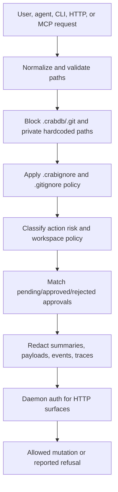
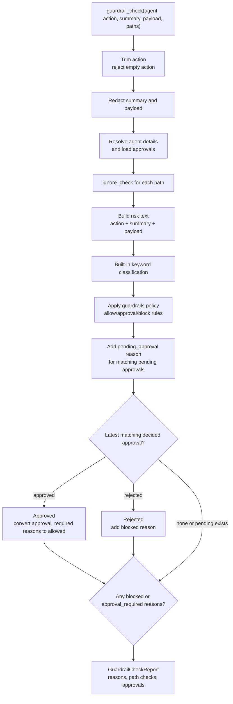
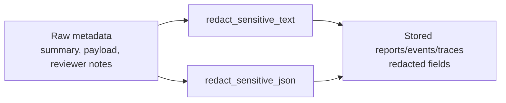

# Guardrails, Security, and Redaction

This design section is advanced/internal. It describes CrabDB's local safety mechanisms for paths, ignored files, guardrail decisions, daemon auth, and sensitive metadata redaction.

## Safety Model

CrabDB is local-first, but it still handles risky workflows:

- Recording files from a workspace.
- Materializing roots into directories.
- Applying patches generated by tools or agents.
- Running commands in agent workdirs.
- Exposing local HTTP and MCP integration surfaces.

The safety model is layered:

1. Normalize paths and keep them inside the workspace.
2. Block internal/private paths.
3. Respect `.crabignore` and `.gitignore`.
4. Require explicit opt-in for ignored paths.
5. Preflight risky agent actions with guardrails.
6. Persist human approvals and paused run state.
7. Redact sensitive metadata before storing trace/guardrail payloads.
8. Require daemon auth by default.



## Path Normalization

Relative paths are normalized by:

- Replacing backslashes with `/`.
- Removing current-directory components.
- Rejecting parent directory components.
- Rejecting root directories and platform prefixes.
- Rejecting NUL bytes.
- Rejecting empty paths.

This prevents commands and patch payloads from escaping the workspace with paths like `../secret` or absolute paths.

## Internal Paths

Internal path checks treat `.crabdb` and `.git` as protected components. Materialization and patch code also include symlink and case-collision protections where relevant.

Materialization helpers validate:

- No case-fold collisions on case-insensitive filesystems.
- No symlink workdir paths.
- No symlink ancestors for materialized paths.
- Safe joining under the destination root.

## Default Ignored Paths

Initialization writes `.crabignore` with default private/generated patterns, including:

- `.crabdb/`
- `.git/`
- `.env`
- `.env.*`
- private key/certificate extensions
- `node_modules/`
- `target/`
- `dist/`
- `build/`
- `coverage/`

Even if `.crabignore` is missing, hardcoded denylist checks still protect internal/private paths.

## Ignore Sources

`ignore_check` returns an ignored flag and source:

- `hardcoded`: default private/internal denylist.
- `workspace`: `.crabignore` or `.gitignore` match.
- absent source: not ignored.

Hardcoded ignored paths become blocked guardrail reasons. Workspace ignored paths become approval-required guardrail reasons and require explicit `allow_ignored` for selected record or agent patch flows.

## Patch Policy

Agent patch paths are validated before mutation:

- Paths must normalize inside the workspace.
- Internal paths are rejected.
- Hardcoded private paths are rejected.
- Workspace ignored paths require `allow_ignored`.

The CLI can set `--allow-ignored`, and patch JSON can set `"allow_ignored": true`. This opt-in is intentionally explicit so ignored fixtures are auditable.

## Guardrail Inputs

Guardrail checks take:

- optional agent
- action
- optional summary
- optional payload JSON
- paths

The check redacts summary/payload, resolves agent details when supplied, checks paths, classifies action risk, applies workspace policy, and compares pending/decided approvals.



## Built-In Classification

Guardrail text includes action, summary, and payload. Built-in classification marks:

- Shell/process execution as approval-required.
- Network/external access as approval-required.
- Deploy/release/publish work as approval-required.
- Destructive or forceful changes as approval-required.
- Ignore/policy changes as approval-required.
- Host-level destructive commands as blocked.

The implementation uses keyword matching. It is intentionally conservative and explainable rather than a full policy language.

## Workspace Policy

`guardrails.policy` rules use:

```text
decision:scope:pattern
```

Decisions:

- `allow`
- `approval`
- `block`

Scopes:

- `action`
- `keyword`
- `path`

Policy block rules add blocked reasons. Policy approval rules add approval-required reasons. Policy allow rules remove approval-required reasons only when there are no block or approval policy matches.

## Approval Matching

For agent-scoped guardrail checks, CrabDB loads approvals for the agent:

- Matching pending approvals add a `pending_approval` approval-required reason.
- Latest matching approved approvals can convert approval-required reasons to allowed and add `approval_satisfied`.
- Latest matching rejected approvals add `approval_rejected` and block.

This lets a human decision persist across related guardrail checks without losing the audit trail.

## Redaction

Redaction is applied to guardrail summaries/payloads and trace/event metadata paths before storage. The redaction helpers look for secret-like field names and private-key-like content.

Redaction reduces accidental leakage in:

- guardrail check output
- approval payloads
- event payloads
- trace attributes
- trace results



It is a safety net, not a guarantee that arbitrary secrets can never be stored. Users should still keep private files ignored and avoid placing secrets in action summaries.

## Daemon Auth

The HTTP daemon requires auth by default:

- `GET /v1/health` is always unauthenticated.
- Other routes require `Authorization: Bearer <token>` or `x-crabdb-token`.
- `--no-auth` disables auth explicitly.
- Generated daemon token files are restricted to `0600` on Unix.

CLI daemon routing can read the token from `--daemon-token`, `CRABDB_DAEMON_TOKEN`, or `.crabdb/daemon.token`.

## Failure Modes

- Invalid path: `INVALID_PATH`, exit 9.
- Ignored path: `IGNORED_PATH`, exit 14.
- Guardrail blocked decision: returned in report; callers decide whether to proceed.
- Unauthorized daemon request: HTTP 401 and daemon exit code category 11.
- Patch rejected: `PATCH_REJECTED`, exit 7.

## Code Facts Used

- Path safety: `crates/crabdb/src/db/util/path.rs`
- Materialization safety: `crates/crabdb/src/db/util/materialize.rs`
- Ignore handling: `crates/crabdb/src/db/core/workspace/ignore.rs`
- Patch policy: `crates/crabdb/src/db/agent/patch_policy.rs`
- Guardrails: `crates/crabdb/src/db/core/workspace/guardrails.rs`, `crates/crabdb/src/db/util/guardrails`
- Redaction: `crates/crabdb/src/db/util/redaction.rs`
- Daemon auth: `crates/crabdb/src/server/route/utils.rs`, `crates/crabdb/src/cli/command/handler/maintenance.rs`
