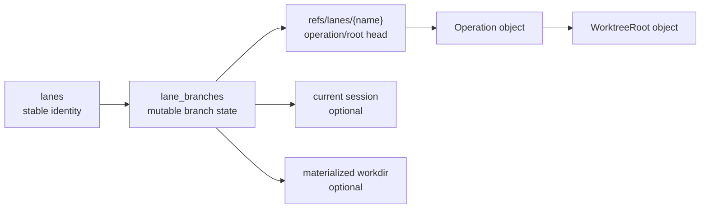
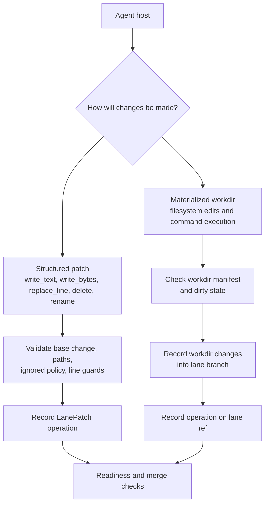
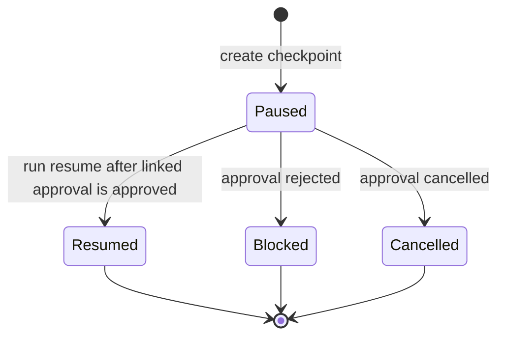
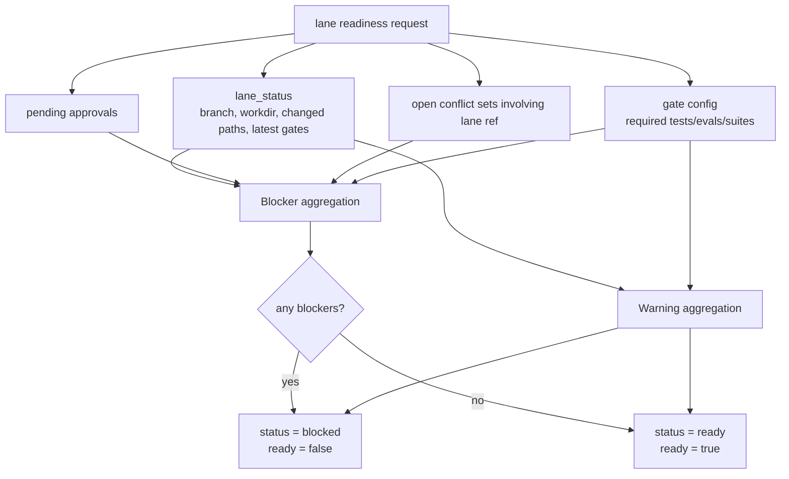

# Lane Coordination

This design section is advanced/internal. It explains how Trail coordinates multiple lane branches, workdirs, sessions, gates, approvals, and merges.

## Coordination Goals

The lane subsystem is designed to let humans, automation, and coding agents work
without immediately mutating the main workspace branch.

The core goals are:

- Isolate lane changes on `refs/lanes/<name>`.
- Preserve enough activity history for review and handoff.
- Support both structured patches and materialized workdir edits.
- Coordinate path ownership with advisory leases.
- Block unsafe merges with readiness checks.
- Serialize merges to shared targets through a merge queue.

## Lane Identity and Branch State

Lane state is split between `lanes` and `lane_branches`.

`lanes` stores identity:

- `lane_id`
- name
- kind
- provider
- model
- creation time
- metadata JSON

`lane_branches` stores branch state:

- lane ID
- backing ref name
- base change/root
- head change/root
- current session
- optional materialized workdir
- status
- timestamps

This split allows stable identity while branch head and workdir state change.



## Lane Refs

Lane branches use refs under:

```text
refs/lanes/<name>
```

The ref points to the same head operation/root that `lane_branches` records. Code that mutates a lane branch should keep these in sync.

## Editing Modes

Lanes can change branch state in two main ways.

Structured patches apply directly to the lane branch:

- write text
- write bytes
- replace stable line
- delete path
- rename path

Materialized workdirs let an external agent or human operate on a filesystem checkout and then record the workdir into the lane branch.

The direct patch path is easier to audit and safer for tool hosts. The workdir path is useful when tools need a real filesystem, command execution, or incremental editing.



## Materialized Workdirs

Materialization can be:

- Full branch materialization.
- Sparse materialization for selected paths.
- Sparse materialization with neighbor files.
- Custom workdir path.
- Default workdir under configured `lane.worktrees_dir`.

Safety rules include:

- Custom workdirs must be empty or absent.
- Workdirs cannot be symlinks.
- Sparse workdirs store manifests for selected paths.
- Dirty workdirs must be recorded or force-synced before merge.

## Sessions and Turns

Sessions are durable containers for lane work. Turns are bounded units of activity inside a session.

Session state includes:

- lane ID
- title
- status
- start/end timestamps
- metadata

Turn state includes:

- lane ID
- optional session ID
- base change
- before change
- optional after change
- status
- start/end timestamps
- metadata

Messages, events, operations, and spans can all link back to sessions and turns. This gives handoff reports enough context to describe what happened and what should happen next.

## Events and Trace Spans

Lane events are generic structured records with:

- event ID
- lane/session/turn links
- event type
- optional change/message links
- payload
- timestamp

Trace spans are derived from start/end events and indexed separately so the system can list, summarize, and show spans efficiently. Parent span IDs and trace IDs let a host reconstruct nested work.

## Run Checkpoints

`lane_run_states` persists paused/resumed lane run state. A run checkpoint can link to:

- lane
- session
- turn
- approval

It stores reason, summary, state JSON, optional interruption JSON, status, reviewer, note, and timestamps.

This is not a scheduler. It is a durable handoff/checkpoint record for hosts that need to pause on approval or interruption and resume later.



## Human Approvals

Approvals are durable gates over sensitive actions. They store:

- action
- summary
- optional payload
- status
- reviewer/note
- session/turn links

Guardrail checks can detect matching pending, approved, or rejected approvals. Approved matches can satisfy approval-required guardrail reasons; rejected matches block.

## Leases and Claims

Leases are advisory coordination records by default. When
`lane.claim_enforcement` is set to `warn` or `reject`, active write leases also
define the allowed write boundary for lane patches and materialized workdir
records. They do not replace branch isolation or merge conflict detection.
Sparse lane path selections are also persisted with the lane. When
`lane.enforce_sparse_paths=true`, that persisted selection is the fallback hard
boundary if the workdir's sparse manifest is missing.

Lease fields include:

- lease ID
- lane ID
- ref name
- optional path
- optional file ID
- mode
- expiry
- creation time

`lane claim` is a convenience around a write lease for a path. Claims also try to hydrate sparse workdir paths for the claimant when possible.

Conflict behavior:

- Existing active lease by the same lane/path/mode is reused.
- Conflicting active leases from other lanes return conflict information or an error depending on API path.
- Expired leases can be ignored by default lists unless `--all` is requested.

## Readiness Aggregation

Readiness is derived at request time. It is not stored as durable truth.

Inputs include:

- Lane status and branch status.
- Branch diff changed paths.
- Materialized workdir state.
- Workdir changed paths.
- Pending approvals.
- Open conflict sets involving the lane ref.
- Latest test gate.
- Latest eval gate.
- Required test/eval gate configuration.
- Existing queued merges.

Blocker codes include:

- `lane_removed`
- `dirty_workdir`
- `pending_approvals`
- `open_conflicts`
- `latest_test_failed`
- `latest_eval_failed`
- `missing_latest_test` when required
- `missing_latest_eval` when required
- required suite issues from gate config

Warnings include:

- Missing latest test/eval when not required.
- No changed paths.
- Already queued merge.



## Handoff Reports

Handoff reports combine:

- Lane details.
- Readiness.
- Current session details.
- Recent sessions.
- Recent events.
- Recent spans.
- Recent operations.
- Derived next steps.

This report is the main transfer object for moving lane work between hosts or from a lane to a human reviewer.

## Merge Coordination

Direct `lane merge` checks readiness before merging. Merge queue runs serialize queued entries and record merge results. If a conflict appears, the queue item becomes conflicted and a conflict set persists for resolution.

This avoids silent overwrites and gives humans and lane-running hosts an explicit conflict-resolution surface.

## Invariants

- Lane branch records and lane refs should agree on head change/root.
- Removed lanes should not be treated as merge-ready.
- Dirty materialized workdirs should block merge until recorded or force-handled.
- Pending approvals should block readiness.
- Open conflict sets involving the lane ref should block readiness.
- Required gate suite config should be enforced by readiness and merge paths.

## Code Facts Used

- Lane lifecycle: `trail/src/db/lane/lifecycle.rs`
- Lane workdirs: `trail/src/db/lane/workdir`
- Lane identity/status: `trail/src/db/lane/identity.rs`
- Lane control: `trail/src/db/lane/control`
- Leases: `trail/src/db/lane/leases.rs`
- Readiness/handoff: `trail/src/db/lane/readiness.rs`
- Merge queue: `trail/src/db/merge`
