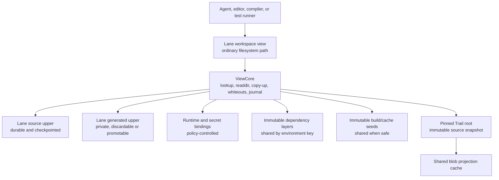

# Layered Lane Workspaces for Large-Repository Multi-Agent Development

Status: implemented behind platform acceptance gates; native Windows Dokan CI
evidence remains required before declaring the rollout complete.

Environment-layer follow-on: the shared adapter host, normalized component state,
Node/Cargo/Go adapters, metadata-driven discovery, atomic environment generations, and
CLI/HTTP/MCP environment surfaces are implemented. Restricted repository command
recipes, local reusable profiles, multi-output atomic publication, and experimental
content-addressed isolated subprocess adapters are implemented; signed catalogs/WASI
packaging and the full universal-environment graph remain tracked by Plan 006.

This document defines the execution and filesystem architecture needed for
Trail to become the default local coordination substrate for many coding agents
working concurrently in a large repository. It extends Trail's existing lane,
operation, provenance, guardrail, readiness, and Git-publication models. It does
not replace them with a second task or version-control abstraction.

The central proposal is simple:

> A Trail lane should expose a normal-looking workspace through a layered,
> copy-on-write filesystem view. Agents receive distinct path namespaces, but
> immutable source, dependency, and cache bytes are shared. Only lane-specific
> mutations consume lane-specific storage.

Git remains the shared publication and synchronization layer. Trail owns the
high-frequency local layer: task isolation, workspace views, checkpoints,
provenance, validation, review, conflict handling, and safe landing.

## Executive Summary

Git worktrees solve branch isolation, but each worktree still materializes a
complete tracked tree and normally grows its own `node_modules`, Cargo `target`,
language environment, generated output, and editor index. For a large monorepo,
running ten or fifty agents can turn cheap Git refs into an expensive collection
of filesystem trees.

Trail already has the right starting points:

- Virtual and sparse lanes.
- Full materialization with filesystem clone COW where available.
- FUSE COW on Linux and supported macOS builds.
- Loopback NFS COW on macOS.
- Dokan COW support on Windows.
- Persistent lane uppers, whiteouts, workdir manifests, sessions, turns,
  checkpoints, gates, readiness, merge queues, and safe Git apply.

The current overlay implementations expose one Trail root as a lower layer and
one lane directory as an upper layer. They do not expose ignored dependencies or
generated artifacts, eagerly load the root file map, and implement overlapping
filesystem behavior separately for FUSE, NFS, and Dokan.

This design evolves that foundation into a **layered lane workspace**:



The intended storage equation is:

```text
one content-addressed source base
+ one dependency layer per unique environment
+ shared compiler/content caches
+ the sum of each lane's actual source and generated deltas
```

not:

```text
number of agents * (source checkout + dependencies + build output)
```

## Problem Statement

Large-repository multi-agent development has five related scaling problems.

### Filesystem amplification

Git shares its object database across worktrees, but a worktree still creates a
tracked checkout, a Git index, directory entries, and independent ignored data.
Generated and dependency directories frequently dominate the source checkout:

- JavaScript `node_modules` trees contain hundreds of thousands of entries.
- Cargo `target` directories can exceed the source tree by orders of magnitude.
- Python environments, Java/Gradle caches, generated SDKs, and editor indexes
  add similar amplification.

Filesystem reflinks reduce data-block duplication, but do not remove directory
entry and inode cost, do not help on every filesystem, and do not by themselves
provide a safe shared model for mutable generated directories.

### Mutable-cache corruption

Simply symlinking all lanes to a shared writable `node_modules` or `target`
directory is incorrect. Package managers, post-install scripts, compilers,
clean commands, and tests mutate these trees. One agent can invalidate another
agent's environment or observe half-written state.

### Large-repository startup and scan cost

An overlay that first loads one million `FileEntry` values into a per-mount
`BTreeMap` still scales with repository size even if it avoids copying file
bytes. Recording by scanning the full mounted view has the same problem. Agent
startup and checkpoint latency must instead scale primarily with the number of
paths actually accessed or changed.

### Tool compatibility

Agents expect a conventional filesystem. Compilers require normal file handles,
renames, executable bits, memory mapping, and locking. Editors expect stable
paths and file notifications. Many agents probe `.git` or invoke `git status`,
`git diff`, and `git log` even when Trail owns the task lifecycle.

### Coordination and safe convergence

Filesystem isolation is necessary but insufficient. Concurrent agents need
stable bases, path-overlap warnings, checkpoints, provenance, validation,
review, conflict detection, and serialized landing. Trail already models these
concerns; the workspace view must connect to that model rather than act as an
untracked sandbox.

## Goals

The design has the following goals.

1. Start an isolated lane without copying the tracked repository.
2. Share immutable dependency trees and safe build caches across lanes.
3. Preserve a conventional in-project path layout such as `node_modules/` and
   `target/`.
4. Guarantee that one lane cannot mutate another lane's visible state.
5. Pin every view to a Trail change/root until an explicit update.
6. Make checkpoint cost proportional to changed paths and changed bytes.
7. Preserve crash-recoverable, uncheckpointed source edits.
8. Keep generated data out of Trail source history by default.
9. Support Linux, macOS, and Windows behind one semantic core.
10. Integrate views with sessions, turns, claims, gates, readiness, handoff,
    merge queues, and Git landing.
11. Preserve CLI, HTTP, MCP, and Rust report alignment.
12. Measure shared, exclusive, and reclaimable physical storage accurately.
13. Keep core lane and checkpoint workflows available without a network or
    hosted service.

## Non-Goals

This design does not:

- Replace Git remotes, pull requests, tags, or shared commit history.
- Turn Trail into a general container orchestrator.
- Promise that arbitrary writable build systems can safely share one directory.
- Make every ignored file cacheable. Unknown ignored paths remain lane-private.
- Automatically resolve semantic merge conflicts between agents.
- Require a hosted cache or remote Trail service.
- Guarantee identical performance across platform filesystem backends.
- Attribute every individual filesystem syscall to a subprocess on backends
  that do not expose reliable process identity. Attribution to the lane,
  session, and launched command is sufficient.

## Terminology

**Lane:** Trail's existing task-oriented branch plus sessions, turns, messages,
gates, approvals, workdir state, readiness, and merge context.

**Workspace view:** The filesystem namespace presented for one lane. A view is
not the lane's source of truth; the lane ref and Trail root remain authoritative.

**Layer:** An immutable file tree that can be attached at the view root or a
subpath. Examples are a Trail root projection, a Node dependency tree, or a
Cargo target seed.

**Upper:** A lane-private mutable tree. The source upper is durable and becomes
Trail operations. The generated upper is private but is normally not recorded
as source history.

**Binding:** A mapping from a layer to a logical path in a view, for example a
Node layer bound at `frontend/node_modules`.

**Whiteout:** Lane-private metadata hiding a path that exists in a lower layer.

**Environment key:** A content-derived identity for dependencies or reusable
build state, including lock inputs, toolchain, platform, and relevant config.

**Projection cache:** Shared real files materialized lazily from Trail or Git
content so filesystem backends can serve ranged reads and use reflink copy-up.

## Current Foundation and Gaps

`LaneWorkdirMode` currently supports `virtual`, `sparse`, `native-cow`,
`fuse-cow`, and `nfs-cow`. Lane spawning records the mode and creates either
a materialized workdir or an overlay mountpoint. `trail agent start` holds a
mount for the child process, records the lane workdir when the child exits, and
then unmounts it.

The transparent COW modes already establish several correct invariants:

- A lane head/root is the immutable lower state.
- Writes copy into a lane-specific upper.
- Deletes persist as whiteouts.
- The upper survives until the lane is removed.
- Mount failure is explicit rather than silently becoming a full copy.
- macOS NFS mount state is persisted for stale-mount recovery.

The principal gaps are:

1. The lower layer includes only files in the Trail root. Default-ignored paths
   such as `node_modules` and `target` are neither visible nor shared.
2. Overlay mounts load the complete root into memory rather than using lazy
   lookup and directory iteration.
3. Lower-file reads materialize complete file contents into memory.
4. FUSE, NFS, and Dokan contain separate implementations of lookup, copy-up,
   whiteout, rename, and directory behavior.
5. A single upper mixes source changes with generated and dependency changes.
6. Checkpoint detection still relies partly on manifests or scans instead of an
   explicit per-view mutation set.
7. Mount lifetime is tied mainly to a terminal agent process; editor workflows
   need daemon-owned or foreground persistent mounts.
8. The view has no Git compatibility metadata.
9. There is no layer cache lifecycle, key model, quota, pinning, accounting, or
   integrity verification.

## Architectural Principles

### The lane ref is authoritative

A workspace view is a projection of a pinned `base_change`, `base_root`, and
current lane head. It is disposable infrastructure around durable source state.
Mounting or unmounting must never move the lane ref.

### Immutable data may be shared; writable state may not

All cross-lane sharing uses immutable layers or content-addressed caches. A
producer builds in staging and publishes atomically. Active consumers never
observe mutation of a shared layer.

### Path namespace and physical storage are separate

Each agent receives a distinct path such as `.trail/views/<view-id>/root`, but
that path is an empty mountpoint when unmounted. Distinct paths do not imply
distinct bytes.

### Source and generated changes are different data classes

Trail source operations must not accidentally capture millions of dependency
or build files. Classification occurs before a write is routed to an upper, not
only later during ignore filtering.

### Correctness does not depend on the mutation journal

The upper trees and whiteouts are durable truth for uncheckpointed filesystem
state. The journal is an incremental index and provenance aid. If it is absent
or truncated, Trail can conservatively reconstruct a mutation set by scanning
the uppers, never the complete composed view.

### Platform backends implement transport, not semantics

One shared `ViewCore` defines lookup, precedence, copy-up, rename, whiteout,
classification, and journaling. FUSE, NFS, and Dokan translate platform
requests into that core. This prevents platform behavior from drifting.

## Proposed Component Architecture

The current `trail/src/db/lane/workdir` implementation should evolve toward:

```text
trail/src/db/lane/view/
  core.rs                 shared filesystem semantics
  resolver.rs             layer precedence and path lookup
  classification.rs       source/generated/dependency/secret rules
  journal.rs              mutation journal and recovery
  lifecycle.rs            create, mount, checkpoint, update, remove
  manifest.rs             durable view and upper manifests
  projection.rs           lazy Trail/Git blob projection cache
  reports.rs              report construction
  backend/
    fuse.rs               Linux/macFUSE adapter
    nfs.rs                macOS loopback NFS adapter
    dokan.rs              Windows adapter
    clone.rs              native-COW portable fallback
  cache/
    store.rs              immutable layer store and pinning
    builder.rs            build leases, staging, atomic publish
    node.rs               npm/pnpm/Yarn/Bun adapter
    cargo.rs              Cargo and compiler-cache adapter
    generic.rs            configured command adapter
  git_shadow.rs           optional Git compatibility view
```

The existing public lane APIs remain the entry point. `workdir` remains a
supported user term, while reports can add the more precise `workspace_view`
model without forcing an immediate breaking rename.

## Shared `ViewCore`

`ViewCore` should be independent of FUSE, NFS, or Dokan request types. A
representative internal interface is:

```rust
trait LayerProvider: Send + Sync {
    fn getattr(&self, path: &RepoPath) -> Result<Option<NodeAttr>>;
    fn lookup(&self, path: &RepoPath) -> Result<Option<LayerEntry>>;
    fn readdir(&self, path: &RepoPath, cursor: DirCursor)
        -> Result<DirPage>;
    fn open_reader(&self, entry: &LayerEntry) -> Result<Box<dyn ReadAt>>;
}

trait MutableUpper: Send + Sync {
    fn copy_up(&self, path: &RepoPath, source: &LayerEntry) -> Result<()>;
    fn create(&self, path: &RepoPath, attr: CreateAttr) -> Result<FileHandle>;
    fn whiteout(&self, path: &RepoPath) -> Result<()>;
    fn rename(&self, from: &RepoPath, to: &RepoPath) -> Result<()>;
    fn sync(&self) -> Result<()>;
}
```

`ViewCore` owns:

- Ordered layer bindings.
- Path classification.
- Source and generated uppers.
- Per-class whiteouts.
- Stable view inode allocation.
- Open-handle tracking.
- Mutation journal sequencing.
- Mount generation and cache invalidation.

Backend adapters remain responsible for translating open flags, attributes,
errors, locking, and directory cookies to platform protocols.

### Lazy source provider

The base source provider must query Trail's ordered path map lazily. It must not
call `load_root_files` for the complete root during mount.

Exact lookup uses the root path map directly. Directory iteration can initially
use prefix-range scans and a bounded LRU of immediate children. For predictable
million-file behavior, Trail should add a rebuildable directory projection
index keyed by root and directory path. The index can be updated incrementally
from root diffs and discarded by GC because the root path map remains truth.

### Ranged content reads

The provider must not reconstruct a whole large file for every read. Introduce
a `ContentReader` abstraction supporting ranged reads from:

- A verified live workspace file when its stamp matches the pinned entry.
- A Git blob provider for imported committed content.
- Trail blob or text content.
- A shared projected real file.

Small content may remain memory-cached. Larger content should be projected once
to `.trail/cache/blobs/<hash>` using staging plus atomic rename, then served by
`pread`/`ReadAt`. The same projected file can serve every lane.

Copy-up should reflink or clone the projected file when the source and upper are
on a compatible filesystem. Ordinary byte copy is the fallback. Range-level
copy-on-write is not required for the first implementation.

### Stable inode identity

Editors and compilers behave better when inode identity is stable across
lookups. The view should derive a candidate inode from `(view_generation,
layer_id, stable_file_id)` and keep a collision map. Upper files retain their
native identity through the view's inode table. Inodes need only remain stable
for the lifetime of one mounted generation; a documented remount may change
them.

## Layer Resolution and Path Classification

Every logical path receives a `PathClass`:

```text
source       versioned project input; checkpoint into Trail
dependency   installed dependency tree; immutable lower plus generated upper
generated    compiler/test/build output; private upper or cache promotion
scratch      ephemeral runtime state; discard by default
secret       injected sensitive data; never checkpoint or promote
internal     synthetic Trail/Git metadata; never expose as ordinary source
```

Rules are ordered by specificity. The default is `source`. Trail's internal
paths are classified before user rules and cannot be overridden. Workspace
profiles and ecosystem adapters then contribute bindings such as:

```text
**/node_modules/**       dependency
target/**                generated
**/dist/**               generated
**/coverage/**           generated
.env                     secret
.git                     internal
.trail                   internal
```

Adapters must support monorepos with nested package roots. A Node adapter may
bind different layers at `frontend/node_modules` and
`tools/generator/node_modules`. Classification is based on normalized logical
repository paths and uses the same Unicode, traversal, case-collision, and
reserved-name protections as Trail patches.

Resolution order for a path is:

1. Internal synthetic entries.
2. Whiteout in the selected path class.
3. Lane upper for the selected path class.
4. Most-specific immutable layer binding at that path.
5. Pinned source-root provider.
6. Not found.

A rename within one class can be represented as copy-up plus whiteout. A rename
across classes must copy into the destination upper and whiteout the source in
one journal transaction. Cross-layer hardlinks should either become a copy or
be rejected; they must never introduce a writable alias into an immutable
layer.

## Upper Trees and Mutation Journal

One lane view should use physically separate upper trees:

```text
.trail/views/<view-id>/
  source-upper/
  generated-upper/
  scratch-upper/
  meta/
    view.json
    source-whiteouts.cbor
    generated-whiteouts.cbor
    journal.log
    clean-checkpoint.json
    mount.json
```

The source upper is recoverable user work. It is included in backup and cannot
be removed by normal cache GC. Generated and scratch uppers follow explicit
retention policies.

The journal is an append-only sequence of compact records:

```text
seq, epoch, class, operation, path, optional destination, flags, timestamp
```

Operations include create, write-intent, truncate, chmod, delete, rename,
symlink, and class transition. The journal records the first dirty transition
for a path and structural mutations; it need not record every write buffer.
High-rate filesystem writes must not open a SQLite transaction per syscall.

Durability policy:

- Source upper file data is synced according to normal close/fsync semantics.
- Whiteout and rename metadata uses atomic file replacement.
- The journal is flushed at checkpoint barriers and periodically during long
  sessions.
- A missing journal tail causes an upper scan during recovery.

Checkpointing uses the journal's dirty set plus whiteouts. It never walks the
base source layer, dependency layers, or the composed mount.

## Workspace View Lifecycle

### Create

1. Resolve and pin the source ref to `base_change` and `base_root`.
2. Allocate the lane and view IDs.
3. Resolve the platform backend and fail explicitly if policy forbids fallback.
4. Detect workspace profiles and calculate dependency/build environment keys.
5. Attach existing immutable layers or schedule missing layer builds.
6. Create empty upper and metadata directories.
7. Persist the view record before mounting.

View creation should be independent of total tracked file count.

### Mount and execute

`trail agent start` may own a mount directly for one child process. Persistent
editor use should be supported by either:

- `trail lane mount --foreground`, where the caller owns the mount; or
- The local daemon, which owns mount workers and heartbeats.

A mount lease contains the owner PID, process start token, backend, mountpoint,
view generation, and heartbeat. Only one writable mount is allowed for a lane
view. Read-only secondary views can be considered later.

The agent runtime injects:

- The view as current working directory.
- `TRAIL_WORKSPACE`, `TRAIL_LANE`, `TRAIL_VIEW`, and session identifiers.
- Ecosystem-specific cache and target variables.
- Optional Git shadow variables.
- An environment allowlist recorded in redacted task metadata.

### Checkpoint

Checkpointing establishes a short mutation barrier:

1. Stop accepting new mutations or advance to a new writable epoch.
2. Flush open source handles, upper metadata, whiteouts, and journal state.
3. Resolve the changed source paths against the current lane head.
4. Apply the incremental root update and create one Trail operation.
5. Advance the lane ref with compare-and-swap.
6. Write a clean checkpoint manifest containing operation, root, and journal
   sequence.
7. Resume mutations in the next epoch.

Generated changes are summarized for diagnostics but are not added to the
source operation. A compare-and-swap failure leaves the upper untouched and
requires retry or lane recovery.

### Update a lane base

The mounted base never changes because another agent lands work. `trail lane
update` explicitly merges or rebases the target branch into the lane, produces
a new root, checkpoints current source changes if requested, and then advances
the view generation. Layer bindings whose environment inputs changed become
stale and must be rebuilt or acknowledged before validation.

### Land

Landing uses the existing Trail flow:

1. Checkpoint unrecorded source-upper changes.
2. Require an explicit review marker for the exact checkpoint being landed,
   then evaluate readiness, claims, conflicts, approvals, and required gates.
3. Merge directly or through the merge queue.
4. Export accepted Trail state to Git.
5. Verify the real Git worktree and base before fast-forwarding.
6. Archive or retain the lane according to policy.

Active writable mounts, unresolved dependency state, or a changed shadow Git
HEAD are additional readiness inputs.

### Unmount, resume, and remove

Unmounting does not remove uppers. Remount reconstructs the view from its pinned
root, immutable layer bindings, uppers, whiteouts, and journal. Stale mount
state is recoverable through owner PID/start-token validation.

Removing a lane refuses unmerged source changes unless forced. Forced removal
reports exactly which source and generated bytes will be lost. Cache layers are
un-pinned but not synchronously deleted.

## Immutable Layer Cache

### Layer identity

A layer key is a hash over canonical `LayerKeyV1` data:

```text
adapter name and adapter schema version
lock and manifest inputs: normalized path + content hash
tool and toolchain versions
OS, architecture, ABI, and target triple where relevant
non-secret registry/config inputs that affect output
explicit allowlisted environment inputs
build strategy and options
```

Secrets are never serialized into a key or manifest. Authentication may be
injected into the builder, while registry identity and integrity metadata are
included when they affect the resulting tree.

### Layer manifest

Every published layer has a content-addressed `WorkspaceLayerManifest` object:

```text
layer ID and kind
cache key and adapter version
logical mount roots
entry count and logical bytes
file entries: path, kind, mode, size, content hash
allowed internal symlink targets
platform/toolchain metadata
build command fingerprint and redacted environment fingerprint
creation time and producer version
portability status
```

Special devices, sockets, setuid/setgid bits, escaping symlinks, and
case-colliding paths are rejected. Layer files become read-only before publish.

### Build and publish protocol

1. Acquire a lease for the cache key in one SQLite transaction.
2. If a complete layer already exists, pin and use it.
3. Build in `.trail/cache/staging/<build-id>`.
4. Run guardrail and approval checks before network access or lifecycle scripts.
5. Validate the resulting tree and build the manifest.
6. Sync files and metadata according to durability policy.
7. Atomically rename staging to the immutable layer location.
8. Mark the layer complete and wake waiters.

Concurrent callers for the same key wait for one builder. A dead builder lease
is recoverable; incomplete staging directories are never mounted.

### Node adapter

The Node adapter detects npm, pnpm, Yarn, or Bun from lockfiles and package
metadata. A root-layer key includes at least:

- The chosen lockfile bytes.
- Relevant `package.json` workspace declarations.
- Package-manager name and exact version.
- Node version and ABI.
- OS and architecture.
- Non-secret registry and install-mode settings.

The builder uses the reproducible/frozen install mode for the selected manager.
The resulting dependency tree is mounted at the package root's expected
`node_modules` path. Package-manager content stores such as pnpm's store or the
npm download cache remain shared separately.

The dependency layer is immutable. Post-install or test-time writes copy into
the lane's generated upper. If `package.json` or the lockfile changes, Trail
marks the environment stale. Validation commands should either run `trail deps
sync` or fail with a concrete stale-environment blocker. A successful sync
builds or reuses the new layer and swaps bindings at a quiescent view-generation
boundary.

Dependency replacement is a Trail administrative operation, not a recursive
filesystem emulation. `trail deps sync` requires an unmounted lane, builds or
reuses the immutable layer first, removes the matching dependency subtree from
the private generated upper, clears whiteouts at or below that mount path, and
then advances the layer binding and view generation. If the process stops
before the binding update, the previous immutable layer remains a valid
fallback. Source-class paths are never accepted by this bulk reset primitive.

This path matters most for loopback NFS: NFSv3 has no recursive-delete request,
so ordinary `rm -rf node_modules` must still issue one operation per entry.
Agents should use `trail deps sync` for dependency replacement; direct POSIX
deletion remains correct but is intentionally not the optimized control path.

Trail must not infer that a lockfile update is valid merely because an agent
mutated `node_modules`. The lockfile and adapter build remain authoritative.

### Cargo adapter

Cargo needs a different strategy because `target` mixes reusable compiler
outputs with mutable fingerprints and incremental state.

The safe default is:

- Share `CARGO_HOME` downloads and Git dependencies through a managed cache.
- Use a shared content-addressed compiler cache such as `sccache`.
- Disable Cargo incremental compilation when `sccache` is active, because
  incremental rustc invocations are not safely compiler-cacheable.
- Route the virtual view's `target` path through `ViewCore`; writes copy into
  the lane's generated upper while immutable seed files remain readable below.
- Optionally attach an immutable Cargo target seed created for an identical
  base root, lockfile, toolchain, target triple, feature/profile set, Cargo
  config, and relevant flags.

`cargo clean` creates lane-local whiteouts over a seed; it never deletes the
shared layer. Workspace-crate incremental state stays private. Trail may
promote a verified target seed after a clean successful build, but must never
allow active lanes to write into the published seed.

The compiler cache is the primary cross-branch reuse mechanism. Target seeds
are an optimization and may be disabled if toolchain behavior or absolute-path
inputs make them unreliable.

### Generic adapters

A generic cache profile can declare:

- Input paths and environment variables.
- Tool identity command.
- Build command.
- Output bindings.
- Network and script policy.
- Portability scope.
- Validation command.

Generic profiles are opt-in because an incorrect key can reuse stale output.
Built-in adapters receive stronger compatibility guarantees and conformance
tests.

## Git Compatibility View

Trail-native agents should use Trail status, diff, checkpoint, and landing APIs.
In practice, many tools require Git repository discovery or invoke read-oriented
Git commands. A high-quality worktree replacement therefore needs an isolated
Git compatibility mode.

For each view, Trail can create a small shadow Git administrative directory:

```text
.trail/git-shadows/<view-id>/
  HEAD
  config
  index or split-index metadata
  refs/
  objects/info/alternates -> real repository object database
```

Trail projects the pinned lane root to a synthetic Git tree/commit and sets
`GIT_DIR` and `GIT_WORK_TREE`. A synthetic `.git` file may be exposed by the
view only when discovery compatibility is required. It is classified as
internal and can never enter Trail history.

Compatibility policies are:

```text
off       no Git metadata; Trail-native operation only
status    isolated status/diff/log/show support; mutation is discouraged
import    shadow commits may be explicitly imported into the lane
```

No shadow operation can mutate the real repository's refs or index. Source
mutations from Git checkout/reset/clean occur only inside the lane view and are
still represented by source-upper files or whiteouts. If shadow HEAD changes,
readiness reports a blocker until the commit is imported or discarded.

A `trail-git` shim placed early in the agent's `PATH` can provide clearer
messages and auditing, but the safety boundary is the isolated shadow Git
directory, not the assumption that a process cannot locate another Git binary.

## Multi-Agent Coordination Contract

The workspace view is one component of an agent task. An execution request
should resolve an internal `AgentTaskSpec` containing:

```text
lane and pinned source ref
provider/model/command identity
expected path claims or sparse scope
workspace profile and layer bindings
Git compatibility policy
environment allowlist and secret bindings
required tests/evals/approvals
resource and timeout hints
checkpoint policy
```

Trail should not become a mandatory scheduler, but it should expose enough
typed state for external schedulers and agent hosts to make good decisions.

Coordination behavior:

- One writable view per lane prevents shared-upper corruption.
- Path claims warn or reject likely overlap before work starts.
- The agent board and stack include active mounts, stale bases, environment
  state, shared changed paths, and safe apply order.
- A lane never observes another lane's unlanded source edits unless it imports,
  updates from, or receives a structured patch/handoff from that lane.
- Checkpoints link filesystem deltas to sessions and turns.
- Test/eval runners execute in the same view generation recorded on the gate.
- Gate records include the source root and environment/layer identities used.
- Merge queues serialize accepted work against a shared target.

This connects efficient execution to Trail's core differentiator: a reviewer
can trace an accepted line through the operation, prompt/turn, commands,
environment, test evidence, approval, and merge.

## Persistent Data Model

The following schema is proposed. Names are illustrative but should become
typed storage APIs rather than ad hoc metadata JSON.

### `workspace_views`

```text
view_id TEXT PRIMARY KEY
lane_id TEXT NOT NULL UNIQUE
base_change TEXT NOT NULL
base_root TEXT NOT NULL
backend TEXT NOT NULL
mountpoint TEXT NOT NULL
source_upper TEXT NOT NULL
generated_upper TEXT NOT NULL
journal_path TEXT NOT NULL
generation INTEGER NOT NULL
checkpoint_seq INTEGER NOT NULL
status TEXT NOT NULL
owner_pid INTEGER
owner_start_token TEXT
heartbeat_at INTEGER
created_at INTEGER NOT NULL
updated_at INTEGER NOT NULL
```

### `workspace_layers`

```text
layer_id TEXT PRIMARY KEY
kind TEXT NOT NULL
cache_key TEXT NOT NULL UNIQUE
adapter TEXT NOT NULL
adapter_version INTEGER NOT NULL
manifest_object_id TEXT
storage_path TEXT NOT NULL
state TEXT NOT NULL
logical_bytes INTEGER NOT NULL
physical_bytes INTEGER
entry_count INTEGER NOT NULL
portability_scope TEXT NOT NULL
builder_id TEXT
lease_expires_at INTEGER
last_used_at INTEGER NOT NULL
created_at INTEGER NOT NULL
```

### `workspace_view_layers`

```text
view_id TEXT NOT NULL
layer_id TEXT NOT NULL
mount_path TEXT NOT NULL
priority INTEGER NOT NULL
read_only INTEGER NOT NULL
PRIMARY KEY (view_id, mount_path, priority)
```

### `workspace_environment_states`

```text
view_id TEXT NOT NULL
adapter TEXT NOT NULL
expected_key TEXT NOT NULL
attached_key TEXT
status TEXT NOT NULL
reason TEXT
updated_at INTEGER NOT NULL
PRIMARY KEY (view_id, adapter)
```

Layer references from active views are authoritative pins. A cached numeric
refcount may exist for reporting but must be rebuildable. Mount heartbeat state
is coordination data, not source history.

`WorkspaceLayerManifest` should be a new content-addressed object kind. View
records and layer bindings live in SQLite because they represent local runtime
state. High-frequency journal entries remain in append-only files.

### Filesystem layout

```text
.trail/
  views/<view-id>/
    root/                       empty mountpoint when unmounted
    source-upper/
    generated-upper/
    scratch-upper/
    meta/
  cache/
    blobs/<content-hash>
    layers/<layer-id>/
    staging/<build-id>/
    tool-home/cargo/
    tool-home/node/
  git-shadows/<view-id>/
```

Backups include view metadata, source uppers, source whiteouts, and journals.
Generated uppers are optional backup content. Mountpoints, blob projections,
immutable cache layers, and scratch data are excluded by default because they
are reconstructible. Restore rewrites absolute paths and leaves views
unmounted.

## Configuration

The existing typed config model should gain workspace-view and cache groups.
A conceptual TOML form is:

```toml
[lane.view]
default_mode = "auto"
mounts_dir = ".trail/views"
large_repo_copy_fallback = "reject"
git_compat = "status"
persistent_mounts = true

[cache]
max_bytes = 214748364800
min_free_bytes = 21474836480
retention_days = 30
node = true
cargo = true
compiler = "sccache"

[[view.rules]]
pattern = "**/node_modules/**"
class = "dependency"
adapter = "node"

[[view.rules]]
pattern = "target/**"
class = "generated"
adapter = "cargo"
```

Security-sensitive defaults remain non-overridable: `.trail` and the real
`.git` are internal; secret patterns cannot become cache layers accidentally.

For compatibility with `trail config get/set`, common scalar values should
have stable flat keys. Rich path rules may live in config TOML and receive a
dedicated validation/report API.

## CLI and API Surface

Existing `--workdir-mode` values remain valid. Add `auto`, and make it the
eventual default for terminal agents after backend conformance gates pass.

Implemented CLI surface:

```sh
trail lane spawn task-a --from main --workdir-mode auto
trail lane mount task-a [--foreground]
trail lane unmount task-a
trail lane exec task-a -- <command>
trail lane checkpoint task-a -m "checkpoint"
trail lane update task-a --from main
trail lane space task-a

trail deps status task-a
trail deps sync task-a

trail cache list
trail cache inspect <layer>
trail cache gc --dry-run
trail cache verify <layer>

trail doctor --workspace-views
```

`trail agent start`, `continue`, `test`, `eval`, and `finish` should use the
same core lifecycle rather than independently managing mounts.

Shared report types include:

- `LaneWorkspaceViewReport`
- `WorkspaceLayerReport`
- `WorkspaceEnvironmentReport`
- `WorkspaceCheckpointReport`
- `WorkspaceSpaceReport`
- `WorkspaceMountReport`
- `CacheBuildReport`

HTTP and MCP expose the same reports. Mount, exec, dependency build, and cache
mutation tools receive appropriate destructive/open-world annotations,
idempotency handling, external mutation audit records, and guardrail checks.

## Platform Backend Strategy

### Linux

Preferred order:

1. Native overlayfs when all layers are physical directories and permissions
   allow an isolated mount.
2. Shared FUSE `ViewCore` adapter when the source root is lazy or native overlay
   is unavailable.
3. Filesystem reflink native-COW fallback.
4. Sparse or virtual mode when policy rejects copying.

Unprivileged/container environments require explicit `/dev/fuse` or a suitable
mount namespace. Trail should report the selected backend and diagnostic
reason, never silently choose a copying fallback for a large root.

### macOS

Preferred order:

1. Built-in loopback NFS COW for installation-free terminal use.
2. macFUSE when installed and approved.
3. APFS clonefile native-COW fallback.
4. Sparse or virtual mode.

The NFS server must bind only to loopback, validate mount ownership, reject
unsupported node kinds, and preserve immediate mutation visibility required by
checkpointing. macOS mounts use synchronous write requests because its default
`nosync` mode may return after queueing a truncate/write sequence; immediate teardown
could otherwise remount the private upper after the truncate but before the data WRITE.
The userspace server fsyncs each WRITE before reporting NFS `FILE_SYNC`.
Metadata-heavy dependency workloads need dedicated benchmarks because disabling NFS
attribute caches improves correctness but can reduce throughput.

The real Next.js/Vite benchmark confirms that a global `noac,actimeo=0` policy
does not scale to large Node resolution graphs. Keep strict coherency for
writable uppers and directory mutation boundaries, but allow long-lived
attribute/content caching for immutable source and dependency lowers. Layer
binding generation changes must invalidate those cached lower identities.
Immutable publication now writes a bounded durable verification seal containing the
content-addressed manifest identity, layer summary, and platform filesystem identity of
the published directory. Routine cache-hit reuse and attachment validate that seal
without reopening the artifact tree. Missing, oversized, malformed, or stale seals
fall back to one full scan and are rewritten only after every entry matches. Explicit
`cache verify`, doctor, and readiness remain full-content operations. This removes
hundreds-of-megabytes of rehashing from warm attachment without claiming that bounded
attachment evidence is a full audit.

### Windows

Dokan is the initial backend. It must preserve case behavior, executable-mode
mapping policy, rename semantics, sharing modes, delete-pending state, and
reparse-point safety. A future ProjFS backend can be evaluated without changing
`ViewCore`.

### Clone fallback

`native-cow` remains valuable for tools that are incompatible with mounted
filesystems. It should gain a `require_clone` result: if the filesystem cannot
clone safely, a large-repository policy can reject ordinary materialization.
Reports distinguish reflinked bytes, copied bytes, and files hydrated from
Trail objects.

### Conformance contract

All mounted backends must pass the same state-machine suite for:

- Lookup and paginated directory iteration.
- Open/read/write/truncate/append.
- Create/delete/rename of files and directories.
- Copy-up and whiteouts.
- Executable and permission changes.
- Symlinks allowed by policy.
- File locking and concurrent handles.
- Memory-mapped reads and writes where supported.
- Case sensitivity and collision rejection.
- Crash/remount recovery.
- Checkpoint equivalence.

Backend-specific limitations must be detectable by `doctor` and present in the
view report before an agent starts.

## Security and Trust Boundaries

Layered views add executable dependency content and command execution, so their
security model must be explicit.

### Dependency builders

- Network access, lifecycle scripts, and external package managers pass through
  guardrail policy and approvals.
- Builder environment variables use an allowlist; secret values are redacted
  from events and manifests.
- Builders run in staging with a bounded output root.
- Private registry credentials are injected ephemerally and never copied into
  the layer.
- Layer validation rejects escaping symlinks, device nodes, sockets, unsafe
  permissions, and path collisions.
- Immutable publish prevents a compromised consumer from modifying other
  consumers, but does not certify that dependencies themselves are trustworthy.

### Mounts

- Mountpoints and upper roots cannot be symlinks.
- FUSE/NFS mounts use `nodev` and `nosuid`; executable files remain supported
  because toolchains and package bins require them.
- Internal metadata is not visible as ordinary writable source.
- One writable mount lease exists per lane view.
- Secret bindings are read-only by default and excluded from journal payloads,
  checkpoints, cache promotion, reports, and backups unless explicitly opted in.

### Git shadows

Shadow repositories may reference the real object database, but never the real
index or writable refs. Hidden Trail/Git projection refs must not alter the
user's checked-out branch. A changed shadow HEAD is auditable lane-local state.

### Resource denial

An agent can create many files in its upper. Configurable quotas should cover:

- Upper logical and physical bytes.
- File count.
- Single-file size.
- Journal size.
- Cache build output.
- Concurrent cache builders.

Quota failure returns a filesystem-appropriate error and a Trail diagnostic;
it must not corrupt an existing checkpoint.

## Crash Consistency and Recovery

The design treats the lane ref, upper trees, and cache layer state as separate
failure domains.

### Mount process dies

The upper and journal remain on disk. A new owner validates the stale process
token, recovers or force-unmounts the platform mount, scans the uppers if the
journal is not clean, and remounts the same generation.

### Crash during copy-up

Copy-up writes a temporary sibling, syncs it as required, and atomically renames
it before the journal marks the path present. Recovery removes abandoned temp
files. A lower path remains visible until publish completes.

### Crash during checkpoint

The Trail ref advances only after operation/root objects are durable. The clean
checkpoint manifest is written after ref advancement. On recovery:

- Manifest behind ref: rebuild clean state from operation/root plus upper.
- Manifest ahead of ref: impossible under the required write order; report
  corruption if observed.
- Ref compare-and-swap failed: preserve upper and retry against the new head.

### Crash during layer build

Incomplete layers remain in staging and are never attached. Builder leases
expire by PID/start-token and time. Recovery verifies a completed staged
manifest before either publishing or deleting it.

### Disk full

No operation may delete a known-good source upper or immutable layer to finish
a write. Trail first aborts the mutation, reports exclusive/reclaimable usage,
and offers cache GC. Source work is never cache-GC input.

## Garbage Collection and Space Accounting

Cache GC works from pins and policy:

- Active or persisted view bindings pin immutable layers.
- Running cache builds pin their staging inputs.
- Source uppers are not cache objects.
- Unreferenced layers become LRU candidates after retention time.
- Blob projections are independently reclaimable and rematerializable.
- Generated uppers follow per-lane retention and archive policy.

`trail lane space` and `trail cache list` should distinguish:

```text
logical visible bytes
shared physical bytes
lane-exclusive physical bytes
reflink/shared-extent bytes when the platform can report them
reclaimable cache bytes
uncheckpointed source bytes
```

Ordinary `du` on mountpoints is insufficient and may report logical bytes
multiple times. Trail reports should use layer manifests plus platform block or
extent accounting where available and clearly label estimates.

`fsck` verifies layer manifests and references. Normal Trail object GC and
workspace-cache GC remain separate commands because cache loss is recoverable
while object-history loss is not.

## Performance Architecture and Targets

These are design targets to validate and calibrate, not claims about the current
implementation.

Reference scale:

```text
1,000,000 tracked paths
100 GiB logical source tree
20 concurrently mounted agents
5 unique dependency environments
1,000 changed source paths per lane
```

Initial targets:

- Warm view creation and mount p95 below 2 seconds.
- View creation work independent of total tracked path count.
- Less than 64 MiB idle resident memory per mounted view at one-million-file
  scale, with a lower long-term target after measurement.
- Less than 10 MiB lane-exclusive disk immediately after mounting, excluding
  deliberately prewarmed generated data.
- Cached file lookup p95 below 2 ms on local SSD-class hardware.
- Checkpoint runtime proportional to changed paths and bytes, with no complete
  composed-view walk.
- No duplicate immutable dependency layer for identical keys.
- Twenty agents starting against one missing dependency key trigger one build.
- Backend sequential read throughput at least 70% of the relevant native or
  projected-file baseline where the protocol permits.

Important optimizations:

- Lazy prolly lookup and derived directory index.
- Shared blob projection files.
- Reflink copy-up.
- Bounded positive and negative metadata caches.
- Directory-page caching with generation invalidation.
- Upper/journal dirty sets rather than tree scans.
- Batched SQLite metadata transactions outside syscall hot paths.
- Daemon-owned shared object, directory, and manifest caches.

Performance results must always state backend, OS, filesystem, cache warmth,
repository shape, file size distribution, and agent count.

## Observability and Diagnostics

Every view report should expose:

- Lane, view ID, pinned change/root, and generation.
- Selected and available backends.
- Mount owner and health.
- Attached layers and environment status.
- Dirty source/generated path counts.
- Last checkpoint and journal sequence.
- Shared/exclusive/reclaimable storage.
- Backend limitations and warnings.

Events should include:

```text
workspace_view_created
workspace_view_mounted
workspace_view_unmounted
workspace_view_recovered
workspace_checkpoint_started/completed/failed
workspace_layer_build_started/completed/failed
workspace_layer_attached/detached
workspace_environment_stale/synchronized
workspace_quota_exceeded
```

Payloads contain identifiers, counts, durations, and redacted command
fingerprints, not file contents or secrets. Metrics should cover mount latency,
lookup/read/write latency, cache hits, bytes copied versus cloned, checkpoint
latency, layer build waiters, journal recovery scans, and backend errors.

`trail doctor --workspace-views` checks platform drivers, mount permissions,
stale mounts, orphaned leases, missing uppers, journal consistency, layer
integrity, disk headroom, Git shadow isolation, and adapter tool availability.

## Readiness Integration

Workspace-view state adds blockers and warnings to the existing readiness
report.

Proposed blockers:

- `workspace_view_unhealthy`
- `workspace_view_active_writers`
- `uncheckpointed_source_changes`
- `dependency_environment_stale`
- `dependency_layer_build_failed`
- `shadow_git_head_diverged`
- `workspace_quota_exceeded`
- `workspace_layer_corrupt`

Proposed warnings:

- Generated upper is large or retained.
- Cache layer is nonportable.
- Backend has known semantic limitations.
- Validation used a different environment key from the current view.
- Lane base is stale relative to its target.

Test and eval gate records should include the lane root, view generation, and
environment/layer keys. A passing test against an older root or stale dependency
view does not satisfy a required current-root gate.

## Implementation Plan

### Phase 0: Specify and benchmark current behavior

- Add a backend-independent filesystem conformance model.
- Measure current native-COW, FUSE, NFS, and Dokan behavior.
- Add large-root mount/start benchmarks and physical-space fixtures.
- Document current backend limitations.

Exit criterion: repeatable correctness and performance baselines exist before
the core is refactored.

### Phase 1: Extract `ViewCore`

- Move lower/upper/whiteout semantics out of FUSE, NFS, and Dokan adapters.
- Make platform adapters thin.
- Introduce stable inode and handle abstractions.
- Run all existing overlay tests through the shared core.

Exit criterion: all transparent backends produce equivalent filesystem deltas
for the common state-machine suite.

### Phase 2: Lazy source and journaled checkpointing

- Add `LayerProvider` and lazy Trail-root lookup.
- Add the derived directory index and ranged content reader.
- Add shared blob projections and reflink copy-up.
- Split source/generated/scratch uppers.
- Add the append-only mutation journal and upper-only recovery scan.
- Checkpoint directly from the source mutation set.

Exit criterion: mount and checkpoint no longer require a complete root or
composed-view scan.

### Phase 3: Lifecycle and automatic backend selection

- Add persisted workspace-view records and mount leases.
- Add `auto` backend selection with explicit fallback policy.
- Add foreground and daemon-owned mount/exec/checkpoint APIs.
- Integrate agent start/continue/test/eval/finish with one lifecycle.
- Add space and doctor reports.

Exit criterion: multiple persistent agent/editor views survive process restart
without source loss.

### Phase 4: Immutable cache and Node environments

- Add layer schema, manifest object, staging, leases, atomic publish, pins, and
  GC.
- Implement path bindings and environment-state readiness.
- Implement npm and pnpm first, followed by Yarn and Bun.
- Add monorepo workspace detection and singleflight builds.

Exit criterion: identical Node environments share one immutable dependency
tree, and a lockfile change cannot silently use stale dependencies.

### Phase 5: Cargo and compiler caching

- Add managed `CARGO_HOME` and compiler-cache configuration.
- Keep target writes private by default.
- Prototype and benchmark immutable Cargo target seeds.
- Record environment identities on test/eval gates.

Exit criterion: concurrent Rust agents reuse downloads and compiler results
without sharing mutable target state or producing incorrect builds.

### Phase 6: Git shadow compatibility

- Project pinned Trail roots to isolated Git shadows.
- Support repository discovery and read-oriented Git commands.
- Detect changed shadow HEAD/index state.
- Add explicit import/discard flows and readiness blockers.

Exit criterion: common Git-assuming coding agents operate without access to the
real index or refs.

### Phase 7: Scale hardening and remote cache option

- Run 10k, 100k, and 1M-path suites with 1, 5, 20, and 50 agents.
- Add crash injection at every publish/checkpoint phase.
- Tune cache quotas and metadata indexes.
- Define an optional remote immutable-layer protocol only after local keys and
  manifests are stable.

Exit criterion: published large-repository SLOs are backed by reproducible
benchmarks and failure tests.

## Test Strategy

### Unit and property tests

- Layer precedence and binding specificity.
- Path classification and protected internal paths.
- Whiteout and cross-class rename semantics.
- Environment key canonicalization.
- Layer manifest verification.
- Pin/reclaim decisions.
- Journal replay and truncated-tail recovery.

### Differential filesystem tests

Generate operation sequences against both a native reference directory and
each mounted backend, then compare visible trees and metadata. Include random
create/write/truncate/rename/delete/chmod/symlink sequences, concurrent handles,
and remounts.

### Crash tests

Kill the mount or Trail process during:

- First copy-up.
- Whiteout persistence.
- Cross-directory rename.
- Journal flush.
- Root/object creation.
- Ref compare-and-swap.
- Clean-manifest write.
- Layer build validation and publish.
- Cache GC.

Every test asserts either the old committed state plus recoverable upper or the
new committed state; no state may disappear silently.

### Ecosystem tests

- npm, pnpm, Yarn, and Bun with native addons and lifecycle scripts.
- Nested Node workspaces with multiple dependency bindings.
- Lockfile and package-manifest changes during a lane.
- Cargo workspaces across toolchains, targets, features, profiles, and
  `cargo clean`.
- Shared compiler-cache contention.
- Test/eval gates tied to exact environment identities.
- Editors, language servers, file watchers, and common coding agents.

### Security tests

- Symlink and junction escape attempts.
- Case-fold and Unicode collisions.
- Device/socket/setuid layer entries.
- Secret-bearing package configuration.
- Malicious cache manifests and partial staging trees.
- NFS non-loopback or wrong-identity access.
- Git shadow attempts to mutate real refs/index.
- Quota exhaustion and path-count attacks.

### Scale tests

Measure cold and warm mount, root listing, random lookup, sequential reads,
package discovery, language-server indexing, build/test, checkpoint, recovery,
and GC. Report logical and physical storage after each additional lane.

## Migration and Compatibility

Existing lanes using the current mode vocabulary remain valid:

- `virtual` and `sparse` semantics do not change.
- `native-cow`, `fuse-cow`, `nfs-cow`, and `dokan-cow` are the supported COW modes.
- Removed workdir mode names are rejected. Operators must remove and recreate
  those lanes with the platform-appropriate current mode.
- Existing lane `metadata_json` remains readable while typed workspace-view
  tables become authoritative for new lanes.
- The default remains `native-cow` until `auto` passes platform conformance and
  performance gates; changing the default is a separately documented product
  decision.

Backups from older schemas restore without views. New backups restore source
uppers but rebuild caches. JSON reports add fields compatibly where possible;
new report types are preferred over changing unrelated existing shapes.

## Alternatives Considered

### Continue using Git worktrees

This preserves maximum Git compatibility but does not solve dependency/build
amplification or Trail-native checkpoints and provenance. Trail can continue to
support importing worktree changes, but worktrees should not be the primary
multi-agent execution substrate.

### Reflink the entire workspace per lane

This is simple and fast on APFS, Btrfs, and compatible filesystems. It remains a
good fallback, but still creates all directory entries, depends on filesystem
support, and does not define safe mutable-cache sharing.

### Share writable dependency and target directories

This minimizes disk initially but violates lane isolation and creates
unpredictable package-manager/compiler contention. It is rejected.

### Run every agent in a container

Containers provide mount namespaces and resource isolation, especially on
Linux. They add image, platform, editor, and host-integration complexity and do
not remove the need for Trail's layer identities, checkpoints, and provenance.
Trail should integrate with containers as an execution backend, not require
them.

### Allow only structured patches and virtual lanes

This is the most scalable source model and should remain preferred for agents
that support it. Many compilers, test runners, language servers, and existing
coding agents require a filesystem. Layered views cover that compatibility gap.

### Store every generated file as a Trail object

This would unify storage but pollute source history, increase object/index
volume, and conflate disposable cache state with durable operations. Generated
layers need separate lifecycle and GC semantics.

## Risks and Mitigations

| Risk | Mitigation |
| --- | --- |
| Userspace filesystem metadata overhead | Lazy providers, projection files, bounded caches, native backend when possible, explicit benchmarks |
| Backend semantic divergence | One `ViewCore` and differential conformance suite |
| Incorrect cache key reuses stale output | Conservative built-in adapters, versioned canonical keys, exact toolchain inputs, validation, opt-in generic adapters |
| Package manager rewrites most of a dependency tree | Prebuild immutable layers, lane generated upper, explicit environment sync, content-store reuse |
| Cargo target seeds are path-sensitive | Make compiler cache primary; key seeds by full environment and base root; allow disabling seeds |
| Journal loss misses changes | Uppers/whiteouts remain truth; recover by scanning only uppers |
| Mount crash strands a workspace | Persisted owner token, heartbeat, stale-mount recovery, disposable mountpoint |
| Cache GC deletes active data | Binding-derived pins, atomic state transitions, dry-run and verify reports |
| Git-assuming agent mutates repository metadata | Isolated Git shadow with no writable link to real refs/index |
| Secret enters a cache layer | Path classification, builder env allowlist, validation, redaction, secret bindings excluded from promotion |
| Scope becomes a general build system | Keep adapters focused on environment materialization and cache reuse; external tools still perform builds |

## Acceptance Criteria

The design is successful when all of the following are true:

1. Twenty agents can start from one million-path root without twenty source
   checkouts or twenty in-memory root maps.
2. Identical Node lock/tool/platform inputs produce one immutable dependency
   layer shared safely by all matching lanes.
3. Rust agents share downloads and compiler results without sharing mutable
   incremental state.
4. One agent's install, clean, checkout, reset, build, or crash cannot alter
   another lane's visible state or the real Git worktree.
5. A checkpoint inspects only source-upper mutations and produces the same Trail
   root as recording an equivalent native directory.
6. Killing Trail at any checkpoint or cache-publish phase does not lose
   uncheckpointed source edits.
7. Tests and evals identify the exact source root and environment layers used.
8. Readiness blocks stale environments, active writers, divergent Git shadows,
   corrupt layers, and uncheckpointed source work.
9. FUSE, NFS, and Dokan pass one shared filesystem behavior suite.
10. Git receives only reviewed, gated, explicitly landed Trail state.
11. Space reports demonstrate that adding an unchanged lane consumes negligible
    exclusive physical storage.
12. Core view creation, execution, checkpoint, and recovery work locally without
    a hosted service.

## Open Decisions

The following decisions require prototypes and measurements:

- Whether the persistent directory index belongs in the versioned root object
  or remains a rebuildable projection keyed by root.
- Whether macOS NFS or APFS native-COW should be the automatic default for
  metadata-heavy Node workloads.
- Whether a workspace-local or user-global immutable cache is the first
  supported scope. Workspace-local is simpler and safer; global saves more
  space across clones.
- Whether Git `status` compatibility should expose a synthetic `.git` file by
  default or rely only on injected environment variables.
- Which generated upper content is retained when a lane is archived.
- Whether target-seed promotion is sufficiently reliable to enable by default
  for Cargo, or remains an experimental optimization behind compiler caching.
- Which remote cache protocol, if any, should follow the local manifest format.

None of these decisions changes the core invariants: immutable shared layers,
private writable uppers, pinned source roots, incremental source checkpoints,
and Git-only publication.

## Code Facts and Change Map

Current implementation areas that this design extends:

- Workdir modes and public reports: `trail/src/model/reports/lane.rs`
- Lane spawn and materialization: `trail/src/db/lane/lifecycle.rs`
- Workdir lifecycle and manifests: `trail/src/db/lane/workdir.rs` and
  `trail/src/db/lane/workdir/`
- FUSE COW: `trail/src/db/lane/workdir/fuse.rs`
- Dokan COW: `trail/src/db/lane/workdir/dokan.rs`
- macOS loopback NFS COW: `trail/src/db/lane/workdir/nfs_overlay.rs`
- Filesystem clone COW: `trail/src/db/util/fs_cow.rs`
- Workdir recording: `trail/src/db/lane/workdir/record.rs`
- Agent terminal lifecycle: `trail/src/cli/command/handler/agent.rs`
- Agent readiness and Git apply: `trail/src/db/agent.rs`
- Root content loading: `trail/src/db/storage/content.rs`
- SQLite schema: `trail/src/db/storage/schema/ddl.rs`
- Typed config: `trail/src/model/domain/config.rs`
- Ignore and protected generated paths: `trail/src/db/mod.rs` and
  `trail/src/db/util/ignore.rs`
- Merge and queue behavior: `trail/src/db/merge/`
- Existing architecture context: `docs/design/architecture.md`,
  `docs/design/lane-coordination.md`, and
  `docs/design/storage-and-indexing.md`
