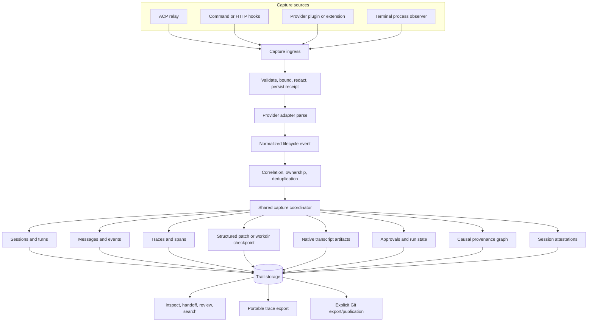

# Native Agent Hooks and ACP Integration Design

Status: Implemented
Audience: Trail maintainers, agent-integration authors, editor/CLI integrators, and reviewers
Research snapshot: 2026-07-11
Related design: [ACP relay](acp-relay.md)

## Executive Summary

Trail should support two first-class ways to observe an AI coding agent:

1. **ACP relay capture**: Trail sits between an ACP client and ACP agent and observes the structured protocol stream.
2. **Native hook capture**: the agent runs normally in its own terminal or editor and invokes Trail through its lifecycle hook, plugin, or extension system.

Neither mode depends on the other. A user who does not use ACP can still obtain durable Trail sessions, turns, messages, events, spans, token usage, tool activity, approvals, transcript artifacts, and worktree checkpoints. A user who does use ACP gets the richer protocol-native stream already implemented by Trail. If both integrations are present, they feed the same capture coordinator and must not create duplicate sessions, turns, messages, spans, or checkpoints.

The core architectural decision is:

> ACP and native hooks are capture transports. Trail's lane activity model is the product model.

Provider-specific code should be narrow. It discovers the provider, installs and removes only Trail-owned configuration, parses native payloads, locates native transcripts, and renders provider-specific hook responses. It must not own Trail session orchestration or checkpoint policy. A shared capture coordinator validates and deduplicates receipts, selects a capture owner, applies normalized lifecycle events, imports transcripts, records file changes, and recovers interrupted work.

This design initially targets:

- OpenAI Codex
- Anthropic Claude Code
- Pi
- OpenCode
- Cursor
- Google Gemini CLI
- GitHub Copilot CLI
- xAI Grok Build

The implementation should borrow the strongest ideas from both Entire and Atomic. Entire contributes adapter inversion of control, native transcript preservation, canonical export, safe hook installation, pre-turn transcript offsets, full turn-end snapshots, and broad provider fixtures. Atomic contributes a pure exhaustive lifecycle state machine, managed-run correlation, exact change-set attestations, causal provenance graphs, immutable factual envelopes separated from redactable transcript material, declarative hook manifests, and portable trace export.

Trail should not copy Entire's hidden Git branch or Atomic's practice of switching the repository's current view when a session starts. Trail remains a local-first operation database, lanes remain explicitly bound work containers, and publication to Git remains a separate boundary.

## Context

Trail already has the durable concepts needed for agent observability:

- lanes and lane workdirs;
- sessions and turns;
- user and assistant messages;
- arbitrary events;
- traces and spans;
- approvals and run state;
- structured patches and workdir synchronization;
- per-turn metadata through `trail.turn_envelope`;
- ACP session mappings and recovery.

The current ACP relay is the richest integration. It sees prompts, streamed assistant updates, tool calls, structured diffs, permissions, usage, cancellation, and session closure. The existing terminal-provider path is intentionally coarser and generally captures a final checkpoint only when the child process exits.

That leaves an important product gap. Many users prefer an agent's native terminal or editor UX and do not want an ACP host in the middle. Most major coding agents now expose lifecycle hooks, plugins, or extensions that can observe enough of the session to build a useful Trail record. Trail should use those native extension points without requiring the user to change how they launch or interact with the agent.

## Goals

### Product Goals

- Record agent activity when the user runs an agent directly, without ACP.
- Preserve a consistent Trail review experience across ACP and hook capture.
- Support session, turn, message, event, span, token, tool, approval, transcript, and file-change evidence when the provider exposes it.
- Make installation and removal safe, local, inspectable, and idempotent.
- Allow project-scoped configuration by default and user-scoped configuration on request.
- Recover useful evidence after hook failures, agent crashes, terminal closure, compaction, and resume.
- Make provider limitations explicit through capabilities and diagnostics.
- Keep hooks fast and fail-open for observability-only behavior.
- Preserve provider-native transcripts as evidence rather than pretending Trail can losslessly reconstruct them from normalized events.
- Make adding a new provider primarily an adapter and fixture task.
- Explain not only what happened but, where evidence supports it, the causal path from goal through exploration, modification, and verification.
- Produce exact, reviewable session attestations over the Trail changes actually created by the session.
- Support nested or externally orchestrated agents without attributing unrelated sessions to the outer run.
- Export portable, vendor-neutral trace bundles without making that export the primary storage model.

### Architecture Goals

- Reuse the existing lane activity model and capture operations.
- Share orchestration between ACP and native hooks.
- Accept events through an in-process path, a short-lived CLI process, or the Trail daemon without changing semantics.
- Make every receipt idempotent and replayable.
- Correlate the same native session observed through more than one transport.
- Maintain a strict Git boundary: capture in Trail first; publish or export to Git only through explicit Git workflows.
- Keep raw provider payloads versioned and bounded so mappings can be improved later.
- Separate immutable factual evidence from mutable, redactable, or regenerated interpretations.
- Model managed capture runs as renewable leases scoped by workspace, workdir, lane, owner, and executor.

## Non-Goals

- Replacing the native transcript viewer of every agent.
- Defining a universal agent-control protocol. ACP already covers the protocol role.
- Making native hooks block tool calls or prompts by default. Trail capture is observability-first.
- Secretly installing global hooks.
- Rewriting arbitrary user configuration into Trail's preferred formatting.
- Treating every provider event as semantically identical.
- Reconstructing private chain-of-thought that the provider does not expose.
- Copying Entire's `entire/checkpoints/v1` hidden branch, commit trailers, or automatic commit coupling.
- Requiring a Git commit to close a Trail turn or session.
- Guaranteeing exact token or cost values when a provider does not emit them.
- Claiming private chain-of-thought as provenance. Trail records exposed plans, summaries, tool evidence, and provider-supplied signed blocks only under explicit policy.
- Automatically rewriting agent context files with inferred learnings.
- Treating a session attestation as proof that the model's output was correct or that a human approved it.

## Design Principles

### One Domain Model, Multiple Transports

ACP, command hooks, HTTP hooks, TypeScript plugins, and native extensions are different delivery mechanisms. Once a payload enters Trail, it should become a normalized lifecycle event and be processed by one coordinator.

### Preserve Native Evidence

Normalized events optimize search, review, and cross-provider behavior. They are not a lossless transcript format. Trail should retain the provider's canonical transcript or export, subject to policy and redaction, and attach its digest and provenance to the Trail session.

### Prefer Canonical Export Over Reconstruction

If a provider offers a supported export command or SDK API, use it. If it exposes a stable transcript file, copy or incrementally ingest that file. Only reconstruct a transcript from hooks when neither is possible, and mark the artifact as reconstructed.

### Passive Adapters, Active Framework

Adapters translate. The framework orchestrates. Provider packages must not directly implement checkpoint policy, create ad hoc database rows, or infer cross-provider ownership independently.

### Fail Open, Diagnose Loudly

A recording failure must not normally block the user's agent. Hooks should return the provider's success response even when Trail is unavailable, spool the receipt when safe, and surface the degraded state through `trail agent hooks doctor`, session warnings, and daemon health.

Policy enforcement is a separate opt-in mode. A future Trail guardrail hook may fail closed, but it must use a different command, configuration marker, and user-visible policy.

### Monotonic Fidelity

Additional evidence should enrich an existing Trail record rather than create another record. ACP can contribute structured tool and message updates while a native Stop hook contributes a final transcript and usage summary. The result is one session and one turn.

### Local-First and Explicit Publication

Trail writes operational state to its own storage. Git commits, notes, branches, or remote publication are separate actions. This preserves Trail's existing provenance and review model and avoids surprising commits or refs.

### Facts, Derived Interpretations, and Attestations Are Different

Provider receipts, messages, tool results, usage counters, structured patches, and Trail checkpoints are factual evidence with explicit source confidence. A rule-based activity classification or generated explanation is a derived interpretation and must link back to its source records. An attestation is a signed or content-addressed statement about a precisely enumerated evidence set. None of these layers may silently masquerade as another.

### Exact Coverage Beats Ambient History

Session summaries and attestations use the exact Trail change IDs recorded for the session's turns. They must never scan an entire lane and attribute inherited baseline operations or concurrent human work to the agent.

### Pure Lifecycle Decisions, Side Effects at the Edge

The session/turn state machine should be a pure function from current state, normalized event, and bounded context to a new state plus ordered actions. Database writes, transcript imports, checkpointing, and provider responses execute those actions outside the transition function. This makes missing, duplicate, late, resume, and crash events exhaustively testable.

## User Experience

### Native Hooks Without ACP

The primary workflow is:

```console
$ trail init
$ trail lane spawn feature-auth --workdir-mode full-cow
$ cd "$(trail lane workdir feature-auth)"
$ trail agent hooks add codex --lane feature-auth
$ trail agent hooks doctor codex
$ codex
```

The user interacts with Codex normally. The installed project hooks invoke Trail at session start, prompt submission, tool boundaries, turn stop, compaction, subagent boundaries, and session end. Trail creates or resumes the mapped session and records each turn.

Equivalent setup should work for every supported provider:

```console
$ trail agent hooks add claude-code
$ trail agent hooks add pi
$ trail agent hooks add opencode
$ trail agent hooks add cursor
$ trail agent hooks add gemini
$ trail agent hooks add copilot
$ trail agent hooks add grok
```

Project scope is the default. User scope is explicit:

```console
$ trail agent hooks add codex --scope user
```

User-scoped hooks discover the nearest initialized Trail workspace at runtime. If no workspace exists, they exit successfully without recording.

### ACP Capture

The existing ACP workflow remains valid:

```console
$ trail acp relay codex --lane feature-auth
```

The ACP relay uses the same normalized coordinator. It normally becomes the primary structured-event owner for that session because it has the highest-fidelity live stream.

### Both Installed

Users should not have to uninstall native hooks before using ACP. The ACP relay exports correlation context to the upstream process:

```text
TRAIL_CAPTURE_MODE=acp
TRAIL_CAPTURE_RUN_ID=<opaque id>
TRAIL_CAPTURE_WORKSPACE=<workspace identity>
TRAIL_CAPTURE_LANE=<lane id>
```

Native hooks still may submit transcript-finalization or audit receipts, but the coordinator recognizes the same run and suppresses duplicate lifecycle mutations. If the provider strips these environment variables, correlation falls back to native session identifiers, working directory identity, provider, and a bounded time window.

### Inspecting Integration State

```console
$ trail agent hooks list
$ trail agent hooks status codex --json
$ trail agent hooks doctor --all
$ trail agent hooks events codex --last 20
$ trail session current feature-auth
$ trail lane handoff feature-auth
```

`status` describes installed files, configured events, ownership markers, provider version, detected transcript support, capture mode, and last successful receipt. `doctor` performs safe contract probes and reports fidelity gaps.

### Removing Hooks

```console
$ trail agent hooks remove codex
$ trail agent hooks remove codex --scope user
```

Removal deletes only entries or files Trail can prove it owns. It preserves unrelated keys, unknown provider fields, comments when the format supports them, and other hook commands.

## Capture Modes and Fidelity

Trail should expose the following modes in diagnostics and session metadata:

| Mode | Launch path | Live messages | Live tools | Per-turn checkpoint | Native transcript | Control/approvals |
| --- | --- | ---: | ---: | ---: | ---: | ---: |
| `acp` | Through `trail acp` | Yes | Yes | Yes | Optional enrichment | Yes |
| `native-hooks` | Agent's own CLI/editor | Provider-dependent | Provider-dependent | Yes when turn hooks exist | Preferred | Observe by default |
| `terminal` | Child process launched by Trail | No | No | Usually final only | Provider-dependent | Process-level only |
| `hybrid` | ACP plus native enrichment | Yes | Yes | One deduplicated checkpoint | Preferred | Yes |

Fidelity is a capability set, not a single support boolean. Every adapter reports:

```text
session_lifecycle
turn_lifecycle
prompt_text
assistant_text
tool_lifecycle
tool_input
tool_output
permission_lifecycle
subagent_lifecycle
compaction_lifecycle
usage
cost
structured_diff
workdir_checkpoint
native_transcript
canonical_export
resume
context_injection
```

The CLI and API return `supported`, `partial`, `unavailable`, or `unknown`, plus a reason and the provider versions verified by Trail.

## Architecture



### Components

#### Agent Registry

The registry maps stable provider names and aliases to adapters. It owns capability reporting, discovery, version probes, and provider construction.

Provider names are stable API values:

```text
codex
claude-code
pi
opencode
cursor
gemini
copilot
grok
```

Aliases such as `claude`, `gemini-cli`, `copilot-cli`, and `grok-build` resolve at the CLI boundary but are not stored as canonical provider names.

#### Provider Adapter

The initial Rust trait should be conceptually equivalent to:

```rust
trait NativeAgentAdapter {
    fn identity(&self) -> AgentIdentity;
    fn discover(&self, ctx: &DiscoveryContext) -> Result<DiscoveryReport>;
    fn capabilities(&self, version: Option<&Version>) -> CapabilityReport;

    fn install_plan(&self, req: &InstallRequest) -> Result<ConfigMutationPlan>;
    fn remove_plan(&self, req: &RemoveRequest) -> Result<ConfigMutationPlan>;
    fn verify_install(&self, req: &VerifyRequest) -> Result<InstallVerification>;

    fn parse_receipt(&self, receipt: RawHookReceipt) -> Result<Vec<LifecycleEvent>>;
    fn render_response(&self, outcome: &HookOutcome) -> Result<HookResponse>;

    fn locate_transcript(&self, session: &NativeSessionRef)
        -> Result<Option<TranscriptSource>>;
    fn export_transcript(&self, session: &NativeSessionRef)
        -> Result<Option<NativeArtifact>>;
    fn resume_command(&self, session: &NativeSessionRef)
        -> Result<Option<Vec<String>>>;
}
```

Optional behavior remains capability-gated. An adapter without canonical export does not implement a fake export. Common validation, redaction, worktree capture, database writes, ownership, and recovery stay outside the adapter.

#### Declarative Adapter Manifest

Atomic demonstrates that hook wiring can live in an integration-supplied manifest rather than requiring a Trail binary release for every renamed provider event. Trail should adopt a constrained version of this idea.

A manifest may declare:

- canonical provider and adapter bundle version;
- supported provider version range;
- project and user configuration targets;
- native event names and the Trail ingress verb each invokes;
- the provider-native JSON shape to merge;
- generated plugin/extension assets by content digest;
- required trust or feature checks;
- capability overrides and known limitations;
- ownership markers and a complete uninstall inventory.

The manifest does not contain arbitrary parser code by default. Built-in Rust adapters still validate and normalize security-sensitive payloads. A future external adapter SDK may use a sandboxed WASM parser with explicit byte, time, filesystem, and network limits.

Manifests are versioned, schema-validated, previewed, and signed when distributed remotely. Local unsigned manifests require an explicit `--allow-unsigned-manifest` confirmation. Unlike Atomic's current generic deep-merge behavior, every Trail-owned non-hook setting must be reversible: the installation inventory records whether Trail created, appended, or replaced each value and removal restores the prior value only when it has not drifted.

This creates a useful split:

```text
adapter code      = payload semantics, validation, transcript logic
adapter manifest  = provider version wiring and installable assets
capture core      = state, evidence, checkpoints, provenance, recovery
```

#### Host-Local Correlation Buffer

Rich plugin APIs such as OpenCode may emit token counters, reasoning summaries, message parts, todos, and tool events separately. A provider plugin may keep an ephemeral in-process buffer to aggregate those fragments into a final turn event. That buffer is an optimization and enrichment source, never durable truth.

The durable receipt journal remains authoritative. If the plugin restarts, Trail reconstructs the turn from already-received receipts, the provider transcript/export, and the workdir. Plugin buffers should therefore:

- be keyed by native session and turn/message IDs;
- cap accumulated text, tool output, and reasoning blocks;
- flush useful partial data periodically for long turns;
- send monotonic counters or provider step IDs so retries do not double-count;
- tolerate missing start timestamps after a plugin reload;
- clear state only after the durable ingress acknowledges receipt.

#### Workspace Resolver

Global hooks must work in the canonical workspace and in lane workdirs without relying on a brittle shell guard such as `test -d .trail`. The internal hook receiver resolves its workspace in this order:

1. authenticated installation/workspace identifier in the hook command;
2. `TRAIL_CAPTURE_WORKSPACE` set by ACP or a managed launcher;
3. a Trail lane/workdir pointer file created during materialization;
4. upward discovery of `.trail` from the provider-reported canonical cwd;
5. no-op success with a bounded diagnostic if no workspace is found.

The pointer contains only a workspace locator and lane/workdir identity, is validated against the canonical Trail database, and cannot grant more authority than the installed hook. Trail should invoke the receiver directly and perform discovery in Rust rather than embedding complex portable shell conditionals in provider configuration.

#### Managed Capture Run Registry

Outer orchestrators, Trail Agent, ACP hosts, and nested agents need an explicit correlation surface. A managed capture run declares:

- opaque `capture_run_id`;
- owner agent and owner session;
- optional executor agent;
- Trail workspace, lane, and workdir;
- optional task/work-item ID;
- creation, renewal, and expiry timestamps.

Runs are renewable leases. Expiry is crash protection, not a maximum session duration. When several runs cover a cwd, Trail selects the longest canonical workdir match and then requires the provider to match the owner or declared executor. Ambiguity is a diagnostic, not permission to guess.

Hooks are never suppressed merely because a run exists. Newly created native-session mappings are stamped with the governing run and adopt its lane. Pre-existing sessions are not restamped, preventing a concurrent direct session from being attributed to a newly started outer run. Ending the managed run returns the exact sessions, turns, changes, artifacts, and attestations bearing that stamp.

#### Capture Ingress

Ingress accepts a raw provider receipt and returns a provider-compatible response. It has three implementations with identical semantics:

- direct function calls from the ACP relay;
- `trail agent hook receive <provider> <native-event>` for command hooks;
- `POST /v1/agent-hooks/{provider}/{event}` for providers supporting HTTP hooks or local plugins using the daemon.

The command name is deliberately singular and low-level. Users manage integrations through `trail agent hooks ...`; provider configuration invokes `trail agent hook receive ...`.

Example installed command:

```text
trail agent hook receive codex UserPromptSubmit --installation <installation-id>
```

The raw payload is read from stdin. Provider-specific environment fields may supplement it, but arguments must never contain prompt text, tool input, or secrets.

#### Durable Receipt Journal

Every accepted hook invocation receives a `receipt_id`. Before semantic processing, Trail stores a bounded receipt record containing:

- provider and native event name;
- installation ID and workspace identity;
- native session, turn, tool, and subagent identifiers when safely extractable;
- source transport;
- payload digest and optional redacted raw payload reference;
- provider timestamp and Trail receive timestamp;
- processing status and diagnostic;
- deduplication key;
- schema/version hints.

Persisting before dispatch makes a command hook replayable after a crash. If the main Trail database cannot be opened quickly, the CLI may atomically spool a bounded file under Trail's local runtime directory and exit successfully. The daemon drains the spool later. Spool files use restrictive permissions and the same redaction policy as normal receipts.

#### Capture Coordinator

The coordinator consumes normalized events and calls existing Trail primitives in order:

```text
session.started
  -> lane session start or resume mapping

turn.started
  -> lane turn begin
  -> user message
  -> root agent span

message.delta / message.completed
  -> assistant message buffering and finalization

tool.started / tool.completed / tool.failed
  -> child span start/end
  -> optional structured patch

approval.requested / approval.decided
  -> lane approval and run-state update

turn.completed
  -> transcript import
  -> structured changes, then workdir fallback
  -> assistant message finalization
  -> root span end
  -> lane turn end

session.ended
  -> close open turn if needed
  -> final transcript import
  -> lane session end
```

This is the same semantic sequence used by the ACP relay. The ACP implementation should be progressively refactored to call this coordinator instead of keeping an ACP-only orchestration path.

## Normalized Lifecycle Contract

### Event Envelope

Every adapter emits one or more versioned envelopes:

```json
{
  "schema": "trail.agent_lifecycle_event",
  "version": 1,
  "event_id": "evt_...",
  "event_type": "tool.completed",
  "occurred_at": 1783791000123,
  "received_at": 1783791000189,
  "provider": "codex",
  "provider_version": "...",
  "transport": "native-hooks",
  "workspace_id": "...",
  "lane_id": "...",
  "capture_run_id": "...",
  "native": {
    "session_id": "...",
    "turn_id": "...",
    "tool_id": "...",
    "subagent_id": null,
    "event_name": "PostToolUse",
    "sequence": null
  },
  "correlation": {
    "parent_event_id": null,
    "trace_id": "...",
    "span_id": "...",
    "parent_span_id": "..."
  },
  "payload": {},
  "evidence": {
    "receipt_id": "...",
    "raw_digest": "sha256:...",
    "transcript_offset": null,
    "confidence": "native-structured"
  }
}
```

Provider timestamps are evidence, not ordering authority. Trail uses a per-native-session logical receive sequence when the provider supplies no reliable sequence. Late events may enrich closed turns but cannot silently reopen or rewrite their outcome.

### Event Vocabulary

Version 1 should recognize:

- `session.started`, `session.resumed`, `session.updated`, `session.ended`;
- `turn.started`, `turn.completed`, `turn.failed`, `turn.cancelled`;
- `message.user`, `message.assistant.delta`, `message.assistant.completed`;
- `plan.updated`;
- `tool.started`, `tool.completed`, `tool.failed`;
- `approval.requested`, `approval.decided`;
- `subagent.started`, `subagent.completed`, `subagent.failed`;
- `compaction.started`, `compaction.completed`;
- `usage.updated`, `model.updated`;
- `workspace.diff`, `workspace.file_changed`, `workspace.checkpoint`;
- `context.injected`;
- `diagnostic`.

Unknown provider events are not discarded. They become `provider.<provider>.<event>` Trail events with bounded, redacted payloads. They do not mutate the session state machine until an adapter version explicitly maps them.

### Confidence and Provenance

Each field derived from provider data records one of:

- `protocol-structured`: observed directly over ACP;
- `native-structured`: supplied by a documented hook or plugin API;
- `native-transcript`: parsed from a provider transcript;
- `canonical-export`: produced by a provider export command/API;
- `worktree-observed`: inferred from Trail's workdir comparison;
- `heuristic`: derived from an unstable or undocumented shape.

Review reports should expose meaningful degradation, for example: "tool duration is exact; token use was parsed from transcript; changed files were observed at turn end."

## Session, Turn, and Span State Machine

### Pure Transition Model

Trail should encode lifecycle decisions as an exhaustive pure transition table. The persisted session phase is:

```text
idle        no open user turn
active      a user turn is open
finalizing  a terminal receipt is durable and checkpoint/artifact work is pending
ended       provider session ended cleanly
interrupted recovery closed an incomplete session
```

The transition function is conceptually:

```rust
fn transition(
    phase: CapturePhase,
    event: LifecycleEventKind,
    context: TransitionContext,
) -> TransitionResult {
    // no I/O
}

struct TransitionResult {
    new_phase: CapturePhase,
    actions: Vec<CaptureAction>,
    diagnostics: Vec<TransitionDiagnostic>,
}
```

Actions include:

```text
ensure_session
begin_turn
append_evidence
start_span
end_span
request_turn_finalization
reconcile_workdir
import_transcript
close_turn
close_session
warn_duplicate
recover_interrupted_turn
```

The transition table explicitly covers every phase/event pair. Expected disorder is represented, not thrown away:

| Current | Event | New phase | Important actions |
| --- | --- | --- | --- |
| `idle` | turn start | `active` | begin turn, capture baseline |
| `idle` | turn end | `finalizing` | synthesize/recover start, finalize if changed/evidence exists |
| `active` | turn start | `active` | close prior as interrupted, begin new turn |
| `active` | turn end | `finalizing` | acquire finalization lease, reconcile/import |
| `finalizing` | duplicate turn end | `finalizing` | attach richer evidence or no-op |
| `finalizing` | finalization complete | `idle` | close turn exactly once |
| `active` | session end | `finalizing` | finalize active turn, then close session |
| `idle` | session end | `ended` | final import and attestation |
| `ended` | resume/session start | `idle` | create capture epoch, retain session relation |
| any | unknown provider event | unchanged | append provider event only |

Database writes execute after the transition is selected and are idempotent by action key. Unit tests enumerate the cross-product of states and event kinds; integration tests verify the resulting durable records.

### Session Identity

Trail adds a transport-neutral native session mapping. The natural identity is:

```text
(workspace_id, provider, native_session_id)
```

When a provider does not expose a stable session ID, the adapter derives a scoped ID from the transcript path or provider session-state directory. A random ID is a last resort and is marked non-resumable.

A native session maps to one Trail lane session. Resume events reopen or continue the same Trail session when the existing session is resumable; they do not create a duplicate just because a new process started.

### Turn Identity

Preferred native turn identity order:

1. provider-supplied turn ID;
2. provider transcript message/turn ID;
3. prompt event ID;
4. deterministic hash of session ID, transcript offset, and prompt receipt;
5. Trail-generated ID persisted in session capture state.

Repeated identical prompts must remain distinct. Prompt text alone is never a turn key.

### Root and Child Spans

Every turn has one root `agent` span. Tool and subagent spans are its children. Nested agent/tool relationships use provider IDs when available. Missing IDs receive deterministic receipt-derived IDs rather than names or input hashes, which can collide during repeated tool calls.

Unmatched completion events create a synthetic start at the completion timestamp and carry `trail.synthetic_start=true`. Open spans are closed as `interrupted` at turn/session recovery.

### Compaction

Compaction is not a new Trail session. Trail records a compaction span and event with before/after transcript offsets, context usage when available, trigger, and summary digest. If the provider changes its native transcript or session identifier during compaction, the mapping table records an alias to the same Trail session.

### Subagents

Subagents remain inside the parent lane session by default and receive child spans plus provider-native identity. If the provider exposes a durable child session with its own transcript, Trail records a child native-session mapping and a `parent_native_session_id`.

A future policy may materialize selected subagents as separate lanes, but capture must not do so implicitly.

## Turn Capture Algorithm

### At Session Start

1. Resolve the initialized Trail workspace from the effective cwd.
2. Verify the hook installation ID belongs to this workspace or is an allowed user-scoped installation.
3. Validate and normalize native identifiers before using them in paths or queries.
4. Correlate or create the native session mapping.
5. Choose the lane according to explicit installation binding, capture environment, current workdir binding, or configured default.
6. Start or resume the Trail lane session.
7. Save provider/model/version, transcript locator, resume metadata, and capture capabilities.
8. Return optional context through the provider's documented response channel.

### At Turn Start

1. Deduplicate the prompt receipt.
2. Recover or close an abandoned prior turn.
3. Capture the current lane head and workdir state.
4. Record the native transcript byte offset, event index, or export revision.
5. Begin a Trail turn with a transport-neutral turn envelope.
6. Add the user message, subject to prompt capture policy.
7. Start the root agent span.
8. Persist the active-turn mapping before returning to the provider.

### During the Turn

- Buffer assistant deltas by native message ID.
- Start and end tool spans.
- Attach sanitized tool input/output summaries according to policy.
- Apply exact structured patches when the provider supplies them.
- Record permission events without deciding them unless an explicit guardrail integration is enabled.
- Accumulate usage monotonically and retain the raw provider counters.
- Record subagents and compaction.
- Periodically flush long-running state through the daemon; command hooks should keep synchronous work bounded.

### At Turn End

1. Make the turn-end receipt durable.
2. Read the transcript delta from the saved offset, if supported.
3. Refresh or export the full canonical transcript. Full snapshots make every turn independently recoverable even when delta parsing changes later.
4. Finalize assistant messages without duplicating ACP-streamed content.
5. Prefer structured diffs already captured during the turn.
6. Reconcile the workdir to catch Bash-generated, formatter-generated, or otherwise unobserved changes.
7. Create at most one Trail checkpoint for the turn.
8. Finalize usage, outcome, capture counts, redaction flags, and fidelity diagnostics.
9. Close remaining tool/subagent spans and the root span.
10. End the Trail turn and persist the new transcript offset.

The turn-end workdir comparison is mandatory even for providers with edit hooks. Agents can modify files through shell commands, generated tools, external processes, or editor actions that bypass specific tool matchers.

### At Session End

Trail closes any active turn as completed, cancelled, failed, or interrupted based on the best available evidence. It performs a final transcript import and workdir reconciliation, closes open spans, and ends the lane session. Cleanup-only events from providers such as Pi should not end a session when the provider is switching or resuming into another session; the adapter supplies the reason.

## Transcript and Artifact Model

### Native Artifact Record

Trail should add an artifact record rather than embedding large transcripts in event payloads:

```text
artifact_id
workspace_id
lane_id
session_id
turn_id nullable
provider
artifact_kind                 transcript | export | tool-output | image | other
format                        provider-specific media type
source                        copied | exported | reconstructed
source_locator_redacted
content_object_id or blob_id
content_digest
size_bytes
start_offset nullable
end_offset nullable
redaction_profile
created_at
metadata_json
```

Artifacts use Trail's content-addressed object/blob storage. Database rows contain metadata and digests, not unbounded JSON or Markdown.

### Snapshot and Delta Policy

- Save a complete native transcript snapshot at every completed turn when the size policy permits.
- Also record the provider-native delta boundary so ingestion and review can be incremental.
- Deduplicate content by digest, so repeated full snapshots do not multiply storage when unchanged.
- For very large transcripts, store chunk manifests and only new chunks.
- Never tail a live transcript indefinitely from a short-lived hook process.
- Treat transcript formats as provider-owned and version them in artifact metadata.

### Transcript Trust

Transcript paths are untrusted input. Trail must canonicalize them, require them to fall under a provider-specific allowed root or an explicitly approved project path, reject symlink escapes, cap file size, and never construct paths directly from an unchecked session/tool ID.

## Evidence Integrity and Redaction Layers

Atomic's split between hashed change metadata and strip-friendly transcript material is a useful model. Trail should express the same distinction using its own object database rather than placing everything into one row or artifact.

### Immutable Factual Envelope

At turn closure Trail creates an immutable evidence manifest containing:

- Trail and native session/turn identifiers;
- provider, adapter, model, and capture transports;
- prompt hash and optional system-instruction hash;
- exact `before_change` and `after_change`;
- exact structured-patch and workdir-checkpoint identifiers;
- source-qualified usage counters and cost;
- terminal outcome and stop reason;
- receipt IDs and payload digests;
- native artifact digests and formats;
- redaction policy active at capture time;
- provenance graph root/digest when present.

The manifest is content-addressed and linked from the turn envelope. It contains hashes and bounded facts, not full prompts, transcripts, reasoning text, or tool output.

### Redactable Evidence Attachments

Full prompts, assistant text, native transcripts, raw hook payloads, tool inputs/outputs, images, and generated explanations remain separate artifacts governed by retention policy. They may be:

- unavailable from the provider;
- stored locally;
- encrypted;
- exported selectively;
- replaced with a redaction tombstone;
- regenerated into a new derived artifact.

Redacting an attachment does not rewrite the turn, checkpoint, or evidence manifest. The artifact record retains its original digest, byte count, media type, source, and a redaction status. Review can therefore distinguish "never captured," "captured and retained," and "captured then redacted."

### Derived Interpretations

Condensed transcripts, summaries, explanations, learnings, and rule-based classifications are versioned derived artifacts. Each records:

- generator name and version;
- input evidence IDs/digests;
- model and prompt hash when an LLM was used;
- generation timestamp;
- confidence or deterministic rule identifier;
- superseded artifact, if regenerated.

Derived artifacts never overwrite native evidence. A new explanation creates a new revision and may be selected as the preferred view.

## Causal Provenance Graph

Timeline events and trace spans answer what happened and when. A causal provenance graph adds a reviewable answer to how one action informed another without claiming access to hidden reasoning.

### Node Vocabulary

Trail should support the following initial node kinds:

| Kind | Typical evidence | Meaning |
| --- | --- | --- |
| `goal` | user prompt, task objective | What the human or outer agent asked for |
| `plan` | provider plan/todo update | Explicit proposed work, not hidden thought |
| `exploration` | read, search, browse, diagnostics | Evidence gathering |
| `decision` | explicit agent summary or deterministic consolidation | A stated or inferred strategy choice |
| `commitment` | write/edit/patch tool, structured diff | A proposed filesystem/code mutation |
| `execution` | shell, deployment, package operation | A side effect not primarily verification |
| `verification` | test, lint, build, typecheck, eval | Evidence that checks work |
| `human_gate` | permission/approval request and decision | Human control boundary |
| `subagent` | child agent session/span | Delegated work |
| `checkpoint` | Trail turn change | Durable outcome of the turn |
| `error` | failed tool, agent/session error | Failure evidence |
| `learning` | explicit or derived reusable finding | Knowledge proposed for later context |

### Edge Vocabulary

Initial causal relations are:

```text
led_to
informed_by
implemented_by
verified_by
blocked_by
resumed_after
delegated_to
failed_with
recorded_as
derived_from
supersedes
```

Edges are assertions with source and confidence. Temporal adjacency alone creates at most a low-confidence `led_to` edge. Exact provider parent IDs, ACP request relationships, tool-call IDs, and explicit plan/todo IDs create higher-confidence edges.

### Deterministic Classification

A versioned rule classifier may map common tool activity:

- read/search/list/web -> `exploration`;
- edit/write/apply-patch -> `commitment`;
- known test/lint/typecheck/build commands -> `verification`;
- other shell commands -> `execution`;
- error status -> `error`.

Classification is an overlay. The original event and span remain unchanged, the rule ID is stored, and unknown tools default to `unclassified` rather than being forced into a misleading category. Provider adapters may supply stable semantic tool categories that outrank name-based rules.

Trail may deterministically consolidate patterns such as explore -> edit -> test or edit -> test-fail -> edit -> test-pass into a `decision` summary. The raw nodes remain present, `consolidated_from` lists them exactly, and the decision carries a confidence. Optional LLM-generated naming is a separate derived artifact and is never required for capture.

### Privacy Boundary

Trail must not store private chain-of-thought by default, even if a plugin can observe a field labeled `reasoning`. Safe defaults are:

- store provider-exposed plan/status summaries when policy allows;
- store reasoning token counts without reasoning text;
- store a provider signature and digest without the signed plaintext when useful;
- accept explicit final explanations as assistant messages;
- require an opt-in policy for raw reasoning blocks;
- label any derived causal explanation as interpretation.

### Graph Storage

Nodes link existing Trail objects instead of copying large payloads:

```text
provenance_node_id
lane_id
session_id
turn_id nullable
node_kind
summary
event_id nullable
span_id nullable
message_id nullable
change_id nullable
artifact_id nullable
source_confidence
classifier_version nullable
created_at
attributes_json
```

Edges contain `from_node_id`, `to_node_id`, `relation`, source confidence, and evidence receipt. At turn end Trail writes a content-addressed graph snapshot/manifest for portable review while keeping normalized node/edge indexes for queries.

## Session Attestations

An attestation is a statement over an exact set of captured outcomes. It is useful for audit, cost aggregation, handoff, and policy; it is not a correctness certificate.

### Coverage

The coordinator appends every successfully created turn checkpoint/change ID to the native-session mapping. Session finalization constructs coverage from that list only. It must not derive coverage by scanning the lane, because a lane may include inherited base history, concurrent human edits, prior sessions, or merged work.

An attestation segment contains:

- session and capture-run identity;
- provider/agent/adapter identity;
- human or host principal that authorized capture, when known;
- exact Trail change IDs and turn IDs covered;
- evidence-manifest digests;
- per-model input, output, reasoning, and cache token totals;
- provider-reported and calculated costs, each source-qualified;
- wall-clock and provider/API durations;
- changed-file and line-operation statistics;
- approval/gate outcomes;
- previous attestation ID for resumed sessions;
- attestation schema version, timestamp, and optional signature.

### Resume Chaining

When a session resumes after an attestation was created, the next attestation covers only newly recorded turns and references the prior attestation. Walking the chain produces session totals without reattesting old evidence. Creating the same segment twice is idempotent because the coverage set and predecessor form the content key.

### Principals and Signatures

Trail should record separate principals rather than encoding the relationship into a display name:

```text
human_principal     who authorized the workspace/session, if known
host_principal      ACP client, editor, or outer orchestrator
agent_principal     Codex, Claude Code, Pi, etc.
model_principal     provider/model/version
capture_principal   Trail adapter and version
```

An installation approval or managed-run declaration supplies authorization provenance. If Trail has a configured signing identity, it may sign the attestation digest. Provider-supplied reasoning signatures are stored as provider evidence and are never reused as a Trail or human signature. Unsigned attestations remain valid content-addressed summaries labeled `unsigned`.

### Verification and Revocation

`trail agent attest verify <id>` checks:

- attestation schema and digest/signature;
- predecessor chain;
- existence and digests of covered turn manifests;
- exact change and turn membership;
- aggregate counters recomputed from source evidence;
- artifact retained/redacted/missing state.

Corrections do not mutate an attestation. Trail issues a superseding attestation or a revocation statement linked to the original.

## Learnings and Context Flywheel

Atomic demonstrates the value of feeding repository and workflow learnings into later sessions. Trail should implement this without automatically editing `CLAUDE.md`, `GEMINI.md`, or other provider-specific context files.

Learnings are explicit or derived records with:

- `repo`, `workflow`, or `code` scope;
- source session, turn, message, span, and evidence digest;
- confidence and review status;
- stable file/line anchors for code findings;
- supersession/deduplication relation;
- sensitivity and injection policy.

Only accepted learnings are eligible for automatic context injection. Code findings use Trail's stable line identity so they survive renames and nearby edits. Repository/workflow learnings can appear in bounded SessionStart, prompt-start, ACP context, or compaction summaries. The injection event records exactly which learning IDs were supplied.

Suggested commands are:

```text
trail agent explain <session|turn> [--save-derived]
trail agent learnings list [--status proposed|accepted|rejected]
trail agent learnings accept <id>
trail agent learnings reject <id>
```

Explanation generation is optional and never runs inside a latency-sensitive hook.

## Portable Agent Trace Export

Trail should offer a best-effort vendor-neutral JSONL export for interoperability with external review and analytics tools:

```console
$ trail agent export <session> --format agent-trace --output traces.jsonl
```

Each self-contained record includes:

- schema version and stable record ID;
- timestamp;
- Trail workspace/lane and change/root revision;
- optional mapped Git commit;
- provider, agent, model, and adapter identity;
- session/turn URI such as `trail://sessions/<id>/turns/<id>`;
- file attribution with stable line ranges where known;
- related change, approval, issue, and artifact references;
- provenance graph/attestation extension metadata.

Export is a projection, not a second source of truth. Importing an external trace creates an artifact plus normalized evidence with its original source; it does not pretend the trace was captured live by Trail.

## File Change and Checkpoint Strategy

Trail has three sources of file-change evidence, in descending preference:

1. **Structured protocol patch**: ACP or a documented native event supplies an exact patch.
2. **Provider tool evidence**: a tool hook supplies the edited path and before/after data.
3. **Workdir reconciliation**: Trail compares the materialized workdir with the turn's `before_change`.

Structured changes should flow through the same safe patch application path used by ACP. Tool evidence can improve attribution but cannot replace the final workdir comparison. Workdir reconciliation is authoritative for the final filesystem state.

Only the coordinator may advance a lane head. Duplicate Stop/AfterAgent/agentStop hooks therefore cannot create duplicate operations. The unique logical key is the Trail turn ID plus checkpoint phase.

If no files changed, the turn closes with `outcome.no_changes=true` and no synthetic operation.

## Git Association Without Hidden Checkpoint Branches

Entire's searchable session-to-commit relationship is valuable even though its hidden checkpoint branch is not a fit for Trail. Trail should provide the same navigation through its existing change/root-to-Git mappings.

### Exact Links Created by Trail

When `trail git export <range> -m <message>` or `trail agent land` creates a Git commit, Trail knows:

- the exported Trail change range;
- the resulting Git commit object;
- the sessions and turns whose `after_change` values contributed to that range;
- the transcript artifacts and spans attached to those turns.

Trail records exact commit links at that boundary. Queries can then navigate in both directions:

```text
Git commit -> Trail change range -> contributing turns -> sessions/artifacts
Trail session -> turn checkpoints -> exported Git commits
```

### Commits Created Outside Trail

For ordinary `git commit`, the association is initially unknown. It can become exact or bounded through either:

1. `trail git import-update`, which maps the current Git state into Trail; or
2. a separate, opt-in lightweight Git `post-commit` integration that records the new Git head and current Trail lane/session mapping.

Agent-hook installation must not silently install Git hooks. The user enables commit linking explicitly:

```console
$ trail git hooks add commit-link
```

The Git hook records identifiers and mappings only. It does not copy transcripts, create Trail turns, amend the commit, write trailers, push refs, or create hidden branches. If Trail is unavailable, the Git commit still succeeds and the link can be recovered from the reflog/current mappings later.

### Link Semantics

A commit may contain work from multiple turns or sessions, and a turn's changes may be split across commits. The relationship is many-to-many and includes a confidence:

- `exact-export`: Trail created the commit from a known change range;
- `exact-head`: a post-commit receipt matched the lane head and active session;
- `import-bounded`: import mapped the commit/root to a range containing the turn;
- `inferred-overlap`: changed paths and time overlap but no exact mapping exists.

Only the first three are presented as provenance. Inferred overlap is a search hint and is visibly labeled.

Suggested storage:

```sql
CREATE TABLE git_agent_links (
    git_commit TEXT NOT NULL,
    lane_id TEXT NOT NULL,
    session_id TEXT NOT NULL,
    turn_id TEXT,
    from_change TEXT,
    through_change TEXT,
    confidence TEXT NOT NULL,
    source TEXT NOT NULL,
    created_at INTEGER NOT NULL,
    metadata_json TEXT,
    PRIMARY KEY(git_commit, session_id, turn_id, source)
);
```

This table is a query index over durable Git mappings and Trail activity. It can be rebuilt when all source mappings remain available. Review commands should expose `trail session commits <session>` and `trail git sessions <commit>` or equivalent JSON/HTTP queries.

## ACP and Hook Coexistence

### Capture Ownership

Trail assigns a lease-like owner for each capture run:

| Evidence class | Preferred owner |
| --- | --- |
| Prompts and streamed assistant text | ACP, then native structured, then transcript |
| Tool lifecycle and approvals | ACP, then native structured, then transcript |
| Structured patches | ACP/native exact patch, then workdir reconciliation |
| Token and cost usage | Provider authoritative counter, then transcript |
| Native transcript | Native hook/plugin finalizer |
| Turn checkpoint | Shared coordinator only |

Ownership is per evidence class, not per process. A hybrid run can use ACP for live events and a native hook for the canonical transcript.

### Correlation

Strong correlation uses `TRAIL_CAPTURE_RUN_ID`. Fallback correlation requires:

- same workspace identity;
- same canonical provider;
- same native session ID or transcript identity;
- compatible lane/workdir;
- overlapping process/session time;
- no conflicting explicit run ID.

Trail must prefer a false negative over merging unrelated sessions. Ambiguous events are retained as receipts and surfaced by doctor/recovery rather than silently attached.

### Idempotency Keys

The adapter constructs the strongest available key:

```text
provider event ID
or (native session, native sequence)
or (native session, native turn, event name, tool/message ID, phase)
or receipt payload digest plus a bounded invocation window
```

Payload digest alone is insufficient for repeated identical tool calls. When no provider identifier exists, the receipt journal assigns an invocation ordinal under a serialized native-session stream.

### Source Precedence

Field-level precedence is:

```text
ACP structured
  > documented native structured event
  > canonical provider export
  > native transcript parser
  > workdir observation
  > heuristic inference
```

Lower-precedence evidence may fill missing fields but may not overwrite conflicting higher-precedence values. Conflicts become diagnostics with both evidence references.

## Storage Changes

The existing `lane_sessions`, `lane_turns`, `lane_events`, `lane_trace_span_events`, messages, operations, and `lane_acp_sessions` remain the durable activity model. Add transport-neutral integration tables rather than overloading `lane_acp_sessions`.

The optional `git_agent_links` index described above extends existing Git mappings; it is not required for capture and does not change Git history.

### `agent_hook_installations`

```sql
CREATE TABLE agent_hook_installations (
    installation_id TEXT PRIMARY KEY,
    workspace_id TEXT NOT NULL,
    provider TEXT NOT NULL,
    scope TEXT NOT NULL,
    config_path TEXT NOT NULL,
    lane_id TEXT,
    manifest_digest TEXT NOT NULL,
    manifest_signature_json TEXT,
    ownership_inventory_json TEXT NOT NULL,
    adapter_version TEXT NOT NULL,
    provider_version_range TEXT,
    status TEXT NOT NULL,
    installed_at INTEGER NOT NULL,
    verified_at INTEGER,
    metadata_json TEXT
);
```

The manifest records only Trail-owned entries and enough original structure to remove them safely. It must not contain secrets.

### `lane_agent_sessions`

```sql
CREATE TABLE lane_agent_sessions (
    mapping_id TEXT PRIMARY KEY,
    workspace_id TEXT NOT NULL,
    provider TEXT NOT NULL,
    native_session_id TEXT NOT NULL,
    parent_native_session_id TEXT,
    trail_session_id TEXT NOT NULL,
    lane_id TEXT NOT NULL,
    capture_run_id TEXT,
    primary_transport TEXT NOT NULL,
    transcript_identity TEXT,
    transcript_offset INTEGER,
    resume_json TEXT,
    last_attestation_id TEXT,
    status TEXT NOT NULL,
    created_at INTEGER NOT NULL,
    updated_at INTEGER NOT NULL,
    UNIQUE(workspace_id, provider, native_session_id)
);
```

`lane_acp_sessions` can remain during migration. New ACP sessions should also create or link a transport-neutral mapping. Once all ACP reads use `lane_agent_sessions`, the ACP-specific table can become a compatibility projection or be migrated.

### `agent_hook_receipts`

```sql
CREATE TABLE agent_hook_receipts (
    receipt_id TEXT PRIMARY KEY,
    workspace_id TEXT NOT NULL,
    installation_id TEXT,
    provider TEXT NOT NULL,
    native_event TEXT NOT NULL,
    native_session_id TEXT,
    native_turn_id TEXT,
    transport TEXT NOT NULL,
    dedupe_key TEXT NOT NULL,
    payload_digest TEXT NOT NULL,
    raw_artifact_id TEXT,
    status TEXT NOT NULL,
    diagnostic TEXT,
    occurred_at INTEGER,
    received_at INTEGER NOT NULL,
    processed_at INTEGER,
    UNIQUE(workspace_id, provider, dedupe_key)
);
```

### `lane_artifacts`

The artifact metadata described earlier links native evidence to Trail sessions and turns. Foreign keys should follow Trail's current migration and deletion conventions rather than introducing cascading behavior ad hoc.

### `agent_capture_runs`

```sql
CREATE TABLE agent_capture_runs (
    capture_run_id TEXT PRIMARY KEY,
    workspace_id TEXT NOT NULL,
    lane_id TEXT,
    workdir TEXT NOT NULL,
    owner_agent TEXT NOT NULL,
    owner_session_id TEXT NOT NULL,
    executor_agent TEXT,
    work_item_id TEXT,
    status TEXT NOT NULL,
    created_at INTEGER NOT NULL,
    updated_at INTEGER NOT NULL,
    expires_at INTEGER NOT NULL,
    metadata_json TEXT
);
```

Active-run lookup indexes canonical workdir and expiry. The database enforces opaque ID validation; the coordinator enforces longest-workdir and owner/executor matching.

### `lane_turn_evidence_manifests`

```sql
CREATE TABLE lane_turn_evidence_manifests (
    manifest_id TEXT PRIMARY KEY,
    lane_id TEXT NOT NULL,
    session_id TEXT NOT NULL,
    turn_id TEXT NOT NULL UNIQUE,
    schema_version INTEGER NOT NULL,
    object_id TEXT NOT NULL,
    digest TEXT NOT NULL,
    created_at INTEGER NOT NULL
);
```

The content-addressed object contains immutable facts and evidence digests. Mutable artifact retention status stays in `lane_artifacts`.

### `lane_provenance_nodes` and `lane_provenance_edges`

```sql
CREATE TABLE lane_provenance_nodes (
    provenance_node_id TEXT PRIMARY KEY,
    lane_id TEXT NOT NULL,
    session_id TEXT NOT NULL,
    turn_id TEXT,
    node_kind TEXT NOT NULL,
    summary TEXT NOT NULL,
    event_id TEXT,
    span_id TEXT,
    message_id TEXT,
    change_id TEXT,
    artifact_id TEXT,
    source_confidence TEXT NOT NULL,
    classifier_version TEXT,
    created_at INTEGER NOT NULL,
    attributes_json TEXT
);

CREATE TABLE lane_provenance_edges (
    provenance_edge_id TEXT PRIMARY KEY,
    lane_id TEXT NOT NULL,
    session_id TEXT NOT NULL,
    from_node_id TEXT NOT NULL,
    to_node_id TEXT NOT NULL,
    relation TEXT NOT NULL,
    source_confidence TEXT NOT NULL,
    receipt_id TEXT,
    created_at INTEGER NOT NULL,
    attributes_json TEXT,
    UNIQUE(from_node_id, to_node_id, relation, receipt_id)
);
```

Indexes cover session/turn/kind, linked change, and both edge directions. A graph snapshot object is an export/cache; the normalized indexes remain queryable.

### `lane_session_attestations`

```sql
CREATE TABLE lane_session_attestations (
    attestation_id TEXT PRIMARY KEY,
    lane_id TEXT NOT NULL,
    session_id TEXT NOT NULL,
    capture_run_id TEXT,
    previous_attestation_id TEXT,
    statement_object_id TEXT NOT NULL,
    statement_digest TEXT NOT NULL,
    signature_json TEXT,
    status TEXT NOT NULL,
    created_at INTEGER NOT NULL,
    superseded_by TEXT,
    metadata_json TEXT
);

CREATE TABLE lane_session_attestation_turns (
    attestation_id TEXT NOT NULL,
    turn_id TEXT NOT NULL,
    change_id TEXT,
    evidence_manifest_id TEXT NOT NULL,
    PRIMARY KEY(attestation_id, turn_id)
);
```

Attestation coverage is written from coordinator-owned turn outcomes in the same logical transaction as session finalization, or replayed idempotently afterward.

### `lane_learnings`

```sql
CREATE TABLE lane_learnings (
    learning_id TEXT PRIMARY KEY,
    lane_id TEXT NOT NULL,
    session_id TEXT NOT NULL,
    turn_id TEXT,
    scope TEXT NOT NULL,
    body TEXT NOT NULL,
    status TEXT NOT NULL,
    confidence REAL,
    source_artifact_id TEXT,
    anchor_json TEXT,
    created_at INTEGER NOT NULL,
    reviewed_at INTEGER,
    reviewer TEXT,
    superseded_by TEXT,
    metadata_json TEXT
);
```

Learning text follows workspace capture/redaction policy. Code anchors use existing Trail identity types rather than raw line numbers as durable identity.

### Turn Envelope Version 2

The current turn envelope is ACP-shaped in its constructor and session fields. Version 2 should retain backward readability and add:

```json
{
  "kind": "agent_turn",
  "protocol": "native-hooks | acp | terminal | hybrid",
  "session": {
    "trail_session_id": "...",
    "capture_run_id": "...",
    "native_session_id": "...",
    "native_turn_id": "...",
    "acp_session_id": "...",
    "upstream_session_id": "..."
  },
  "capture": {
    "transports": ["acp", "native-hooks"],
    "fidelity": {},
    "receipt_count": 0,
    "artifact_ids": [],
    "diagnostic_count": 0,
    "evidence_manifest_id": "...",
    "provenance_graph_digest": "..."
  },
  "principal": {
    "human": null,
    "host": "vscode",
    "agent": "codex",
    "model": "...",
    "adapter": "trail/codex@..."
  }
}
```

Existing version 1 ACP envelopes remain valid and readable. The migration should introduce a generic constructor and make `new_acp_prompt` a thin compatibility wrapper.

## Configuration and Installation Contract

### Rules

- Default to project scope.
- Show a dry-run mutation plan before any potentially ambiguous overwrite.
- Parse and write the provider's actual format rather than template-replacing the whole file.
- Preserve unknown keys and unrelated hook entries.
- Identify Trail entries by an installation ID plus a recognizable command prefix or generated-file marker.
- Make repeated installation a no-op when the desired state is already present.
- Use atomic write-and-rename in the same directory.
- Preserve permissions and newline style where practical.
- Refuse to overwrite an unowned plugin/extension file with Trail's chosen filename unless `--force` is explicit.
- On removal, remove only entries matching the installation manifest and ownership marker.
- Validate the resulting file with the provider's schema or parser when available.
- Never enable unrelated experimental provider features without reporting the change.

### Generated Plugin Files

Pi and OpenCode require generated TypeScript files. Each file begins with a machine-readable ownership header:

```text
// Generated by Trail. installation=<id> adapter=<version>
// Manage with: trail agent hooks remove <provider>
```

The file is self-contained, dependency-light, and invokes `trail` by resolved absolute path when project portability policy permits. Otherwise it uses a small launcher that discovers Trail on `PATH` and reports a diagnostic without breaking the agent.

### Command Timeouts

Installed capture commands use a short provider timeout, preferably 5 seconds or less for prompt/tool hooks and at most 30 seconds for turn/session finalization. Trail itself targets:

- receipt durability under 50 ms with a healthy local daemon;
- parsing and dispatch under 100 ms for ordinary events;
- asynchronous transcript copy/export and workdir reconciliation when the provider response contract allows it.

If the provider synchronously waits for Stop-hook completion, Trail persists the receipt, schedules heavy work, and returns. Session views may briefly show `finalizing`.

## Context Injection

Native hooks can optionally provide Trail context at session or turn start, paralleling ACP's MCP/context capabilities. Examples include lane objective, current head, unresolved approvals, recent handoff, and changed-path claims.

Context injection is opt-in and bounded. The adapter renders the provider's documented output shape:

- Claude Code: `additionalContext` or documented SessionStart/UserPromptSubmit stdout behavior;
- Codex: hook response fields supported for the event/version;
- Pi: `before_agent_start` extension result;
- OpenCode: system/message transformation hook;
- Gemini CLI: `hookSpecificOutput.additionalContext` for the appropriate event;
- other providers only when documented.

Every injection records a `context.injected` event containing a digest, byte count, source records, and redaction result. Trail does not store duplicate plaintext in the event when the underlying context already exists as Trail objects.

Injection failure never blocks capture. Providers with no safe injection mechanism remain capture-only.

### Provenance-Aware Compaction Context

When a provider exposes a pre-compaction context transform, Trail may inject a token-bounded summary built from accepted factual and derived records:

```text
goals
current plan/todos
accepted decisions with source links
files changed and latest checkpoint
verification outcomes
pending approvals/gates
open errors or deferred items
accepted learnings relevant to the active paths
```

The summary targets a configurable budget, defaults to factual records, and excludes raw transcripts and private reasoning. It includes a digest and a `trail://` reference so the full evidence can be inspected outside model context. Trail records both the inputs and exact injected bytes as a `context.injected` derived artifact. Replaying or resuming a compacted session must not reuse stale timestamps, lane heads, or pending approval state without regeneration.

## Security and Privacy

### Threat Model

Hook payloads and transcripts may contain:

- prompts and proprietary source code;
- command lines and environment fragments;
- secrets in tool input/output;
- attacker-controlled filenames and IDs;
- large or malformed JSON;
- paths outside the workspace;
- terminal escape sequences;
- provider fields whose schema changes unexpectedly.

### Required Controls

- Enforce maximum stdin size before JSON decoding.
- Parse with bounded recursion/depth where the library permits.
- Validate IDs against a conservative character/length policy before path use.
- Canonicalize transcript paths and enforce provider allowlists.
- Strip terminal control characters from diagnostics.
- Redact known secret patterns and configured paths before durable raw storage.
- Default tool output capture to bounded summaries; allow full output only by policy.
- Encrypt or exclude sensitive artifacts according to Trail workspace policy.
- Use owner-only permissions for receipt spools and generated secrets-free state.
- Never interpolate payload values into a shell command.
- Execute hook commands without an interactive shell when the provider allows argv configuration.
- Record adapter and provider versions for forensic interpretation.
- Treat context injection as untrusted content and clearly delimit it for the receiving agent.

### Capture Policy

Workspace configuration should support:

```toml
[agent_capture]
enabled = true
prompts = "full"                 # full | hash | off
assistant_messages = "full"      # full | summary | off
tool_inputs = "redacted"         # full | redacted | summary | off
tool_outputs = "summary"         # full | redacted | summary | off
reasoning_text = "off"            # full | redacted | digest-only | off
native_transcripts = "copy"      # copy | reference | off
raw_hook_payloads = "redacted"   # full | redacted | digest-only
causal_provenance = true
session_attestations = "on-end"   # on-end | periodic | manual | off
learning_injection = "accepted"   # accepted | off
max_hook_payload_bytes = 1048576
max_artifact_bytes = 104857600
fail_mode = "open"
```

Policy is evaluated before receipt payload persistence. `digest-only` retains routing fields separately and never writes the full raw JSON.

## Reliability, Concurrency, and Recovery

### Ordering

Providers may launch multiple matching hooks concurrently. Trail must not assume command completion order equals event order. Receipts are serialized per native session for state-machine application while retaining original timestamps.

Tool calls can remain concurrent. Their spans use independent IDs and close in any order.

### Finalization Lease

Providers can deliver duplicate Stop/AfterAgent/session-idle events concurrently. Before transcript import or checkpointing, the coordinator acquires a short renewable lease keyed by `(workspace_id, provider, native_session_id, native_turn_id)`. A competing finalizer may append a higher-fidelity receipt but cannot run workdir reconciliation or close the turn.

The lease and finalization phase are durable, so a crashed worker can be replaced after expiry. The completed turn ID/evidence manifest is the idempotency result returned to every duplicate receipt. An in-process file lock may reduce contention, but it is never the sole correctness mechanism.

### Short-Lived Hook Processes

Command hooks run in separate processes, so in-memory baselines cannot span TurnStart and TurnEnd. Trail stores the pre-turn change/root, workdir manifest/stamps, transcript offset, and active span mapping durably before the start hook returns. Provider plugin buffers can add timing detail, but correctness relies on durable Trail state.

For provider Stop hooks with very short timeouts, Trail persists the terminal receipt and hands finalization to the local daemon. If no daemon is available, it spools an acknowledged job before returning. A detached child process without a durable receipt is not sufficient because it can be killed with the parent and provides no replay boundary.

### Missing Events

- Turn start without session start lazily creates/resumes the session.
- Tool event without turn start lazily creates an inferred active turn only when a prompt/turn identity can be established; otherwise it remains an unattached receipt diagnostic.
- Turn end without turn start can reconstruct from the transcript delta and workdir, marked recovered.
- Session end without turn end closes the active turn as interrupted or provider-indicated status.
- A new turn start closes an abandoned prior turn before opening the next.

### Crash Recovery

On workspace open, daemon start, `doctor`, or a new receipt, Trail scans:

- pending receipt journal entries;
- spooled receipts;
- active native-session mappings with stale heartbeats;
- open turns and spans;
- transcript offsets newer than the last imported artifact;
- workdir changes after the last turn checkpoint.

Recovery is idempotent. It replays receipts, imports evidence, creates at most one checkpoint per turn, marks synthetic/recovered transitions, and emits a diagnostic event.

### Rewind and Resume

Provider resume preserves the Trail session mapping. If the provider rewinds or forks a conversation, Trail records a native session relation:

- `resume`: same logical session;
- `fork`: child mapping, same lane unless configured otherwise;
- `rewind`: new capture epoch referencing the earlier transcript/artifact boundary.

Trail history is append-only. A provider rewind does not delete prior Trail turns; it records the branch in conversational history and subsequent worktree checkpoints describe actual state changes.

## Provider Integration Matrix

The matrix describes the intended first implementation based on provider contracts verified at the research snapshot. Provider versions change; adapters and `doctor` remain authoritative.

| Provider | Native mechanism | Project configuration | Session/turn hooks | Tool spans | Transcript/export | ACP |
| --- | --- | --- | --- | --- | --- | --- |
| Codex | Command hooks | `.codex/hooks.json`, trusted project | Strong | Strong | JSONL path may be supplied; unstable format | Yes through supported ACP adapter/host path |
| Claude Code | Command/HTTP hooks | `.claude/settings.json` | Strong | Strong | Native JSONL | Available through ACP adapters, not required |
| Pi | TypeScript extension | `.pi/extensions/trail/index.ts` | Strong | Strong | Native session JSONL | Provider/version-dependent |
| OpenCode | TypeScript plugin | `.opencode/plugins/trail.ts` | Strong via event bus | Strong | `opencode export` preferred | Yes where OpenCode ACP is available |
| Cursor | Command hooks | `.cursor/hooks.json` | Strong on current versions | Strong/partial by surface | Agent transcript JSONL | Yes in Trail's current ACP profiles |
| Gemini CLI | Command hooks | `.gemini/settings.json` | Strong | Strong | Native transcript JSON | ACP support provider/version-dependent |
| Copilot CLI | Command hooks | `.github/hooks/trail.json` | Strong | Strong on current hook contract | Session-state `events.jsonl` | Not required; host/version-dependent |
| Grok Build | Native JSON hooks, Claude/Cursor compatibility, or plugin | `.grok/hooks/trail.json` | Strong on documented events | Strong | `~/.grok/sessions`, Markdown export | Yes: `grok agent stdio` |
| Kiro | Versioned standalone command hooks in IDE/CLI v3 | `.kiro/hooks/trail.json` | Strong turn lifecycle; no standalone SessionEnd | Strong | Stop exposes the final assistant response; no full transcript contract | Host/version-dependent |

### Adapter Deployment Classes

Atomic's wider registry demonstrates that support is not limited to JSON hook files. Trail should model deployment independently from event fidelity:

| Class | Examples | Trail approach |
| --- | --- | --- |
| JSON command config | Codex, Claude Code, Cursor, Gemini, Copilot | Round-trip-safe merge with owned entries |
| Project plugin | OpenCode | Generated or package-managed TypeScript plugin |
| Project extension | Pi | Generated or package-managed TypeScript extension |
| Executable hook directory | Cline-like agents | Owned scripts plus executable/PowerShell variants |
| Versioned standalone hook file | Kiro | Owned `.kiro/hooks/trail.json` using the documented `v1` schema |
| YAML/plugin package | Hermes-like agents | Dedicated parser/package or declarative manifest |
| Self-managed embedded agent | Trail Agent or Sherpa-like hosts | Direct in-process lifecycle API, no config file |
| ACP-native agent | Grok Build and registry agents | ACP relay plus optional native enrichment |

The verified target list contains the nine providers above. Kiro remains experimental because its standalone hook contract is shared with the IDE and CLI v3 engine. Kiro CLI package 2.8.0 introduced that engine behind `kiro-cli --v3`; the default v2 engine still embeds hooks in named custom-agent configuration. A second compatibility wave may add Cline, Devin, Hermes, and self-managed agents after their current official contracts are verified. Their presence in Atomic is implementation evidence for adapter shapes, not sufficient by itself for Trail to claim compatibility.

## Provider Designs

### OpenAI Codex

#### Installation

Trail writes owned matchers into `.codex/hooks.json`. Project hooks are subject to Codex project trust and exact hook trust. `doctor` must distinguish:

- configuration present;
- project trusted;
- hook configuration trusted;
- hook feature disabled;
- installed command resolvable;
- hook invocation recently observed.

Current Codex documentation describes hooks as enabled by default, with `[features] hooks = false` disabling them and `codex_hooks` retained as a deprecated alias. Trail should not write a feature flag when defaults suffice. If it must remove an explicit disable, it shows that mutation in the install plan.

#### Hook Coverage

Target the current lifecycle set where available:

- `SessionStart` -> session start/resume;
- `UserPromptSubmit` -> turn start and user message;
- `PreToolUse` -> tool span start;
- `PermissionRequest` -> observed approval request;
- `PostToolUse` -> tool span end and possible structured edit;
- `PreCompact` / `PostCompact` -> compaction span;
- `SubagentStart` / `SubagentStop` -> subagent spans;
- `Stop` -> turn completion;
- session closure if/when a documented event is available.

Codex may invoke multiple matching hook commands concurrently. Trail relies on IDs and receipt ordering, not file order.

Codex Stop handling must acknowledge quickly. The foreground hook only durably journals the receipt; transcript import, workdir reconciliation, provenance consolidation, and attestation updates run through the daemon/spool finalizer under the per-turn lease. A background process may be an execution mechanism, but the journal acknowledgement is the correctness boundary.

#### Transcript and Trust Gap

Codex's `transcript_path` is nullable and the transcript format is not a stable public interface. The adapter therefore treats transcript parsing as versioned, optional enrichment. Turn closure remains correct using hook events plus workdir reconciliation. `doctor` reports when transcript capture is unavailable instead of presenting the session as fully faithful.

#### ACP Coexistence

When Codex runs behind Trail's ACP relay, ACP owns prompts, streaming messages, tools, structured diffs, permissions, and usage. Native hooks may supply the transcript and session finalization. Both paths correlate through the capture run environment and native session ID.

### Anthropic Claude Code

#### Installation

Trail merges entries into `.claude/settings.json` at project scope or the appropriate user settings file at user scope. It preserves user hooks, matchers, and unknown fields. Commands use the provider's documented JSON-on-stdin contract.

#### Hook Coverage

Claude Code exposes a broad lifecycle. The initial adapter uses:

- `SessionStart` and `SessionEnd`;
- `UserPromptSubmit`;
- `PreToolUse`, `PostToolUse`, and `PostToolUseFailure`;
- `PermissionRequest` and `PermissionDenied`;
- `Stop`, `StopFailure`;
- `SubagentStart`, `SubagentStop`;
- `PreCompact`, `PostCompact`;
- optionally `FileChanged`, `CwdChanged`, and task/team events as raw or mapped evidence.

Capture hooks always return a non-blocking success. Trail must not emit exit code 2 or a blocking decision from the observability command.

#### Transcript

The hook payload includes a native JSONL transcript path. Trail validates it under Claude's expected project transcript root, imports from the saved offset, and stores a complete content-addressed snapshot at turn end. Resume uses the stable native session ID and transcript path.

#### Context

Claude supports context through SessionStart and UserPromptSubmit hook output. Trail can inject a bounded lane handoff or readiness summary and records its digest as evidence.

### Pi

#### Installation

Pi uses a project TypeScript extension at `.pi/extensions/trail/index.ts`. Trail owns that generated file and refuses to overwrite a foreign file. The extension uses Pi's typed extension API and invokes local Trail ingress without bundling Trail logic.

#### Event Coverage

The extension observes:

- `session_start` and `session_shutdown`;
- `before_agent_start`, `agent_start`, and `agent_end`;
- `turn_start` and `turn_end`;
- message lifecycle events for assistant text when stable;
- `tool_call`, tool execution start/end/failure;
- compaction events;
- model-selection and usage events when available.

Pi distinguishes an agent run for a user prompt from individual model/tool turns. Trail's user-facing `LaneTurn` should correspond to one submitted user prompt (`before_agent_start` through `agent_end`), while inner Pi `turn_start`/`turn_end` pairs become model/tool-cycle spans or events. This avoids exploding one user request into several Trail turns.

`session_shutdown` reasons such as reload, new, resume, or fork guide whether Trail ends, aliases, or relates the session.

The extension may maintain ephemeral per-session tool start times and message buffers for precise durations. It sends stable IDs and periodic receipts to Trail; a Pi reload must lose only optional timing precision, never the durable turn or checkpoint.

#### Transcript and Context

Pi stores native JSONL sessions and supports session resume. The extension records the resolved session file and native ID. `before_agent_start` can return bounded Trail context or system-prompt modifications through the native extension contract.

### OpenCode

#### Installation

Trail generates `.opencode/plugins/trail.ts`. OpenCode automatically loads project plugins. The file uses the typed plugin API and provider SDK client where necessary. It must not assume Node when OpenCode's plugin runtime is Bun.

#### Event Coverage

OpenCode's plugin event bus includes session, message, permission, tool, file, todo, and command events. Map:

- `session.created` / `session.updated` / `session.idle` / `session.deleted`;
- message updates and parts to prompt/assistant messages;
- `tool.execute.before` / `tool.execute.after` to spans;
- `permission.asked` / `permission.replied` to observed approvals;
- `session.compacted` to compaction;
- `session.diff` and `file.edited` to change evidence;
- `session.error` to failure diagnostics.

OpenCode child sessions are subagents. Parent-child session relations become nested subagent spans and child native-session mappings.

OpenCode can emit `chat.message` before the asynchronous `session.created` bus event reaches the plugin. The plugin therefore performs an idempotent `ensure_session` before sending the prompt receipt. Trail's state machine also accepts turn start without session start, so correctness does not depend on plugin event order.

The plugin may aggregate per-turn model/provider, wall duration, step count, finish reason, token/cache/reasoning counters, cost, todo snapshot, tool durations, structured file diffs, diagnostics, and bounded provider reasoning metadata. It flushes important events as they happen and treats the final `session.idle` payload as a summary enrichment, not the only copy. Counters include provider step IDs or monotonic source sequence so a retried summary cannot double-count usage.

#### Transcript

Prefer `opencode export <session>` or its SDK equivalent over reconstructing an export from event fragments. The canonical JSON export becomes the native artifact. Live message events still provide searchable Trail messages before turn finalization.

Before compaction, the plugin can request Trail's provenance-aware summary and inject it through OpenCode's compaction/system transform. The injected summary is bounded, excludes private reasoning by default, and points back to the full Trail session.

### Cursor

#### Installation

Trail merges versioned entries into `.cursor/hooks.json`. Cursor hook availability has changed across releases, so discovery records the exact Cursor version and `doctor` validates configured hook names against the installed build.

#### Event Coverage

Use current documented events when available:

- `sessionStart`, `sessionEnd`;
- `beforeSubmitPrompt`;
- `preToolUse`, `postToolUse` and shell/MCP/file-specific before/after hooks where needed;
- `afterAgentResponse`, `afterAgentThought` only when their payload is documented and policy permits capture;
- `stop`;
- `subagentStart`, `subagentStop`;
- `preCompact`;
- workspace/file events as supporting evidence.

The adapter capability map is version-gated because earlier Cursor builds accepted a smaller event set and had configuration-validation gaps. Missing session start can be recovered lazily from `beforeSubmitPrompt`; it should be reported as degraded rather than fatal.

#### Transcript

Cursor transcript locations and schemas are treated as versioned native artifacts. If a reliable transcript cannot be located, Trail still records prompt/stop/tool evidence and performs workdir reconciliation. Resume capability remains `partial` until a documented stable resume locator is available for the relevant surface.

### Google Gemini CLI

#### Installation

Trail merges matchers into `.gemini/settings.json`, preserving unrelated and unknown hook types. Gemini sends JSON on stdin and consumes structured stdout/exit behavior. Capture exits success and does not block agent actions.

#### Event Coverage

Gemini offers a broad lifecycle:

- `SessionStart` / `SessionEnd`;
- `BeforeAgent` / `AfterAgent` for user-level Trail turns;
- `BeforeModel` / `AfterModel` for model-cycle events and usage;
- `BeforeToolSelection`;
- `BeforeTool` / `AfterTool` for spans;
- `PreCompress` for compaction;
- notifications and other events as diagnostic evidence.

As with Pi, one Trail turn corresponds to one user prompt/agent run, while individual model calls are child spans or events.

#### Transcript and Context

Import the native JSON transcript with adapter-version metadata. `BeforeAgent` is the preferred context-injection boundary. Model token counters enrich the turn envelope without assuming all models/providers report cost consistently.

### GitHub Copilot CLI

#### Installation

Project hooks live in an owned `.github/hooks/trail.json`; user hooks live under the Copilot user hook directory. A dedicated project file minimizes configuration collision and makes removal straightforward. Trail still refuses to replace a foreign file with the same name.

#### Event Coverage

Use the current hook contract:

- `sessionStart`, `sessionEnd`;
- `userPromptSubmitted`;
- `preToolUse`, `postToolUse`;
- `agentStop`;
- `subagentStart`, `subagentStop` where available;
- permission, compaction, notification, and error hooks when supported by the installed version.

Some Copilot versions reuse a tool-call identifier as the child session identifier during subagent lifecycle. The adapter must correlate those events without creating a phantom top-level session. This rule belongs in the Copilot adapter and has a regression fixture.

#### Transcript

The native session-state `events.jsonl` is imported from the validated Copilot session directory. Trail records whether the artifact represents the CLI, editor, or cloud-agent surface because hook availability and transcript semantics can differ.

### xAI Grok Build

#### Two First-Class Paths

Grok Build supports ACP through `grok agent stdio`; Trail should provide a built-in ACP profile for that command. Grok also supports hooks/plugins and Claude Code configuration compatibility, allowing direct native capture without ACP.

#### Native Installation Strategy

Install a dedicated Trail-owned JSON file at `.grok/hooks/trail.json`. Grok discovers project `.grok/hooks/*.json`, user `~/.grok/hooks/*.json`, enabled-plugin hooks, and compatible Claude Code and Cursor hook files. The dedicated Grok file gives Trail exact ownership and avoids relying on compatibility precedence. Project hooks require `/hooks-trust` or a trusted launch; `doctor` reports both installation and trust state.

The documented native event set is `SessionStart`, `SessionEnd`, `UserPromptSubmit`, `PreToolUse`, `PostToolUse`, `PostToolUseFailure`, `PermissionDenied`, `Stop`, `StopFailure`, `Notification`, `SubagentStart`, `SubagentStop`, `PreCompact`, and `PostCompact`. Native payloads use camel-case fields including `hookEventName`, `sessionId`, `workspaceRoot`, `toolName`, and `toolInput`. The adapter must accept the explicitly documented Claude/Cursor-compatible shapes as separate fixture variants rather than guessing field aliases at runtime.

Only `PreToolUse` is blocking. Trail's observability hook always exits zero, emits no passive stdout, and never returns `deny`. Timeouts, crashes, and malformed output are documented as fail-open, which matches Trail's recording policy.

Grok's changelog also describes host-registered hooks over the agent connection. When that API is stable, the ACP adapter can register enrichment hooks in-memory instead of writing project files for ACP runs. Direct non-ACP use still relies on the project/user native integration.

#### Contract Probe and Compatibility Drift

The official contract makes Grok a supported native adapter. An explicit `trail agent hooks doctor grok --probe` remains useful for detecting version drift and compatibility-mode behavior. It should:

1. inspect the installed Grok version and capabilities;
2. validate hook/plugin directories and trust;
3. generate a harmless probe session when explicitly requested;
4. capture redacted payload shapes;
5. compare them to checked-in fixtures;
6. report whether Grok-native, Claude-compatible, or Cursor-compatible mapping is active.

Failure to run an optional probe does not make a documented supported version experimental. An unknown newer version reports `unknown` until static inspection or the probe confirms its event and payload shapes.

#### Transcript and Resume

Grok stores sessions under `~/.grok/sessions` and can export Markdown. Prefer the supported export command for canonical evidence and retain the session locator for resume. Markdown export is a native artifact; normalized Trail messages still come from ACP or hook events when available.

## CLI and API Surface

### User Commands

```text
trail agent hooks list [--installed] [--json]
trail agent hooks add <provider> [--scope project|user] [--lane <lane>]
                       [--context off|session|turn|compaction] [--dry-run] [--force]
trail agent hooks add --manifest <file> [--allow-unsigned-manifest]
trail agent hooks remove <provider> [--scope project|user] [--dry-run]
trail agent hooks remove --manifest <file> [--dry-run]
trail agent hooks status <provider> [--json]
trail agent hooks doctor [<provider>|--all] [--probe] [--json]
trail agent hooks events <provider> [--last <n>] [--failed] [--json]
trail agent hooks replay [--receipt <id>|--pending] [--json]

trail agent capture begin --owner <agent> --session <id>
                          [--executor <agent>] [--lane <lane>]
                          [--workdir <path>] [--work-item <id>]
                          [--ttl <duration>] [--json]
trail agent capture renew <run-id> [--ttl <duration>] [--json]
trail agent capture end <run-id> [--json]
trail agent capture status [--json]

trail agent provenance show <session|turn> [--json]
trail agent attest list [--session <id>] [--json]
trail agent attest show <id> [--json]
trail agent attest verify <id> [--json]
trail agent export <session> --format agent-trace [--output <path>]
trail agent explain <session|turn> [--save-derived]
trail agent learnings list|accept|reject ...
```

### Internal Hook Command

```text
trail agent hook receive <provider> <native-event>
    --installation <id>
    [--transport command|plugin|http]
```

The internal command remains documented for integration authors but is not the normal setup interface.

### HTTP

```text
POST   /v1/agent-hooks/{provider}/{event}
GET    /v1/agent-hooks/installations
GET    /v1/agent-hooks/installations/{id}
GET    /v1/agent-hooks/receipts
POST   /v1/agent-hooks/receipts/{id}/replay
GET    /v1/agent-integrations/capabilities
POST   /v1/agent-capture-runs
POST   /v1/agent-capture-runs/{id}/renew
POST   /v1/agent-capture-runs/{id}/end
GET    /v1/agent-sessions/{id}/provenance
GET    /v1/agent-sessions/{id}/attestations
POST   /v1/agent-attestations/{id}/verify
GET    /v1/agent-sessions/{id}/export?format=agent-trace
```

Local HTTP ingress requires a short-lived installation credential or a Unix-domain-socket trust boundary. It must not expose unauthenticated hook ingestion on a network interface.

### MCP

MCP should expose read-oriented integration status and receipt diagnostics. Hook installation is a workspace mutation and should require the same explicit approval as other configuration writes. Agent-facing MCP tools do not need to be called for native capture; the hook infrastructure is out-of-band.

## Diagnostics

`doctor` should check:

- Trail workspace and lane binding;
- provider executable and version;
- native mechanism supported at that version;
- project/user config path and parseability;
- installation ownership and drift;
- provider trust state;
- hook command resolution in a non-interactive environment;
- daemon/socket availability or direct-write fallback;
- recent receipt and processing latency;
- transcript path/export availability;
- native ID and resume support;
- ACP/native duplicate correlation when hybrid;
- governing managed run, executor match, lease expiry, and workdir specificity;
- stale sessions, open turns/spans, pending receipts, and spool backlog;
- stuck/contended finalization leases;
- evidence-manifest and artifact digest consistency;
- attestation coverage, predecessor chain, and signature status;
- adapter manifest signature, provider-version range, and configuration drift;
- capture policy and redaction mode.

Every warning has a stable code, human message, machine details, and remediation. Examples:

```text
CODEX_HOOK_TRUST_MISSING
CURSOR_EVENT_UNSUPPORTED_BY_VERSION
TRANSCRIPT_PATH_OUTSIDE_PROVIDER_ROOT
HOOK_COMMAND_NOT_ON_PATH
CAPTURE_RECEIPT_SPOOLING
HYBRID_CORRELATION_AMBIGUOUS
TURN_RECOVERED_WITH_WORKDIR_ONLY
MANAGED_RUN_AMBIGUOUS
MANAGED_RUN_EXECUTOR_MISMATCH
TURN_FINALIZATION_LEASE_STALE
ADAPTER_MANIFEST_UNSIGNED
ADAPTER_MANIFEST_VERSION_MISMATCH
EVIDENCE_ARTIFACT_REDACTED
ATTESTATION_COVERAGE_MISMATCH
```

## Testing Strategy

### Adapter Contract Tests

Every provider adapter must pass the same suite:

- fresh install;
- idempotent reinstall;
- dry run;
- force behavior;
- signed, unsigned, expired, and provider-version-incompatible manifests;
- reversible ownership for manifest deep merges and drift-safe uninstall;
- preservation of unrelated and unknown configuration;
- safe removal of only Trail-owned entries;
- refusal to overwrite foreign generated files;
- malformed and oversized payloads;
- invalid identifiers and transcript-path traversal;
- every supported hook fixture maps to expected lifecycle events;
- unknown hooks are retained as provider events;
- provider response never blocks in capture mode;
- context output matches the provider schema;
- capability report matches the fixture version.

### Lifecycle Tests

Replay complete fixture sessions through the shared coordinator:

- normal session with two turns;
- repeated identical prompts and tool calls;
- concurrent tool calls ending out of order;
- tool failure and permission denial;
- subagent nesting;
- compaction and resume;
- missing SessionStart;
- missing Stop followed by a new prompt;
- duplicate delivery;
- hook and ACP delivery of the same run;
- agent crash with transcript/workdir recovery;
- no-change turn;
- large transcript and capture truncation;
- secret redaction.
- exhaustive state/event transition coverage;
- two concurrent terminal receipts competing for the finalization lease;
- managed run with owner/executor filtering and nested workdirs;
- pre-existing session not restamped into a later managed run;
- plugin correlation-buffer restart halfway through a turn;
- exact attestation coverage when the lane contains inherited and concurrent changes;
- resumed-session attestation chaining and idempotent recreation;
- deterministic provenance classification/consolidation with source links;
- transcript redaction preserving the immutable evidence manifest;
- portable trace export roundtrip as an external artifact.

Tests assert one Trail session, the expected turn count, one checkpoint per changed turn, closed spans, correct source precedence, stable diagnostics, exact attestation coverage, and unchanged factual evidence after derived-artifact regeneration or transcript redaction.

### Golden Native Fixtures

Keep redacted payload and transcript fixtures by provider and version:

```text
trail/tests/fixtures/agent-hooks/<provider>/<version>/
    capabilities.json
    session.jsonl
    expected-lifecycle.jsonl
    transcript.*
    config-before.*
    config-after.*
```

Fixtures must come from documented examples or explicit opt-in capture on test accounts. They contain no real repository content or credentials.

### Optional Real-Agent E2E

Real-agent tests are opt-in because they may require login, tokens, network, or spend. A minimal deterministic prompt asks the agent to create one known file and stop. The test verifies hook delivery, transcript acquisition, one turn, one checkpoint, and safe uninstall.

Grok requires a real contract probe before graduating from experimental. Cursor and Codex should also run version-matrix smoke tests because their hook contracts evolve quickly.

### Performance Tests

Measure p50/p95/p99 hook response latency with and without the daemon, concurrent tool hooks, transcript sizes, and workdir sizes. Test that a daemon outage produces bounded spooling and that replay does not duplicate state.

The v1 release gates use deliberately generous CI budgets so they catch algorithmic
regressions without pretending shared runners are latency laboratories:

- one hundred concurrent deliveries of the same receipt must converge to one journal
  row in less than 15 seconds and grow the workspace database by less than 32 MiB;
- an individual payload is capped at 1 MiB before durable ingress, a transcript or
  artifact at 64 MiB, a portable trace at 256 MiB, and the degraded spool at 10,000
  files or 64 MiB;
- local CLI scale smoke tests must remain green at 1,000 files, while native-hook unit
  and E2E tests exercise duplicate ingress, replay, database outage, and transcript
  rewrite/truncation paths;
- release benchmarking should record p50/p95/p99 rather than turn machine-specific
  timings into protocol guarantees. Provider acknowledgement timeouts remain a
  compatibility input to each adapter and the durable-spool path is the fallback.

## Rollout Plan

### Phase 0: Shared Capture Coordinator

- Extract ACP session/turn/message/tool/checkpoint orchestration behind transport-neutral inputs.
- Add lifecycle envelope, source precedence, ownership, and idempotency tests.
- Implement the pure exhaustive lifecycle state machine and action executor boundary.
- Add generic turn envelope v2 while preserving v1 reads.
- Keep ACP behavior and performance unchanged.

Exit criterion: existing ACP e2e tests pass through the shared coordinator and duplicate normalized event replay is a no-op.

### Phase 1: Receipt Journal and Hook CLI

- Add installation, native-session, managed-run, receipt, artifact, and finalization-lease storage.
- Implement bounded stdin, redaction, direct dispatch, daemon dispatch, and spool fallback.
- Add `list`, `status`, `doctor`, `events`, and `replay` foundations.
- Implement generic config mutation/ownership helpers.

Exit criterion: a synthetic provider can record and recover complete sessions through short-lived command invocations.

### Phase 2: Claude Code and Codex

- Implement the two broad command-hook adapters.
- Import native transcripts with path validation.
- Implement trust diagnostics, tool/subagent spans, compaction, and context injection.
- Validate hybrid ACP/native deduplication.

Exit criterion: both agents record multi-turn direct sessions, and Codex hybrid mode creates one record.

### Phase 3: Gemini CLI, Copilot CLI, and Cursor

- Add JSON config adapters and versioned capability probes.
- Add transcript importers and provider edge-case fixtures.
- Add editor/CLI surface metadata where relevant.

Exit criterion: supported versions pass fixture, install-preservation, and opt-in E2E tests.

### Phase 4: Pi and OpenCode

- Add generated TypeScript extension/plugin adapters.
- Capture richer message, tool, permission, subagent, and compaction streams.
- Prefer canonical OpenCode export and native Pi session files.

Exit criterion: generated files are portable, safely owned, and direct sessions produce the same Trail review model as command-hook providers.

### Phase 5: Grok Build

- Add built-in `grok agent stdio` ACP profile.
- Check in native camel-case and explicit Claude/Cursor compatibility fixtures.
- Implement the owned `.grok/hooks/trail.json` integration and non-blocking response contract.
- Add export/resume integration and trust diagnostics.

Exit criterion: documented versions pass native fixtures and direct-session E2E; unknown versions degrade with clear diagnostics rather than silently selecting a compatibility shape.

### Phase 6: Provenance, Attestation, and Portable Export

- Add immutable evidence manifests and redactable artifact status.
- Add causal provenance nodes/edges with deterministic classification.
- Add exact session attestation creation, resume chaining, and verification.
- Add accepted learnings with stable code anchors and compaction injection.
- Add vendor-neutral agent-trace export.

Exit criterion: a multi-turn hybrid session can be audited from goal to exact checkpoints, verified against a chained attestation, redacted without changing factual manifests, and exported as portable JSONL.

### Phase 7: Product Hardening

- Search and filtering by provider, model, tool, token usage, and artifact.
- Storage retention, compaction, and artifact export policy.
- Compatibility telemetry that never uploads content without opt-in.
- Signed declarative manifests, documented third-party adapter SDK, and conformance suite.
- Second-wave adapters only after official contract verification.

## Acceptance Criteria

The initial feature is complete when:

1. A user can install hooks for each stable target provider without using ACP.
2. Direct agent sessions create searchable Trail sessions and user-level turns.
3. Supported tool calls become spans with correct nesting and failure state.
4. Every completed changed turn produces at most one Trail checkpoint.
5. Native transcripts or canonical exports are retained when supported and policy allows.
6. ACP and native hooks observing the same run produce one deduplicated record.
7. Hook failures do not block ordinary agent use and are diagnosable.
8. Install and remove preserve foreign configuration and unknown fields.
9. Crash recovery replays receipts without duplicating turns, spans, or operations.
10. All raw payloads, paths, IDs, and artifacts pass the security constraints.
11. Capability reports accurately describe provider/version limitations.
12. Existing ACP and terminal integrations remain backward compatible.
13. Trail-created or explicitly linked Git commits can be queried back to the contributing agent sessions without hidden refs or commit trailers.
14. Managed runs attribute only newly governed sessions from the matching owner/executor and workdir.
15. Every completed turn has an immutable evidence manifest distinct from redactable attachments.
16. Causal provenance nodes link back to source events/spans/changes and clearly label deterministic or generated interpretation.
17. Session attestations cover exactly the turn changes recorded by that session and chain correctly across resume.
18. Transcript redaction and explanation regeneration do not change checkpoint identity or factual manifests.
19. Declarative adapter manifests are previewable, version-gated, signed when remote, and fully reversible for Trail-owned mutations.
20. Sessions can be exported to a portable trace without making the export a second source of truth.

## Decisions Borrowed From Entire

The local Entire clone at commit `7cd6662805fbd525f2f418ecf465a247b924af70` informed this design. Trail should borrow ideas, not storage semantics or code blindly.

| Entire idea | Trail adaptation |
| --- | --- |
| Agent adapter translates native hooks to normalized lifecycle events | `NativeAgentAdapter` emits Trail lifecycle envelopes |
| Generic dispatcher owns lifecycle orchestration | Shared capture coordinator owns sessions, turns, spans, and checkpoints |
| Full native transcript on checkpoints | Content-addressed native artifact at each completed Trail turn |
| Transcript delta offset saved before the turn | Native-session mapping stores transcript offset/export revision |
| Canonical export preferred over event reconstruction | OpenCode export and Grok export are first-class artifacts |
| Idempotent install/uninstall preserving unknown config | Trail-owned mutation manifests and round-trip-safe writers |
| Plugin/extension adapters for Pi and OpenCode | Generated `.pi` extension and `.opencode` plugin |
| Fail-soft hook commands with bounded timeout | Durable receipt first, async finalization, fail-open capture response |
| Central session/tool/subagent identifier validation | Ingress validation before path/query construction |
| Context injection through native responses | Optional lane/handoff injection with evidence digest |
| Provider-specific handling of phantom or reused IDs | Adapter regression rules, notably Copilot subagent IDs |
| Simulated hook tests plus optional real E2E | Golden provider/version fixtures and opt-in agent smoke tests |
| Trust diagnostics for Codex hooks | Provider-specific `doctor` checks for project/hook trust |
| Hidden Git checkpoint branch and commit trailers | **Not adopted**; Trail storage is primary and Git publication is explicit |

Relevant Entire implementation references include:

- [Agent integration guide](../../entire/docs/architecture/agent-guide.md)
- [Agent integration checklist](../../entire/docs/architecture/agent-integration-checklist.md)
- [Agent adapter interfaces](../../entire/cmd/entire/cli/agent/agent.go)
- [Generic hook registry](../../entire/cmd/entire/cli/hook_registry.go)
- [Shared lifecycle dispatcher](../../entire/cmd/entire/cli/lifecycle.go)
- Provider packages under `entire/cmd/entire/cli/agent/`

## Decisions Borrowed From Atomic

The local Atomic clone at commit `24a5d55a66192e6337f42c2cb18deee4f58ea6fe` was inspected at the implementation level. Its `atomic-agent` library test suite passed with 1,200 tests. Trail should adapt the following ideas to its own operation database and lane model.

| Atomic idea | Trail adaptation |
| --- | --- |
| Pure `phase + event + context -> actions` transition function | Exhaustive transport-neutral capture state machine with side-effect executor |
| Lightweight local session scratch state | Durable `lane_agent_sessions`, receipt journal, and active-turn mappings |
| Every turn records one native VCS change | Every completed changed turn advances its Trail lane at most once |
| Session envelope embedded in hashed change metadata | Content-addressed factual evidence manifest linked from turn envelope v2 |
| Transcript/reasoning stored in strip-friendly unhashed data | Redactable/encrypted artifacts with retained digest and tombstone state |
| Exact `recorded_change_hashes` used for session attestation | Attestation coverage from coordinator-owned turn change IDs, never lane scans |
| Chained attestations for resumed sessions | New segment covers only new turns and references prior Trail attestation |
| Managed lifecycle lease with owner/executor/view/workdir | Managed capture run with owner/executor/lane/workdir and longest-prefix resolution |
| Only newly created sessions receive a managed-run stamp | Never restamp pre-existing direct sessions into an outer run |
| In-memory provider plugin buffer plus durable CLI state | Ephemeral enrichment buffer backed by durable receipts and replay |
| Turn-end lock suppresses duplicate Stop recording | Durable finalization lease plus idempotent completed result |
| Deterministic tool classification and provenance DAG | Optional causal overlay linked to Trail events, spans, messages, and changes |
| Decision consolidation retains raw nodes | Derived decision nodes list exact `consolidated_from` evidence and confidence |
| Agent identity derived from user authorization | Separate human, host, agent, model, and adapter principals in evidence/attestation |
| Declarative integration hook manifest | Signed/versioned install manifest, built-in parser, reversible ownership inventory |
| Global hooks no-op outside an Atomic/sandbox workspace | Trail receiver resolves workspace/lane pointer and exits success when absent |
| Codex Stop detached foreground worker | Durable terminal receipt plus daemon/spool finalizer; no unacknowledged child reliance |
| Provenance-aware compaction summary | Token-bounded factual/accepted-learning context injected through native or ACP boundary |
| `agent-trace` JSONL projection | `trail agent export --format agent-trace` with Trail revisions and stable line attribution |
| Explain/learnings knowledge flywheel | Reviewed Trail learning records and context injection, no automatic provider-file edits |

### Atomic Implementation Lessons Not Adopted Directly

Atomic's source also clarifies several traps:

- Its common `HookType` currently has only session start/end, turn start/end, and pre/post tool use. Trail's normalized contract must retain messages, plans, approvals, subagents, compaction, usage, model updates, and workspace evidence rather than collapsing them into raw JSON.
- Its fallback watcher is in-process, but command hook invocations are separate processes. Atomic's own turn-end path therefore relies on repository status. Trail must persist the pre-turn baseline and transcript offset so cross-process recovery is exact.
- Its session-start handler may switch Atomic's current view and later restore it. Trail native capture must bind an explicit lane/workdir and never switch a user's Git branch or ambient Trail ref behind their back.
- Several Atomic adapters parse events but intentionally leave installation to separate packages or IDE panels. Trail capability reporting must distinguish `payload_parser`, `automatic_install`, `guided_install`, and `external_package` instead of calling all adapters equally installed.
- Atomic's declarative manifest can deep-merge non-hook settings and intentionally leaves them on uninstall. Trail requires a reversible ownership inventory for every setting it changes.
- Atomic can attach agent metadata directly to its native VCS changes. Trail keeps operational capture in Trail and uses explicit Git mappings/publication, preserving its existing product boundary.
- Atomic's plus-tag display identity is useful UX but not a cryptographic authorization model by itself. Trail records separate principals and signs attestations only with an actual configured key.

Relevant Atomic implementation references include:

- [`atomic-agent` overview](../../atomic/atomic-agent/README.md)
- [Normalized hook trait and registry](../../atomic/atomic-agent/src/hooks/mod.rs)
- [Declarative hook manifests](../../atomic/atomic-agent/src/hooks/manifest.rs)
- [Pure lifecycle state machine](../../atomic/atomic-agent/src/turn/phase.rs)
- [Durable session scratch state](../../atomic/atomic-agent/src/turn/session.rs)
- [Turn orchestrator](../../atomic/atomic-agent/src/turn/orchestrator/turn.rs)
- [Managed lifecycle leases](../../atomic/atomic-cli/src/commands/agent/lifecycle.rs)
- [Hook ingress and Codex handoff](../../atomic/atomic-cli/src/commands/agent/hooks.rs)
- [Session evidence envelope](../../atomic/atomic-agent/src/envelope.rs)
- [Causal provenance types](../../atomic/atomic-agent/src/provenance/types.rs)
- [Deterministic provenance classification](../../atomic/atomic-agent/src/provenance/classify.rs)
- [Session attestation construction](../../atomic/atomic-agent/src/turn/orchestrator/attestation.rs)
- [Redactable transcript storage](../../atomic/atomic-agent/src/transcript/storage.rs)
- [Portable trace export](../../atomic/atomic-agent/src/export.rs)
- [OpenCode plugin correlation state](../../atomic/packages/opencode-atomic-hooks/src/session.ts)

## Rejected Alternatives

### One Hook Script Per Provider With Direct Database Calls

Rejected because orchestration, security, and checkpoint behavior would drift across providers and duplicate ACP logic.

### Transcript-Only Import

Rejected as the primary path because it loses live tool timing, approvals, structured diffs, and reliable turn boundaries. It remains a recovery and enrichment source.

### Tool-Hook-Only File Attribution

Rejected because shell commands, formatters, subprocesses, and provider-specific edit paths can bypass tool matchers. Turn-end workdir reconciliation remains required.

### Automatically Disable Native Hooks During ACP

Rejected because native hooks can provide the canonical transcript and session-end evidence ACP lacks. Deduplication and evidence ownership are more robust than mutating configuration for every launch.

### Store Everything as Generic Events

Rejected because sessions, turns, messages, spans, approvals, artifacts, and operations have different invariants and query needs. Generic events remain the compatibility escape hatch.

### Mirror Entire's Hidden Git Branch

Rejected because it conflicts with Trail's local operation database and explicit Git interoperability. Users may later export a review bundle to Git, but capture must not depend on commits.

### Switch the Ambient Repository View at Session Start

Rejected because editor, terminal, human, and concurrent agent processes may share a repository. Native capture binds a Trail lane/workdir; it does not switch Git branches or global Trail refs as a hook side effect.

### Six Generic Lifecycle Events Only

Rejected because flattening every provider into session/turn/pre-tool/post-tool loses streamed messages, approvals, subagents, compaction, plans, usage, and structured file evidence. A stable broad vocabulary plus provider-event escape hatch preserves fidelity.

### Detached Finalizer Without Durable Receipt

Rejected because a child process can die with the provider, contend with duplicates, or finish without an observable acknowledgement. Trail durably journals first and then finalizes through the daemon, spool replay, or an idempotent foreground path.

### Automatically Write Derived Learnings Into Agent Files

Rejected as the default because inferred text can be wrong, sensitive, provider-specific, and noisy in source control. Trail stores proposed learnings, anchors them to evidence, requires review for persistent reuse, and injects accepted learnings through the active transport.

### Attribute an Entire Lane to a Session

Rejected because lanes include inherited history and may include concurrent or human changes. Attestations enumerate exact turn change IDs recorded by the coordinator.

## Open Questions

### Decisions fixed by the first implementation

- User-scoped hook commands remain explicitly bound to the Trail workspace that
  authorized the installation. The command carries both the workspace locator and
  installation ID; it never discovers an arbitrary repository at invocation time.
- Provider-native artifacts use Trail's content-addressed object store plus indexed
  `lane_artifacts` metadata. A single artifact is bounded at 64 MiB; larger transcripts
  must be imported as ordered offset chunks and may later receive a chunk manifest.
- Context injection stays off unless requested separately. Installing observability
  hooks does not change an agent's prompt or system context.
- Unknown provider versions are reported as `unknown` by an explicit version probe
  until a checked-in fixture/range confirms compatibility; executable discovery alone
  does not silently upgrade a compatibility claim.
- Direct native sessions without an explicit lane/run binding use a deterministic
  provider lane and observation-first capture. Workdir checkpointing occurs only when
  the selected lane has a materialized, authorized workdir.

### Version 1 policy choices

The former open questions are fixed for schema and adapter version 1. Changing one of
these choices requires a new policy or schema version and an upgrade diagnostic:

1. Canonical exports and native transcripts are copied as bounded, content-addressed
   artifacts after central redaction. Privacy-sensitive reference/digest-only capture
   remains a future workspace-policy mode; disabling attachments is always allowed.
2. Failed, ambiguous, quarantined, and discarded receipts retain their immutable audit
   identity. Automated deletion is disabled until Trail has an explicit retention
   configuration and auditable garbage-collection operation.
3. Cursor transcript and resume support stays `unknown` unless a checked-in contract
   fixture and version range prove it. Available lifecycle hooks still record receipts.
4. Grok host-hook and canonical-export support follows the same rule. Its ACP profile
   is supported independently; unverified native versions never receive a stronger
   compatibility claim.
5. Subagents are child spans in the parent Trail session. A separately identified
   provider session may have its own mapping, but Trail does not invent child sessions
   merely because a subagent hook fired.
6. Late higher-fidelity material may append a new immutable artifact and provenance
   edge to a closed turn. It may not rewrite closed messages or factual envelopes;
   conflicting semantic enrichment requires an explicit future revision model.
7. A chained attestation is created after every durably finalized session. Periodic and
   manual attestations may add coverage but never replace the on-end chain.
8. Attestations use Trail-local Ed25519 keys with explicit key IDs, rotation, and
   revocation. Git author identity is descriptive metadata, not signing authority.
9. Provenance uses normalized query rows plus content-addressed evidence and attestation
   manifests. Derived activity nodes always link back to immutable factual sources.
10. Trail emits `trail.agent-trace` version 1. Import means bounded parse and complete
    verification; it does not merge foreign rows into the local operation database.
    Future extensions must use a namespaced schema/version.
11. Learnings are never injected globally. Only explicitly accepted, workspace-scoped,
    sensitivity-eligible learnings may be injected through an opted-in transport.
12. Version 1 ships checked-in manifests only. A future remote manifest must be signed,
    constrained by the same declarative schema, revocable by publisher/key identity,
    and incapable of adding arbitrary shell interpolation or filesystem authority.

## Documentation and Compatibility Policy

Each adapter page should publish:

- verified provider versions and date;
- installed files and exact scope;
- lifecycle and fidelity matrix;
- transcript/export location and retention behavior;
- trust or permission requirements;
- context-injection behavior;
- known gaps and recovery behavior;
- uninstall instructions;
- a link to the provider's primary hook documentation.

Provider hook contracts evolve faster than Trail's core model. Compatibility claims therefore belong to adapter fixtures and generated capability reports, not hard-coded marketing copy. Unknown newer versions may run in compatible mode with a warning; known incompatible versions fail installation safely and preserve existing configuration.

## Primary References

- [Trail ACP relay design](acp-relay.md)
- [Trail data model](data-model.md)
- [Trail integration overview](../integrations/overview.md)
- [Entire agent integration guide](../../entire/docs/architecture/agent-guide.md)
- [Atomic agent integration overview](../../atomic/atomic-agent/README.md)
- [Atomic provenance metadata specification](../../atomic/docs/PROVENANCE-METADATA-SPEC.md)
- [OpenAI Codex hooks](https://learn.chatgpt.com/docs/hooks)
- [OpenAI Codex advanced configuration](https://developers.openai.com/codex/config-advanced)
- [Claude Code hooks reference](https://code.claude.com/docs/en/hooks)
- [Pi extensions](https://pi.dev/docs/latest/extensions)
- [OpenCode plugins](https://opencode.ai/docs/plugins/)
- [Cursor hooks](https://cursor.com/docs/hooks)
- [Gemini CLI hooks reference](https://geminicli.com/docs/hooks/reference/)
- [GitHub Copilot hooks reference](https://docs.github.com/en/copilot/reference/hooks-reference)
- [GitHub Copilot CLI hook configuration](https://docs.github.com/en/copilot/how-tos/copilot-cli/customize-copilot/use-hooks)
- [xAI Grok Build overview](https://docs.x.ai/build/overview)
- [xAI Grok Build hooks](https://docs.x.ai/build/features/hooks)
- [xAI Grok Build skills, plugins, and marketplaces](https://docs.x.ai/build/features/skills-plugins-marketplaces)
- [xAI Grok Build headless scripting](https://docs.x.ai/build/cli/headless-scripting)
- [xAI Grok Build changelog](https://x.ai/build/changelog)
