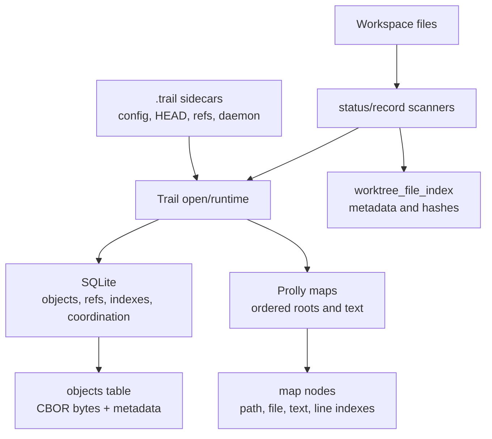
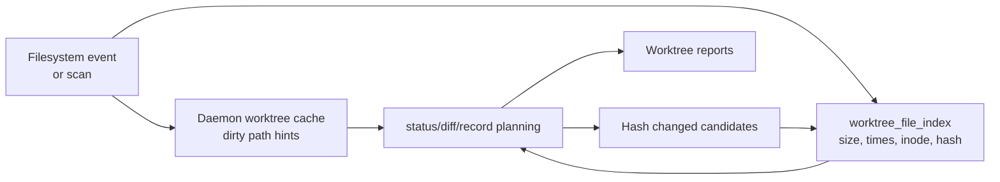
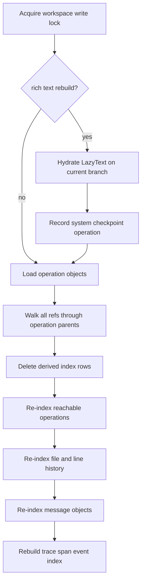

# Storage and Indexing

This design section is advanced/internal. It describes the current storage architecture and index maintenance paths.

## Storage Overview

Trail stores workspace state in three places:

- Files under `.trail` for config, HEAD, refs, worktree manifests, daemon discovery, and daemon tokens.
- SQLite under `.trail/index/trail.sqlite` for durable tables and derived indexes.
- Prolly-backed object/map storage for ordered maps and content-addressed structures.

The central design choice is that durable history lives in objects and refs, while many query tables are derived and rebuildable.



## Filesystem Layout

Initialization creates:

```text
.trail/
  config.toml
  HEAD
  index/trail.sqlite
  refs/branches/
  refs/lanes/
  worktrees/
```

Additional files may appear later:

- `.trail/daemon.json`: daemon endpoint registration.
- `.trail/daemon.token`: generated token file when daemon auth creates one.
- Lane workdir manifests inside materialized workdirs.
- Sparse workdir manifests inside sparse materializations.

The `.trailignore` file lives at the workspace root, not inside `.trail`.

## SQLite Schema Responsibilities

The schema contains these major table groups:

- Schema metadata: `schema_meta`
- Object storage metadata and bytes: `objects`
- Refs: `refs`
- Operation indexes: `operations`, `operation_parents`
- History indexes: `file_history`, `line_history`
- Messages and anchors: `messages`, `anchors`
- Lane identity and branch state: `lanes`, `lane_branches`
- Agent activity: `lane_sessions`, `lane_turns`, `lane_events`, `lane_trace_span_events`
- Human gates and resumable state: `lane_approvals`, `lane_run_states`
- Coordination: `leases`
- Merge state: `merge_queue`, `merge_results`, `conflict_sets`,
  `conflict_resolution_suggestions`
- Git interop: `git_mappings`
- Worktree scan cache: `worktree_file_index`

SQLite is therefore both object store and index store. The `objects` table stores durable object bytes. Other tables make common queries fast and hold coordination state that is not modeled as content-addressed objects.

## Semantic Memory Indexes

Agent memory should use SQLite as the first storage and indexing substrate. The
structured memory rows are durable truth; `sqlite-vec` `vec0` tables are the
preferred local vector accelerator. Portable exact ranking over little-endian
`f32` BLOBs remains available as a fallback and verification backend.

See [SQLite Vector Memory Direction](sqlite-vector-memory.md) for the memory
schema direction, extension policy, and baseline benchmark.

## Schema Versioning

Schema versioning has two layers:

- SQLite `PRAGMA user_version`.
- Rows in `schema_meta`, including schema and app version metadata.

Opening a workspace with `user_version` greater than the supported `TRAIL_SCHEMA_VERSION` fails. Initialization and opening call schema setup/validation, and schema setup also uses `ensure_column` for additive compatibility columns.

## Object Storage

Objects are stored by:

- object ID
- kind
- version
- codec
- hash algorithm
- size
- bytes
- creation time

The typed object helpers serialize values to CBOR and deserialize by kind. The object cache inside `Trail` avoids repeated decode/read work for frequently used objects. It is capped by entry count and total bytes.

## Prolly Maps

The `prolly` crate stores ordered map structures used by Trail roots and text.

Trail uses prolly maps for:

- Root path map.
- Root file index map.
- Text order map.
- Line index map.

The design gives efficient range scans and diffs over sorted keys. Low-level inspection is exposed by `trail map range` and `trail map diff`, with map decoders for raw, path, file-index, text-order, and line-index map types.

## Worktree File Index

`worktree_file_index` caches file metadata and hashes:

- path
- size
- modified/changed timestamps
- device and inode
- executable bit
- kind
- content hash
- last scan marker
- update time

This index lets status and daemon-backed status avoid fully hashing every file on every request. It is refreshed by normal status/record paths and explicitly by `trail index watch`.

The daemon worktree cache adds another layer for live file-event-driven dirty path tracking. It is reconciled against the worktree index and full status paths when needed.



## Derived History Indexes

`operations`, `operation_parents`, `file_history`, `line_history`, and `messages` are derived from stored operation/message objects.

They power:

- `timeline`
- `show`
- `history`
- `why`
- `code-from`
- session timelines
- agent timelines

Because these are derived, `rebuild_indexes` can delete and reconstruct them from reachable operation objects and message objects.

## Index Rebuild

Rebuild flow:

1. Acquire the workspace write lock.
2. Load operation objects from the `objects` table.
3. Determine reachable changes by walking from all refs through operation parents.
4. Delete derived operation/history/message rows.
5. Re-index reachable operations.
6. Re-index messages.
7. Rebuild the lane trace span event index.

`rebuild_indexes_with_rich_text` first hydrates lazy text on the current branch into rich text indexes, records a system checkpoint operation, then rebuilds indexes.



## Garbage Collection

Garbage collection works from reachability:

- Ref roots and operation objects are roots of reachability.
- Operations reference roots, parents, messages, conflict sets, and event payload objects.
- Roots reference file entries and text/blob content.
- Lane events and coordination records can reference object IDs.

`gc --dry-run` reports without pruning. Normal GC deletes unreachable known objects while preserving reachable roots and references.

## Backup and Restore

Backups include SQLite data and worktree-related state. Restore can rewrite materialized lane workdir paths so restored lane workdirs point inside the restored workspace. Backup creation rejects output inside `.trail` to avoid recursive or unsafe backups.

## Failure Modes

- Future schema version: refuse to open.
- Missing operation object referenced by a ref: index rebuild reports an error.
- Corrupt operation/message object bytes: index rebuild reports decode errors.
- Missing worktree index baseline: status may fall back to a fuller scan.
- Dirty or missing workdir manifest: lane workdir status becomes conservative.

## When to Change This Area

Review this design before changing:

- Schema DDL or schema versioning.
- Object serialization or object kinds.
- Root or text prolly map formats.
- Worktree status performance.
- Index rebuild semantics.
- Backup/restore format.
- GC reachability rules.

## Code Facts Used

- Schema DDL/versioning: `trail/src/db/storage/schema`
- Object storage: `trail/src/db/storage/objects`
- Worktree index: `trail/src/db/storage/worktree_index.rs`
- Rebuild/GC: `trail/src/db/storage/lifecycle`
- Backup/restore: `trail/src/db/core/backup`
- Prolly config: `trail/src/db/util/prolly.rs`
