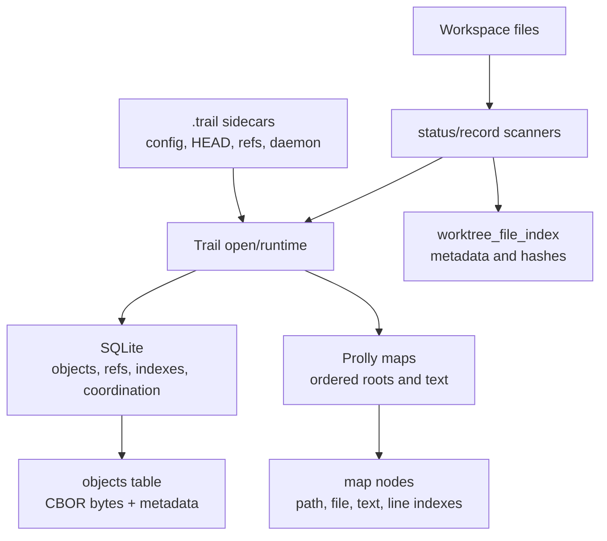
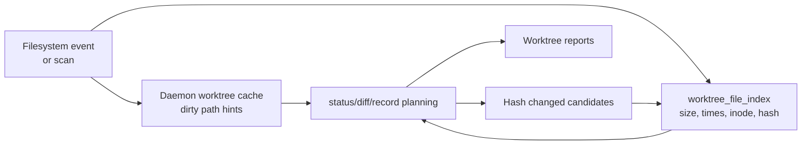
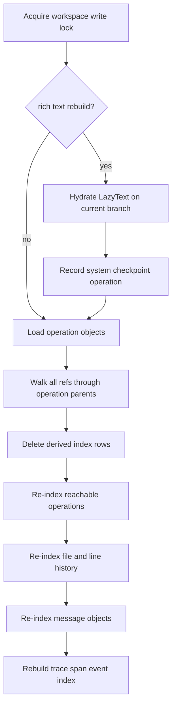

# Storage and Indexing

Environment layer manifests and their sorted page objects are authoritative
content-addressed objects rooted by `workspace_layers`. Object GC preserves the
root and every page. `workspace_layer_publications` records private-output
promotion phases and producer evidence; doctor, fsck, backup, restore, and
schema validation treat those rows as authoritative schema-v1 state. Backup
archives exclude mountpoints, generated/scratch uppers, and workspace cache
bytes while retaining source uppers and their authenticated recovery journals.
Restore keeps publication history, closes attachable attempts as `recovered`,
and clears only machine-local layer/runtime links.

Artifact CAS rows are verified against the raw `objects` bytes rather than the
process-local object cache. `fsck` checks object metadata/content identity,
directory/file/chunk edges, complete tree roots, resolution snapshots, ready
envelopes, construction-attempt coherence, and layer materialization ownership.
It distinguishes a legacy layer whose directory is authoritative from a
CAS-backed layer whose directory can be reconstructed, and reports different
repair guidance for each.

Workspace-open recovery terminalizes only construction attempts whose exact
PID/start identity is proven dead or mismatched. It removes only the lock and
staging directory derived from that owner fence. Missing CAS-backed layer
materializations are reconstructed through a private staging directory;
completed restore staging is removed idempotently. Unknown layer directories or
restore staging are never deleted implicitly and remain visible to doctor and
fsck as bounded orphan diagnostics.

Private backup-verification stages validate durable CAS without requiring the
intentionally omitted materialization cache. Resolution snapshots, artifact
objects, envelopes, attestations, historical generations, and exact generation
bindings remain in the portable SQLite snapshot. Host-local materialization
rows, performance-cache namespaces, active runtime resources, and generation
activation pointers do not. Restore first recovers retained source uppers from
private staged paths, then rebases them to the destination `.trail` directory
immediately before atomic publication. Reports distinguish retained private
bytes from omitted rebuildable materializations and caches. Verification checks
a deterministic retained-private tree digest before opening the staged
database. Legacy cache absence remains rebuildable through environment
synchronization rather than making an otherwise valid database-only backup
unverifiable.

This design section is advanced/internal. It describes the current storage architecture and index maintenance paths.

## Storage Overview

Trail stores workspace state in three places:

- Files under `.trail` for config, HEAD, refs, worktree manifests, daemon discovery, and daemon tokens.
- SQLite under `.trail/index/trail.sqlite` for durable tables and derived indexes.
- Prolly-backed object/map storage for ordered maps and content-addressed structures.

The central design choice is that durable history lives in objects and refs, while many query tables are derived and rebuildable.


```mermaid
flowchart TB
    Workspace["Workspace files"] --> Scanner["status/record scanners"]
    Sidecars[".trail sidecars<br/>config, HEAD, refs, daemon"]
    Runtime["Trail open/runtime"]

    Sidecars --> Runtime
    Scanner --> Runtime
    Runtime --> SQLite["SQLite<br/>objects, refs, indexes, coordination"]
    Runtime --> Prolly["Prolly maps<br/>ordered roots and text"]
    SQLite --> ObjectBytes["objects table<br/>CBOR bytes + metadata"]
    Prolly --> MapNodes["map nodes<br/>path, file, text, line indexes"]
    Scanner --> WorktreeIndex["worktree_file_index<br/>metadata and hashes"]
```

## Filesystem Layout

Initialization creates:

```text
.trail/
  config.toml
  HEAD
  index/trail.sqlite
  refs/branches/
  refs/lanes/
  worktrees/
```

Additional files may appear later:

- `.trail/daemon.json`: daemon endpoint registration.
- `.trail/daemon.token`: generated token file when daemon auth creates one.
- Lane workdir manifests inside materialized workdirs.
- Sparse workdir manifests inside sparse materializations.

The `.trailignore` file lives at the workspace root, not inside `.trail`.

## SQLite Schema Responsibilities

The schema contains these major table groups:

- Schema metadata: `schema_meta`
- Object storage metadata and bytes: `objects`
- Refs: `refs`
- Operation indexes: `operations`, `operation_parents`
- History indexes: `file_history`, `line_history`
- Messages and anchors: `messages`, `anchors`
- Lane identity and branch state: `lanes`, `lane_branches`
- Agent activity: `lane_sessions`, `lane_turns`, `lane_events`, `lane_trace_span_events`
- Human gates and resumable state: `lane_approvals`, `lane_run_states`
- Coordination: `leases`
- Merge state: `lane_merge_queue`, `merge_results`, `conflict_sets`,
  `conflict_resolution_suggestions`
- Git interop: `git_mappings`
- Worktree scan cache: `worktree_file_index`

SQLite is therefore both object store and index store. The `objects` table stores durable object bytes. Other tables make common queries fast and hold coordination state that is not modeled as content-addressed objects.

## Semantic Memory Indexes

Agent memory should use SQLite as the first storage and indexing substrate. The
structured memory rows are durable truth; `sqlite-vec` `vec0` tables are the
preferred local vector accelerator. Portable exact ranking over little-endian
`f32` BLOBs remains available as a fallback and verification backend.

See [SQLite Vector Memory Direction](sqlite-vector-memory.md) for the memory
schema direction, extension policy, and baseline benchmark.

## Schema Versioning

Schema versioning has two layers:

- SQLite `PRAGMA user_version`.
- Rows in `schema_meta`, including schema and app version metadata.

Trail currently ships one database schema, v1. Opening a workspace whose
`user_version` or `schema_meta.schema.version` is not `1` fails closed with
backup and `trail init --force` guidance. Fresh creation installs the complete
schema atomically; Trail intentionally has no database migration or additive
compatibility path while the product is pre-user.

## Object Storage

Objects are stored by:

- object ID
- kind
- version
- codec
- hash algorithm
- size
- bytes
- creation time

The typed object helpers serialize values to CBOR and deserialize by kind. The object cache inside `Trail` avoids repeated decode/read work for frequently used objects. It is capped by entry count and total bytes.

## Prolly Maps

The `prolly` crate stores ordered map structures used by Trail roots and text.

Trail uses prolly maps for:

- Root path map.
- Root file index map.
- Text order map.
- Line index map.

The design gives efficient range scans and diffs over sorted keys. Low-level inspection is exposed by `trail map range` and `trail map diff`, with map decoders for raw, path, file-index, text-order, and line-index map types.

## Worktree File Index

`worktree_file_index` caches file metadata and hashes:

- path
- size
- modified/changed timestamps
- device and inode
- executable bit
- kind
- content hash
- last scan marker
- update time

This index lets status and daemon-backed status avoid fully hashing every file on every request. It is refreshed by normal status/record paths and explicitly by `trail index watch`.

The daemon worktree cache adds another layer for live file-event-driven dirty path tracking. It is reconciled against the worktree index and full status paths when needed.


```mermaid
flowchart LR
    FsEvent["Filesystem event<br/>or scan"] --> Cache["Daemon worktree cache<br/>dirty path hints"]
    FsEvent --> Index["worktree_file_index<br/>size, times, inode, hash"]
    Cache --> Planner["status/diff/record planning"]
    Index --> Planner
    Planner --> Hash["Hash changed candidates"]
    Hash --> Index
    Planner --> Report["Worktree reports"]
```

## Derived History Indexes

`operations`, `operation_parents`, `file_history`, `line_history`, and `messages` are derived from stored operation/message objects.

They power:

- `timeline`
- `show`
- `history`
- `why`
- `code-from`
- session timelines
- agent timelines

Because these are derived, `rebuild_indexes` can delete and reconstruct them from reachable operation objects and message objects.

## Index Rebuild

Rebuild flow:

1. Acquire the workspace write lock.
2. Load operation objects from the `objects` table.
3. Determine reachable changes by walking from all refs through operation parents.
4. Delete derived operation/history/message rows.
5. Re-index reachable operations.
6. Re-index messages.
7. Rebuild the lane trace span event index.

`rebuild_indexes_with_rich_text` first hydrates lazy text on the current branch into rich text indexes, records a system checkpoint operation, then rebuilds indexes.


```mermaid
flowchart TB
    Lock["Acquire workspace write lock"] --> Mode{"rich text rebuild?"}
    Mode -- "yes" --> Hydrate["Hydrate LazyText on current branch"]
    Hydrate --> Checkpoint["Record system checkpoint operation"]
    Mode -- "no" --> Load["Load operation objects"]
    Checkpoint --> Load
    Load --> Reach["Walk all refs through operation parents"]
    Reach --> Clear["Delete derived index rows"]
    Clear --> Ops["Re-index reachable operations"]
    Ops --> History["Re-index file and line history"]
    History --> Messages["Re-index message objects"]
    Messages --> Spans["Rebuild trace span event index"]
```

## Garbage Collection

Garbage collection works from reachability:

- Ref roots and operation objects are roots of reachability.
- Operations reference roots, parents, messages, conflict sets, and event payload objects.
- Roots reference file entries and text/blob content.
- Lane events and coordination records can reference object IDs.
- Artifact generation bindings and workspace-layer shadows root their exact
  envelope and tree identities. Construction/resolution attempts, resolution
  snapshots, attestations, quarantines, active holds, and in-progress layer
  publications root their durable object evidence.
- Artifact envelopes traverse to tree roots, resolution snapshots, and
  validation receipts. Tree roots traverse directory nodes; directory nodes
  traverse directories/files; file nodes traverse blobs or chunk lists; and
  chunk lists traverse chunks. Shared nodes remain live while any rooted graph
  reaches them.
- A recorded real-directory artifact materialization acts as a conservative
  local cache lease. Cache eviction removes that row independently; a later
  object GC may collect the CAS graph if no durable authority remains.
- Portable backups do not add roots to the source database: backup creation is
  serialized by the workspace write lock, and the completed archive contains
  its own authoritative object graph.

An unbound artifact envelope row is an index, not an independent retention
root. GC may therefore collect a ready envelope left between publication and
generation activation when no generation, attempt, attestation, quarantine,
shadow, or hold retains it.

`gc --dry-run` reports without pruning. Normal GC validates artifact identities
and edges before deleting anything, orders unreachable artifact DAGs
parent-before-child with object-ID tie breaking, and commits batches of at most
256 objects. Each committed batch leaves the remaining artifact graph valid:
interruption preserves earlier batches and rolls back the current batch, while
a later invocation recomputes reachability and resumes. Missing roots,
invalid edges, corrupt identities, unsupported active hold targets, or foreign
key disagreement fail closed rather than risking reachable content.

Artifact storage reports use distinct accounting axes rather than one total:

- `logical_bytes` sums file sizes once per distinct artifact tree in scope.
- `unique_authoritative_bytes` and `cross_artifact_shared_bytes` partition the
  encoded content-addressed object bytes in scope. An object is counted once;
  it is shared when more than one artifact envelope references it.
- `materialized_bytes`, `lane_private_bytes`, `demand_loaded_bytes`, and
  `unknown_bytes` classify measured filesystem allocation. CAS-backed artifact
  directories and layers are materialized; source/generated/scratch uppers are
  lane-private; Git-root blob projections are demand-loaded; legacy layers,
  tool namespaces, and unattributable native-clone extents remain unknown.
- `prefetched_bytes` counts persisted storage created only for prefetch. The
  current hot-set implementation warms the operating-system page cache, so it
  reports zero and excludes that volatile cache explicitly.
- `reclaimable_bytes` is an independent policy/disposition axis and can overlap
  materialized or cache classifications. A lane-scoped report includes only
  its rebuildable artifact materializations; the legacy top-level workspace
  reclaimable field remains workspace-wide.

Callers must not add logical, authoritative, physical, and reclaimable axes
together. Workspace-cache GC captures these values before deletion and sets
its reclaimable field from the exact ordered candidates selected by retention,
quota, and free-space policy.

## Backup and Restore

Backups include SQLite data and worktree-related state. Restore can rewrite materialized lane workdir paths so restored lane workdirs point inside the restored workspace. Backup creation rejects output inside `.trail` to avoid recursive or unsafe backups.

## Failure Modes

- Any schema version other than v1: refuse to open.
- Missing operation object referenced by a ref: index rebuild reports an error.
- Corrupt operation/message object bytes: index rebuild reports decode errors.
- Missing worktree index baseline: status may fall back to a fuller scan.
- Dirty or missing workdir manifest: lane workdir status becomes conservative.

## When to Change This Area

Review this design before changing:

- Schema DDL or schema versioning.
- Object serialization or object kinds.
- Root or text prolly map formats.
- Worktree status performance.
- Index rebuild semantics.
- Backup/restore format.
- GC reachability rules.

## Code Facts Used

- Schema DDL/versioning: `trail/src/db/storage/schema`
- Object storage: `trail/src/db/storage/objects`
- Worktree index: `trail/src/db/storage/worktree_index.rs`
- Rebuild/GC: `trail/src/db/storage/lifecycle`
- Backup/restore: `trail/src/db/core/backup`
- Prolly config: `trail/src/db/util/prolly.rs`
