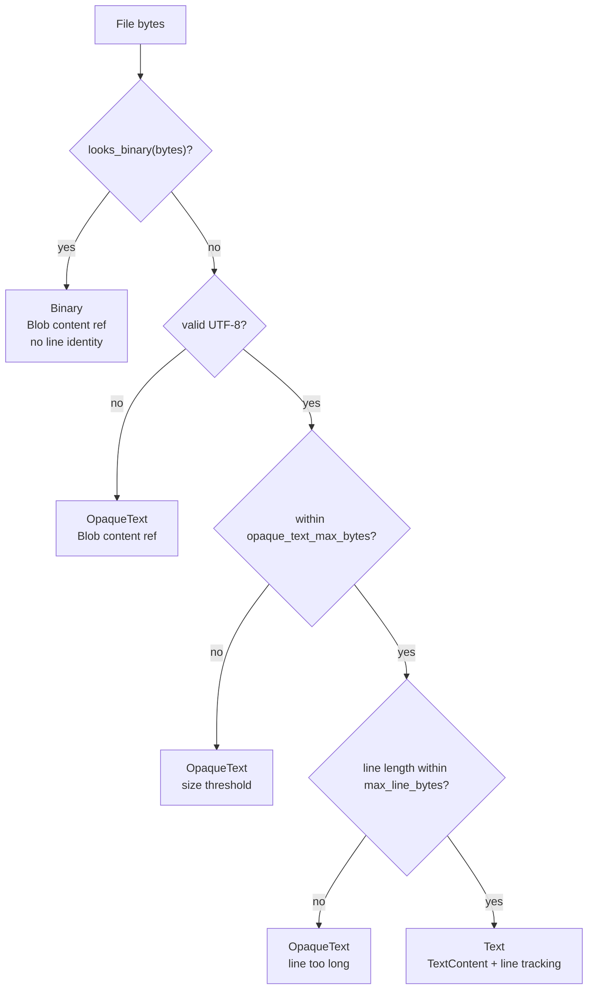
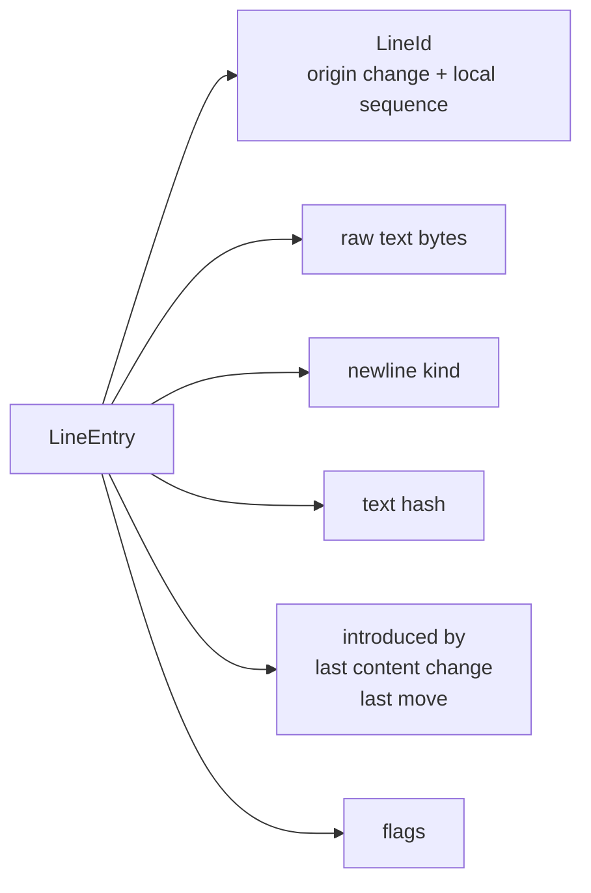
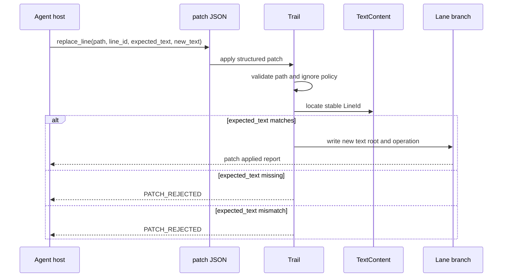

# Text and Line Identity

This design section is advanced/internal. It explains how Trail classifies file content, stores text, and preserves line identity for provenance and lane patching.

## Why Line Identity Exists

Traditional line numbers are unstable. Adding one line near the top of a file shifts every later line number. Trail instead assigns stable `LineId` values so it can answer questions such as:

- Which operation introduced this current line?
- Did a line move or change content?
- Can an agent replace this exact line safely?
- Did two branches edit the same logical line?

Line identity is one of the main reasons Trail stores text as structured content rather than only raw file snapshots.

## File Classification

Files are represented as:

- `Text`
- `OpaqueText`
- `Binary`

Classification depends on content, UTF-8 validity, line lengths, size thresholds, and binary-like checks. Text files get line-aware tracking. Opaque text stores bytes but does not fully index every line. Binary files are content-addressed blobs without line identity.

## Text Policy

Text policy controls thresholds:

- `text.small_text_max_bytes`
- `text.tree_text_min_bytes`
- `text.opaque_text_max_bytes`
- `text.max_line_bytes`
- `text.preserve_similarity`

Initialization can apply `minimal`, `balanced`, or `full`. Large worktree imports may automatically apply minimal text policy unless the user explicitly chose a policy.

The policy is a performance and fidelity tradeoff:

- Minimal reduces rich text indexing pressure.
- Balanced is the default.
- Full favors line-level structures for more text.

## Text Representations

`TextContent` supports multiple representations.

`SmallText` stores line entries inline. This is simple and direct for small content.

`SmallTextTable` stores compact encoded line metadata. It reduces object size for small text while preserving line identity.

`TreeText` stores ordered line data and indexes through prolly maps. This supports larger text with range and diff operations.

`LazyText` stores a blob plus the operation that introduced it. Lines can be materialized later when rich text is needed.

`OpaqueText` stores a blob and reason such as too large, line too long, invalid UTF-8, or binary-like content.

## Line Entry Model

Each `LineEntry` contains:

- `line_id`
- raw text bytes
- newline kind
- text hash
- introducing operation
- last content-changing operation
- optional last move operation
- flags

Newline kind is part of line materialization because preserving line endings matters for faithful checkout and patch application.

## Line ID Allocation

`LineId` is made from:

- origin `ChangeId`
- local sequence

New lines introduced by an operation get IDs tied to that operation. Existing lines keep their IDs when content or position changes can be matched according to the line preservation logic.

## Preserving Identity Across Edits

The line utilities compare old and new lines and use similarity thresholds to preserve identity across edits. This is not a promise that every edit preserves every ID; it is a best-effort algorithm grounded in current text policy and line matching logic.

Important cases:

- Same-position rewrites can preserve line identity.
- Moved lines can be represented as moves.
- Inserted lines get new IDs.
- Deleted lines stay in history as deleted.
- Replacements through structured patches can target a known `line_id`.

## Structured Patch Safety

The `replace_line` patch operation takes:

- path
- line ID
- expected text
- new text

The line ID makes the patch target stable. `expected_text` is required as a content guard so a stale patch can be rejected instead of silently replacing unexpected content.

## Line History Index

Line changes are indexed into `line_history` with:

- line ID
- file ID
- change ID
- path
- line number
- change kind
- text hash
- timestamp

This supports `why`, `history --line-id`, and line-focused review workflows.

## Merges and Line Identity

Line-aware merge paths can combine non-overlapping line edits more safely than path-only merging. Conflict detection can use file changes, line changes, and root diffs. Lane merge readiness checks conflict sets before allowing merge.

The current merge strategy validator accepts `conservative`, `line-id-aware`, and `line_id_aware`, while agent config currently accepts `conservative`.

## Limits and Caveats

- Binary and opaque text files do not provide line identity.
- Lazy text may need hydration before rich line history is available.
- Very large repositories may use minimal text policy to avoid expensive line maps.
- Line identity is stable by design, but not a substitute for reviewing patch content and diffs.

## Code Facts Used

- Text model: `trail/src/model/domain/objects.rs`
- Line IDs: `trail/src/ids.rs`
- Text building: `trail/src/db/storage/file_build/text.rs`
- Content loading/materialization: `trail/src/db/storage/content.rs`
- Line utilities: `trail/src/db/util/line_ops.rs`
- Patch schema: `trail/src/model/inspect/patch.rs`
- Tests: `same_position_rewrite_preserves_line_identity`, `minimal_text_policy_uses_lazy_line_trackable_text`, `lane_patch_can_replace_stable_line_with_expected_text`
