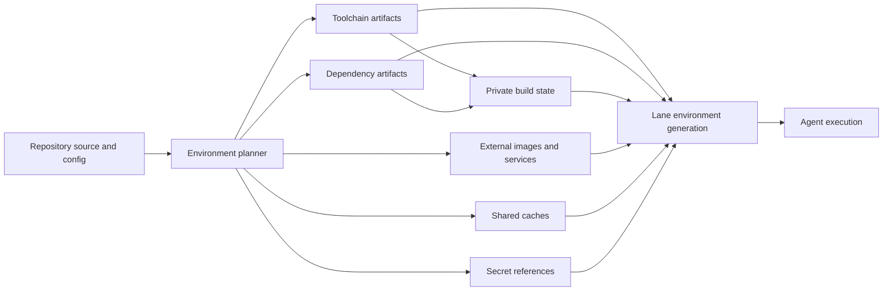

# Universal Lane Environments

Status: implementation in progress

This document defines a general environment model for reproducible agent execution in
Trail lanes. It extends the filesystem mechanisms in
[Layered Lane Workspaces](layered-lane-workspaces.md) from dependency directories into a
complete, typed description of everything a command needs: source, toolchains,
dependencies, generated state, caches, secrets, services, network policy, and external
resources.

The design deliberately distinguishes specification from materialization. An
environment specification says what is required and which policy applies. An
environment generation records the exact artifacts and runtime resources attached to
one lane at one point in time.

## Executive summary

Trail should model an execution environment as a directed acyclic graph of typed
components. Every component declares:

- the inputs that determine its identity;
- the adapter that can plan, build, validate, and bind it;
- whether its contents are immutable, shared, private, disposable, secret, or external;
- the target path, environment variable, service, or runtime resource it contributes;
- the trust and network capabilities required to create or use it;
- how freshness and health are proven.

Trail, rather than each language integration, owns the safety-critical lifecycle:
canonical fingerprinting, single-flight construction, staging, validation, immutable
publication, lane-quiescence checks, atomic attachment, recovery, provenance, and
garbage collection. Ecosystem adapters supply domain knowledge without receiving
authority to mutate Trail's database or shared artifact references directly.

The default policy is:

- share immutable content by digest;
- seed mutable state from immutable content, then give every lane copy-on-write
  isolation;
- keep ordinary writable state lane-private;
- make scratch state disposable;
- inject secrets only at execution time;
- represent remote services and OCI images by pinned external identities;
- never infer that an ignored or untracked directory is safe to share merely because
  Git does not track it.

This permits a large monorepo to share terabytes of common dependency and toolchain
content while preserving the behavioral isolation agents expect from separate
worktrees.

## Goals

1. Reproduce an agent command from a complete, inspectable environment record.
2. Let adapters for Cargo, npm, CMake, Docker, Python, Go, and future ecosystems compose
   under one lifecycle and policy model.
3. Share large immutable content without allowing one lane to corrupt another.
4. Isolate writable build state without eagerly copying it.
5. Make freshness explainable: Trail can identify exactly which input made a component
   stale.
6. Keep secret material out of artifact keys, manifests, transcripts, logs, and lane
   snapshots.
7. Support local filesystems, Linux overlayfs or FUSE, and the macOS NFS workspace view
   without changing environment semantics.
8. Make attachment transactional and recoverable after crashes.
9. Preserve Trail's existing distinction between local operational state and Git
   history.
10. Provide consistent CLI, HTTP, MCP, and Rust API reports.

## Non-goals

- Replacing ecosystem package managers, build systems, OCI registries, secret managers,
  or service orchestrators.
- Claiming arbitrary build scripts are deterministic. Trail records their declared
  inputs, policy, outputs, and observations; stronger reproducibility requires a
  hermetic adapter or sandbox.
- Treating a cache hit as proof that an environment is correct.
- Storing secrets in content-addressed artifacts.
- Sharing arbitrary writable directories between concurrently active lanes.
- Making Git commits, branches, or merges implicit side effects of environment sync.

## Terminology

| Term | Meaning |
| --- | --- |
| Environment specification | Desired graph, policies, commands, and bindings, normally defined by repository configuration plus adapter discovery. |
| Environment graph | A DAG whose nodes are environment components and whose edges express build or runtime dependency. |
| Component | One independently fingerprinted requirement such as a Node dependency tree, Rust toolchain, CMake build tree, OCI image, secret binding, or database service. |
| Artifact | A verified material result with a stable identity and manifest. It may be stored by Trail or managed externally. |
| Binding | The projection of a component into a lane: mount, path, environment variable, socket, port, process, container, or credential handle. |
| Generation | An immutable record of the exact component instances and bindings atomically selected for a lane. |
| Adapter | Trusted built-in, declarative recipe, or capability-constrained plugin that understands an ecosystem or resource type. |
| Fingerprint | Canonical digest of all declared non-secret identity inputs for a component. |
| Seed | Immutable initial content presented through a lane-private copy-on-write upper layer. |
| Runtime resource | A process, container, network, port lease, or remote service needed while commands execute. |

## Environment graph

An environment is not a single dependency directory. It is a composition of concerns
with different lifetimes and sharing rules.



Edges have explicit semantics:

- `build_requires`: the parent identity contributes to the child's fingerprint;
- `runtime_requires`: the parent must be healthy when the child is used;
- `binds_after`: ordering without identity propagation;
- `invalidates_with`: a declared change invalidates a child even when no artifact is
  directly consumed.

These four edge types are implemented in schema v9, repository command recipes, the
protocol-v2 adapter SDK, canonical keys, generation provenance, graph/plan reports,
CLI, HTTP/OpenAPI, and MCP. Legacy `depends_on` remains a compatible
`build_requires` spelling. Runtime/order-only provider replacement advances the exact
generation edge without rebuilding its consumer.

Cycles are rejected during planning. A service that refers back to application source
is represented as separate image-build and service-runtime nodes rather than a cyclic
node.

## Policy classes

Every output and binding must select a policy. There is no implicit "dependency
directory" policy.

| Policy | Sharing and mutability | Typical examples | Trail behavior |
| --- | --- | --- | --- |
| `immutable_shared` | Read-only and content-addressed across lanes and repositories allowed by scope | package store, unpacked toolchain, generated SDK, sysroot | Build in staging, validate, publish by digest, mount read-only. |
| `immutable_seed_private` | Immutable shared lower content with a lane-private writable upper | `node_modules`, prebuilt Cargo target seed, SDK that post-install tools modify | Attach lower plus private COW upper; whiteouts and replacements stay in the lane. |
| `cache_shared_content` | Cache entries are immutable; index may be concurrent | npm/pnpm download cache, Cargo registry/git cache, BuildKit content store | Namespace by adapter and compatibility tuple; verify content; tolerate eviction. |
| `cache_shared_compiler` | Concurrent cache with tool-specific correctness protocol | sccache, ccache | Use adapter-approved daemon or locking; never treat cache as authoritative output. |
| `writable_private` | Persistent only for one lane | Cargo `target`, CMake build tree, framework `.next` state, local database files | Store directly in the lane-private generated upper with no fake shared layer; snapshot only when explicitly requested. |
| `disposable` | Private and freely recreated | temp files, test output, sockets, ephemeral logs | Allocate per execution or lane; exclude from checkpoints unless requested; reap by TTL. |
| `secret_runtime` | Never stored as artifact content | tokens, signing keys, registry credentials | Resolve a provider reference at execution time; inject through constrained channel; redact. |
| `external_immutable` | Immutable identity stored elsewhere | OCI image digest, remote toolchain archive, Nix store path | Record provider, digest, and verification evidence; materialize lazily. |
| `external_managed` | Mutable service owned outside Trail | cloud database, SaaS API, shared dev service | Record logical reference and health contract, not state; optionally lease credentials. |
| `runtime_private` | Per-lane process/container/network/port | PostgreSQL container, dev server, emulator | Allocate isolated runtime resources; stop or suspend with the lane. |
| `configuration` | Non-secret execution settings | feature flags, target triple, locale | Canonicalize identity-affecting values; inject remaining values at execution. |

### Decision rules

Adapters recommend a policy, but the planner applies these invariants:

1. If concurrent writers can affect one another's correctness, the content is not
   directly shareable.
2. If an output is fully determined by declared inputs and validation can reject partial
   results, prefer `immutable_shared`.
3. If consumers conventionally modify an otherwise reusable tree, prefer
   `immutable_seed_private`.
4. If deletion must not reveal a lower entry, the workspace backend must preserve a
   directory whiteout or replacement marker.
5. If losing content changes only performance, classify it as a cache or disposable.
6. If losing content changes correctness or user state, classify it as private state or
   an artifact, never as a cache.
7. If a value grants authority, classify it as a secret even when it is also an input.
8. If Trail cannot own the lifecycle, record it as external and verify its identity or
   health at the boundary.
9. Repository ignore rules are evidence about version control only. They do not decide
   environment policy.

Users may override adapter recommendations in repository policy, but unsafe widening
of sharing requires an explicit approval recorded in provenance.

## Specification sources and precedence

The effective specification is assembled from narrow, explainable sources:

1. Trail's built-in safety defaults;
2. organization policy;
3. repository configuration committed with source;
4. adapter discovery from manifests and lockfiles;
5. lane-specific non-secret overrides;
6. execution-specific ephemeral overrides.

Later sources may narrow capabilities. Widening network access, secret access, host
mounts, shared write access, or executable hooks requires policy approval. The resolved
specification and the origin of every field are inspectable with `trail env explain`.

Discovery proposes graph nodes; it does not silently execute installers. A plan is
produced before any state-changing build or attachment.

## Identity and fingerprinting

For component `c`, Trail computes:

```text
component_key(c) = H(canonical({
  schema_version,
  adapter_id,
  adapter_version,
  component_kind,
  declared_input_digests,
  parent_artifact_identities,
  toolchain_identities,
  os,
  architecture,
  abi,
  target,
  portability_class,
  canonical_options,
  allowlisted_identity_environment,
  network_and_script_policy,
  output_contract
}))
```

Canonicalization uses sorted maps, normalized relative paths, explicit string encodings,
and a versioned hashing algorithm. File modes and symlink targets participate when the
adapter declares them significant. Inputs outside the repository are prohibited unless
represented by an explicit toolchain, external artifact, configuration, or secret node.

### Input roles

Adapters classify inputs so invalidation is precise:

- `identity`: always contributes bytes or a normalized semantic value;
- `tool_identity`: resolved executable identity and version probe;
- `policy_identity`: script, network, target, and sandbox policy;
- `runtime_only`: required at execution but does not rebuild the artifact;
- `health_only`: checked before use without affecting identity;
- `secret_reference`: opaque provider, key name, and optional version identifier;
- `ignored`: explicitly documented as irrelevant.

Secret values never participate in a key. When credential rotation should invalidate an
output, the provider supplies a non-secret version identifier; Trail stores that opaque
identifier, not the credential.

### Portability classes

Each artifact declares one portability class:

- `universal`: independent of operating system and architecture;
- `os_arch`: bound to operating system and architecture;
- `abi`: additionally bound to libc, SDK, compiler ABI, or platform release;
- `host`: safe only on the creating host;
- `lane`: not publishable outside its originating lane.

Adapters must conservatively choose a narrower class when native extensions, absolute
paths, case sensitivity, or filesystem semantics are uncertain.

## Artifacts and manifests

Trail publishes stored artifacts only after successful validation. A manifest contains:

- artifact ID and component key;
- adapter and schema versions;
- artifact kind, portability, and sharing scope;
- input and parent artifact identities;
- toolchain identities and normalized build options;
- output roots, file count, logical bytes, and tree digest;
- ownership, modes, symlink targets, hard-link groups, and supported special-file policy;
- creation host compatibility tuple and timestamp;
- build operation and transcript references;
- validation rules and results;
- network and script policy actually used;
- redacted provenance and trust level;
- lifecycle state and corruption observations.

Manifests never contain secret values, unredacted command environments, or credentials
embedded in source URLs. Publication is an atomic rename or equivalent transaction from
a private staging location. Published immutable content is never repaired in place: a
bad artifact becomes `corrupt`, references are quarantined, and a new artifact is built.

## Environment generations

An environment generation is an immutable selection of component instances and
bindings for one lane. It solves two problems that a loose set of mounts cannot:

- an agent can prove exactly what it executed against;
- a crash cannot expose a half-updated mixture of old and new components.

A generation records:

- resolved specification digest and source revision observation;
- component keys and artifact identities;
- private upper-layer identities;
- cache namespaces;
- secret references, never resolved values;
- external resource identities and health observations;
- mount, environment, working-directory, network, and service bindings;
- predecessor generation and attachment operation;
- creation, activation, and retirement timestamps.

### Atomic sync protocol

`trail env sync <lane>` performs the following operation:

1. Acquire a lane environment lease and prove the lane is quiescent, or request an
   explicit stop/restart policy for managed processes.
2. Resolve configuration and discovery into a canonical graph.
3. Fingerprint every node and propagate staleness through identity-bearing edges.
4. Reuse healthy artifacts; acquire single-flight leases for missing builds.
5. Build missing content in private staging with declared capabilities only.
6. Validate and publish artifacts, or record a failed build without exposing staging.
7. Prepare private upper layers, caches, runtime allocations, and secret handles.
8. Validate every proposed binding for collision, containment, and backend support.
9. Commit the new generation and lane binding set in one database transaction.
10. Switch the workspace/runtime view to the new generation.
11. Run lightweight post-attach health checks and record readiness evidence.
12. Retire the predecessor only after activation succeeds; keep it available for
    rollback until retention policy permits collection.

Only paths declared as environment bindings may be replaced. Sync never resets the
lane's general source upper layer. Reusing an immutable seed with a new fingerprint
creates a fresh private upper by default; preserving mutations across incompatible seeds
requires an adapter-provided migration and explicit policy.

If the process crashes before step 9, the old generation remains authoritative. If it
crashes between steps 9 and 10, recovery completes or rolls back the recorded pending
switch. Runtime allocations have idempotent cleanup tokens.

## Component lifecycle

```text
unknown -> planned -> building -> verified -> ready -> attached
                       |              |          |
                       v              v          v
                     failed         corrupt     stale
```

- `planned`: identity and output contract are known.
- `building`: one lease holder owns private staging; waiters observe progress.
- `verified`: output validation and manifest creation succeeded.
- `ready`: artifact publication or external identity resolution succeeded.
- `attached`: referenced by an active generation.
- `stale`: declared inputs or required runtime health changed.
- `corrupt`: observed content conflicts with its manifest.
- `failed`: the attempt ended without a publishable result.

States are observations, not destructive commands. A stale immutable artifact can
remain retained for old generations while a replacement is built.

## Verification tiers

Verification must match both risk and filesystem cost:

| Tier | Trigger | Checks |
| --- | --- | --- |
| `attach` | Every generation activation | Manifest exists, artifact state is ready, compatibility tuple matches, root metadata and sentinel checks pass, binding targets are valid. |
| `sample` | Policy interval or suspicious observation | Deterministic sample of content and metadata plus adapter health checks. |
| `full` | Explicit command, publication, corruption suspicion, scheduled audit | Complete tree digest, containment, symlink, mode, and adapter validation. |

Routine status and attach operations must not recursively hash hundreds of megabytes.
The full digest is computed before publication and thereafter only by explicit or
policy-driven verification. This distinction keeps safety evidence strong without
turning every agent startup into an `O(tree size)` scan.

## Execution contract

`trail env exec <lane> -- <command>` captures and enforces a complete execution
envelope:

- active environment generation;
- source and environment mounts;
- working directory;
- executable resolution and `PATH` ordering;
- normalized non-secret environment values;
- secret injection handles and redaction policy;
- user, group, umask, locale, and time-zone policy;
- network policy and allowed endpoints;
- CPU, memory, process, and timeout limits when configured;
- required runtime services and health gates;
- inherited file descriptors, sockets, and ports;
- sandbox and host-filesystem capabilities;
- transcript and operation provenance.

The command record references the generation, so later inspection can answer which
compiler, lockfile, dependency tree, service image, and policy were active. Directly
entering a lane shell remains possible, but commands outside `env exec` receive weaker
reproducibility evidence and readiness can report that distinction.

## Filesystem bindings

Bindings are typed rather than encoded as opaque mount arguments:

- `tree_ro`: immutable tree mounted read-only;
- `tree_cow`: immutable lower plus lane-private upper and work metadata;
- `tree_private`: persistent private directory;
- `tree_scratch`: disposable private directory;
- `file_ro` and `file_private`: single-file variants;
- `cache`: adapter-mediated cache namespace;
- `env`: non-secret environment value;
- `secret_env`, `secret_file`, and `secret_fd`: runtime secret injection;
- `socket`, `port`, `service`, and `container`: runtime resources;
- `external`: identity and health reference with no local mount.

Target paths are normalized relative to the lane workspace unless explicitly declared
as sandbox paths. Bindings cannot overlap unless their ordering and nesting semantics
are declared. Trail internal paths, `.git`, lane control metadata, and secret staging
areas are reserved.

All workspace backends must preserve the same observable semantics for copy-up,
whiteouts, bulk directory replacement, rename, links, metadata, and deletion. Backend
capability negotiation rejects a generation whose required semantics are unsupported.

## Shared caches

Caches improve performance but never determine correctness. Each cache namespace is
derived from:

- adapter and cache kind;
- compatibility tuple;
- organization/repository sharing scope;
- explicit trust boundary;
- optional tool-native namespace.

Trail supports three access strategies:

1. content-addressed entries with an independently locked index;
2. an adapter-approved concurrent cache daemon such as sccache;
3. a lane-private cache seeded from a shared immutable snapshot.

An adapter may not label a directory `cache_shared_*` unless its producer supports
concurrent writers or Trail mediates writes safely. Cache eviction can make execution
slower but cannot make a ready generation invalid.

Schema v10 implements this contract for trusted built-ins. Namespace identity hashes
adapter identity, logical cache name, protocol, access policy, workspace scope, and the
complete compatibility map. Node, Cargo, sccache, and Go no longer write untyped global
tool-home paths. Every command holds a process/start-token lease; host-exclusive caches
also acquire deterministic cross-process locks. GC first closes an atomic maintenance
gate, then refuses to rename a namespace with any live lease. Cache rows and exact IDs
are retained in active and historical generation reports, while the bytes remain
performance-only and safely evictable. External plugins remain denied until their cache
protocol receives an explicit certification capability.

## Secrets

Environment specifications contain secret references such as provider, logical name,
scope, purpose, and optional version selector. Resolution occurs as late as possible,
normally immediately before command or service start.

Required guarantees:

- no secret bytes in component keys, manifests, database values, artifact trees,
  command previews, or transcripts;
- redaction operates on exact resolved values and structured provider fields;
- file secrets use private permissions and are unlinked or revoked after use;
- file-descriptor injection is preferred when the consumer supports it;
- provider access is scoped to the lane task and command purpose;
- secret access is an auditable operation without recording the value;
- checkpoint, export, and diagnostics scan for accidental secret persistence;
- adapters receive opaque handles unless their declared capability requires bytes.

Secret availability affects readiness. Secret rotation alone does not rebuild immutable
artifacts unless a non-secret version identity is deliberately part of the key.

Schema v15 implements the first fail-closed service-secret provider without storing
bytes. An OCI service or protocol-v2 plugin declares a logical name, `file` or
`environment_file` provider, opaque reference, optional non-secret version, purpose,
requiredness, and a `/run/secrets/...` target. An optional consumer environment variable
receives only that target path for `*_FILE` conventions. `environment_file` resolves an
environment variable to a provider-owned path at reconcile time. Trail never reads that file; it
requires a bounded non-symlink regular file with private permissions and passes only a
read-only mount handle to Docker or Podman. Active and historical tables store references
and availability, and an append-only access audit stores only identity, purpose, provider,
outcome, and time. Missing or revoked required handles stop the owned service and block
readiness. Each managed container carries a digest of its resolved source paths, targets,
and non-secret `*_FILE` bindings—not secret bytes. If a provider rotates a handle to a new
path, reconciliation detects the mismatch and recreates only the Trail-owned container,
so it cannot adopt a stale bind mount. Raw environment-value injection is intentionally
denied for standalone Docker because it would persist the value in inspectable container
configuration; portable non-persistent environment and descriptor injection remain future
provider capabilities.

## External and runtime resources

Not everything should become a local tree.

### External immutable artifacts

An OCI image should normally be represented by registry, repository, platform, and
content digest. Tags may be accepted as resolution inputs, but the generation records
the resolved digest. Similar rules apply to remote toolchain bundles and package store
objects.

The first implemented form is a strict pinned declaration:

```toml
# trail.oci.toml
schema = "trail.oci-images/v1"

[[image]]
name = "web"
reference = "ghcr.io/example/web@sha256:<64 lowercase hex characters>"
platform = "linux/amd64"
```

`trail/oci-image@1` and protocol-v2 plugins normalize this to a metadata-only external
component. Planning is side-effect free and does not contact a registry. Schema v14
stores the exact identity in active state and immutable generation history; the
component has no fake output directory or layer, and cleanup ownership is `external`.
Tag-to-digest resolution, registry verification/materialization, credentials, and
container lifecycle remain separate provider/runtime work so they cannot contaminate
artifact identity or planning purity.

### Externally managed services

A cloud database or shared API contributes:

- a logical resource reference;
- endpoint discovery policy;
- credential reference;
- compatibility or schema requirement;
- health and readiness probe;
- lease or concurrency rules;
- cleanup ownership, which is explicitly `external`.

Trail does not snapshot or delete externally managed state.

### Private runtime services

Local services and containers are allocated per lane by default. Names, networks,
volumes, sockets, and host ports include lane identity. Runtime state is separate from
immutable image identity. A generation may declare whether a service is restarted,
reused when compatible, or always recreated on activation.

The first private-service form extends `trail.oci.toml` without giving the adapter
provider authority:

```toml
[[service]]
name = "database"
image = "postgres-image"
container_port = 5432
health_timeout_ms = 45000
restart_policy = "on_failure"
volume_target = "/var/lib/postgresql/data"
```

Schema v14 stores the immutable declaration separately from the allocation ID,
provider resource ID, deterministic container/network/volume names, loopback host port,
health state, cleanup token, lifecycle owner, and timestamps. Containers and networks
are generation-scoped; a private data volume is scoped to the logical lane service so a
healthy image rollout does not silently discard database state. Retired containers and
networks are removed after the replacement becomes healthy, while a volume remains as
long as an active generation references it. Docker and Podman are
detected at reconciliation time. A missing pinned image is pulled by digest; Trail then
verifies the observed repository digest before creating anything. Existing names are
adopted only when Trail ownership labels match exactly. A dead lifecycle owner is marked
`orphaned` on reopen and safely inspected on the next reconcile.

## Monorepos and multiple lanes

Discovery roots are explicit. A monorepo can have many overlapping environment graphs,
but identical component keys converge to one artifact. For example:

- several packages can share one pnpm store and toolchain;
- two Next.js applications can share lockfile-derived dependencies but keep separate
  `.next` state;
- Rust crates can share registry content and sccache while retaining private target
  directories;
- CMake targets can share a toolchain and immutable install prefix while keeping
  configuration-specific build trees private.

Each lane pins a generation independently. Syncing lane A cannot change the active
generation, private upper, services, or secret handles of lane B. A new artifact may be
built once and become available to both, but each lane attaches it through its own
transaction.

Graph invalidation is component-local. Editing a frontend lockfile need not invalidate
an unrelated Rust toolchain. Editing a shared compiler configuration invalidates every
descendant whose edge carries tool identity.

## Concurrency and leases

Trail uses distinct leases for:

- component build single-flight;
- artifact publication;
- lane generation mutation;
- runtime resource allocation;
- cache maintenance;
- garbage collection.

Build waiters may stream progress and either reuse the published result or retry after a
failed lease. Leases contain owner operation, heartbeat, expiry, and recovery metadata.
No lease alone proves safety: publication also requires staging ownership and manifest
validation, while activation also requires a lane transaction.

Garbage collection considers active generations, retained predecessors, checkpoints,
running operations, open backend references, and leases. Logical and physical byte
accounting are reported separately so shared-space savings remain visible.

## Adapter trust model

Trail supports three adapter tiers:

1. **Built-in adapters** run as reviewed Trail code with narrowly scoped host APIs.
2. **Declarative recipes** describe probes, commands, inputs, outputs, and policies; the
   Trail host executes them in a sandbox.
3. **Capability-constrained plugins** use a versioned WASI/component interface or
   equivalent isolated protocol. They request filesystem, process, network, secret, and
   runtime capabilities explicitly.

Adapters never receive raw database access, shared artifact mutation, arbitrary host
paths, or undeclared secrets. They return plans and observations. The host validates
paths, executes approved actions, publishes artifacts, and commits generations.

Open-ended shell hooks are disabled by default. Command vectors avoid shell parsing;
shell execution, lifecycle scripts, and network access are separately visible policy
decisions.

The detailed contract is defined in
[Environment Adapter and Specification Contract](environment-adapter-contract.md).

## Proposed data model

The names below are conceptual; implementation may normalize fields differently.

| Relation | Key fields | Purpose |
| --- | --- | --- |
| `environment_specs` | ID, repository, root, source, canonical digest, schema version | Resolved desired graph and field provenance. |
| `environment_components` | spec ID, component ID, kind, adapter, policy, options | Nodes in the desired graph. |
| `environment_edges` | parent, child, semantics | Build, runtime, ordering, and invalidation relationships. |
| `environment_inputs` | component, role, source, observed digest | Explainable identity and health inputs. |
| `environment_artifacts` | artifact ID, component key, state, portability, manifest | Stored or external immutable results. |
| `environment_builds` | operation, component key, lease, staging, outcome | Construction provenance and recovery. |
| `environment_generations` | lane, generation, spec digest, predecessor, state | Atomic environment snapshots. |
| `environment_bindings` | generation, component, type, source, target, policy | Filesystem, environment, secret, and runtime projections. |
| `environment_private_state` | lane, component, generation lineage, storage ID | Persistent private uppers and directories. |
| `environment_runtime_resources` | generation, kind, provider ID, lease, health, cleanup | Processes, containers, ports, networks, and services. |
| `environment_verifications` | artifact/resource, tier, rule, result, operation | Health and integrity evidence. |

Foreign keys and state transitions are enforced transactionally. Manifests remain
portable records even if an implementation stores large trees outside the database.

### Verification tiers

Immutable filesystem artifacts distinguish bounded attachment evidence from an
explicit integrity audit. Publication and successful full verification write a durable
seal over the content-addressed manifest, layer summary, and platform filesystem
identity. Routine reuse validates that seal in constant filesystem work; a legacy,
oversized, malformed, or stale seal triggers one complete scan and self-heals. Explicit
verification, doctor, and readiness always compare every entry and content hash. The
seal is derived cache state, never authority, and is collected atomically with the
layer.

## User experience

The command family is environment-centric while retaining compatibility aliases for
the existing dependency workflow.

```text
trail env discover [--lane <lane>]
trail env graph [--lane <lane>] [--format table|json|dot]
trail env plan <lane>
trail env sync <lane> [--offline] [--frozen] [--restart-services]
trail env status <lane> [--verify attach|sample|full]
trail env explain <lane> [component-or-path]
trail env verify <lane> [--full]
trail env exec <lane> -- <command> [args...]
trail env gc [--dry-run]
```

Commands and gates executed in a layered lane receive `TRAIL_SERVICES_JSON`, keyed by
`component/resource`, with loopback host, port, and address for every healthy active
service. A globally unique resource name also receives
`TRAIL_SERVICE_<NAME>_HOST`, `_PORT`, and `_ADDRESS`. Trail refuses to start the command
when an active required runtime is not healthy, so clients never silently use a stale
endpoint.

`trail lane deps plan|sync|status` remains as a compatibility view over components with
dependency-related kinds.

The implemented explanation surface selects a stable component explicitly:

```text
trail env explain <lane> --component <component-id> [--offset N] [--limit N]
```

It diffs canonical input and tool maps plus adapter, platform, architecture,
portability, and strategy fields. Reports expose names and change classes, never key
values, and carry provenance completeness and pagination metadata.

A plan should be decision-oriented:

```text
Lane: feature-search
Current generation: envgen_014
Proposed generation: envgen_015

REUSE   rust-toolchain     immutable_shared       art_b71…
REUSE   cargo-registry     cache_shared_content   cache_cargo_linux_x64
BUILD   cargo-target-seed  immutable_seed_private stale: Cargo.lock changed
KEEP    cargo-target       writable_private       lane state is compatible
RESOLVE api-token          secret_runtime          provider: keychain/team-api
START   postgres           runtime_private         image sha256:91c…; port auto

Network required while building: crates.io (adapter policy)
Source paths replaced: none
Private paths reset: target seed upper only
```

`--frozen` rejects discovery or identity resolution that would change the pinned graph.
`--offline` rejects unmaterialized external fetches. Status exits nonzero when readiness
requirements are unmet, while returning a structured reason list.

## API and report parity

CLI text is a rendering of shared report types, not an independent implementation.
Minimum reports are:

- `EnvironmentDiscoveryReport`;
- `EnvironmentGraphReport`;
- `EnvironmentPlanReport`;
- `EnvironmentSyncReport`;
- `EnvironmentStatusReport`;
- `EnvironmentExplanationReport`;
- `EnvironmentVerificationReport`;
- `EnvironmentExecutionReport`.

HTTP, MCP, CLI JSON, and Rust APIs expose the same stable identifiers, lifecycle states,
policy decisions, stale reasons, operation links, and redaction rules. Long-running
build, verification, and runtime operations use Trail operations with progress events
and cancellation rather than blocking opaque requests.

## Readiness, claims, and Git handoff

Environment readiness is one input to lane readiness; it does not replace task claims
or Git conflict checks.

A lane is environment-ready when:

- its active generation matches the resolved specification or an allowed pin;
- all required artifacts pass the configured verification tier;
- private bindings are mountable and not owned by another lane;
- required services are healthy;
- required secret references are resolvable for the intended command;
- no generation switch or environment build is in an unsafe state.

The readiness report identifies environment drift separately from source divergence,
task ownership, guardrail violations, and merge conflicts. Environment sync never
creates a Git commit, moves a branch, or merges code. Git handoff continues through the
explicit Trail lane workflow.

## Failure handling

| Failure | Required result |
| --- | --- |
| Adapter discovery fails | Preserve active generation; record structured diagnostic and adapter version. |
| Build command fails | Retain logs under redaction policy; delete or quarantine staging; publish nothing. |
| Builder crashes | Expire lease, inspect staging ownership, and retry or clean idempotently. |
| Validation fails | Mark attempt failed; never attach output. |
| Published artifact changes | Mark corrupt, quarantine from new generations, preserve evidence, rebuild. |
| Backend cannot express whiteout or link semantics | Reject affected binding before activation. |
| Secret provider unavailable | Keep artifact state intact; mark command/service readiness blocked. |
| Service health fails | Apply declared restart policy; otherwise preserve generation and report not ready. |
| Activation crashes | Complete or roll back pending generation from transaction journal. |
| Cache corruption | Evict affected entries; rebuild authoritative outputs. |
| Disk pressure | Reap disposable state, then unreferenced cache and artifacts; never delete active private state. |

Diagnostics always distinguish corrective actions that are safe to automate from those
requiring user authorization.

## Platform behavior

The semantic contract is platform-independent; materialization backends are not.

- Linux prefers kernel overlayfs where permitted and uses FUSE when policy or substrate
  requires it.
- macOS uses Trail's NFS-backed layered workspace view or a future equivalent.
- A materialized-copy backend is a correctness fallback when layering is unavailable,
  with explicit space and performance reporting.
- Remote or network filesystems must advertise atomic rename, locking, link, mode,
  invalidation, and crash-recovery capabilities rather than being assumed compatible.
- Artifacts whose manifests contain unsupported modes, symlinks, case collisions, or
  host-bound paths are rejected or narrowed to `host` portability.

The conformance suite exercises untracked dependency trees, nested deletion, bulk
directory replacement, rename across layers, symlinks, hard links, executable modes,
concurrent readers, crash recovery, and large metadata-heavy trees on every supported
backend.

## Performance and observability

Trail reports:

- plan, build, validation, publication, attach, and service-start durations;
- logical artifact bytes versus unique physical bytes;
- copy-up bytes and whiteout counts per lane;
- cache hit/miss and invalidation reasons;
- mount/backend round trips where measurable;
- generation switch downtime;
- full-verification throughput;
- garbage-collection candidates and retained-by explanations.

Initial product targets should include:

- no full-tree scan on an unchanged routine attach;
- constant-number database transactions for generation activation;
- one shared build for concurrent identical component keys;
- no eager copy of immutable seeds;
- clear progress for metadata-heavy package-manager replacement rather than an
  apparently hung command;
- cancellation that leaves the previous generation usable.

Performance claims must identify dataset shape, backend, host, cold/warm state, and
verification tier. A small synthetic tree is not evidence for real Node, Cargo, CMake,
or container workloads.

## Compatibility and migration

The existing workspace-layer implementation becomes the first artifact and binding
backend:

- workspace layer keys map to component keys;
- workspace layer manifests map to artifact manifests;
- lane workspace mounts map to generation bindings;
- dependency plan/sync/status map to filtered environment operations;
- schema-backed ordering/invalidation edges are finalized in deterministic topological
  order, enter downstream component keys, persist in generation provenance, and
  propagate exact descendant staleness;
- current Node and Cargo logic become built-in adapters;
- `trail/go-vendor@1` publishes a lock- and toolchain-keyed vendor seed, while Go
  workspaces fail closed until graph-aware multi-module planning is implemented;
- `trail/cmake-build@1` provisions a layer-free private build tree and defers configure
  to the mounted lane so absolute cache paths remain valid;
- `trail/python-venv@1` provisions a layer-free private `.venv`, keys it by dependency
  manifests/locks and interpreter identity, and automatically initializes it through an
  ephemeral candidate view at the final mountpoint so embedded prefix paths remain valid
  without weakening atomic generation activation;
- existing layer references are imported into an initial environment generation without
  copying tree content.

Migration is additive. Repositories without an environment specification continue to
use adapter discovery and current defaults. Configuration gains a schema version and an
explicit opt-in for policy overrides; existing dependency commands remain supported
until report and behavior parity is proven.

## Security invariants

1. A component cannot read undeclared source or host paths during a hermetic build.
2. A component cannot publish outside host-owned staging.
3. An adapter cannot mutate Trail's database or an immutable artifact.
4. A lane cannot write another lane's private state.
5. Shared direct-write state requires a reviewed concurrency protocol.
6. Secrets cannot enter artifact identity or persisted output by default.
7. Network and lifecycle-script use is explicit in plan and provenance.
8. External resources are never deleted unless Trail created them and owns cleanup.
9. Generation activation is atomic and requires lane safety checks.
10. Readiness never claims stronger verification than the evidence tier performed.

## Acceptance criteria

The architecture is complete enough to ship when:

- one graph can compose at least Node, Cargo, CMake, OCI image, secret, and service
  components;
- all policy classes have storage, lifecycle, failure, and garbage-collection tests;
- two lanes can concurrently use the same immutable artifacts and caches without sharing
  private writes;
- a lockfile change yields an exact stale explanation and only invalidates descendants;
- a crash at every build and activation boundary preserves a valid prior generation;
- secret canary tests find no value in database, logs, transcripts, manifests,
  checkpoints, or exported diagnostics;
- Linux overlayfs/FUSE and macOS NFS pass the same filesystem conformance suite;
- full verification detects injected corruption while routine attach avoids a full tree
  scan;
- CLI, HTTP, MCP, and Rust API reports are semantically identical;
- a recorded execution can reconstruct or clearly report unavailable external inputs;
- logical-versus-physical accounting demonstrates sharing without hiding private-state
  cost.

## Open decisions

1. Whether repository specifications live in `trail.toml`, a dedicated
   `.trail/environment.toml`, or both through includes.
2. Which sandbox backend provides the minimum portable declarative-command contract.
3. Whether environment generations are embedded in lane checkpoints or referenced as
   separately retained immutable records.
4. How organization-level artifact trust and signing are represented across machines.
5. Which cache protocols qualify for shared direct writes in the first release.
6. Whether plugin isolation begins with a subprocess JSON protocol before adopting a
   WASI component interface.
7. How long predecessor generations and private seed uppers remain recoverable by
   default.

These decisions can change implementation detail without weakening the policy classes,
identity model, atomic generation lifecycle, or security invariants defined here.
